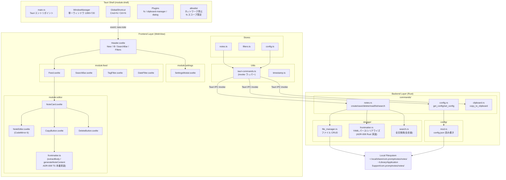
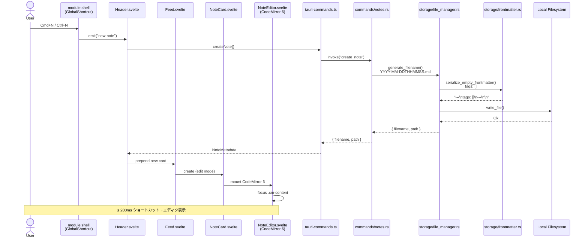
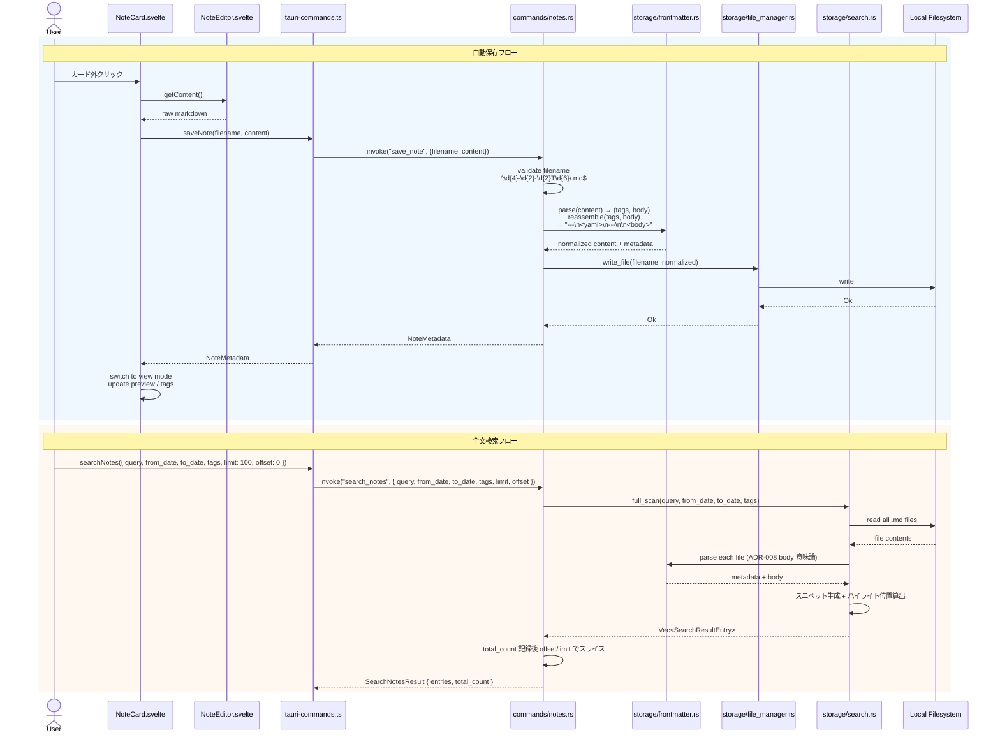
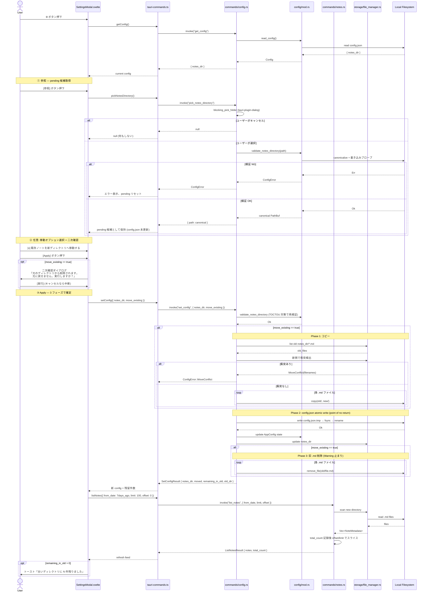

---
codd:
  node_id: detail:component_architecture
  type: design
  depends_on:
  - id: design:system-design
    relation: depends_on
    semantic: technical
  depended_by:
  - id: detail:editor_clipboard
    relation: depends_on
    semantic: technical
  - id: detail:storage_fileformat
    relation: depends_on
    semantic: technical
  - id: detail:feed_search
    relation: depends_on
    semantic: technical
  - id: plan:implementation_plan
    relation: depends_on
    semantic: technical
  conventions:
  - targets:
    - module:shell
    - framework:tauri
    reason: Tauri IPC境界を明確化し、フロントエンドからの直接ファイルシステムアクセスを禁止。全ファイル操作はRustバックエンド経由。
  - targets:
    - module:storage
    - module:settings
    reason: 設定変更（保存ディレクトリ）はRustバックエンド経由で永続化。フロントエンド単独でのファイルパス操作は禁止。
  modules:
  - editor
  - feed
  - storage
  - settings
  - shell
---

# Component Architecture & IPC Boundary

## 1. Overview

本設計書は PromptNotes の Tauri アプリケーションにおけるコンポーネント分割と IPC 境界を詳細に定義する。上流の System Design（design:system-design）で規定された 3 層アーキテクチャ（Tauri Shell → Frontend WebView → Rust Backend）を、実装可能なモジュール粒度まで分解し、各コンポーネント間の通信契約・所有権・責務境界を明確化する。

### 対象モジュール

本設計書がカバーするモジュールは以下の 5 つである。

| モジュール | レイヤー | 主要責務 |
|---|---|---|
| `module:shell` | OS / Tauri ランタイム | ウィンドウ管理、グローバルショートカット、プラグイン初期化、allowlist 強制 |
| `module:editor` | Frontend (Svelte + CodeMirror 6) | ノート編集・表示モード遷移、自動保存トリガー、コピー操作 |
| `module:feed` | Frontend + Backend | ノート一覧表示、デフォルト 7 日間フィルタ、タグ/日付フィルタ、全文検索 |
| `module:storage` | Backend (Rust) | `.md` ファイル CRUD、frontmatter パース、ファイル名バリデーション |
| `module:settings` | Frontend + Backend | 保存ディレクトリ変更、`config.json` 永続化 |

### リリースブロッキング制約への準拠

本設計書は以下の非交渉条件を全セクションにわたって反映する。

| 制約 | 準拠方法 |
|---|---|
| Tauri IPC 境界を明確化し、フロントエンドからの直接ファイルシステムアクセスを禁止。全ファイル操作は Rust バックエンド経由。 | §2 のコンポーネント図・シーケンス図で IPC 境界を明示。フロントエンドコンポーネントはすべて `tauri-commands.ts` の型安全ラッパー経由で `invoke` を呼び出し、`fs` API への直接アクセスパスを持たない設計とする。 |
| 設定変更（保存ディレクトリ）は Rust バックエンド経由で永続化。フロントエンド単独でのファイルパス操作は禁止。 | §3 で `module:settings` の所有権を定義し、`set_config` IPC コマンドを唯一の設定変更エントリポイントとする。フロントエンドはディレクトリパスの文字列を Rust に送信するのみで、パス解決・存在確認・書き込みはすべて Rust 側で実行する。 |
| ADR-008 body 意味論（閉じフェンス `---\n` 直後の区切り `\n` 1 つを body に含めない、往復冪等性）の両実装整合。 | §3 で Rust 側 `src-tauri/src/storage/frontmatter.rs` をファイル I/O の単一所有者、TypeScript 側 `src/editor/frontmatter.ts` を編集モードコピー時の body 抽出所有者と定義し、`tests/unit/frontmatter.ts` のスタブと共に往復冪等性ユニットテストで両者の一致を検証する。 |

## 2. Mermaid Diagrams

### 2.1 コンポーネント構成図



**所有権と通信境界の説明:**

この図は PromptNotes の全コンポーネントとその依存関係を示す。最も重要な設計制約は、Frontend Layer から Backend Layer への通信が **必ず `tauri-commands.ts`（invoke ラッパー）を経由する** 点である。フロントエンドのどのコンポーネントも、Tauri の `fs` プラグイン API を直接インポートしない。`tauri-commands.ts` は IPC 境界の唯一のゲートウェイであり、ここで型安全性を担保する。

Rust バックエンド内では、`commands/` レイヤーが IPC コマンドのエントリポイントとなり、実際のビジネスロジック（ファイル操作、検索、frontmatter パース）は `storage/` および `config/` モジュールに委譲される。`commands/` は薄いディスパッチ層であり、バリデーション・エラーハンドリング・レスポンス整形を担当する。全コマンドは統一エラー型 `TauriCommandError { code, message }` でエラーを返却する（§4.5 参照）。削除操作は `trash` クレートを使用し OS のゴミ箱に移動する（§4.6 参照）。

ADR-008 body 意味論については、ファイル I/O を伴うパース/シリアライズは `storage/frontmatter.rs` が単一所有する。一方、編集モードのコピー操作では CodeMirror 6 に保持される未保存テキストから body を抽出する必要があるため、この用途に限り TypeScript 側の `src/editor/frontmatter.ts`（`extractBody` / `generateNoteContent`）が使用される。両実装は閉じフェンス `---\n` 直後の区切り `\n` 1 つを body に含めない共通仕様を採用し、往復冪等性を満たす。

### 2.1b コンポーネント包含階層の不変条件 (Containment Invariants)

§2.1 のコンポーネント図に記された依存矢印は、実装時の Svelte コンポーネントツリー・DOM 包含階層として**厳密に**解釈される。以下の不変条件はリリースブロッキング制約として扱う。`codd implement` および手書き実装の双方でこれらを満たすこと。

**INV-CONTAIN-01 (唯一のメインビュー)**: `App.svelte` は起動時に単一の `<Feed>` コンポーネントのみをメインビューとしてマウントする。`App.svelte` の責務は (a) グローバルストアの初期化、(b) `<Feed>` の単一マウント、(c) `<SettingsModal>` のトグル、(d) 起動時のウィンドウ/ショートカットセットアップに限定される。「どのビューを表示するか」を切り替える `currentView` 的なステートを持たないこと。

**INV-CONTAIN-02 (NoteEditor の包含位置)**: `NoteEditor.svelte` は必ず「編集モードに遷移している NoteCard」の Svelte 子孫としてマウントされる。`Feed.svelte` の直接の子、または `App.svelte` の子として `NoteCard` と兄弟関係で配置してはならない。結果として、DOM 上で `.cm-editor` は `[data-testid="note-card"]` の子孫に限定される。

**INV-CONTAIN-03 (Feed の永続マウント)**: `Feed.svelte` および Feed 内の全 `NoteCard` は、任意のカードが編集モードにある間も DOM から外れない。編集モードへの遷移によって他のカード（編集中カードの兄弟）がアンマウントされてはならない。

**INV-CONTAIN-04 (単一 EditorView)**: Feed 全体を通して同時に存在する `EditorView` インスタンスは最大 1 つである（§4.3 のシングルインスタンス管理と一致）。別のカードをクリックした場合、旧カードの `EditorView` は destroy され、新カードで recreate される。

**INV-CONTAIN-05 (カード常設の子コンポーネント)**: `CopyButton.svelte` と `DeleteButton.svelte` は NoteCard の子として**表示モード・編集モード共通で常時マウント**される。モード遷移によって一瞬でもアンマウント／非描画されてはならない（AC-EDIT-06 / AC-EDIT-06b 準拠）。

### 2.2 IPC コマンドシーケンス図（新規ノート作成）



**実装境界の説明:**

このシーケンスは、ショートカット押下からエディタ表示までの全ステップを示す。IPC 境界（`tauri-commands.ts` → `commands/notes.rs`）を跨ぐ箇所が唯一のプロセス間通信であり、ここがレイテンシのボトルネックとなる。200ms 以内の目標を達成するため、`create_note` コマンドはファイル名生成 → 空ファイル書き込み → レスポンス返却を同期的に処理し、frontmatter シリアライズは最小限の固定文字列（`"---\ntags: []\n---\n\n"`、ADR-008 準拠でレイアウト末尾に空行 1 つ）を出力する。

### 2.3 自動保存・検索のシーケンス図



**実装境界の説明:**

自動保存フローでは、フロントエンドは CodeMirror 6 からの生の Markdown テキストをそのまま Rust バックエンドに送信する。ファイル I/O に伴う frontmatter パース・tags 抽出・ADR-008 body 意味論に則った正規化（`reassemble`）はすべて Rust 側の `storage/frontmatter.rs` が単一所有する。返却された `NoteMetadata` には `preview`（body 先頭切り詰め）と `tags` が含まれ、フロントエンドはそれらをそのまま表示モードに反映する。表示用にフロントエンドが frontmatter を独自にパースすることはない。

全文検索では `storage/search.rs` が保存ディレクトリ内の全 `.md` ファイルを走査し、`frontmatter.rs` の `parse` を呼び出して body 部分のみをマッチング対象とする。数十件規模では 200ms 以内のレスポンスが見込まれるが、1,000 件超過時は tantivy ベースのインデックス検索への移行を検討する（OQ-004）。

### 2.4 設定変更フロー



**実装境界の説明:**

設定変更フローは 2 段階確定（pick → apply）で構成される。フロントエンド（`SettingsModal.svelte`）はディレクトリパスの文字列値を取得するために Tauri の `dialog` プラグインを `pick_notes_directory` コマンド経由で使用するが、パスの解決・canonicalize・存在確認・書き込みプローブ・`config.json` への書き込み・既存ノート移動はすべて Rust バックエンド（`config/mod.rs` と `commands/config.rs`）が実行する。フロントエンド単独でのファイルパス操作（パス結合、存在チェック等）は禁止されており、この制約は `tauri-commands.ts` が `get_config` / `pick_notes_directory` / `set_config` の 3 コマンドのみを公開することで構造的に強制される。`pick_notes_directory` は `config.json` を書き換えず pending 候補を返すのみで、確定は `set_config` が担う。この分離により、参照だけして Apply しなかった場合に設定が変化しない性質を保証する。

## 3. Ownership Boundaries

### 3.1 モジュール所有権マトリクス

各ソースファイル・コンポーネントの正規所有者を以下に定義する。所有者以外のモジュールが同一の責務を再実装することを禁止する。

| ファイル / コンポーネント | 所有モジュール | 責務の単一所有 |
|---|---|---|
| `src-tauri/src/main.rs` / `src-tauri/src/lib.rs` | `module:shell` | Tauri アプリケーション初期化、プラグイン登録、capabilities 強制、**グローバルショートカット (`CmdOrCtrl+N`) の Rust 側登録と `new-note` イベント emit** |
| `src-tauri/src/error.rs` | `module:shell` | 統一エラー型 `TauriCommandError { code, message }` と `CommandResult<T>` 型エイリアス、各エラーコードのコンストラクタ (§4.5 / OQ-ARCH-002 準拠) |
| `src-tauri/src/commands/notes.rs` | `module:storage` | ノート CRUD の IPC エントリポイント（`create_note`, `save_note`, `trash_note`, `force_delete_note`, `read_note`, `list_notes`, `search_notes`, `list_all_tags`）。既存ノートの移動は `module:settings` の `set_config` に統合されており、本モジュールは移動 IPC を公開しない |
| `src/shell/window-close.ts` | `module:shell` | `onCloseRequested` のフック、`registerPendingSave` / `clearPendingSave` API で `module:editor` から未保存 save 関数を受け取り、クローズ直前に best-effort 実行する |
| `src/shell/global-shortcut.ts` | `module:shell` | Rust 側から emit される `new-note` イベントを `listen` で購読し、フロントエンドのハンドラ (`handleNewNote`) を発火させる薄いラッパー。**`@tauri-apps/plugin-global-shortcut` の直接 import は禁止** |
| `src-tauri/src/commands/config.rs` | `module:settings` | 設定読み書きの IPC エントリポイント（`get_config`, `set_config`） |
| `src-tauri/src/commands/clipboard.rs` | `module:shell` | クリップボード操作の IPC エントリポイント（`copy_to_clipboard`） |
| `src-tauri/src/storage/file_manager.rs` | `module:storage` | ファイル CRUD 操作（唯一のファイルシステム書き込みポイント） |
| `src-tauri/src/storage/frontmatter.rs` | `module:storage` | YAML frontmatter パース/シリアライズ（ADR-008 body 意味論の Rust 側単一所有者）。`parse` は閉じフェンス `\n---\n` 直後の `\n` を body に含めず、`reassemble` は frontmatter 末尾 `\n` の後に区切り `\n` を 1 つ追加して body を連結する。往復冪等性を `#[cfg(test)] mod tests` で保証する |
| `src-tauri/src/storage/search.rs` | `module:feed` | 全文検索ロジック（ファイル全走査） |
| `src-tauri/src/config/mod.rs` | `module:settings` | `config.json` 読み書き、ディレクトリバリデーション |
| `src/shell/tauri-commands.ts` | 共有（全モジュール） | IPC invoke の型安全ラッパー。**単一所有者: module:shell が API 定義を管理し、他モジュールはインポートのみ** |
| `src/storage/timestamp.ts` | 共有（全モジュール） | ファイル名 ↔ 日時変換ユーティリティ。**単一所有者: module:storage がフォーマット仕様を決定** |
| `src/editor/frontmatter.ts` | `module:editor` | ADR-008 body 意味論の TypeScript 本番実装。`extractBody` は閉じフェンス直後の空行を除去し、`generateNoteContent` は frontmatter と body の間に空行 1 行を挿入する。**用途は編集モードのコピー操作に限定**され、CodeMirror 6 が保持する未保存テキストから body を抽出する。ファイル I/O を伴うパース/シリアライズは Rust 側 `storage/frontmatter.rs` が排他所有し、本ファイルは IPC レスポンスのパース用途には使用しない |
| `tests/unit/frontmatter.ts` | `module:storage` | ADR-008 TypeScript スタブ（`splitRaw`, `serializeFrontmatter`）。`tests/unit/frontmatter.test.ts` の往復冪等性ユニットテストから利用され、Rust 実装と TS 実装の共通仕様を検証する |
| `src/feed/notes.ts` | `module:feed` | ノート一覧の状態管理 |
| `src/feed/filters.ts` | `module:feed` | フィルタ状態（日付範囲、タグ、検索クエリ）の管理。セッション内は状態保持、アプリ再起動時にデフォルト（7 日間）にリセット |
| `src/feed/searchResults.ts` | `module:feed` | 検索結果のスニペット・ハイライト情報（`Writable<SearchResultEntry[] | null>`）。`search_notes` レスポンス時に更新、`list_notes` フォールバック時は `null` |
| `src/feed/totalCount.ts` | `module:feed` | フィルタ条件に合致する全ノート数（`Writable<number>`）。ページネーション（スクロールロード）の次ページ有無判定に使用 |
| `src/settings/config.ts` | `module:settings` | 設定状態のキャッシュ |
| `src/editor/NoteCard.svelte` | `module:editor` | ノートカードの表示/編集モード制御・モード切替時の高さアニメーション（§4.13）。**Feed 内の flex 縮小を防ぐためのレイアウト制約**（`flex-shrink: 0` 等）は `detail:feed_search` §4.4c を参照 |
| `src/editor/NoteEditor.svelte` | `module:editor` | CodeMirror 6 インスタンスのライフサイクル管理 |
| `src/editor/CopyButton.svelte` | `module:editor` | コピー操作 UI とフィードバック。**表示モード・編集モードの両方で常時マウントされ、モード遷移で再マウントしない**（詳細は `detail:editor_clipboard` §2.1 / §4.4 を参照）。**絵文字単体表示は禁止**でテキストラベル + 枠線により視認性を保証する。編集モードでのコピー時は `src/editor/frontmatter.ts` の `extractBody` を経由して body のみをクリップボードに送る |
| `src/editor/DeleteButton.svelte` | `module:editor` | 削除操作 UI（テキストラベル `Delete` + 枠線で視認性を保証、絵文字単体表示は禁止）。詳細は `detail:editor_clipboard` §4.4b を参照 |
| `src/feed/Feed.svelte` | `module:feed` | ノートカード一覧のレンダリング（降順ソート）。ノート追加時のフェードイン・削除時のフェードアウト・残存カードの FLIP アニメーションを管理（§4.12 参照） |
| `src/feed/SearchBar.svelte` | `module:feed` | 検索入力 UI |
| `src/feed/TagFilter.svelte` | `module:feed` | タグフィルタ UI（複数選択時は OR 条件） |
| `src/feed/DateFilter.svelte` | `module:feed` | 日付範囲フィルタ UI |
| `src/feed/Header.svelte` | `module:feed` | ヘッダー統合コンポーネント（New ボタン、⚙️ ボタン、SearchBar、フィルタ）。アプリ名は表示しない |
| `src/settings/SettingsModal.svelte` | `module:settings` | 設定モーダル UI |

### 3.2 共有型の所有権

再実装ドリフトを防止するため、以下の共有型・インターフェースの正規所有者を明記する。

| 型 / インターフェース | 正規所有者 | 定義場所 | 利用者 |
|---|---|---|---|
| `NoteMetadata` (TypeScript) | `module:storage` | `src/shell/tauri-commands.ts` | `module:feed`, `module:editor` |
| `NoteMetadata` (Rust struct) | `module:storage` | `src-tauri/src/commands/notes.rs` | `storage/search.rs`, `storage/file_manager.rs` |
| `ListNotesResult` (Rust struct) | `module:storage` | `src-tauri/src/commands/notes.rs` | `list_notes` IPC レスポンス型。`notes: Vec<NoteMetadata>` + `total_count: u32` |
| `SearchResultEntry` (Rust struct) | `module:feed` | `src-tauri/src/storage/search.rs` | `metadata: NoteMetadata` + `snippet: String` + `highlights: Vec<HighlightRange>`。`search_notes` レスポンス要素型 |
| `SearchNotesResult` (Rust struct) | `module:feed` | `src-tauri/src/commands/notes.rs` | `entries: Vec<SearchResultEntry>` + `total_count: u32`。`search_notes` IPC レスポンス型 |
| `HighlightRange` (Rust struct) | `module:feed` | `src-tauri/src/storage/search.rs` | `start: u32`, `end: u32`。スニペット内のマッチ位置（相対オフセット） |
| `SearchResultEntry` (TypeScript) | `module:feed` | `src/shell/tauri-commands.ts` | `searchResults.ts` store の要素型。`NoteCard.svelte` がスニペット・ハイライト表示に使用 |
| `ListOptions` (Rust struct) | `module:storage` | `src-tauri/src/commands/notes.rs` | `from_date`, `to_date`, `tags`, `limit`, `offset` パラメータの IPC 受け渡し用 |
| `AppConfig` (Rust struct) | `module:settings` | `src-tauri/src/config/mod.rs` | `commands/config.rs` |
| `AppConfig` (TypeScript) | `module:settings` | `src/settings/config.ts` | `SettingsModal.svelte` |
| ファイル名正規表現 `^\d{4}-\d{2}-\d{2}T\d{6}\.md$` | `module:storage` | `src-tauri/src/storage/file_manager.rs` | `commands/notes.rs`（バリデーション時にインポート） |
| ADR-008 body 意味論共通仕様 | `module:storage` | ADR-008 本体 + `src-tauri/src/storage/frontmatter.rs` のドキュメントコメント | `src/editor/frontmatter.ts`, `tests/unit/frontmatter.ts`（仕様準拠の義務） |

### 3.3 IPC 境界の所有ルール

1. **IPC コマンド定義**: Rust 側の `commands/` ディレクトリが正規所有者。新しい IPC コマンドの追加は必ず `commands/mod.rs` での登録を伴う。
2. **IPC ラッパー**: フロントエンド側の `tauri-commands.ts` が唯一の invoke 呼び出しポイント。各 Svelte コンポーネントは `@tauri-apps/api/core` の `invoke` を直接呼び出さず、`tauri-commands.ts` の型付き関数を使用する。
3. **frontmatter パースの分担**: ファイル I/O に伴う frontmatter パース・シリアライズ（`save_note` / `read_note` / `list_notes` / `search_notes` の内部処理）は Rust 側 `storage/frontmatter.rs` が単一所有する。`list_notes` / `read_note` / `save_note` の IPC レスポンスにはパース済み構造化データ（`tags` 配列、`preview` 等）を含め、フロントエンド表示にそのまま使用する。一方、編集モードのコピー操作（AC-EDIT-06b / FC-EDIT-03）は CodeMirror 6 が保持する未保存テキストから body を抽出する必要があるため、この用途に限り TypeScript 側 `src/editor/frontmatter.ts` が `extractBody` / `generateNoteContent` を提供する。両実装は ADR-008 の body 意味論（閉じフェンス `---\n` 直後の区切り `\n` 1 つを body に含めない、`---\n<yaml>\n---\n\n<body>` に正規化、body 空時は末尾 `\n` を残す）を共通仕様として採用し、`tests/unit/frontmatter.test.ts` および `src-tauri/src/storage/frontmatter.rs` の `#[cfg(test)] mod tests` で往復冪等性を検証する。

### 3.4 プラグイン使用の所有ルール

| Tauri プラグイン | 使用を許可されるモジュール | 禁止事項 |
|---|---|---|
| `fs` | `module:storage`（Rust 側のみ） | フロントエンドからの直接使用禁止 |
| `clipboard-manager` | `module:shell`（`commands/clipboard.rs` 経由） | フロントエンドの Web Clipboard API 使用禁止。`read_from_clipboard` IPC は提供しない (write のみ) |
| `dialog` | `module:settings`（Rust 側 `pick_notes_directory` 経由） | **フロントエンドからの `@tauri-apps/plugin-dialog` 直接 import 禁止**。dialog 起動・canonical 化・validate は全て Rust 側 `commands/config.rs` が実施 |
| `global-shortcut` | `module:shell`（`lib.rs` の setup 内で Rust 側登録） | **フロントエンドからの `@tauri-apps/plugin-global-shortcut` 直接 import 禁止**。Rust 側が shortcut を register し、発火時に main window へ `new-note` イベントを emit。フロントエンドは `listen` で購読 |

## 4. Implementation Implications

### 4.1 IPC 境界の強制メカニズム

フロントエンドからの直接ファイルシステムアクセス禁止は、以下の 3 つのレイヤーで強制する。

1. **`src-tauri/capabilities/default.json` の capabilities**: WebView に付与する capability を `core:default` のみに限定し、`fs:*` / `clipboard-manager:*` / `dialog:*` / `global-shortcut:*` の WebView 直アクセスを**完全に遮断**する。プラグイン本体 (`tauri_plugin_fs::init()` 等) は Rust 側で初期化するが、WebView からは `invoke` による Rust コマンド呼び出しのみ可能。
2. **コードレビュー規約**: フロントエンドコードが `@tauri-apps/plugin-fs` / `@tauri-apps/plugin-clipboard-manager` / `@tauri-apps/plugin-dialog` / `@tauri-apps/plugin-global-shortcut` をインポートしている場合はリジェクトする。許可されるインポートは `@tauri-apps/api/core`（`invoke` のみ、`tauri-commands.ts` 内に限定）と `@tauri-apps/api/event`（`listen` のみ、`global-shortcut.ts` で `new-note` 購読専用）のみ。
3. **ESLint ルール**: `eslint.config.js` の `no-restricted-imports` と `no-restricted-globals` で上記プラグイン群と `navigator.clipboard` を構造的に禁止する。`npm run lint` を CI で必須実行。

```js
// eslint.config.js (抜粋)
{
  rules: {
    "no-restricted-imports": ["error", {
      paths: [
        { name: "@tauri-apps/plugin-fs", message: "Use tauri-commands.ts IPC wrappers." },
        { name: "@tauri-apps/plugin-clipboard-manager", message: "Use tauri-commands.ts copyToClipboard()." },
        { name: "@tauri-apps/plugin-dialog", message: "Use tauri-commands.ts pickNotesDirectory()." },
        { name: "@tauri-apps/plugin-global-shortcut", message: "Use 'new-note' event from Rust-side registration." },
      ],
    }],
    "no-restricted-globals": ["error", {
      name: "navigator",
      message: "Do not access navigator.clipboard. Use tauri-commands.ts IPC wrappers.",
    }],
  },
}
```

### 4.2 設定変更の安全性とファイル移動

`module:settings` における保存ディレクトリ変更は 2 段階確定（pick → apply）で処理する。途中で失敗した場合の状態遷移は `config.json` の atomic write を唯一の不可逆境界（point of no return）として設計される。

**ステップ 1: 参照（pick）— pending 候補取得**

1. ユーザーが `SettingsModal.svelte` の `[参照]` ボタンを押下
2. `pick_notes_directory` IPC コマンドを発行
3. Rust 側が `tauri-plugin-dialog` の `blocking_pick_folder` を起動
4. ユーザーがキャンセル → `null` を返却（`config.json` 未変更、UI は元の状態を保持）
5. ユーザーが選択 → `validate_notes_directory(path)` を実行
   - 失敗 → `ConfigError` を返却、`SettingsModal.svelte` がエラー表示。`config.json` 未変更
   - 成功 → canonical 化した `PathBuf` を返却。`SettingsModal.svelte` 内の `pendingPath` ステートに保持（`config.json` 未変更）
6. **重要**: この段階では `config.json` は一切書き換わらない。`[参照] したが Apply しなかった` ケースで設定が変化しないことを保証する。

**ステップ 2: 移動オプション選択と二次確認（UI 責務）**

1. ユーザーが `[ ] 既存ノートを新ディレクトリへ移動する` チェックボックスを任意で選択（既定: オフ）
2. `[Apply]` ボタンを押下
3. チェックボックスがオンの場合、`SettingsModal.svelte` が二次確認ダイアログを表示:
   > 既存ノート N 件を新ディレクトリへ移動します。
   > 元のディレクトリからは削除され、元に戻せません。
   > 実行しますか？  [キャンセル] [実行]
4. `[キャンセル]` → pending 状態を保持したまま UI に戻る（Apply はなかったことになる）
5. `[実行]` → `set_config` 発行へ進む

**ステップ 3: Apply — 3 フェーズで確定**

`set_config({ notes_dir, move_existing })` は以下の 3 フェーズを Rust バックエンドが実行する。詳細は `detail:storage_fileformat` §4.5 を参照。

| フェーズ | 内容 | 失敗時の状態 |
|---|---|---|
| Phase 0 | `validate_notes_directory` 再実行（TOCTOU 対策） | 旧 `config.json` のまま、ConfigError 返却 |
| Phase 1 | `move_existing: true` の場合のみ、旧 `notes_dir/*.md` を新 `notes_dir` へコピー | 新側の途中コピーを削除してロールバック。旧は無傷 |
| Phase 2 | `config.json` を atomic write (tmp → fsync → rename) ← **point of no return** | 新側コピーを削除して status quo 復元 |
| Phase 3 | `move_existing: true` の場合のみ、旧 `notes_dir/*.md` を削除 | `remaining_in_old` にカウント（Error ではなく Warning 相当） |

**ファイル移動の扱い（`move_existing` フラグ単独制御）**

旧 `move_notes` IPC コマンドの構想は廃止する。移動と設定更新は `set_config` の単一トランザクションに統合する。

- **`move_existing: false`（既定）**: 旧ディレクトリのファイルは一切触らない。新ディレクトリが空の場合はフィードが空から始まる。旧ディレクトリを後で再選択すれば元のデータに戻れる
- **`move_existing: true`**: 3 フェーズで .md ファイルのみ移動。非 `.md` ファイル（Obsidian 添付画像・`.canvas` 等）は対象外で旧ディレクトリに残る
- **衝突検出**: Phase 1 で新側に同名 `.md` が存在する場合 `ConfigError::MoveConflict(filenames)` を返して中止。ユーザーに衝突ファイル名を表示し、手動解消を促す
- **部分削除失敗**: Phase 3 で旧 `.md` の削除に失敗したファイル数を `SetConfigResult.remaining_in_old` で返却。UI がトースト「古いディレクトリに N 件残りました」を表示
- **同一ディレクトリ選択**: `ConfigError::SameDirectory` として早期リターン（副作用なし）

フロントエンドはパスの妥当性検証を一切行わない。`SettingsModal.svelte` は `pick_notes_directory` が返した canonical パスをそのまま `pendingPath` に保持し、`set_config` に渡す。Rust バックエンドが Apply 時点で再度 `validate_notes_directory` を呼び直すことで、参照から Apply までの間に発生したディスク状態変化（TOCTOU）を吸収する。

**起動時ディレクトリ不在の扱い**

アプリ起動時に `notes_dir` へのアクセスが失敗した場合、`config/mod.rs` は errno を 4 種（`ENOENT` / `EACCES` / `EIO`系 / `ENOTDIR`）に分類して UI に通知する。自動でデフォルトにフォールバックすることは禁止（requirements 不可侵条項 4）。`SettingsModal.svelte` または起動時エラーモーダルが以下の 3 択を表示する:

- `[再試行]` — 一時的不在（外付けディスクの再接続等）のリカバリパス。`get_config` を再発行して再検証
- `[別のディレクトリを選ぶ]` — `pick_notes_directory` フローへ遷移
- `[デフォルトに戻す]` — ユーザー明示同意を経て `config.json` をデフォルト値で上書き

### 4.3 CodeMirror 6 インスタンス管理

`NoteEditor.svelte` は CodeMirror 6 のシングルインスタンスを destroy → recreate 方式で管理する。同時に編集モードになるカードは 1 つだけであるため、`EditorView` インスタンスは最大 1 つのみ存在する。カード遷移ごとにインスタンスを破棄・再生成することでメモリ消費を最小化する。

- **マウント**: `NoteCard.svelte` が編集モードに遷移する際に `NoteEditor.svelte` をマウントし、`EditorView` を新規生成
- **アンマウント**: 別カードクリックまたはカード外クリック時に自動保存を実行した後、`EditorView.destroy()` を呼び出してリソースを解放
- **拡張構成**: `@codemirror/lang-markdown` + `@codemirror/language-data` によるシンタックスハイライト、`ViewPlugin` + `Decoration` による frontmatter 背景色カスタマイズ
- **パフォーマンス計測**: E2E テストで CodeMirror 6 の初期化時間を計測し、200ms 以内であることを検証する
- **禁止**: Markdown の HTML レンダリング（プレビュー）は実装しない。タイトル入力欄は実装しない。違反時リリース不可。

### 4.3b 禁止実装パターン (Forbidden Implementation Patterns)

本節は §2.1b の INV-CONTAIN-01〜05 を違反しうる実装パターンを明示的に列挙する。`codd implement` および手書き実装の双方で、以下のいずれも採用してはならない。違反時リリース不可。

| # | 禁止パターン | 違反する不変条件 |
|---|---|---|
| FBD-01 | `App.svelte` に `currentView: "feed" \| "editor" \| "settings"` 型の画面切替ステートを置き、編集時に Feed 全体をアンマウントしてフルスクリーン NoteEditor を表示する | INV-CONTAIN-01, 02, 03 |
| FBD-02 | `src/routes/edit/[filename]` のような URL ルート単位で編集画面を分ける（SvelteKit 相当のルーティングで NoteEditor を別ページ化する） | INV-CONTAIN-01, 02, 03 |
| FBD-03 | NoteCard が `body_preview` や省略テキストのみを表示し、本文全文を**いずれかの手段で**取得・表示できる状態にしない（`white-space: nowrap` / `text-overflow: ellipsis` / `-webkit-line-clamp` 等による恒久的切り詰めや、本文を `body_preview` フィールドのみで保持する設計）。表示モードは `max-height` + カード内スクロールで本文を表示し、編集モードは本文量に応じてカード高を伸ばすこと（requirements §ノート、AC-UI-04）。なお `max-height` を超えるカード内スクロールは表示モードでのみ許容され、本文の永続的な切り詰めは禁止 | requirements §ノート |
| FBD-04 | 編集モード遷移時に NoteCard 構造（CopyButton・DeleteButton・タグ行）をアンマウントまたは再マウントする | INV-CONTAIN-05, AC-EDIT-06b |
| FBD-05 | `NoteEditor.svelte` に `onBack: () => void` のようなコールバックを持たせて、Feed への「戻る」ナビゲーションを前提とした API にする。`onBack` の存在はインラインエディタであれば不要であり、フルスクリーンエディタ前提の設計の化石である | INV-CONTAIN-02 |
| FBD-06 | Masonry / Pinterest 風カード / CSS columns / 多次元レイアウト（`auto-fill` / `repeat()` / 多列）等で 2 列以上の多列レイアウトを構成する。フィードは必ず単一列・縦積みとし、`display: flex; flex-direction: column` で実装すること。requirements §フィード表示「新しいノートが上に来る降順表示」「縦に並ぶフィード形式」を厳守する | requirements §トップフィード画面 |

### 4.4 Store 設計とデータフロー

Svelte の reactive store を使用し、コンポーネント間の状態共有を以下のように設計する。

| Store | 型 | 更新トリガー | 購読者 |
|---|---|---|---|
| `notes` (`notes.ts`) | `Writable<NoteMetadata[]>` | `list_notes` / `search_notes` レスポンス受信時、`create_note` / `save_note` / `delete_note` 成功時 | `Feed.svelte`, `NoteCard.svelte` |
| `filters` (`filters.ts`) | `Writable<{ fromDate: string, toDate: string, tags: string[], query: string }>` | `DateFilter`, `TagFilter`, `SearchBar` の UI 操作時 | `Feed.svelte`（フィルタ変更で `list_notes` / `search_notes` を再発行） |
| `config` (`config.ts`) | `Writable<{ notes_dir: string, pendingPath: string \| null, moveExisting: boolean, lastResult: SetConfigResult \| null }>` | `get_config` レスポンス受信時に `notes_dir` 更新。`pick_notes_directory` レスポンス受信時に `pendingPath` 更新（参照段階、`notes_dir` は未変更）。`set_config` 成功時に `notes_dir` / `lastResult` 更新 + `pendingPath: null` リセット。`lastResult.remaining_in_old > 0` の場合は UI がトースト表示 | `SettingsModal.svelte` |

`filters` store の変更は `Feed.svelte` の reactive ブロック（`$:` ステートメント）で検知し、対応する IPC コマンドを自動発行する。デフォルト値はアプリ起動時に `fromDate` を 7 日前の `00:00:00`、`toDate` を現在日時に設定する。

### 4.5 統一エラー型

IPC コマンドのエラーハンドリングは統一エラー型を使用する。

**Rust 側定義:**

```rust
#[derive(Serialize)]
struct TauriCommandError {
    code: String,
    message: String,
}
```

**エラーコード一覧（`MODULE_REASON` 形式）:**

| code | 発生箇所 | 意味 |
|---|---|---|
| `STORAGE_NOT_FOUND` | `commands/notes.rs` | 指定ファイルが存在しない |
| `STORAGE_INVALID_FILENAME` | `commands/notes.rs` | ファイル名が正規表現に不合致 |
| `STORAGE_WRITE_FAILED` | `storage/file_manager.rs` | ファイル書き込み失敗 |
| `STORAGE_PATH_TRAVERSAL` | `storage/file_manager.rs` | パストラバーサル検出 |
| `STORAGE_FRONTMATTER_PARSE` | `storage/frontmatter.rs` | frontmatter の YAML パースに失敗（ADR-008 不変条件違反） |
| `CONFIG_INVALID_DIR` | `commands/config.rs` | ディレクトリが存在せず作成も失敗 |
| `CONFIG_WRITE_FAILED` | `config/mod.rs` | config.json 書き込み失敗 |
| `CLIPBOARD_FAILED` | `commands/clipboard.rs` | クリップボード操作失敗 |
| `TRASH_FAILED` | `commands/notes.rs` | ゴミ箱移動失敗（フォールバックダイアログのトリガー） |

フロントエンド側では `code` を switch 文で分岐し、ユーザー向けメッセージを表示する。`message` はデバッグ用の詳細情報（ファイルパス、OS エラー等）を含み、開発者コンソールに出力する。

`tauri-commands.ts` で対応する TypeScript 型を定義する。

```typescript
interface TauriCommandError {
  code: string;
  message: string;
}
```

### 4.6 削除操作とゴミ箱連携

ノート削除は `trash` クレートを使用し、OS のゴミ箱に移動する。確認ダイアログは表示しない。

**削除フロー:**

1. `delete_note` IPC コマンドが `filename` を受信
2. `file_manager.rs` でファイル名バリデーション・パストラバーサル検証
3. `trash::delete()` でゴミ箱への移動を試行
4. 成功: 完了レスポンスを返却（ダイアログなし）
5. 失敗（`TRASH_FAILED`）: エラーを返却。フロントエンドが確認ダイアログを表示

```
「ゴミ箱が利用できません。完全に削除しますか？」
[削除する] / [キャンセル]
```

- **「削除する」**: `force_delete_note` IPC コマンドを発行。`std::fs::remove_file()` で完全削除
- **「キャンセル」**: 操作を中止

**依存クレート:** `trash` （Linux: freedesktop trash spec、macOS: NSFileManager に対応）

### 4.7 ファイル名バリデーションとパストラバーサル防止

`storage/file_manager.rs` が以下のバリデーションを一元的に所有する。

1. ファイル名が正規表現 `^\d{4}-\d{2}-\d{2}T\d{6}\.md$` に合致すること
2. ファイル名にパスセパレータ（`/`, `\`）が含まれないこと
3. 解決後のパスが設定済み `notes_dir` 配下であること（`canonicalize` で検証）

すべての IPC コマンド（`save_note`, `delete_note`, `read_note`）は `file_manager.rs` のバリデーション関数を呼び出してからファイル操作を実行する。

### 4.8 パフォーマンス制約の実装方針

| 指標 | 閾値 | 実装方針 |
|---|---|---|
| ショートカット → エディタ表示 | 200ms 以内 | `create_note` は固定文字列の frontmatter を同期書き込み。CodeMirror 6 の初期化は最小拡張セットで実行 |
| 全文検索レスポンス | 200ms 以内（数十件規模） | `search.rs` で `std::fs::read_dir` + `read_to_string` による逐次走査。1,000 件超過・200ms 超過時に tantivy 移行を検討 |
| 自動保存完了 | 100ms 以内 | `save_note` は frontmatter パース → `reassemble` による正規化 → ファイル書き込みを同期で実行。非同期 I/O のオーバーヘッドを回避 |
| アプリ起動 → フィード表示 | 2 秒以内 | 起動時に `list_notes` でデフォルト 7 日間分のみ読み込み。frontmatter パースは先頭 `---` 〜 `---` のみ走査し本文全体は読まない |

### 4.9 プラットフォーム固有の考慮事項

| 項目 | Linux | macOS |
|---|---|---|
| デフォルト保存ディレクトリ | `~/.local/share/com.promptnotes/notes/` | `~/Library/Application Support/com.promptnotes/notes/` |
| 設定ファイルパス | `~/.local/share/com.promptnotes/config.json` | `~/Library/Application Support/com.promptnotes/config.json` |
| グローバルショートカット | Ctrl+N | Cmd+N |
| ビルド出力 | `.deb`, `.AppImage`, Flatpak | `.dmg`, Homebrew Cask |
| E2E テスト実行 | `xvfb-run` で仮想ディスプレイ上 | ネイティブ実行 |

パス解決には Tauri の `app_data_dir()` API を使用し、OS ごとのパス差異をアプリケーションコードから隔離する。ADR-010 で固定した bundle identifier `com.promptnotes` が `app_data_dir()` の戻り値を決定し、そこから派生する `<app_data_dir>/notes/` がデフォルト `notes_dir` となる。`config/mod.rs` が `app_data_dir()` を唯一の呼び出し元とし、`dirs::data_dir()` 等による OS 別パスのハードコード・identifier の迂回は禁止する。

### 4.10 ネットワークアクセス禁止の構造的強制

AI 呼び出し機能の実装禁止を構造的に保証するため、以下の対策を講じる。

1. **`tauri.conf.json`**: `http` / `shell:open` 等のネットワーク関連 capability を一切定義しない
2. **Cargo.toml**: `reqwest`, `hyper` 等の HTTP クライアントクレートを依存関係に含めない
3. **package.json**: `fetch` ラッパーや HTTP クライアントライブラリ（`axios` 等）を依存関係に含めない
4. **CSP (Content Security Policy)**: `tauri.conf.json` の `security.csp` で `connect-src 'none'` を設定し、WebView からのネットワークリクエストをブロック

### 4.11 ADR-008 body 意味論の両実装整合

Rust 側 `storage/frontmatter.rs` と TypeScript 側 `src/editor/frontmatter.ts` は独立実装となるため、共通仕様からのドリフトを防ぐ運用規約を設ける。

1. **仕様の単一情報源**: ADR-008 が body 定義・正規化レイアウト（`---\n<yaml>\n---\n\n<body>`）・body 空時の末尾 `\n` 残存・往復冪等性を規定する。両実装の doc コメントには ADR-008 へのリンクを記載する。
2. **TypeScript 本番実装の適用範囲**: `src/editor/frontmatter.ts` は編集モードのコピー操作（CodeMirror 6 の未保存テキストから body を抽出して `copy_to_clipboard` に渡す経路）でのみ使用する。IPC レスポンスの frontmatter 再解析には使用しない。
3. **TypeScript スタブの検証**: `tests/unit/frontmatter.ts`（`splitRaw`, `serializeFrontmatter`）は `tests/unit/frontmatter.test.ts` から参照され、`parseFrontmatter → serializeFrontmatter → parseFrontmatter` の往復冪等性、および `generateNoteContent → extractBody → generateNoteContent` の擬似往復冪等性を表明する。
4. **Rust 側の検証**: `src-tauri/src/storage/frontmatter.rs` 末尾の `#[cfg(test)] mod tests` に `parse → reassemble → parse` の往復で `(tags, body)` が一致することを表明するテストを配置する。
5. **回帰防止**: N 回繰り返しても body 先頭に改行 `\n` が累積しないこと（AC-STOR-06）をユニットテストで保証し、Rust/TS 両実装のいずれかを変更した場合は両方のテストを必ず再実行する。

### 4.12 ノート数変化時のアニメーション

`Feed.svelte` はノートの追加・削除時に以下のアニメーションを適用する（AC-UI-09, AC-UI-10）。

**使用する Svelte ディレクティブ:**

| ディレクティブ | 対象 | 効果 |
|---|---|---|
| `transition:fade` (in) | 新規追加カード | フェードインで登場 |
| `transition:fade` (out) | 削除対象カード | フェードアウトで退場 |
| `animate:flip` | 残存カード | 追加・削除後の位置移動を滑らかにアニメーション |

**実装方針:**

- `Feed.svelte` の `{#each $notes as note (note.filename)}` ブロック内の各 `NoteCard` に対して、Svelte 組み込みの `transition:fade` と `animate:flip` を適用する
- duration は Svelte デフォルト値を使用する（`animate:flip` は移動距離に応じて可変、`transition:fade` は 400ms）
- アニメーション中も操作をブロックしない。Svelte の `transition` / `animate` は要素ごとに独立して動作するため、連続削除等の操作を即座に受け付けてもクラッシュやレイアウト崩れが発生しない
- 外部アニメーションライブラリは導入しない（Svelte 組み込み機能で完結する）

**所有権:** アニメーションディレクティブの適用は `Feed.svelte`（`module:feed`）が単一所有する。モード切替時の高さアニメーション（§4.13）は `NoteCard.svelte`（`module:editor`）が所有し、責務は分離される。

**prefers-reduced-motion:** `@media (prefers-reduced-motion: reduce)` が有効な環境ではフェード/FLIP アニメーションを無効化し即時切替にフォールバックする（AC-UI-12）。

**IPC 境界への影響:** なし。アニメーションは純粋にフロントエンド側の DOM 操作であり、Rust バックエンドへの新規コマンド追加は不要。

### 4.13 モード切替時の高さアニメーション

`NoteCard.svelte` は表示モード↔編集モードの切替時にカード外形高さの変化をアニメーションする（AC-UI-11, AC-UI-12）。

**カード外形高さの定義:**

| モード | カード外形高さ |
|---|---|
| 表示モード | `min(本文全展開高さ + パディング, max-height)`（既定 `max-height` = 300px） |
| 編集モード | `本文全展開高さ + パディング`（`max-height` は適用しない） |

**仕様:**

| 項目 | 値 |
|---|---|
| 対象 | モード切替時のカード外形高さの変化のみ（タイピング中のリアルタイム高さ変化は対象外） |
| 時間・イージング | 200ms / ease-in-out |
| コンテンツ切替 | 高さアニメーション開始と同時に即時切替 |
| 高さ差 0 のケース | 本文が `max-height` 未満で表示↔編集の外形高さが等しい場合、視覚的な高さ変化は生じない（`transition` は設定されていてよいが、`height` の補間結果は不変）。コンテンツ切替は他ケースと同様に即時行う |
| スクロール位置 | 表示モードでカード内スクロール位置を持っていても、編集モード遷移時は引き継がず、エディタはノート先頭から表示する。表示モードに戻ったときも `scrollTop = 0` にリセットする |
| 中断時の挙動 | 実行中のアニメーションを即座に最終状態にスナップし次の操作を受け付ける |

**実装方針:**

- モード切替前にカード要素の現在の外形高さを計測し、切替後の外形高さを確定してから CSS `transition: height` または Web Animations API で補間する
- 表示モードの確定高さは `min(scrollHeight + padding, max-height)`、編集モードの確定高さは `scrollHeight + padding`（CodeMirror マウント後の値）として計算する
- CSS `transition: height` は `height: auto` に対して動作しないため、切替前後の高さを JavaScript で計測して明示的な px 値でアニメーションを駆動する
- アニメーション完了後は `height` を `auto` に戻し、コンテンツ変化による自然な高さ変化を妨げない（表示モード復帰時は併せて `max-height` 制約を再適用する）

**prefers-reduced-motion:** `@media (prefers-reduced-motion: reduce)` が有効な環境ではアニメーションを無効化し即時切替にフォールバックする（AC-UI-12）。

**所有権:** `NoteCard.svelte`（`module:editor`）が単一所有する。`Feed.svelte` はモード切替アニメーションの知識を持たない。

**IPC 境界への影響:** なし。

## 5. Resolved Questions

全 Open Questions は解決済みである。以下に決定事項を記録する。

| ID | 質問 | 決定 | 反映先 |
|---|---|---|---|
| OQ-ARCH-001 | CodeMirror 6 インスタンスをカード遷移時に destroy/recreate するか再利用するか | destroy → recreate を無条件採用。メモリ消費を最小化する。パフォーマンス計測テスト（200ms 以内）を E2E テストで実施する | §4.3 |
| OQ-ARCH-002 | エラーハンドリングを統一型で行うか個別処理するか | 統一エラー型 `TauriCommandError { code: string, message: string }` を採用。エラーコードは `MODULE_REASON` 形式（例: `STORAGE_NOT_FOUND`, `STORAGE_FRONTMATTER_PARSE`, `CONFIG_INVALID_DIR`） | §4.5 |
| OQ-ARCH-003 | 削除操作に確認ダイアログを表示するか | `trash` クレートで OS のゴミ箱に移動（確認ダイアログなし）。ゴミ箱移動失敗時のみ確認ダイアログを表示し、ユーザーが完全削除を選択可能 | §4.6 |
| OQ-ARCH-004 | 保存ディレクトリ変更時に旧ディレクトリのファイルを移動するか | ユーザーに確認ダイアログ「ノートを新しいディレクトリに移動しますか？」を表示。移動を選択した場合、同名ファイルはスキップ（上書きしない）。結果を件数通知（例:「12件移動、2件スキップ」） | §4.2 |
| OQ-ARCH-005 | フロントエンド側と Rust 側の frontmatter パース不整合時の優先順位 | ADR-008 を両実装の単一仕様とし、ファイル I/O 経路は Rust 側 `storage/frontmatter.rs` が排他所有（`list_notes` / `read_note` / `save_note` のレスポンスにパース済み構造化データを含める）。TypeScript 側 `src/editor/frontmatter.ts` は編集モードのコピー操作（CodeMirror 6 が保持する未保存テキストからの body 抽出）に用途を限定し、`tests/unit/frontmatter.test.ts` と Rust `#[cfg(test)]` テストで往復冪等性を両実装横断で検証する | §3.1, §3.3, §4.11 |
