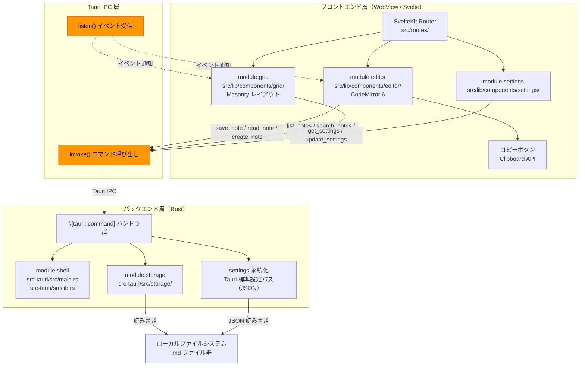
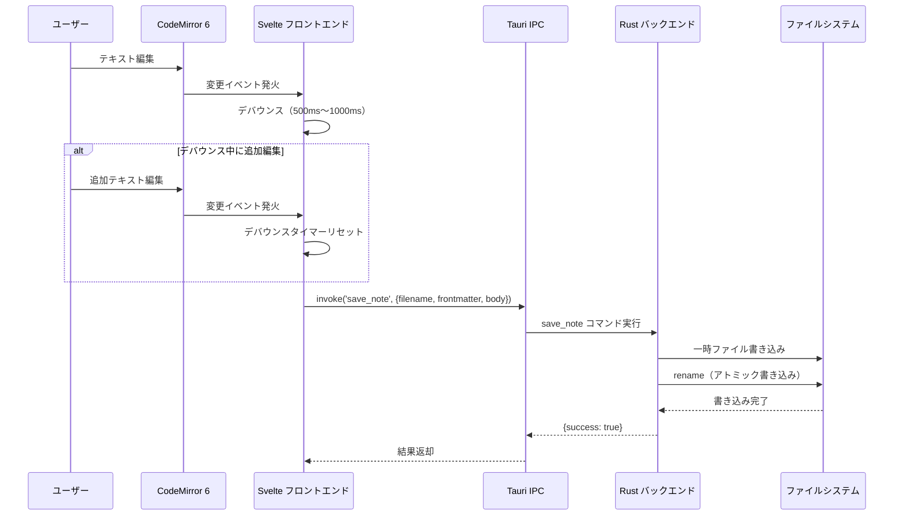
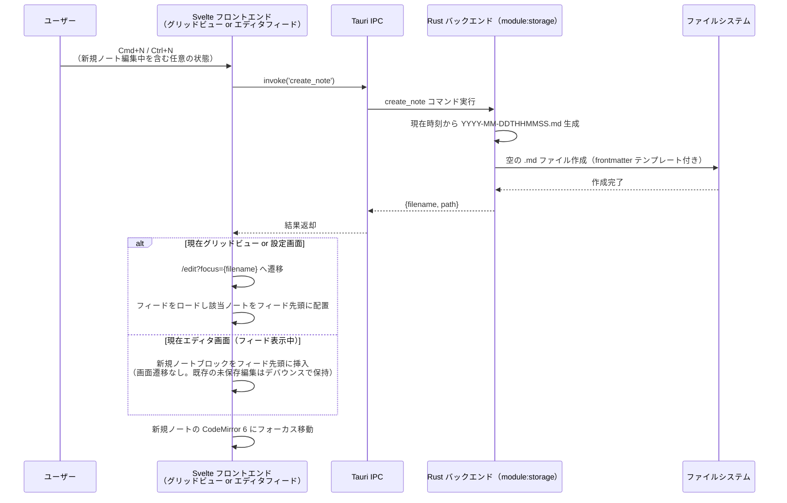
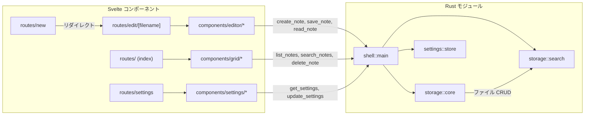

---
codd:
  node_id: detail:component_architecture
  type: design
  modules: [lib, src-tauri/src/notes]
  depends_on:
  - id: design:system-design
    relation: depends_on
    semantic: technical
  depended_by:
  - id: plan:implementation_plan
    relation: depends_on
    semantic: technical
  - id: detail:editor_clipboard
    relation: depends_on
    semantic: technical
  - id: detail:grid_search
    relation: depends_on
    semantic: technical
  - id: detail:storage_fileformat
    relation: depends_on
    semantic: technical
  conventions:
  - targets:
    - module:shell
    - framework:tauri
    reason: Tauri IPC境界を明確化し、フロントエンドからの直接ファイルシステムアクセスを禁止。全ファイル操作はRustバックエンド経由。
  - targets:
    - module:storage
    - module:settings
    reason: 設定変更（保存ディレクトリ）はRustバックエンド経由で永続化。フロントエンド単独でのファイルパス操作は禁止。
  modules:
  - editor
  - grid
  - storage
  - settings
  - shell
---

# Component Architecture & IPC Boundary

## 1. Overview

本設計書は、PromptNotes の Tauri v2 アーキテクチャにおけるコンポーネント構成と IPC 境界を詳細に定義する。PromptNotes は Svelte フロントエンド、Tauri IPC 層、Rust バックエンドの 3 層で構成され、すべてのファイルシステム操作は Rust バックエンド経由で実行される。フロントエンドからの直接ファイルシステムアクセスは設計上禁止されており、`invoke()` による `#[tauri::command]` 呼び出しのみが許可される通信手段である。

本設計書は以下のリリース不可制約（Non-negotiable conventions）に準拠する。

| 制約 ID | 対象 | 制約内容 | 本設計書での反映 |
|---|---|---|---|
| NNC-1 | `module:shell`, `framework:tauri` | Tauri IPC 境界を明確化し、フロントエンドからの直接ファイルシステムアクセスを禁止。全ファイル操作は Rust バックエンド経由。 | §2 の IPC 境界図、§3 の所有権定義、§4 の実装制約として全セクションに反映。Tauri の `fs` プラグインスコープは `deny` に設定し、WebView プロセスからの直接パスアクセスを遮断する。 |
| NNC-2 | `module:storage`, `module:settings` | 設定変更（保存ディレクトリ）は Rust バックエンド経由で永続化。フロントエンド単独でのファイルパス操作は禁止。 | §3 で `module:settings` の永続化責務を Rust 側に限定。§4 で設定ファイルパス解決ロジックの Rust 側実装を義務付け。 |

対象プラットフォームは Linux および macOS であり、デフォルト保存ディレクトリは OS ごとに以下のとおり定義される。

- **Linux**: `~/.local/share/promptnotes/notes/`
- **macOS**: `~/Library/Application Support/promptnotes/notes/`

データはローカル `.md` ファイルのみで管理し、クラウド同期・データベース（SQLite, Tantivy 等）・AI 呼び出し機能は一切実装しない。ネットワーク通信は設計上存在せず、すべてのデータはユーザーのローカルファイルシステムにのみ保存される。

## 2. Mermaid Diagrams

### 2.1 コンポーネント構成と IPC 境界



**IPC 境界の意味**: オレンジで示された Tauri IPC 層が、フロントエンドとバックエンドの唯一の通信経路である。フロントエンド層のいかなるコンポーネントも、IPC 層を経由せずにファイルシステムへアクセスすることはできない。Tauri の `tauri.conf.json` において `fs` プラグインのスコープを制限し、WebView プロセスからの直接ファイルアクセスをブロックする。コピーボタンのみが例外的に Clipboard API（ブラウザ標準 API）を使用するが、これはファイルシステム操作ではない。

`module:shell` は Tauri `Builder` によるアプリ初期化と `#[tauri::command]` ハンドラ登録を所有し、すべての IPC エントリポイントの登録責務を持つ。新規コマンドの追加は必ず `module:shell` のハンドラ登録に反映する必要がある。

### 2.2 IPC コマンドシーケンス（自動保存フロー）



**所有権と境界**: 自動保存のデバウンスロジックはフロントエンド（`module:editor`）が所有する。ファイルのアトミック書き込み（一時ファイル → rename）は `module:storage`（Rust 側）が所有する。フロントエンドは保存先パスの解決に一切関与せず、`filename` のみを指定する。パスの組み立て（保存ディレクトリ + filename）は Rust バックエンドが `module:storage` 内部で行う。

### 2.3 新規ノート作成シーケンス



**実装境界**: ファイル名の生成ロジック（`YYYY-MM-DDTHHMMSS.md` 形式）は `module:storage` の Rust コードが単独で所有する。フロントエンドはファイル名を生成せず、`create_note` コマンドの戻り値として受け取った `filename` をフィードへのノート挿入およびフォーカス対象の決定に使用するのみである。`Cmd+N` ハンドラは現在のルートや編集状態に関係なく無条件に `create_note` を発行する（再入可能）。新規ノート編集中の未保存変更は各ノートブロックが所有する独立デバウンスタイマーによって保護され、`Cmd+N` 実行時に失われない。

### 2.4 コンポーネント依存関係



**モジュール境界の意味**: `ShellMain`（`module:shell`）はすべての IPC コマンドのディスパッチャとして機能し、個別の Rust モジュールへ処理を委譲する。フロントエンドの各コンポーネントは、対応する Rust モジュールの存在を知らず、コマンド名と引数の型のみを把握する。この境界により、Rust 側の内部リファクタリングがフロントエンドに影響を与えない。

## 3. Ownership Boundaries

### 3.1 モジュール所有権マトリクス

| モジュール | 配置 | 所有する責務 | 禁止事項 |
|---|---|---|---|
| `module:shell` | `src-tauri/src/main.rs`, `src-tauri/src/lib.rs` | Tauri Builder 初期化、`#[tauri::command]` ハンドラ登録、ウィンドウ管理、グローバルキーボードショートカットのフォワーディング | ビジネスロジックの直接実装（ストレージ操作、検索ロジック等を shell 内に書かない） |
| `module:editor` | `src/lib/components/editor/` | ノートフィード（過去ノートのスクロール可能リスト）、各ノートブロックごとの CodeMirror 6 インスタンス管理、タグ入力 UI、コピーボタン、独立した自動保存デバウンスロジック、`Cmd+N`/`Ctrl+N` キーバインド処理（新規ノート編集中からの再入を含む）、`list_notes` によるフィード初期ロード | タイトル入力欄の設置、Markdown レンダリング（HTML 要素生成）、直接ファイルシステムアクセス、ファイル名の生成、Cmd+N 実行のスキップ（現在の編集状態に関係なく常に新規作成を実行） |
| `module:grid` | `src/lib/components/grid/` | Masonry レイアウト、フィルタリング UI（日付/タグ/全文検索）、カードクリックによるエディタ遷移 | ファイル走査ロジックの実装（検索は Rust 側 `search_notes` コマンドに委譲）、直接ファイルシステムアクセス |
| `module:storage` | `src-tauri/src/storage/` | `.md` ファイル CRUD、ファイル名生成（`YYYY-MM-DDTHHMMSS.md`）、frontmatter パース/シリアライズ、全文検索（ファイル全走査）、アトミック書き込み、パス解決 | SQLite・Tantivy 等データベース/インデックスエンジンの利用、ネットワーク通信、`tags` 以外のメタデータフィールドの自動挿入 |
| `module:settings` | `src/lib/components/settings/`（UI）+ Rust 側永続化ロジック | 保存ディレクトリパスの変更 UI 提供 | フロントエンド単独での設定ファイル書き込み、フロントエンド単独でのファイルパス解決 |

### 3.2 共有型の所有権

IPC コマンドの引数・戻り値に使用される型は、フロントエンドと Rust バックエンドの双方で定義が必要になる。所有権の混乱を防ぐため、以下のルールを適用する。

| 共有型 | 正規の所有者 | フロントエンド側の扱い |
|---|---|---|
| `NoteMetadata` | `module:storage`（Rust 側 `src-tauri/src/storage/` 内の `struct NoteMetadata`） | TypeScript 型定義 `src/lib/types/note.ts` に手動ミラーリング。Rust 側の構造体変更時にフロントエンド型を同期更新する。 |
| IPC コマンド引数/戻り値型 | 各コマンドを実装する Rust モジュール | `src/lib/types/commands.ts` に TypeScript 型を手動定義。 |
| 設定型（`Settings`） | Rust 側設定管理ロジック | `src/lib/types/settings.ts` に TypeScript 型を手動定義。 |

**単一所有者の原則**: `NoteMetadata` の構造体定義は `module:storage` の Rust コード内に 1 箇所のみ存在する。フロントエンドの TypeScript 型はミラーであり、正規定義ではない。フィールド追加・変更は Rust 側で行い、フロントエンドはそれに追随する。

### 3.3 ファイルパス解決の所有権

ファイルパスの解決（保存ディレクトリ + ファイル名の結合、OS 別デフォルトパスの決定）は `module:storage` が排他的に所有する。

- フロントエンドは `filename`（例: `2026-04-04T143205.md`）のみを扱い、フルパスを知らない。
- 設定画面（`module:settings`）でユーザーが保存ディレクトリを変更する場合、フロントエンドは新しいパス文字列を `update_settings` コマンド経由で Rust 側に送信する。パスのバリデーション（ディレクトリ存在確認、書き込み権限確認）は Rust 側で実行する。
- フロントエンドが `window.__TAURI__` や Tauri の `fs` プラグインを直接使用してファイルパスを操作することは禁止される。

### 3.4 設定永続化の所有権

設定値（`notes_dir` 等）の永続化は Rust バックエンド側のロジックが所有する。

- 設定ファイルは Tauri の標準設定ファイルパスに JSON 形式で保存される。
  - Linux: `~/.config/promptnotes/config.json`
  - macOS: `~/Library/Application Support/promptnotes/config.json`
- フロントエンド（`module:settings` コンポーネント）は UI の提供と `get_settings` / `update_settings` コマンドの呼び出しのみを行い、設定ファイルの読み書きには一切関与しない。

## 4. Implementation Implications

### 4.1 Tauri IPC セキュリティ設定

`tauri.conf.json` の権限設定において、以下を強制する。

- **`fs` プラグイン**: WebView からの直接ファイルアクセスを `deny` に設定。すべてのファイル操作は `#[tauri::command]` ハンドラ経由とする。
- **`shell` プラグイン**: 外部プロセス起動を `deny` に設定。
- **`http` プラグイン**: ネットワーク通信を `deny` に設定。PromptNotes はネットワーク通信を一切行わない（プライバシー制約）。
- **`clipboard-manager` プラグイン**: コピーボタンの実装に必要なため `allow` に設定。ただし、Clipboard API（ブラウザ標準）で代替可能であれば Tauri プラグインは不使用とする。

この設定により、NNC-1（フロントエンドからの直接ファイルシステムアクセス禁止）が技術的に強制される。

### 4.2 IPC コマンド実装パターン

すべてのコマンドは以下の統一パターンで実装する。

```rust
// src-tauri/src/commands/note_commands.rs
#[tauri::command]
pub async fn save_note(
    filename: String,
    frontmatter: Frontmatter,
    body: String,
    state: tauri::State<'_, AppState>,
) -> Result<SaveResult, String> {
    let storage = state.storage.lock().await;
    storage.save(&filename, &frontmatter, &body)
        .map_err(|e| e.to_string())
}
```

- **エラーハンドリング**: Rust 側のエラーは `Result<T, String>` で返却し、フロントエンドで `try/catch` する。
- **状態管理**: `tauri::State<AppState>` を介してストレージや設定の状態を共有する。`AppState` は `module:shell` の初期化時に `manage()` で登録する。
- **非同期処理**: ファイル I/O を含むコマンドは `async` で定義し、Tauri のスレッドプールで実行する。WebView スレッドをブロックしない。

### 4.3 コマンドハンドラ登録（module:shell）

`module:shell` の `main.rs` でハンドラを一括登録する。

```rust
fn main() {
    tauri::Builder::default()
        .manage(AppState::new())
        .invoke_handler(tauri::generate_handler![
            create_note,
            save_note,
            read_note,
            list_notes,
            search_notes,
            delete_note,
            get_settings,
            update_settings,
        ])
        .run(tauri::generate_context!())
        .expect("error while running tauri application");
}
```

新規コマンドの追加時は、`generate_handler!` マクロへの追加と、対応する TypeScript 型定義の追加を同時に行う。

### 4.4 フロントエンド IPC 呼び出し層

フロントエンドからの IPC 呼び出しは `src/lib/api/` ディレクトリに集約し、各 Svelte コンポーネントが `@tauri-apps/api/core` の `invoke()` を直接呼び出すことを避ける。

```
src/lib/api/
├── notes.ts      # create_note, save_note, read_note, list_notes, search_notes, delete_note
└── settings.ts   # get_settings, update_settings
```

この抽象層により、IPC コマンド名の変更がコンポーネント全体に波及することを防ぐ。

### 4.5 アトミック書き込みの実装

`module:storage` の `save_note` 実装において、データ破損を防ぐためにアトミック書き込みを採用する。

1. 保存ディレクトリ内に一時ファイル（例: `.2026-04-04T143205.md.tmp`）を作成し、内容を書き込む。
2. `std::fs::rename()` で一時ファイルを正式ファイル名にアトミックに置換する。
3. Linux・macOS の両プラットフォームで、同一ファイルシステム上の `rename` はアトミック操作であることを前提とする。

### 4.6 全文検索の実装制約

`search_notes` コマンドはファイル全走査方式で実装する。

- 検索対象: 保存ディレクトリ内の全 `.md` ファイルの本文部分（frontmatter を除く）。
- 性能目標: 直近 7 日間のノート（数十件規模）に対して **100ms 以内**で応答。
- インデックスエンジン（Tantivy, SQLite FTS 等）は現時点では導入しない。件数が数千件規模に達し体感遅延が発生した場合に、ADR FU-002 として導入判断を行う。

### 4.7 フロントエンドルーティングと画面遷移

SvelteKit のファイルベースルーティングで以下のルートを定義する。

| パス | 画面 | IPC コマンド依存 |
|---|---|---|
| `/` | グリッドビュー（Pinterest レイアウト） | `list_notes`, `search_notes`, `delete_note` |
| `/edit` | エディタフィード（過去ノートのインラインリスト＋新規ノート編集） | `list_notes`, `read_note`, `save_note`, `create_note` |
| `/settings` | 設定画面 | `get_settings`, `update_settings` |

`/edit` はノートフィード全体を表示する単一ルートであり、個別ノートごとのルートは持たない。クエリパラメータ `?focus=:filename` でフィード内の初期フォーカス対象を指定できる。グリッドビューのカードクリックおよび `Cmd+N`/`Ctrl+N` 押下時はいずれもこのルートへ遷移する。`Cmd+N`/`Ctrl+N` は `/edit` 上で既に新規ノートを編集中であっても再入可能であり、その場合は画面遷移せずに新しいノートブロックをフィード先頭に挿入してフォーカスを移動する。

### 4.8 CodeMirror 6 の統合制約

- エディタエンジンは CodeMirror 6 に固定（変更不可）。
- Markdown シンタックスハイライトには `@codemirror/lang-markdown` パッケージを使用する。
- Markdown レンダリング（`<h1>`, `<strong>` 等の HTML 要素生成）は禁止。プレーンテキスト表示のみ。
- タイトル入力欄（`<input>` / `<textarea>`）の設置は禁止。

### 4.9 テスト戦略における IPC 境界の検証

Playwright による E2E テスト（`tests/e2e/` 配下）において、以下の IPC 境界違反を検出するテストケースを含める。

| テストケース | 検証内容 | 対応するスコープガード |
|---|---|---|
| `scope-guard.browser.spec.ts` | 外部 API 呼び出し（`fetch`, `XMLHttpRequest`）の不在 | ネットワーク通信禁止 |
| DOM 検証 | タイトル専用 `input` / `textarea` の不在 | タイトル入力欄禁止 |
| DOM 検証 | レンダリング済み HTML 要素（`<h1>`, `<strong>` 等）が本文領域に存在しない | Markdown レンダリング禁止 |

### 4.10 ビルド・配布パイプライン

GitHub Actions で Linux（`.deb`, `.AppImage`, Flatpak, NixOS パッケージ）および macOS（`.dmg`, Homebrew Cask）向けのビルドを実行する。開発環境は `direnv` + `nix flake` で統一し、`direnv allow` 後に Rust ツールチェイン、Node.js、Tauri CLI がすべて利用可能になる。開発サーバーは `tauri dev`（`http://localhost:1420`）で起動する。

## 5. Open Questions

| ID | 質問 | 影響モジュール | 解決トリガー |
|---|---|---|---|
| OQ-CA-001 | 自動保存のデバウンス時間を 500ms と 1000ms のどちらに設定するか。タイピング中のディスク I/O 頻度と保存漏れリスクのトレードオフを評価する必要がある。 | `module:editor` | ユーザーテスト実施時に体感フィードバックを収集して決定 |
| OQ-CA-002 | フロントエンド IPC 呼び出し層（`src/lib/api/`）で TypeScript の型を Rust 側の構造体と自動同期する仕組み（例: `ts-rs` クレートによる自動生成）を導入するか、手動ミラーリングで運用するか。 | `module:shell`, `module:storage` | 初回実装完了後、型の乖離が問題になった時点 |
| OQ-CA-003 | 設定画面で保存ディレクトリを変更した場合、既存ノートの移動を行うか、新規ノートのみ新ディレクトリに作成するか。Rust 側のパス解決ロジックと `list_notes` の走査対象ディレクトリに影響する。 | `module:settings`, `module:storage` | 詳細設計レビュー時 |
| OQ-CA-004 | `NoteMetadata.body_preview` の文字数上限をいくつにするか。グリッドビューの Masonry レイアウトにおけるカード高さの算出に影響する。 | `module:grid`, `module:storage` | UI プロトタイプ作成時 |
| OQ-CA-005 | ノート削除機能の UI 配置（エディタ画面内メニュー、グリッドビューのコンテキストメニュー、または両方）。`delete_note` コマンドの呼び出し元が変わるため、IPC 呼び出し層の設計に影響する。 | `module:editor`, `module:grid` | UI 設計レビュー時 |
| OQ-CA-006 | ノート件数が数千件規模に達した場合の全文検索応答時間が 100ms を超える可能性について、Tantivy 等の Rust ネイティブ全文検索エンジン導入をどの時点で判断するか。 | `module:storage`, `module:grid` | 全走査で体感遅延が発生した時点（ADR FU-002） |
