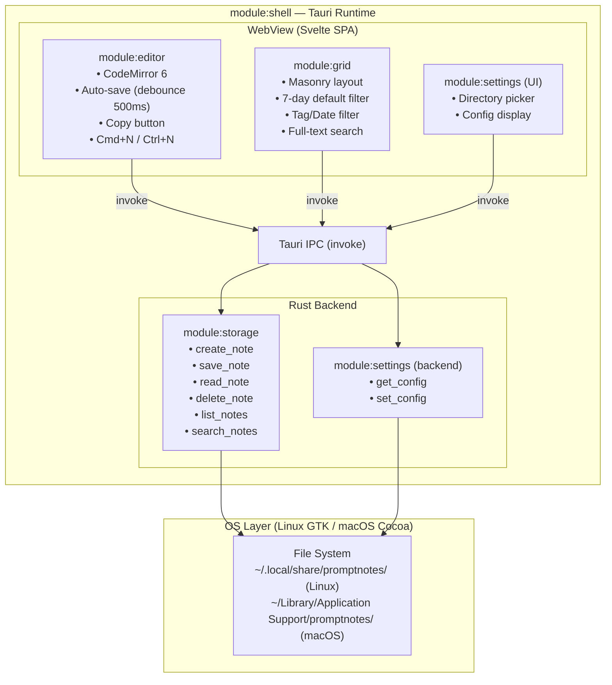
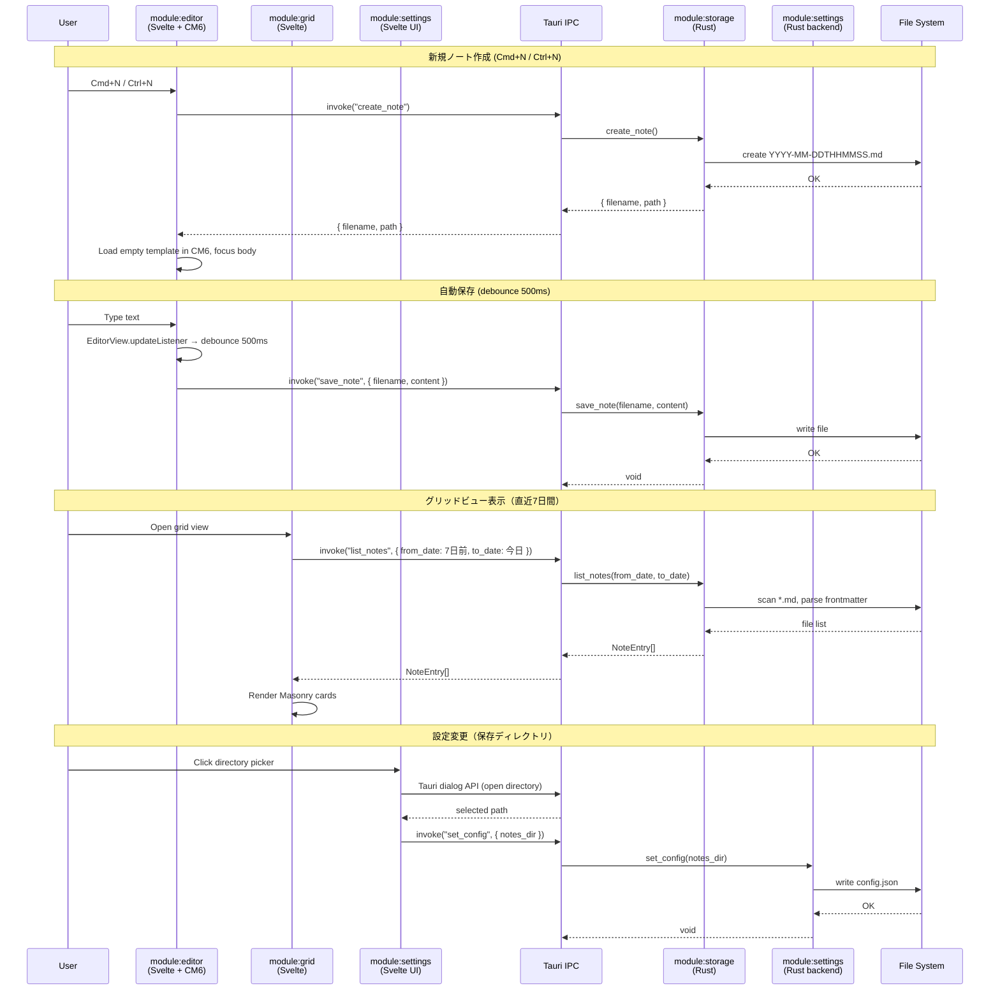
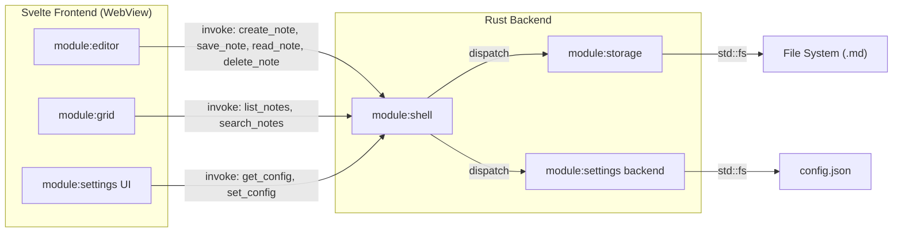

---
codd:
  node_id: detail:component_architecture
  type: design
  depends_on:
  - id: design:system-design
    relation: depends_on
    semantic: technical
  depended_by:
  - id: plan:implementation_plan
    relation: depends_on
    semantic: technical
  conventions:
  - targets:
    - module:shell
    - framework:tauri
    reason: Tauri IPC境界を明確化し、フロントエンドからの直接ファイルシステムアクセスを禁止。全ファイル操作はRustバックエンド経由。
  - targets:
    - module:storage
    - module:settings
    reason: 設定変更（保存ディレクトリ）はRustバックエンド経由で永続化。フロントエンド単独でのファイルパス操作は禁止。
  modules:
  - editor
  - grid
  - storage
  - settings
  - shell
---

# Component Architecture & IPC Boundary

## 1. Overview

本設計書は PromptNotes アプリケーションのコンポーネント分割と、Tauri IPC 境界を中心としたモジュール間通信の詳細を定義する。PromptNotes は Tauri（Rust + WebView）上で動作するローカルファーストのプロンプトノートアプリであり、フロントエンドに **Svelte**、エディタエンジンに **CodeMirror 6** を採用する。データはローカルファイルシステム上の `.md` ファイルのみに保存し、データベース（SQLite・IndexedDB 等）やクラウド同期、AI 呼び出し機能は一切使用しない。対象プラットフォームは Linux（GTK WebKitGTK）および macOS（WKWebView）である。

アプリケーションは以下の5モジュールで構成される。

| モジュール | レイヤー | 責務 |
|-----------|---------|------|
| `module:shell` | Rust + Tauri ランタイム | アプリケーションウィンドウ管理、IPC コマンドルーティング、ライフサイクル管理 |
| `module:storage` | Rust バックエンド | `.md` ファイルの CRUD、frontmatter パース、ファイル名タイムスタンプ生成、全文検索 |
| `module:settings` | Rust バックエンド + Svelte UI | `config.json` の読み書き（保存ディレクトリ変更）。永続化は Rust 側で完結 |
| `module:editor` | Svelte フロントエンド | CodeMirror 6 によるプレーンテキスト Markdown 編集、frontmatter デコレーション、自動保存、コピーボタン |
| `module:grid` | Svelte フロントエンド | Pinterest スタイル Masonry カードレイアウト、直近7日間デフォルト表示、タグ/日付フィルタ、全文検索 |

**リリース不可制約（Release-Blocking Constraints）への準拠:**

- **CONV-1（`framework:tauri`, `module:shell`）:** フロントエンド↔Rust バックエンド間の全通信は Tauri IPC（`invoke`）経由で行う。フロントエンドからの直接ファイルシステムアクセスは禁止する。全ファイル操作は Rust バックエンド経由で実行される。本設計書のすべての IPC コマンド定義はこの原則に基づく。
- **CONV-2（`module:storage`, `module:settings`）:** 設定変更（保存ディレクトリ）は `set_config` IPC コマンドを通じて Rust バックエンドで永続化する。フロントエンド単独でのファイルパス操作・ファイルシステム読み書きは禁止する。設定画面のディレクトリ選択には Tauri のファイルダイアログ API を使用し、選択結果は Rust 側で検証・保存する。

## 2. Mermaid Diagrams

### 2.1 コンポーネント構成とレイヤー境界



このダイアグラムは PromptNotes の全コンポーネントを2つのレイヤー（Rust バックエンドと Svelte フロントエンド）に分離し、その間に Tauri IPC 境界を明示している。

**所有権と境界:**

- **`module:shell`** は Tauri ランタイム全体を所有し、ウィンドウ作成・IPC コマンドの登録とディスパッチ・アプリケーションライフサイクル（起動・終了）を管理する。Rust 側の `main.rs` がこのモジュールのエントリポイントである。
- **`module:storage`** はすべてのファイル I/O 操作を排他的に所有する。ノートの CRUD、frontmatter パース（`serde_yaml`）、ファイル名タイムスタンプ生成（`chrono` クレート）、ファイル全走査検索はこのモジュール内でのみ実装される。フロントエンドモジュールがファイルシステムに直接触れることは一切ない。
- **`module:settings`** はバックエンド（`config.json` 永続化）とフロントエンド（UI）にまたがるが、永続化ロジックは Rust バックエンドが単独所有する。フロントエンドの設定画面コンポーネントは表示とユーザー入力の受付のみを担い、パス検証やファイル書き込みは行わない。
- **`module:editor`** と **`module:grid`** は Svelte フロントエンド内のコンポーネントであり、データ取得・永続化はすべて IPC 経由で `module:storage` に委譲する。

### 2.2 IPC コマンドシーケンス



このシーケンス図は主要な4つのユーザーフローにおける IPC 通信の流れを示す。

**実装境界の注記:**

- **新規ノート作成:** ファイル名（`YYYY-MM-DDTHHMMSS.md`）の生成は `module:storage`（Rust 側、`chrono` クレート使用）が排他的に行う。フロントエンドはファイル名を生成せず、`create_note` の戻り値として受け取る。
- **自動保存:** デバウンスタイマー（500ms）の管理は `module:editor`（Svelte 側）が担う。CodeMirror の `EditorView.updateListener` で変更を検知し、デバウンス後に `save_note` を呼び出す。Rust 側はステートレスな上書き保存のみを行う。
- **グリッドビュー:** 日付フィルタの起算（直近7日間）は Svelte 側で `from_date` / `to_date` を算出し、Rust 側に渡す。Rust 側はファイル名タイムスタンプとの比較フィルタリングおよび frontmatter パースを行い、`NoteEntry[]` を返却する。
- **設定変更:** ディレクトリ選択ダイアログは Tauri API（`@tauri-apps/api/dialog`）を利用する。選択されたパスは `set_config` IPC コマンドで Rust バックエンドに送信され、`config.json` への書き込みは Rust 側で完結する。フロントエンドが直接 `config.json` に触れることは禁止される。

### 2.3 モジュール依存関係



`module:shell` は IPC コマンドのディスパッチャーとして機能し、フロントエンドの全モジュールからの `invoke` 呼び出しを受け付けて、適切なバックエンドモジュール（`module:storage` または `module:settings`）にルーティングする。フロントエンドモジュール間に直接の依存関係はなく、各画面コンポーネントは独立して IPC を呼び出す。

## 3. Ownership Boundaries

### 3.1 モジュール所有権マトリクス

| 資源 / 関心事 | 排他的所有者 | 利用者 | 制約 |
|--------------|------------|-------|------|
| `.md` ファイル CRUD | `module:storage` | `module:editor`, `module:grid` via IPC | フロントエンドからの直接アクセス禁止 |
| ファイル名生成（`YYYY-MM-DDTHHMMSS.md`） | `module:storage` | `module:editor`（戻り値として受領） | `chrono` クレートによるタイムスタンプ生成は Rust 側のみ |
| frontmatter パース（`serde_yaml`） | `module:storage` | `module:grid`（`NoteEntry.tags` として受領） | YAML デシリアライズは Rust 側のみ |
| 全文検索ロジック | `module:storage` | `module:grid` via IPC | `str::contains`（大文字小文字非区別）による走査は Rust 側のみ |
| `config.json` 読み書き | `module:settings`（Rust） | `module:settings`（Svelte UI）via IPC | フロントエンド単独でのファイルパス操作禁止 |
| IPC コマンド登録・ディスパッチ | `module:shell` | 全フロントエンドモジュール | `#[tauri::command]` マクロで公開、`invoke` で呼び出し |
| CodeMirror 6 インスタンス管理 | `module:editor` | なし | `EditorView` の生成・破棄・状態管理は `module:editor` Svelte コンポーネント内で完結 |
| デバウンスタイマー（自動保存 500ms） | `module:editor` | なし | JavaScript 側で `setTimeout` / `clearTimeout` で管理 |
| Masonry カードレイアウト | `module:grid` | なし | CSS Columns またはライブラリによる実装。`module:editor` とは独立 |
| ウィンドウ管理・ライフサイクル | `module:shell` | なし | Tauri `Builder` の設定、ウィンドウ作成、アプリ終了処理 |

### 3.2 共有型定義の所有権

フロントエンド・バックエンド間で共有される型は IPC 境界で JSON シリアライズされるため、両側で同等の型定義が必要になる。

| 型 | Rust 側所有ファイル | TypeScript 側定義場所 | 正の方向 |
|----|-------------------|---------------------|---------|
| `NoteEntry` | `module:storage` 内の `models.rs` | `src/lib/types.ts` | Rust → TypeScript（Rust 側が正。TS 側は IPC レスポンスの型注釈） |
| `Config` | `module:settings` 内の `config.rs` | `src/lib/types.ts` | Rust → TypeScript |
| IPC コマンド引数 | 各 `#[tauri::command]` 関数の引数型 | `src/lib/api.ts`（invoke ラッパー） | Rust → TypeScript |

**再実装ドリフト防止:** Rust 側の `serde::Serialize` / `serde::Deserialize` 導出が正（canonical）であり、TypeScript 側の型定義は Rust 側に追従する。型の不一致を検出するため、CI で IPC コマンドの結合テスト（Rust バックエンド + Svelte フロントエンドの E2E）を実行する。

### 3.3 IPC コマンド境界の詳細

| コマンド名 | 所有モジュール | 引数 | 戻り値 | フロントエンド呼び出し元 |
|-----------|--------------|------|--------|----------------------|
| `create_note` | `module:storage` | なし | `{ filename: string, path: string }` | `module:editor` |
| `save_note` | `module:storage` | `{ filename: string, content: string }` | `void` | `module:editor` |
| `read_note` | `module:storage` | `{ filename: string }` | `{ content: string }` | `module:editor` |
| `delete_note` | `module:storage` | `{ filename: string }` | `void` | `module:editor`, `module:grid` |
| `list_notes` | `module:storage` | `{ from_date?: string, to_date?: string, tag?: string }` | `NoteEntry[]` | `module:grid` |
| `search_notes` | `module:storage` | `{ query: string, from_date?: string, to_date?: string, tag?: string }` | `NoteEntry[]` | `module:grid` |
| `get_config` | `module:settings` | なし | `Config` | `module:settings` UI |
| `set_config` | `module:settings` | `{ notes_dir: string }` | `void` | `module:settings` UI |

### 3.4 フロントエンド内部のコンポーネント構成

Svelte SPA 内の画面遷移は SPA ルーティングライブラリを使用せず、状態変数による条件レンダリングで実現する（3画面のみのため十分）。

```
src/
├── App.svelte              # ルートコンポーネント。currentView 状態で画面切替
├── lib/
│   ├── api.ts              # invoke ラッパー。全 IPC コマンドの型安全な呼び出し関数
│   ├── types.ts            # NoteEntry, Config 等の TypeScript 型定義
│   └── debounce.ts         # デバウンスユーティリティ（自動保存用）
├── components/
│   ├── Editor.svelte       # module:editor — CodeMirror 6 統合
│   ├── GridView.svelte     # module:grid — Masonry カードレイアウト
│   ├── Settings.svelte     # module:settings UI — ディレクトリ選択
│   ├── NoteCard.svelte     # グリッドビュー用個別カードコンポーネント
│   ├── TagFilter.svelte    # タグフィルタ UI
│   ├── DateFilter.svelte   # 日付フィルタ UI
│   └── CopyButton.svelte   # 1クリックコピーボタン
```

`lib/api.ts` が IPC 呼び出しの単一エントリポイントとなり、各 Svelte コンポーネントは `api.ts` の関数を通じてバックエンドと通信する。`@tauri-apps/api` の `invoke` を直接呼び出すコードは `api.ts` 内にのみ存在させ、コンポーネント側での直接 `invoke` 呼び出しを避ける。

## 4. Implementation Implications

### 4.1 Tauri IPC セキュリティ境界

Tauri の IPC 境界は本アプリケーションのセキュリティモデルの中核である。

- **フロントエンドからの直接ファイルシステムアクセス禁止（CONV-1 準拠）:** Tauri の `allowlist` 設定で `fs` スコープを制限し、WebView からの直接ファイルアクセスを遮断する。全ファイル操作は `#[tauri::command]` で公開された IPC コマンド経由でのみ実行可能とする。
- **パストラバーサル防止:** `save_note` / `read_note` / `delete_note` コマンドの `filename` 引数に対して、Rust 側で `..` や `/` を含むパスを拒否するバリデーションを実装する。ファイル名は `YYYY-MM-DDTHHMMSS.md` パターンに厳密に一致するもののみ許可する。
- **設定変更のサーバーサイド検証（CONV-2 準拠）:** `set_config` コマンドで渡された `notes_dir` パスは Rust 側で存在チェック・書き込み権限チェックを行った後に `config.json` に書き込む。

### 4.2 自動保存のデバウンス実装

`module:editor` 内の自動保存フローは以下のように実装する。

1. CodeMirror の `EditorView.updateListener` エクステンションを登録し、`docChanged` フラグが `true` の `ViewUpdate` を検知する。
2. 変更検知後、JavaScript 側で 500ms のデバウンスタイマーを起動する。タイマー未消化時に新たな変更が発生した場合はタイマーをリセットする。
3. デバウンスタイマー消化後、`api.ts` の `saveNote(filename, content)` を呼び出し、IPC 経由で Rust バックエンドにコンテンツを送信する。
4. Rust 側は `std::fs::write` で指定ファイルを上書き保存する。

ユーザーの明示的な「保存」操作（Cmd+S 等）は不要であり、UI 上に保存ボタンは配置しない。

### 4.3 CodeMirror 6 と Svelte の統合

`Editor.svelte` コンポーネント内で CodeMirror 6 を統合する際の実装方針:

- `onMount` ライフサイクルフックで `EditorView` インスタンスを生成し、コンポーネント内の DOM 要素にマウントする。
- `onDestroy` で `EditorView.destroy()` を呼び出してリソースを解放する。
- Markdown シンタックスハイライトは `@codemirror/lang-markdown` パッケージを使用する。
- frontmatter 領域のカスタムデコレーション（背景色変更）は `ViewPlugin` または `StateField` + `Decoration` で実装する（OQ-002 で最終判断）。
- キーマップに `Cmd-n`（macOS）/ `Ctrl-n`（Linux）を登録し、`create_note` IPC コマンドを呼び出す。
- タイトル入力欄は一切設けない。Markdown プレビュー（HTML レンダリング）機能は実装しない。これらが存在する場合リリース不可。

### 4.4 グリッドビューの実装

`GridView.svelte` コンポーネントの実装方針:

- **デフォルトフィルタ:** コンポーネントマウント時に現在日時から7日前を算出し、`list_notes({ from_date, to_date })` を呼び出す。
- **Masonry レイアウト:** CSS Columns または JavaScript ライブラリ（svelte-masonry 等）で Pinterest スタイルの可変高カードレイアウトを実現する（OQ-003 で最終判断。WebKitGTK / WKWebView の CSS Masonry サポート状況に依存）。
- **タグフィルタ:** `TagFilter.svelte` コンポーネントでタグ選択 UI を提供し、選択タグを `list_notes` の `tag` パラメータに渡す。
- **日付フィルタ:** `DateFilter.svelte` コンポーネントで日付範囲指定 UI を提供する。
- **全文検索:** 検索テキストボックスの入力を `search_notes` コマンドに渡し、Rust 側のファイル全走査で結果を取得する。
- **カードクリック:** `NoteCard.svelte` のクリックイベントで `currentView` 状態をエディタ画面に切り替え、対象ノートの `filename` を `read_note` 経由で読み込む。

### 4.5 ストレージ層の Rust 実装

`module:storage` の Rust 実装における主要な技術選定:

| 処理 | ライブラリ / 手法 | 備考 |
|------|-----------------|------|
| ファイル I/O | `std::fs` | `read_to_string`, `write`, `create_dir_all`, `read_dir` |
| タイムスタンプ生成 | `chrono` クレート | `Local::now().format("%Y-%m-%dT%H%M%S")` |
| frontmatter パース | `serde_yaml` クレート | `---` デリミタ検出後、YAML 部分をデシリアライズ |
| デフォルトディレクトリ取得 | `dirs` クレート | `dirs::data_dir()` → Linux: `~/.local/share/`, macOS: `~/Library/Application Support/` |
| JSON 設定ファイル | `serde_json` クレート | `config.json` のシリアライズ / デシリアライズ |
| 全文検索 | `str::contains`（大文字小文字非区別） | インデックスエンジンなし。5,000 件超過時に Tantivy 導入を検討 |

### 4.6 設定管理フロー（CONV-2 準拠）

設定画面（`Settings.svelte`）におけるディレクトリ変更フロー:

1. ユーザーが「ディレクトリ選択」ボタンをクリックする。
2. Tauri のファイルダイアログ API（`@tauri-apps/api/dialog` の `open({ directory: true })`）でネイティブディレクトリ選択ダイアログを表示する。
3. ユーザーがディレクトリを選択すると、選択されたパスを `api.ts` の `setConfig({ notes_dir })` 経由で Rust バックエンドに送信する。
4. Rust 側でパスの存在チェック・書き込み権限チェックを実行し、成功時に `config.json` を更新する。
5. 設定変更後、新規ノートは新しいディレクトリに保存される。既存ノートの自動移動は行わない。

フロントエンド側で `notes_dir` のパス文字列を直接ファイルシステムに書き込む操作は禁止される。パスの検証・永続化は Rust バックエンドが排他的に行う。

### 4.7 プラットフォーム固有の考慮事項

| 項目 | Linux (GTK WebKitGTK) | macOS (WKWebView) |
|------|----------------------|-------------------|
| デフォルト保存ディレクトリ | `~/.local/share/promptnotes/notes/` | `~/Library/Application Support/promptnotes/notes/` |
| 設定ファイルパス | `~/.local/share/promptnotes/config.json` | `~/Library/Application Support/promptnotes/config.json` |
| 新規ノートキーバインド | `Ctrl+N` | `Cmd+N` |
| コピーボタン（代替キーバインド想定） | `Ctrl+C` (OS 標準) | `Cmd+C` (OS 標準) |
| 配布形式 | `.AppImage`, `.deb`, Flatpak (Flathub), NixOS パッケージ | `.dmg`, Homebrew Cask |

### 4.8 パフォーマンス特性

- **ファイル全走査検索:** 想定ノート件数は1週間あたり数十件、蓄積が進んでも数百〜数千件規模。この規模ではファイル全走査（`std::fs::read_to_string` + `str::contains`）で実用的な応答速度が得られる。5,000 件超過時に応答時間を計測し、Tantivy 等のインデックスエンジン導入を検討する。
- **自動保存レイテンシ:** デバウンス 500ms + IPC オーバーヘッド + `std::fs::write` のレイテンシ。ローカルファイルシステムへの書き込みであるため、通常は数ミリ秒以内に完了する。
- **新規ノート作成:** `Cmd+N` / `Ctrl+N` からフォーカス移動完了まで体感上の遅延がないこと。ファイル生成（`chrono` + `std::fs::File::create`）は 1ms 以下で完了する想定。

### 4.9 スコープ外（実装禁止）の明示

以下の機能はアーキテクチャレベルで禁止されており、IPC コマンドの追加・フロントエンドモジュールの追加を含め、実装された場合リリース不可となる。

- AI 呼び出し機能（LLM API コール、チャット UI、プロンプト送信）
- クラウド同期（リモートサーバーへのデータ送信・同期）
- データベース利用（SQLite・IndexedDB・PostgreSQL 等）
- タイトル入力欄（エディタ画面）
- Markdown プレビュー / HTML レンダリング
- Windows ビルド・配布（将来対応。現時点ではスコープ外）
- モバイル対応（iOS / Android）

## 5. Open Questions

| ID | 対象モジュール | 質問 | 判断時期 |
|----|--------------|------|---------|
| OQ-002 | `module:editor` | CodeMirror 6 の frontmatter カスタムデコレーション（背景色変更）を `ViewPlugin` で実装するか `StateField` + `Decoration` で実装するか。Svelte コンポーネントとの統合パターンによって最適解が異なる。 | 開発着手時の技術検証（プロトタイプ）で決定 |
| OQ-003 | `module:grid` | Masonry レイアウトを CSS Columns で実装するか、JavaScript ライブラリ（svelte-masonry 等）で実装するか。CSS Grid の `grid-template-rows: masonry` は Firefox のみ実験的サポートであり、WebKitGTK / WKWebView での対応状況を確認する必要がある。 | WebKitGTK / WKWebView のサポート状況調査後に決定 |
| OQ-004 | `module:editor` | 自動保存のデバウンス間隔を 500ms とするか、より長い間隔（1000ms 等）とするか。体感の即時性とファイル I/O 頻度のバランスを検証する。 | プロトタイプでのユーザーテスト後に決定 |
| OQ-005 | `module:shell` | Tauri v2 の安定版リリース状況に応じて v1 と v2 のいずれをベースにするか。v2 では IPC モデル（permissions ベース）とセキュリティモデルが変更されており、`allowlist` 設定方式が異なる。 | 開発開始時点の Tauri 安定版に基づいて決定 |
| OQ-006 | `module:storage`, `module:editor` | `api.ts` の IPC ラッパー関数にエラーハンドリング（ファイル書き込み失敗、ディレクトリ不存在等）のユーザー通知方式。トースト通知、インライン表示、またはダイアログのいずれを採用するか。 | UI プロトタイプ時に決定 |
