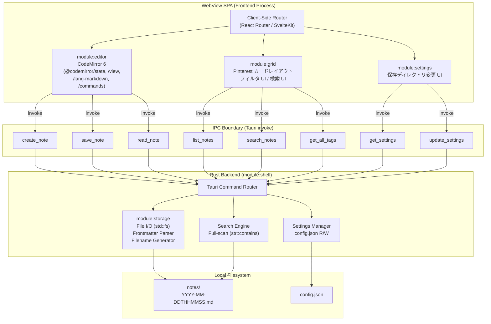
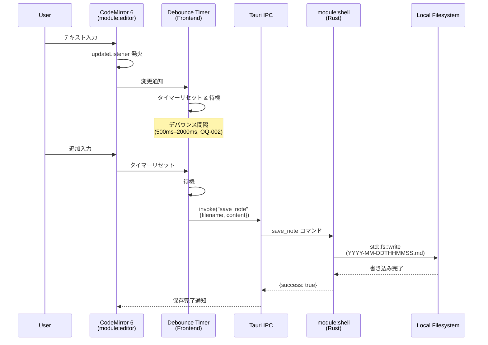
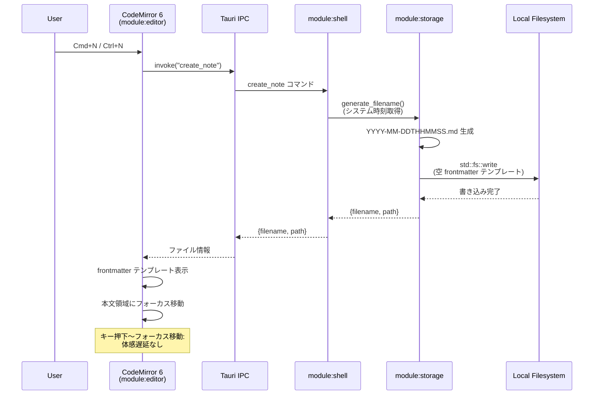
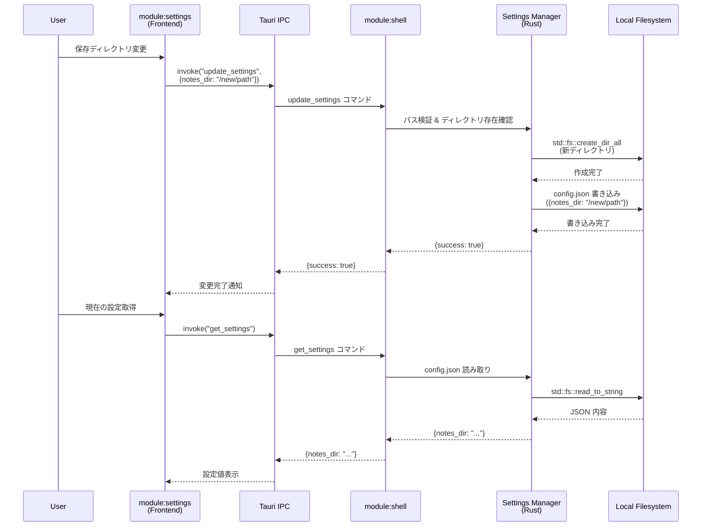
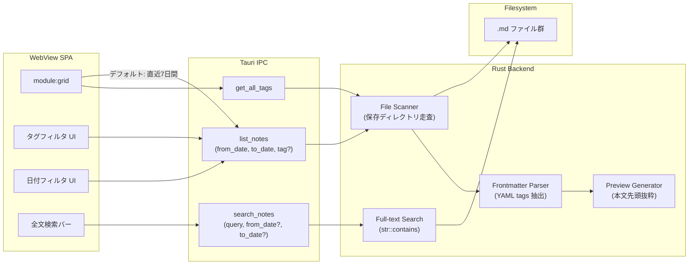

---
codd:
  node_id: detail:component_architecture
  type: design
  depends_on:
  - id: design:system-design
    relation: depends_on
    semantic: technical
  depended_by:
  - id: plan:implementation_plan
    relation: depends_on
    semantic: technical
  conventions:
  - targets:
    - module:shell
    - framework:tauri
    reason: Tauri IPC境界を明確化し、フロントエンドからの直接ファイルシステムアクセスを禁止。全ファイル操作はRustバックエンド経由。
  - targets:
    - module:storage
    - module:settings
    reason: 設定変更（保存ディレクトリ）はRustバックエンド経由で永続化。フロントエンド単独でのファイルパス操作は禁止。
  modules:
  - editor
  - grid
  - storage
  - settings
  - shell
---

# Component Architecture & IPC Boundary

## 1. Overview

PromptNotes は Tauri（Rust + WebView）アーキテクチャ上に構築されるローカルファーストのプロンプトノートアプリケーションである。本設計書は、フロントエンド WebView SPA と Rust バックエンド間のコンポーネント分割、IPC 境界の詳細設計、および各モジュールの責務と所有権を定義する。

アプリケーションは5つのモジュール（`module:editor`、`module:grid`、`module:storage`、`module:settings`、`module:shell`）で構成され、これらは Tauri IPC（`invoke` コマンド）を唯一の通信チャネルとするプロセス分離モデル上で動作する。対象プラットフォームは Linux（GTK WebView / WebKitGTK）および macOS（WKWebView）であり、Windows は将来対応としてスコープ外とする。

### 1.1 リリース不可制約への準拠

本設計書は以下のリリース不可制約に準拠しており、各制約がコンポーネント設計にどのように反映されているかを本文全体を通じて明示する。

| 制約 | 対象 | 本設計書での反映箇所 |
|------|------|---------------------|
| Tauri IPC 境界の明確化。フロントエンドからの直接ファイルシステムアクセス禁止。全ファイル操作は Rust バックエンド経由。 | `module:shell`, `framework:tauri` | §2（IPC 境界図）、§3（所有権境界）、§4.1（IPC エンフォースメント） |
| 設定変更（保存ディレクトリ）は Rust バックエンド経由で永続化。フロントエンド単独でのファイルパス操作禁止。 | `module:storage`, `module:settings` | §2（設定フロー図）、§3.4（設定モジュール所有権）、§4.2（設定永続化制約） |
| データはローカル `.md` ファイルのみ。クラウド同期・DB 利用・AI 呼び出し機能の実装禁止。 | `module:storage` | §3.3（ストレージ所有権）、§4.3（排除機能の実装ガード） |
| CodeMirror 6 必須。タイトル入力欄禁止。Markdown プレビュー（レンダリング）禁止。 | `module:editor` | §3.2（エディタ所有権）、§4.4（エディタ制約） |
| ファイル名規則 `YYYY-MM-DDTHHMMSS.md` および自動保存。 | `module:storage` | §3.3（ファイル命名責務）、§4.5（自動保存フロー） |
| デフォルト直近7日間フィルタ・タグ/日付フィルタ・全文検索。 | `module:grid` | §3.5（グリッド所有権）、§4.6（フィルタ・検索設計） |
| `Cmd+N` / `Ctrl+N` 即時新規ノート作成および1クリックコピーボタン。 | `module:editor` | §4.4（キーバインド・コピー設計） |

---

## 2. Mermaid Diagrams

### 2.1 コンポーネント構成と IPC 境界



**IPC 境界の所有権と実装上の意味:**

この図は PromptNotes のプロセス分離モデルを表す。WebView SPA（フロントエンドプロセス）と Rust バックエンドプロセスの間に Tauri IPC 境界が存在し、すべてのデータアクセスは `invoke` コマンドを経由する。フロントエンドからの直接ファイルシステムアクセスは Tauri の CSP（Content Security Policy）およびコマンド許可リスト（`tauri.conf.json` の `allowlist`）で物理的に禁止される。

Rust バックエンド内の3つのサブモジュール（`module:storage`、Search Engine、Settings Manager）はすべて `module:shell` の Tauri Command Router を介してのみ呼び出される。これにより、ファイルパス操作・ファイル書き込み・設定変更の全操作がバックエンドプロセス内に閉じ込められ、フロントエンドが任意のパスへアクセスするリスクを排除する。

### 2.2 自動保存シーケンス



**所有権と責務の分離:**

自動保存フローにおいて、デバウンス処理はフロントエンド側（`module:editor`）が所有する。これはユーザー入力の頻度制御が UI 層の責務であるためである。一方、実際のファイル書き込み（`std::fs::write`）は必ず Rust バックエンド（`module:shell` → `module:storage`）が実行する。フロントエンドは `save_note` IPC コマンドを通じてファイル名と内容を送信するのみであり、ファイルパスの組み立て・ディレクトリの存在確認・書き込み処理には一切関与しない。

### 2.3 新規ノート作成フロー



**タイムスタンプ生成の所有権:** ファイル名 `YYYY-MM-DDTHHMMSS.md` の生成は `module:storage`（Rust 側）が単独所有する。フロントエンドはタイムスタンプ生成に関与せず、バックエンドから返却された `filename` をそのまま使用する。これにより、タイムゾーン処理やファイル名重複チェックのロジックが Rust 側に集約される。

### 2.4 設定変更フロー



**設定永続化の所有権:** 設定ファイル（`config.json`）の読み書きは Settings Manager（Rust 側、`module:shell` 内）が単独所有する。フロントエンド（`module:settings`）はディレクトリパスの文字列を IPC 経由で送受信するのみであり、`config.json` のファイルパスやフォーマットについての知識を持たない。フロントエンド単独でのファイルパス操作は IPC 境界により物理的に不可能である。

### 2.5 グリッドビュー データ取得とフィルタリング



**検索・フィルタの責務分離:** フィルタリングロジック（日付範囲判定、タグマッチング）および全文検索ロジック（`str::contains` によるファイル全走査）はすべて Rust バックエンド側で実行される。フロントエンド（`module:grid`）はフィルタ条件の構築と結果の表示のみを担当する。検索インデックスエンジン（Tantivy、SQLite FTS 等）は導入しない。ノート件数 5,000 件超過時に Tantivy 導入を検討する（OQ-005）。

---

## 3. Ownership Boundaries

### 3.1 `module:shell` — Tauri バックエンドシェル

**所有者:** Rust バックエンドプロセス（単一所有）

`module:shell` は Tauri の Rust バックエンドプロセスそのものであり、以下の責務を単独で所有する。

| 責務 | 実装手段 | 再実装禁止ルール |
|------|---------|-----------------|
| IPC コマンドルーティング | Tauri `#[tauri::command]` マクロ | フロントエンドに同等のルーティング層を設けない |
| ファイルシステムアクセスゲートウェイ | `std::fs` クレート | WebView 側での `fs` API 直接呼び出し禁止 |
| プラットフォーム固有パス解決 | `dirs` クレートまたは Tauri `path` API | フロントエンドでのパス組み立て禁止 |
| CSP / コマンド許可リスト管理 | `tauri.conf.json` の `allowlist` 設定 | 許可リスト外コマンドの追加禁止 |

`module:shell` は他の全バックエンドモジュール（`module:storage`、Search Engine、Settings Manager）のエントリポイントとして機能する。Tauri IPC の `invoke` コマンドは `module:shell` のみが登録・公開し、サブモジュールが直接 IPC エンドポイントを公開することはない。

**IPC コマンド一覧（確定）:**

| コマンド | 引数 | 戻り値 | 呼び出し元 |
|---------|------|--------|-----------|
| `create_note` | なし | `{ filename: string, path: string }` | `module:editor` |
| `save_note` | `{ filename: string, content: string }` | `{ success: bool }` | `module:editor` |
| `read_note` | `{ filename: string }` | `{ content: string, tags: string[] }` | `module:editor` |
| `list_notes` | `{ from_date: string, to_date: string, tag?: string }` | `{ notes: NoteEntry[] }` | `module:grid` |
| `search_notes` | `{ query: string, from_date?: string, to_date?: string }` | `{ results: NoteEntry[] }` | `module:grid` |
| `get_all_tags` | なし | `{ tags: string[] }` | `module:grid` |
| `get_settings` | なし | `{ notes_dir: string }` | `module:settings` |
| `update_settings` | `{ notes_dir: string }` | `{ success: bool }` | `module:settings` |

### 3.2 `module:editor` — エディタ画面

**所有者:** フロントエンド WebView SPA（単一所有）

`module:editor` は CodeMirror 6 ベースのエディタ UI を所有し、以下の責務を持つ。

| 責務 | 実装手段 | 所有権境界 |
|------|---------|-----------|
| CodeMirror 6 インスタンス管理 | `@codemirror/state`, `@codemirror/view` | エディタエンジンの唯一の所有者 |
| Markdown シンタックスハイライト | `@codemirror/lang-markdown` | HTML レンダリング（プレビュー）禁止 |
| frontmatter 視覚的区別 | `ViewPlugin` + `Decoration` | 背景色デコレーション |
| キーバインド登録 | `keymap` エクステンション | macOS: `Cmd+N`、Linux: `Ctrl+N` |
| 1クリックコピーボタン | `navigator.clipboard.writeText()` | frontmatter 除外・本文のみコピー |
| 自動保存デバウンス | `updateListener` + タイマー | デバウンス後に `save_note` IPC 呼び出し |

**タイトル入力欄の排除:** `module:editor` にタイトル専用の `<input>` や `<textarea>` を配置しない。この制約違反はリリース不可（FAIL-04）。

**Markdown プレビューの排除:** Markdown → HTML 変換表示機能を実装しない。CodeMirror 6 のシンタックスハイライト（色分け）のみを提供する。この制約違反はリリース不可（FAIL-05）。

### 3.3 `module:storage` — ストレージ層

**所有者:** Rust バックエンド（単一所有）

`module:storage` はファイル I/O の全責務を Rust バックエンド内で所有する。フロントエンドはこのモジュールの機能に直接アクセスできない。

| 責務 | 実装手段 | 制約 |
|------|---------|------|
| ファイル名生成 | `chrono` クレート → `YYYY-MM-DDTHHMMSS.md` | ファイル名にタイトル文字列を含めない |
| ファイル読み書き | `std::fs::write`, `std::fs::read_to_string` | ローカル `.md` ファイルのみ |
| frontmatter パース | YAML パーサー（`serde_yaml` クレート） | `tags` フィールドのみ対応 |
| ディレクトリ自動作成 | `std::fs::create_dir_all` | 初回起動時のデフォルトディレクトリ |
| プレビューテキスト生成 | 本文先頭からの切り出し | グリッドビューカード用 |

**排除対象の明示:** `module:storage` は以下を実装しない。

- SQLite、IndexedDB、PostgreSQL 等のデータベースアクセス
- クラウドストレージ（S3、Google Drive 等）へのアップロード・同期
- ネットワーク通信によるデータ送受信
- LLM API コール・AI 呼び出し

**ファイル形式（確定）:**

```markdown
---
tags: [gpt, coding]
---

本文をここに書く...
```

Obsidian vault 内サブディレクトリ指定時の互換性、VSCode での直接編集、Git によるバージョン管理をすべて保証する。

**デフォルト保存ディレクトリ:**

| プラットフォーム | ノート保存先 | 設定ファイル |
|-----------------|-------------|-------------|
| Linux | `~/.local/share/promptnotes/notes/` | `~/.config/promptnotes/config.json` |
| macOS | `~/Library/Application Support/promptnotes/notes/` | `~/Library/Application Support/promptnotes/config.json` |

### 3.4 `module:settings` — 設定画面

**所有者:** フロントエンド UI は WebView SPA、設定永続化ロジックは Rust バックエンド

`module:settings` はフロントエンドとバックエンドにまたがるが、責務は明確に分離される。

| 責務 | 所有者 | 実装 |
|------|--------|------|
| 設定画面 UI（ディレクトリ選択 UI） | フロントエンド | React/Svelte コンポーネント |
| ディレクトリパスのバリデーション | Rust バックエンド | パス存在確認・権限チェック |
| `config.json` の読み書き | Rust バックエンド | `std::fs` + `serde_json` |
| ディレクトリ作成 | Rust バックエンド | `std::fs::create_dir_all` |

**リリース不可制約の反映:** フロントエンドは `update_settings` IPC コマンドを通じて新しいディレクトリパス文字列を送信するのみである。フロントエンド単独でのファイルパス操作（ディレクトリ作成・config.json 書き込み・パス検証）は IPC 境界により物理的に不可能であり、Tauri の `allowlist` で `fs` プラグインへのアクセスを許可しないことで担保する。

### 3.5 `module:grid` — グリッドビュー

**所有者:** フロントエンド WebView SPA（UI・レイアウト）、Rust バックエンド（データ取得・フィルタ・検索）

| 責務 | 所有者 | 実装 |
|------|--------|------|
| Pinterest スタイル可変高カードレイアウト | フロントエンド | CSS Grid / Masonry ライブラリ |
| フィルタ UI（タグ選択・日付範囲指定） | フロントエンド | React/Svelte コンポーネント |
| 検索バー UI | フロントエンド | React/Svelte コンポーネント |
| 日付範囲フィルタリング（ファイル名タイムスタンプ判定） | Rust バックエンド | `list_notes` コマンド |
| タグフィルタリング（frontmatter パース） | Rust バックエンド | `list_notes` コマンド |
| 全文検索（ファイル全走査） | Rust バックエンド | `search_notes` コマンド |
| タグ一覧集約 | Rust バックエンド | `get_all_tags` コマンド |

**デフォルト直近7日間フィルタ:** グリッドビュー表示時、フロントエンドは `list_notes` を `from_date` = 7日前、`to_date` = 現在で呼び出す。7日間の計算はフロントエンドが行い、Rust バックエンドはファイル名タイムスタンプとの範囲比較を行う。

### 3.6 共有型定義（`NoteEntry`）

`NoteEntry` はフロントエンド・バックエンド間で共有されるデータ転送型である。

```typescript
// フロントエンド側定義（TypeScript）
interface NoteEntry {
  filename: string;       // "2026-04-04T143205.md"
  created_at: string;     // "2026-04-04T14:32:05"
  tags: string[];         // ["gpt", "coding"]
  preview: string;        // 本文先頭の抜粋テキスト
}
```

```rust
// バックエンド側定義（Rust）
#[derive(Serialize)]
struct NoteEntry {
    filename: String,
    created_at: String,
    tags: Vec<String>,
    preview: String,
}
```

**所有権:** `NoteEntry` の正規定義は Rust バックエンド側（`module:storage` 内）が所有する。TypeScript 側の型定義はバックエンドのスキーマから手動同期（または `tauri-specta` による自動生成）で維持する。スキーマ変更時はバックエンド側を先に更新し、フロントエンド型定義を追従させる。

---

## 4. Implementation Implications

### 4.1 IPC エンフォースメント

Tauri IPC 境界の強制は以下の3層で実装する。

**第1層: `tauri.conf.json` の `allowlist` 設定**

```json
{
  "tauri": {
    "allowlist": {
      "fs": { "all": false },
      "path": { "all": false },
      "shell": { "all": false },
      "http": { "all": false },
      "dialog": { "all": false }
    }
  }
}
```

`fs`、`path`、`shell`、`http`、`dialog` の各プラグインを全て `false` に設定し、フロントエンドからのネイティブ API 直接アクセスを禁止する。ファイル操作はカスタム `#[tauri::command]` 経由のみ許可する。

**第2層: CSP（Content Security Policy）**

WebView の CSP ヘッダで外部リソースの読み込みおよびネットワーク通信を禁止する。`connect-src` を `ipc:` スキームのみに制限し、`fetch` や `XMLHttpRequest` による外部通信を遮断する。

**第3層: カスタムコマンドのパスバリデーション**

`save_note`、`read_note`、`update_settings` 等のコマンド内で、受け取ったファイル名・パスが設定された保存ディレクトリ配下であることをバリデーションする。パストラバーサル（`../` を含むパス）を検出した場合はエラーを返す。

### 4.2 設定永続化制約の実装

`module:settings` における設定変更は以下のフローに厳密に従う。

1. フロントエンドの設定 UI でユーザーが新しいディレクトリパスを入力する。
2. `update_settings` IPC コマンドで文字列としてバックエンドに送信する。
3. Rust バックエンドが以下を順次実行する:
   - パスの正規化（`std::path::Path::canonicalize`）
   - ディレクトリの存在確認、存在しない場合は `std::fs::create_dir_all` で作成
   - 書き込み権限の確認
   - `config.json` への永続化（`serde_json::to_string_pretty` + `std::fs::write`）
4. 成功時のみ `{ success: true }` をフロントエンドに返却する。

フロントエンドは `config.json` のファイルパス、JSON フォーマット、ディレクトリ作成ロジックのいずれも知らない。この設計により、フロントエンド単独でのファイルパス操作が構造的に不可能となる。

### 4.3 排除機能の実装ガード

以下の機能が実装に含まれる場合、リリース不可とする。実装ガードとして CI パイプラインに検査を組み込む。

| 排除対象 | 検出方法 |
|---------|---------|
| AI 呼び出し機能 | `http` allowlist が `false` であることの CI チェック。`fetch`/`XMLHttpRequest` の使用を lint で検出。 |
| クラウド同期 | CSP の `connect-src` 制限の CI チェック。ネットワーク系クレート（`reqwest`, `hyper`）の `Cargo.toml` 依存禁止。 |
| データベース | `sqlite`, `rusqlite`, `diesel`, `sea-orm` 等の `Cargo.toml` 依存禁止。IndexedDB API 使用の lint 検出。 |
| タイトル入力欄 | 受け入れテスト（FAIL-04）でエディタ画面にタイトル入力 UI が存在しないことを検証。 |
| Markdown プレビュー | 受け入れテスト（FAIL-05）でプレビューパネル・レンダリング UI が存在しないことを検証。 |

### 4.4 エディタ制約の実装

**CodeMirror 6 統合パッケージ:**

| パッケージ | バージョン | 用途 |
|-----------|-----------|------|
| `@codemirror/state` | 最新安定版 | エディタ状態管理 |
| `@codemirror/view` | 最新安定版 | エディタビュー・DOM 統合 |
| `@codemirror/lang-markdown` | 最新安定版 | Markdown シンタックスハイライト |
| `@codemirror/commands` | 最新安定版 | 基本編集コマンド |
| `@codemirror/language` | 最新安定版 | 言語サポート基盤 |

**キーバインド実装:**

```typescript
import { keymap } from "@codemirror/view";

const promptNotesKeymap = keymap.of([
  {
    key: "Mod-n", // macOS: Cmd+N, Linux: Ctrl+N
    run: () => {
      invoke("create_note").then(handleNewNote);
      return true;
    },
  },
]);
```

`Mod` キーは Tauri/CodeMirror が OS を自動検出し、macOS では `Cmd`、Linux では `Ctrl` にマッピングする。

**1クリックコピーボタン実装:**

コピーボタンは CodeMirror 6 エディタの外側（ツールバー領域）に配置する。クリック時の処理:

1. `editorView.state.doc.toString()` でドキュメント全文を取得
2. 正規表現 `^---\n[\s\S]*?\n---\n` で frontmatter ブロックを除外
3. `navigator.clipboard.writeText(bodyText)` でクリップボードに書き込み

### 4.5 自動保存フローの実装

自動保存は以下の実装パターンに従う。

1. CodeMirror 6 の `EditorView.updateListener.of((update) => { ... })` でドキュメント変更を監視する。
2. `update.docChanged` が `true` の場合、デバウンスタイマーを起動する。
3. デバウンス間隔（OQ-002: 500ms〜2000ms の範囲で決定予定）が経過した後、`invoke("save_note", { filename, content })` を呼び出す。
4. Rust バックエンド側では `module:storage` が `std::fs::write` でファイルに上書き保存する。

手動保存ボタン・`Cmd+S`/`Ctrl+S` は実装しない。自動保存が唯一の永続化手段である。

### 4.6 フィルタ・検索設計の実装

**デフォルト直近7日間フィルタ:**

グリッドビューのマウント時に以下のロジックを実行する。

```typescript
const now = new Date();
const sevenDaysAgo = new Date(now.getTime() - 7 * 24 * 60 * 60 * 1000);
const notes = await invoke("list_notes", {
  from_date: formatDate(sevenDaysAgo),
  to_date: formatDate(now),
});
```

Rust バックエンド側では、保存ディレクトリ内の `.md` ファイル名を `std::fs::read_dir` で走査し、ファイル名の `YYYY-MM-DDTHHMMSS` 部分をパースして日付範囲内のファイルを抽出する。

**タグフィルタ:** `list_notes` の `tag` 引数にタグ文字列を指定する。Rust バックエンドが各ファイルの frontmatter をパースし、指定タグを含むファイルのみを返す。タグフィルタと日付フィルタは AND 条件で組み合わせ可能。

**全文検索:** `search_notes` コマンドで Rust バックエンドが全 `.md` ファイルを `std::fs::read_to_string` で読み込み、`str::contains`（大文字小文字の扱いは OQ-003 で決定）でマッチ判定を行う。検索インデックスは構築しない。

### 4.7 プラットフォーム固有の実装

**パス解決:** Rust バックエンドは `dirs` クレートまたは Tauri の `path` API を使用して、プラットフォーム固有のデフォルトディレクトリを解決する。

| API | Linux | macOS |
|-----|-------|-------|
| `dirs::data_dir()` | `~/.local/share/` | `~/Library/Application Support/` |
| `dirs::config_dir()` | `~/.config/` | `~/Library/Application Support/` |

**WebView:** Linux は GTK WebView（WebKitGTK）、macOS は WKWebView を使用する。WebView の差異はTauri フレームワークが吸収するため、フロントエンドコードにプラットフォーム分岐は不要である。

**配布パイプライン:** CI/CD で `tauri build` を実行し、以下のアーティファクトを生成する。

| OS | 形式 |
|----|------|
| Linux | `.AppImage` または `.deb`、Flatpak（Flathub）、Nix パッケージ |
| macOS | `.dmg`、Homebrew Cask |

Windows 向けビルド・配布パイプラインは構築しない。

### 4.8 パフォーマンス閾値

| 操作 | 想定規模 | 方式 | 閾値 |
|------|---------|------|------|
| 新規ノート作成（`Cmd+N`/`Ctrl+N`） | 単一ファイル | IPC → `std::fs::write` | キー押下〜フォーカス移動完了まで体感遅延なし |
| 自動保存 | 単一ファイル上書き | デバウンス → IPC → `std::fs::write` | デバウンス完了後、即座に書き込み完了 |
| ノート一覧取得（`list_notes`） | 〜5,000 件 | ファイル名走査 + frontmatter パース | 実用的応答速度（具体値は OQ-005 ベンチマークで確定） |
| 全文検索（`search_notes`） | 〜5,000 件 | ファイル全走査（`str::contains`） | 実用的応答速度（5,000 件超過時に Tantivy 導入検討） |

---

## 5. Open Questions

| ID | 対象モジュール | 質問 | 影響範囲 | 優先度 | 解決条件 |
|----|---------------|------|---------|--------|---------|
| OQ-001 | 全フロントエンド | フロントエンド UI フレームワークとして React と Svelte のどちらを採用するか。検証項目: CodeMirror 6 統合安定性（`@uiw/react-codemirror` 等ラッパーの品質）、frontmatter 背景色カスタムデコレーション実装容易性、ビルドサイズ比較、Tauri IPC との統合パターン。 | フロントエンド全体の実装方式・パッケージ依存構成。`module:editor`、`module:grid`、`module:settings` の UI コンポーネント設計に直接影響する。 | 高（開発開始前に解決必須） | 技術検証プロトタイプの実装と比較評価を完了する。 |
| OQ-002 | `module:editor` | 自動保存のデバウンス間隔をどの程度に設定するか。短すぎると `save_note` IPC 呼び出し頻度とディスク I/O が増加し、長すぎるとクラッシュ時のデータ消失量が増える。 | 自動保存の応答性とリソース消費のバランス。IPC 呼び出し頻度にも影響する。 | 中 | ユーザーテストで体感遅延と保存信頼性を検証し、500ms〜2000ms の範囲で具体値を決定する。 |
| OQ-003 | `module:grid` / Search Engine | 全文検索の大文字小文字区別をどうするか。`str::contains` は case-sensitive であり、case-insensitive にする場合は `str::to_lowercase` 変換が必要。 | 検索結果の網羅性・精度。Rust バックエンドの `search_notes` コマンド実装に影響する。 | 中 | ユーザビリティの観点から case-insensitive をデフォルトとし、必要に応じてオプション追加を決定する。 |
| OQ-004 | `module:grid` | グリッドビューのカードに表示する本文プレビューの文字数上限をどう設定するか。`NoteEntry.preview` フィールドの生成ロジック（Rust 側 `module:storage`）に影響する。 | UI 表示品質・IPC ペイロードサイズ | 低 | デザインモックアップとプロトタイプで視覚的に検証する。 |
| OQ-005 | `module:grid` / Search Engine | ノート件数 5,000 件超過時のファイル全走査パフォーマンス。`list_notes` および `search_notes` の応答時間がユーザー許容範囲を超えるかどうか。 | 検索アーキテクチャの将来拡張。Tantivy 導入時は `module:storage` の内部構成変更が必要。 | 低（5,000 件超過時に検討） | 5,000 件規模でのベンチマークを実施し、応答時間が許容範囲を超える場合に Tantivy 導入 ADR を起票する。 |
| OQ-006 | `module:shell` / `framework:tauri` | Tauri v2 安定版リリース時の IPC モデル・セキュリティモデル（`allowlist` → permissions 体系への移行等）の変更への対応方針。 | `tauri.conf.json` 構成、IPC コマンド登録パターン、CSP 設定に影響する。 | 中（Tauri メジャーバージョンアップ時） | Tauri v2 リリースノートを評価し、マイグレーション計画を策定する。 |
