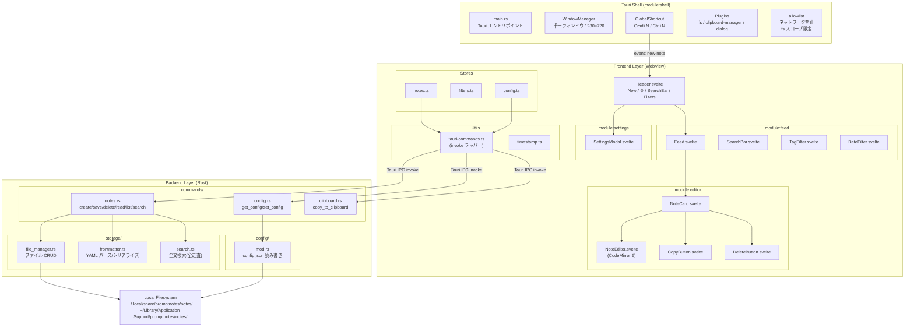
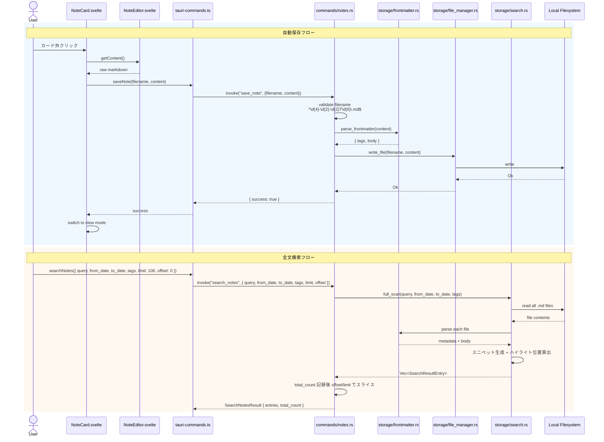
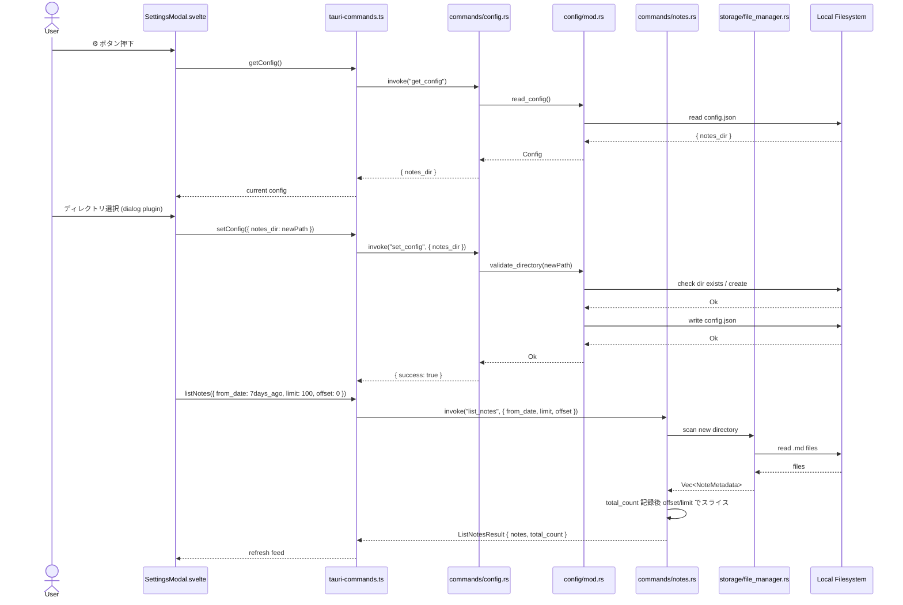

---
codd:
  node_id: detail:component_architecture
  type: design
  depends_on:
  - id: design:system-design
    relation: depends_on
    semantic: technical
  depended_by:
  - id: detail:editor_clipboard
    relation: depends_on
    semantic: technical
  - id: detail:storage_fileformat
    relation: depends_on
    semantic: technical
  - id: detail:feed_search
    relation: depends_on
    semantic: technical
  - id: plan:implementation_plan
    relation: depends_on
    semantic: technical
  conventions:
  - targets:
    - module:shell
    - framework:tauri
    reason: Tauri IPC境界を明確化し、フロントエンドからの直接ファイルシステムアクセスを禁止。全ファイル操作はRustバックエンド経由。
  - targets:
    - module:storage
    - module:settings
    reason: 設定変更（保存ディレクトリ）はRustバックエンド経由で永続化。フロントエンド単独でのファイルパス操作は禁止。
  modules:
  - editor
  - feed
  - storage
  - settings
  - shell
---

# Component Architecture & IPC Boundary

## 1. Overview

本設計書は PromptNotes の Tauri アプリケーションにおけるコンポーネント分割と IPC 境界を詳細に定義する。上流の System Design（design:system-design）で規定された 3 層アーキテクチャ（Tauri Shell → Frontend WebView → Rust Backend）を、実装可能なモジュール粒度まで分解し、各コンポーネント間の通信契約・所有権・責務境界を明確化する。

### 対象モジュール

本設計書がカバーするモジュールは以下の 5 つである。

| モジュール | レイヤー | 主要責務 |
|---|---|---|
| `module:shell` | OS / Tauri ランタイム | ウィンドウ管理、グローバルショートカット、プラグイン初期化、allowlist 強制 |
| `module:editor` | Frontend (Svelte + CodeMirror 6) | ノート編集・表示モード遷移、自動保存トリガー、コピー操作 |
| `module:feed` | Frontend + Backend | ノート一覧表示、デフォルト 7 日間フィルタ、タグ/日付フィルタ、全文検索 |
| `module:storage` | Backend (Rust) | `.md` ファイル CRUD、frontmatter パース、ファイル名バリデーション |
| `module:settings` | Frontend + Backend | 保存ディレクトリ変更、`config.json` 永続化 |

### リリースブロッキング制約への準拠

本設計書は以下の非交渉条件を全セクションにわたって反映する。

| 制約 | 準拠方法 |
|---|---|
| Tauri IPC 境界を明確化し、フロントエンドからの直接ファイルシステムアクセスを禁止。全ファイル操作は Rust バックエンド経由。 | §2 のコンポーネント図・シーケンス図で IPC 境界を明示。フロントエンドコンポーネントはすべて `tauri-commands.ts` の型安全ラッパー経由で `invoke` を呼び出し、`fs` API への直接アクセスパスを持たない設計とする。 |
| 設定変更（保存ディレクトリ）は Rust バックエンド経由で永続化。フロントエンド単独でのファイルパス操作は禁止。 | §3 で `module:settings` の所有権を定義し、`set_config` IPC コマンドを唯一の設定変更エントリポイントとする。フロントエンドはディレクトリパスの文字列を Rust に送信するのみで、パス解決・存在確認・書き込みはすべて Rust 側で実行する。 |

## 2. Mermaid Diagrams

### 2.1 コンポーネント構成図



**所有権と通信境界の説明:**

この図は PromptNotes の全コンポーネントとその依存関係を示す。最も重要な設計制約は、Frontend Layer から Backend Layer への通信が **必ず `tauri-commands.ts`（invoke ラッパー）を経由する** 点である。フロントエンドのどのコンポーネントも、Tauri の `fs` プラグイン API を直接インポートしない。`tauri-commands.ts` は IPC 境界の唯一のゲートウェイであり、ここで型安全性を担保する。

Rust バックエンド内では、`commands/` レイヤーが IPC コマンドのエントリポイントとなり、実際のビジネスロジック（ファイル操作、検索、frontmatter パース）は `storage/` および `config/` モジュールに委譲される。`commands/` は薄いディスパッチ層であり、バリデーション・エラーハンドリング・レスポンス整形を担当する。全コマンドは統一エラー型 `TauriCommandError { code, message }` でエラーを返却する（§4.5 参照）。削除操作は `trash` クレートを使用し OS のゴミ箱に移動する（§4.6 参照）。

### 2.2 IPC コマンドシーケンス図（新規ノート作成）


**実装境界の説明:**

このシーケンスは、ショートカット押下からエディタ表示までの全ステップを示す。IPC 境界（`tauri-commands.ts` → `commands/notes.rs`）を跨ぐ箇所が唯一のプロセス間通信であり、ここがレイテンシのボトルネックとなる。200ms 以内の目標を達成するため、`create_note` コマンドはファイル名生成 → 空ファイル書き込み → レスポンス返却を同期的に処理し、frontmatter シリアライズは最小限の固定文字列（`"---\ntags: []\n---\n"`）を出力する。

### 2.3 自動保存・検索のシーケンス図



**実装境界の説明:**

自動保存フローでは、フロントエンドは CodeMirror 6 からの生のMarkdown テキストをそのまま Rust バックエンドに送信する。frontmatter のパースや tags の抽出はすべて Rust 側の `storage/frontmatter.rs` が単一所有する。フロントエンド側に frontmatter パーサーは存在せず、表示用のタグ情報等は `list_notes` / `read_note` のレスポンスに含まれるパース済み構造化データを使用する。

全文検索では `storage/search.rs` が保存ディレクトリ内の全 `.md` ファイルを走査する。数十件規模では 200ms 以内のレスポンスが見込まれるが、1,000 件超過時は tantivy ベースのインデックス検索への移行を検討する（OQ-004）。

### 2.4 設定変更フロー



**実装境界の説明:**

設定変更フローにおいて、フロントエンド（`SettingsModal.svelte`）はディレクトリパスの文字列値を取得するために Tauri の `dialog` プラグインを使用するが、パスの解決・存在確認・ディレクトリ作成・`config.json` への書き込みはすべて Rust バックエンド（`config/mod.rs`）が実行する。フロントエンド単独でのファイルパス操作（パス結合、存在チェック等）は禁止されており、この制約は `tauri-commands.ts` が `set_config` コマンドのみを公開することで構造的に強制される。

## 3. Ownership Boundaries

### 3.1 モジュール所有権マトリクス

各ソースファイル・コンポーネントの正規所有者を以下に定義する。所有者以外のモジュールが同一の責務を再実装することを禁止する。

| ファイル / コンポーネント | 所有モジュール | 責務の単一所有 |
|---|---|---|
| `src-tauri/src/main.rs` | `module:shell` | Tauri アプリケーション初期化、プラグイン登録、allowlist 適用 |
| `src-tauri/src/commands/notes.rs` | `module:storage` | ノート CRUD の IPC エントリポイント（`create_note`, `save_note`, `delete_note`, `force_delete_note`, `read_note`, `list_notes`, `search_notes`, `list_all_tags`, `move_notes`） |
| `src-tauri/src/commands/config.rs` | `module:settings` | 設定読み書きの IPC エントリポイント（`get_config`, `set_config`） |
| `src-tauri/src/commands/clipboard.rs` | `module:shell` | クリップボード操作の IPC エントリポイント（`copy_to_clipboard`） |
| `src-tauri/src/storage/file_manager.rs` | `module:storage` | ファイル CRUD 操作（唯一のファイルシステム書き込みポイント） |
| `src-tauri/src/storage/frontmatter.rs` | `module:storage` | YAML frontmatter パース/シリアライズ（正規化の単一所有者） |
| `src-tauri/src/storage/search.rs` | `module:feed` | 全文検索ロジック（ファイル全走査） |
| `src-tauri/src/config/mod.rs` | `module:settings` | `config.json` 読み書き、ディレクトリバリデーション |
| `src/lib/utils/tauri-commands.ts` | 共有（全モジュール） | IPC invoke の型安全ラッパー。**単一所有者: module:shell が API 定義を管理し、他モジュールはインポートのみ** |
| `src/lib/utils/timestamp.ts` | 共有（全モジュール） | ファイル名 ↔ 日時変換ユーティリティ。**単一所有者: module:storage がフォーマット仕様を決定** |
| ~~`src/lib/utils/frontmatter.ts`~~ | ~~`module:editor`~~ | **廃止**。frontmatter パースは Rust 側 `storage/frontmatter.rs` に一本化。フロントエンドは `list_notes` / `read_note` レスポンスに含まれるパース済み構造化データ（tags 配列等）を使用する（OQ-ARCH-005 決定） |
| `src/lib/stores/notes.ts` | `module:feed` | ノート一覧の状態管理 |
| `src/lib/stores/filters.ts` | `module:feed` | フィルタ状態（日付範囲、タグ、検索クエリ）の管理。セッション内は状態保持、アプリ再起動時にデフォルト（7 日間）にリセット |
| `src/lib/stores/searchResults.ts` | `module:feed` | 検索結果のスニペット・ハイライト情報（`Writable<SearchResultEntry[] | null>`）。`search_notes` レスポンス時に更新、`list_notes` フォールバック時は `null` |
| `src/lib/stores/totalCount.ts` | `module:feed` | フィルタ条件に合致する全ノート数（`Writable<number>`）。ページネーション（スクロールロード）の次ページ有無判定に使用 |
| `src/lib/stores/config.ts` | `module:settings` | 設定状態のキャッシュ |
| `src/lib/components/NoteCard.svelte` | `module:editor` | ノートカードの表示/編集モード制御。**Feed 内の flex 縮小を防ぐためのレイアウト制約**（`flex-shrink: 0` 等）は `detail:feed_search` §4.4b を参照 |
| `src/lib/components/NoteEditor.svelte` | `module:editor` | CodeMirror 6 インスタンスのライフサイクル管理 |
| `src/lib/components/CopyButton.svelte` | `module:editor` | コピー操作 UI とフィードバック。**表示モード・編集モードの両方で常時マウントされ、モード遷移で再マウントしない**（詳細は `detail:editor_clipboard` §2.1 / §4.4 を参照）。**絵文字単体表示は禁止**でテキストラベル + 枠線により視認性を保証する |
| `src/lib/components/DeleteButton.svelte` | `module:editor` | 削除操作 UI（テキストラベル `Delete` + 枠線で視認性を保証、絵文字単体表示は禁止）。詳細は `detail:editor_clipboard` §4.4b を参照 |
| `src/lib/components/Feed.svelte` | `module:feed` | ノートカード一覧のレンダリング（降順ソート） |
| `src/lib/components/SearchBar.svelte` | `module:feed` | 検索入力 UI |
| `src/lib/components/TagFilter.svelte` | `module:feed` | タグフィルタ UI（複数選択時は OR 条件） |
| `src/lib/components/DateFilter.svelte` | `module:feed` | 日付範囲フィルタ UI |
| `src/lib/components/Header.svelte` | `module:feed` | ヘッダー統合コンポーネント（New ボタン、⚙️ ボタン、SearchBar、フィルタ）。アプリ名は表示しない |
| `src/lib/components/SettingsModal.svelte` | `module:settings` | 設定モーダル UI |

### 3.2 共有型の所有権

再実装ドリフトを防止するため、以下の共有型・インターフェースの正規所有者を明記する。

| 型 / インターフェース | 正規所有者 | 定義場所 | 利用者 |
|---|---|---|---|
| `NoteMetadata` (TypeScript) | `module:storage` | `src/lib/utils/tauri-commands.ts` | `module:feed`, `module:editor` |
| `NoteMetadata` (Rust struct) | `module:storage` | `src-tauri/src/commands/notes.rs` | `storage/search.rs`, `storage/file_manager.rs` |
| `ListNotesResult` (Rust struct) | `module:storage` | `src-tauri/src/commands/notes.rs` | `list_notes` IPC レスポンス型。`notes: Vec<NoteMetadata>` + `total_count: u32` |
| `SearchResultEntry` (Rust struct) | `module:feed` | `src-tauri/src/storage/search.rs` | `metadata: NoteMetadata` + `snippet: String` + `highlights: Vec<HighlightRange>`。`search_notes` レスポンス要素型 |
| `SearchNotesResult` (Rust struct) | `module:feed` | `src-tauri/src/commands/notes.rs` | `entries: Vec<SearchResultEntry>` + `total_count: u32`。`search_notes` IPC レスポンス型 |
| `HighlightRange` (Rust struct) | `module:feed` | `src-tauri/src/storage/search.rs` | `start: u32`, `end: u32`。スニペット内のマッチ位置（相対オフセット） |
| `SearchResultEntry` (TypeScript) | `module:feed` | `src/lib/utils/tauri-commands.ts` | `searchResults.ts` store の要素型。`NoteCard.svelte` がスニペット・ハイライト表示に使用 |
| `ListOptions` (Rust struct) | `module:storage` | `src-tauri/src/commands/notes.rs` | `from_date`, `to_date`, `tags`, `limit`, `offset` パラメータの IPC 受け渡し用 |
| `AppConfig` (Rust struct) | `module:settings` | `src-tauri/src/config/mod.rs` | `commands/config.rs` |
| `AppConfig` (TypeScript) | `module:settings` | `src/lib/stores/config.ts` | `SettingsModal.svelte` |
| ファイル名正規表現 `^\d{4}-\d{2}-\d{2}T\d{6}\.md$` | `module:storage` | `src-tauri/src/storage/file_manager.rs` | `commands/notes.rs`（バリデーション時にインポート） |

### 3.3 IPC 境界の所有ルール

1. **IPC コマンド定義**: Rust 側の `commands/` ディレクトリが正規所有者。新しい IPC コマンドの追加は必ず `commands/mod.rs` での登録を伴う。
2. **IPC ラッパー**: フロントエンド側の `tauri-commands.ts` が唯一の invoke 呼び出しポイント。各 Svelte コンポーネントは `@tauri-apps/api/core` の `invoke` を直接呼び出さず、`tauri-commands.ts` の型付き関数を使用する。
3. **frontmatter パースの一本化**: Rust 側 `storage/frontmatter.rs` が frontmatter のパース・シリアライズを単一所有する。フロントエンド側の `frontmatter.ts` は廃止し、フロントエンドは `list_notes` / `read_note` の IPC レスポンスに含まれるパース済み構造化データ（tags 配列等）をそのまま表示に使用する。フロントエンドが frontmatter を独自にパース・組み立てることは禁止する。

### 3.4 プラグイン使用の所有ルール

| Tauri プラグイン | 使用を許可されるモジュール | 禁止事項 |
|---|---|---|
| `fs` | `module:storage`（Rust 側のみ） | フロントエンドからの直接使用禁止 |
| `clipboard-manager` | `module:shell`（`commands/clipboard.rs` 経由） | フロントエンドの Web Clipboard API 使用禁止 |
| `dialog` | `module:settings`（`SettingsModal.svelte` でのディレクトリ選択のみ） | パス文字列の取得のみ許可。パス解決・検証は Rust 側 |

## 4. Implementation Implications

### 4.1 IPC 境界の強制メカニズム

フロントエンドからの直接ファイルシステムアクセス禁止は、以下の 3 つのレイヤーで強制する。

1. **`tauri.conf.json` の allowlist/capabilities**: Tauri v2 の capabilities 設定で、WebView からの `fs` プラグインへの直接アクセスを許可しない。`clipboard-manager` も `copy_to_clipboard` コマンド経由でのみ使用する。
2. **コードレビュー規約**: フロントエンドコードが `@tauri-apps/plugin-fs` をインポートしている場合はリジェクトする。許可されるインポートは `@tauri-apps/api/core`（`invoke` のみ、`tauri-commands.ts` 内に限定）と `@tauri-apps/plugin-dialog`（`SettingsModal.svelte` 内に限定）のみ。
3. **ESLint ルール**: `no-restricted-imports` で `@tauri-apps/plugin-fs` のインポートを禁止する。

```json
{
  "rules": {
    "no-restricted-imports": ["error", {
      "paths": [
        {
          "name": "@tauri-apps/plugin-fs",
          "message": "Direct filesystem access from frontend is prohibited. Use tauri-commands.ts IPC wrappers."
        }
      ]
    }]
  }
}
```

### 4.2 設定変更の安全性とファイル移動

`module:settings` における保存ディレクトリ変更は以下の手順で処理する。

**ステップ 1: ディレクトリ検証（Rust バックエンド）**

1. `set_config` コマンドが新しい `notes_dir` パスを受信
2. `config/mod.rs` がパスを正規化（`canonicalize`）し、ディレクトリの存在を確認。存在しない場合は作成を試行
3. 書き込み権限を検証（テストファイルの作成・削除）
4. `config.json` に新しいパスを書き込み
5. 成功レスポンスを返却

**ステップ 2: ファイル移動の確認（フロントエンド → バックエンド）**

`set_config` 成功後、フロントエンドはユーザーに確認ダイアログを表示する。

```
「ノートを新しいディレクトリに移動しますか？」
[移動する] / [移動しない]
```

- **「移動する」**: `move_notes` IPC コマンドを発行。Rust バックエンドが旧ディレクトリの `.md` ファイルを新ディレクトリに移動する。同名ファイルが存在する場合はスキップ（上書きしない）。移動結果 `{ moved: u32, skipped: u32 }` を返却し、スキップがあった場合はフロントエンドが件数通知（例:「12件移動、2件スキップ」）を表示する。
- **「移動しない」**: `config.json` のみ更新済みのため、新ディレクトリ内の既存 `.md` ファイルを `list_notes` で読み込む。

フロントエンドはパスの妥当性検証を一切行わない。`SettingsModal.svelte` は Tauri `dialog` プラグインから取得したパス文字列をそのまま `set_config` に渡す。

### 4.3 CodeMirror 6 インスタンス管理

`NoteEditor.svelte` は CodeMirror 6 のシングルインスタンスを destroy → recreate 方式で管理する。同時に編集モードになるカードは 1 つだけであるため、`EditorView` インスタンスは最大 1 つのみ存在する。カード遷移ごとにインスタンスを破棄・再生成することでメモリ消費を最小化する。

- **マウント**: `NoteCard.svelte` が編集モードに遷移する際に `NoteEditor.svelte` をマウントし、`EditorView` を新規生成
- **アンマウント**: 別カードクリックまたはカード外クリック時に自動保存を実行した後、`EditorView.destroy()` を呼び出してリソースを解放
- **拡張構成**: `@codemirror/lang-markdown` + `@codemirror/language-data` によるシンタックスハイライト、`ViewPlugin` + `Decoration` による frontmatter 背景色カスタマイズ
- **パフォーマンス計測**: E2E テストで CodeMirror 6 の初期化時間を計測し、200ms 以内であることを検証する
- **禁止**: Markdown の HTML レンダリング（プレビュー）は実装しない。タイトル入力欄は実装しない。違反時リリース不可。

### 4.4 Store 設計とデータフロー

Svelte の reactive store を使用し、コンポーネント間の状態共有を以下のように設計する。

| Store | 型 | 更新トリガー | 購読者 |
|---|---|---|---|
| `notes` (`notes.ts`) | `Writable<NoteMetadata[]>` | `list_notes` / `search_notes` レスポンス受信時、`create_note` / `delete_note` 成功時 | `Feed.svelte`, `NoteCard.svelte` |
| `filters` (`filters.ts`) | `Writable<{ fromDate: string, toDate: string, tags: string[], query: string }>` | `DateFilter`, `TagFilter`, `SearchBar` の UI 操作時 | `Feed.svelte`（フィルタ変更で `list_notes` / `search_notes` を再発行） |
| `config` (`config.ts`) | `Writable<{ notes_dir: string }>` | `get_config` レスポンス受信時、`set_config` 成功時 | `SettingsModal.svelte` |

`filters` store の変更は `Feed.svelte` の reactive ブロック（`$:` ステートメント）で検知し、対応する IPC コマンドを自動発行する。デフォルト値はアプリ起動時に `fromDate` を 7 日前の `00:00:00`、`toDate` を現在日時に設定する。

### 4.5 統一エラー型

IPC コマンドのエラーハンドリングは統一エラー型を使用する。

**Rust 側定義:**

```rust
#[derive(Serialize)]
struct TauriCommandError {
    code: String,
    message: String,
}
```

**エラーコード一覧（`MODULE_REASON` 形式）:**

| code | 発生箇所 | 意味 |
|---|---|---|
| `STORAGE_NOT_FOUND` | `commands/notes.rs` | 指定ファイルが存在しない |
| `STORAGE_INVALID_FILENAME` | `commands/notes.rs` | ファイル名が正規表現に不合致 |
| `STORAGE_WRITE_FAILED` | `storage/file_manager.rs` | ファイル書き込み失敗 |
| `STORAGE_PATH_TRAVERSAL` | `storage/file_manager.rs` | パストラバーサル検出 |
| `CONFIG_INVALID_DIR` | `commands/config.rs` | ディレクトリが存在せず作成も失敗 |
| `CONFIG_WRITE_FAILED` | `config/mod.rs` | config.json 書き込み失敗 |
| `CLIPBOARD_FAILED` | `commands/clipboard.rs` | クリップボード操作失敗 |
| `TRASH_FAILED` | `commands/notes.rs` | ゴミ箱移動失敗（フォールバックダイアログのトリガー） |

フロントエンド側では `code` を switch 文で分岐し、ユーザー向けメッセージを表示する。`message` はデバッグ用の詳細情報（ファイルパス、OS エラー等）を含み、開発者コンソールに出力する。

`tauri-commands.ts` で対応する TypeScript 型を定義する。

```typescript
interface TauriCommandError {
  code: string;
  message: string;
}
```

### 4.6 削除操作とゴミ箱連携

ノート削除は `trash` クレートを使用し、OS のゴミ箱に移動する。確認ダイアログは表示しない。

**削除フロー:**

1. `delete_note` IPC コマンドが `filename` を受信
2. `file_manager.rs` でファイル名バリデーション・パストラバーサル検証
3. `trash::delete()` でゴミ箱への移動を試行
4. 成功: 完了レスポンスを返却（ダイアログなし）
5. 失敗（`TRASH_FAILED`）: エラーを返却。フロントエンドが確認ダイアログを表示

```
「ゴミ箱が利用できません。完全に削除しますか？」
[削除する] / [キャンセル]
```

- **「削除する」**: `force_delete_note` IPC コマンドを発行。`std::fs::remove_file()` で完全削除
- **「キャンセル」**: 操作を中止

**依存クレート:** `trash` （Linux: freedesktop trash spec、macOS: NSFileManager に対応）

### 4.7 ファイル名バリデーションとパストラバーサル防止

`storage/file_manager.rs` が以下のバリデーションを一元的に所有する。

1. ファイル名が正規表現 `^\d{4}-\d{2}-\d{2}T\d{6}\.md$` に合致すること
2. ファイル名にパスセパレータ（`/`, `\`）が含まれないこと
3. 解決後のパスが設定済み `notes_dir` 配下であること（`canonicalize` で検証）

すべての IPC コマンド（`save_note`, `delete_note`, `read_note`）は `file_manager.rs` のバリデーション関数を呼び出してからファイル操作を実行する。

### 4.8 パフォーマンス制約の実装方針

| 指標 | 閾値 | 実装方針 |
|---|---|---|
| ショートカット → エディタ表示 | 200ms 以内 | `create_note` は固定文字列の frontmatter を同期書き込み。CodeMirror 6 の初期化は最小拡張セットで実行 |
| 全文検索レスポンス | 200ms 以内（数十件規模） | `search.rs` で `std::fs::read_dir` + `read_to_string` による逐次走査。1,000 件超過・200ms 超過時に tantivy 移行を検討 |
| 自動保存完了 | 100ms 以内 | `save_note` は frontmatter パース → ファイル書き込みを同期で実行。非同期 I/O のオーバーヘッドを回避 |
| アプリ起動 → フィード表示 | 2 秒以内 | 起動時に `list_notes` でデフォルト 7 日間分のみ読み込み。frontmatter パースは先頭 `---` 〜 `---` のみ走査し本文全体は読まない |

### 4.9 プラットフォーム固有の考慮事項

| 項目 | Linux | macOS |
|---|---|---|
| デフォルト保存ディレクトリ | `~/.local/share/promptnotes/notes/` | `~/Library/Application Support/promptnotes/notes/` |
| 設定ファイルパス | `~/.local/share/promptnotes/config.json` | `~/Library/Application Support/promptnotes/config.json` |
| グローバルショートカット | Ctrl+N | Cmd+N |
| ビルド出力 | `.deb`, `.AppImage`, Flatpak | `.dmg`, Homebrew Cask |
| E2E テスト実行 | `xvfb-run` で仮想ディスプレイ上 | ネイティブ実行 |

パス解決には Tauri の `app_data_dir()` API を使用し、OS ごとのパス差異をアプリケーションコードから隔離する。`config/mod.rs` が `app_data_dir()` を唯一の呼び出し元とし、ハードコードされたパスは使用しない。

### 4.10 ネットワークアクセス禁止の構造的強制

AI 呼び出し機能の実装禁止を構造的に保証するため、以下の対策を講じる。

1. **`tauri.conf.json`**: `http` / `shell:open` 等のネットワーク関連 capability を一切定義しない
2. **Cargo.toml**: `reqwest`, `hyper` 等の HTTP クライアントクレートを依存関係に含めない
3. **package.json**: `fetch` ラッパーや HTTP クライアントライブラリ（`axios` 等）を依存関係に含めない
4. **CSP (Content Security Policy)**: `tauri.conf.json` の `security.csp` で `connect-src 'none'` を設定し、WebView からのネットワークリクエストをブロック

## 5. Resolved Questions

全 Open Questions は解決済みである。以下に決定事項を記録する。

| ID | 質問 | 決定 | 反映先 |
|---|---|---|---|
| OQ-ARCH-001 | CodeMirror 6 インスタンスをカード遷移時に destroy/recreate するか再利用するか | destroy → recreate を無条件採用。メモリ消費を最小化する。パフォーマンス計測テスト（200ms 以内）を E2E テストで実施する | §4.3 |
| OQ-ARCH-002 | エラーハンドリングを統一型で行うか個別処理するか | 統一エラー型 `TauriCommandError { code: string, message: string }` を採用。エラーコードは `MODULE_REASON` 形式（例: `STORAGE_NOT_FOUND`, `CONFIG_INVALID_DIR`） | §4.5 |
| OQ-ARCH-003 | 削除操作に確認ダイアログを表示するか | `trash` クレートで OS のゴミ箱に移動（確認ダイアログなし）。ゴミ箱移動失敗時のみ確認ダイアログを表示し、ユーザーが完全削除を選択可能 | §4.6 |
| OQ-ARCH-004 | 保存ディレクトリ変更時に旧ディレクトリのファイルを移動するか | ユーザーに確認ダイアログ「ノートを新しいディレクトリに移動しますか？」を表示。移動を選択した場合、同名ファイルはスキップ（上書きしない）。結果を件数通知（例:「12件移動、2件スキップ」） | §4.2 |
| OQ-ARCH-005 | フロントエンド側とRust側のfrontmatterパース不整合時の優先順位 | フロントエンド側 `frontmatter.ts` を廃止し、frontmatter パース責務を Rust 側 `storage/frontmatter.rs` に一本化。`list_notes` / `read_note` のレスポンスにパース済み構造化データを含め、フロントエンドはそのまま表示に使用する | §3.1, §3.3 |
