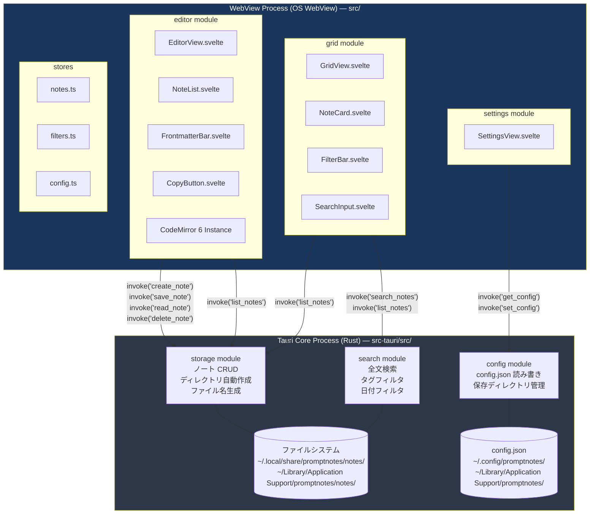
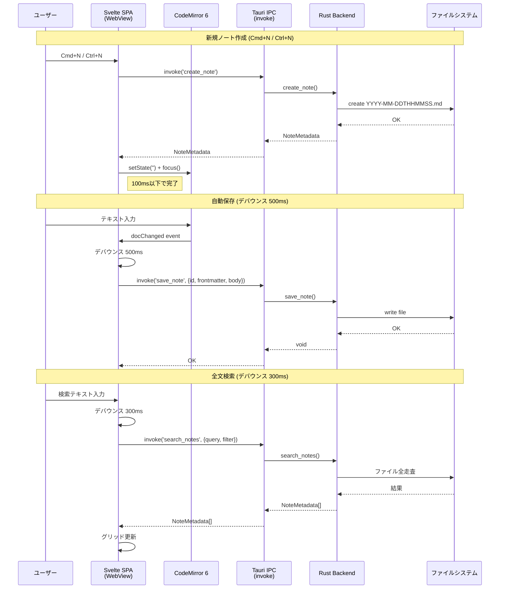
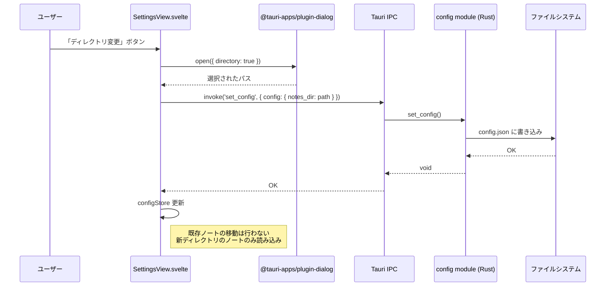

---
codd:
  node_id: detail:component_architecture
  type: design
  depends_on:
  - id: design:system-design
    relation: depends_on
    semantic: technical
  depended_by:
  - id: detail:editor_clipboard
    relation: depends_on
    semantic: technical
  - id: detail:storage_fileformat
    relation: depends_on
    semantic: technical
  - id: detail:grid_search
    relation: depends_on
    semantic: technical
  - id: plan:implementation_plan
    relation: depends_on
    semantic: technical
  conventions:
  - targets:
    - module:shell
    - framework:tauri
    reason: Tauri IPC境界を明確化し、フロントエンドからの直接ファイルシステムアクセスを禁止。全ファイル操作はRustバックエンド経由。
  - targets:
    - module:storage
    - module:settings
    reason: 設定変更（保存ディレクトリ）はRustバックエンド経由で永続化。フロントエンド単独でのファイルパス操作は禁止。
  modules:
  - editor
  - grid
  - storage
  - settings
  - shell
---

# Component Architecture & IPC Boundary

## 1. Overview

本設計書は PromptNotes アプリケーションのコンポーネント構成と Tauri IPC 境界を詳細に定義する。Tauri v2 の 2 プロセスアーキテクチャ（Rust Core Process + OS WebView Process）において、各モジュールがどのプロセスに属し、どのような IPC コマンドを通じて相互作用するかを明確化する。

PromptNotes は「タイトル不要・本文即記・グリッド振り返り」を設計思想とするローカルデスクトップノートアプリであり、フロントエンド（Svelte SPA + CodeMirror 6）とバックエンド（Rust）の責務分離を厳格に維持する。

### IPC 境界の原則

フロントエンドからの直接ファイルシステムアクセスは全面禁止とする。すべてのファイル操作（ノートの CRUD、設定の読み書き）は Rust バックエンドの Tauri コマンドを経由する。この制約は `framework:tauri` / `module:shell` に対するリリースブロッキング制約であり、違反した場合リリース不可となる。

設定変更（保存ディレクトリの変更）についても、フロントエンド単独でのファイルパス操作は禁止であり、`module:storage` / `module:settings` に対するリリースブロッキング制約として、すべて Rust バックエンド経由で永続化する。

### 技術スタックの固定

| レイヤー | 技術 | リリースブロッキング制約 |
|---|---|---|
| アプリケーションフレームワーク | Tauri v2（Rust + OS WebView） | RBC-1: 変更禁止 |
| フロントエンド | Svelte SPA | — |
| エディタエンジン | CodeMirror 6 | RBC-2: 変更禁止 |
| データ永続化 | ローカル `.md` ファイル | RBC-3: DB・クラウド禁止 |
| 対象プラットフォーム | Linux（WebKitGTK）、macOS（WKWebView） | Windows はスコープ外 |

---

## 2. Mermaid Diagrams

### 2.1 プロセス境界とモジュール配置



**所有権と境界の説明:**

- **Rust Core Process** はファイルシステムおよび設定ファイルへの唯一のアクセス経路である。`storage`、`search`、`config` の 3 モジュールがすべての I/O を担当し、WebView Process からの `invoke` 呼び出しにのみ応答する。
- **WebView Process** は UI レンダリングとユーザーインタラクションに専念する。`@tauri-apps/api/core` の `invoke` 関数のみを通じてバックエンドと通信し、`fs`、`path` 等の Tauri プラグインによる直接ファイルアクセスは一切使用しない。
- **stores** は WebView Process 内のアプリケーション状態管理層であり、`invoke` の結果をキャッシュし、各コンポーネントにリアクティブに配信する。stores 自身がファイルシステムにアクセスすることはない。

### 2.2 IPC コマンドシーケンス



**実装上の境界:**

- 新規ノート作成では、Rust 側のファイル作成完了を待ってからフロントエンドが CodeMirror 6 のフォーカスを移す。レイテンシ目標 100ms 以下を達成するため、Rust 側は `tokio::fs` 等の非同期 I/O を使用する。
- 自動保存のデバウンスは Svelte フロントエンド側で 500ms の `setTimeout` ベースで実装する。CodeMirror 6 の `updateListener` から `docChanged` イベントを受け取り、デバウンス後に `invoke('save_note')` を発行する。
- 全文検索のデバウンスは 300ms でフロントエンド側に実装し、Rust バックエンドのファイル全走査を過剰にトリガーしない。

### 2.3 設定変更フロー



**所有権:**

- ディレクトリ選択ダイアログは `@tauri-apps/plugin-dialog` が提供するネイティブ OS ダイアログを使用する。フロントエンドが直接ファイルパスを構築・操作することはない。
- `config.json` への書き込みは `config` モジュール（Rust）が排他的に担当する。フロントエンドは `invoke('set_config')` 経由でのみ設定を変更でき、`localStorage` や `IndexedDB` 等のブラウザストレージに設定を保存することは禁止する。

---

## 3. Ownership Boundaries

### 3.1 モジュール所有権マトリクス

| モジュール | プロセス | 所有するリソース | 禁止事項 |
|---|---|---|---|
| `storage`（Rust） | Core Process | ノートファイル（`.md`）の CRUD、ディレクトリ作成、ファイル名生成（`YYYY-MM-DDTHHMMSS.md`） | WebView からの直接ファイル操作 |
| `search`（Rust） | Core Process | ファイル全走査による検索ロジック、タグ/日付フィルタリング | インデックスファイルの作成、外部検索エンジンの利用 |
| `config`（Rust） | Core Process | `config.json` の読み書き、デフォルト保存ディレクトリの決定 | フロントエンドからの直接的なファイルパス操作 |
| `editor`（Svelte） | WebView Process | CodeMirror 6 インスタンスの構成・ライフサイクル、キーバインド処理、コピーボタン UI、frontmatter 編集 UI | Monaco 等の代替エディタ使用、タイトル入力欄、Markdown プレビュー |
| `grid`（Svelte） | WebView Process | Pinterest スタイルカードレイアウト、フィルタ UI、検索 UI | バックエンドを経由しない独自の検索・フィルタ処理 |
| `settings`（Svelte） | WebView Process | 設定変更 UI、ディレクトリ選択ダイアログの呼び出し | `localStorage` / `IndexedDB` への設定保存 |
| `stores`（Svelte） | WebView Process | `notes.ts`、`filters.ts`、`config.ts` による Svelte ストア状態管理 | ファイルシステムへの直接アクセス |

### 3.2 共有型の所有権

TypeScript の型定義（`NoteMetadata`、`Note`、`NoteFilter`、`AppConfig`）は `src/lib/types.ts` に単一定義する。このファイルが型の正規所有者であり、各コンポーネントやストアはここからインポートする。

```
src/lib/types.ts          ← 型定義の単一ソース
├── NoteMetadata           Rust の storage/search コマンド応答に対応
├── Note                   read_note の応答に対応
├── NoteFilter             list_notes/search_notes のフィルタパラメータ
└── AppConfig              get_config/set_config のペイロード
```

Rust 側の対応する構造体は `src-tauri/src/models.rs` に定義し、`serde::Serialize` / `serde::Deserialize` を derive する。TypeScript 型と Rust 構造体のフィールド名は snake_case で一致させ、Tauri IPC のシリアライゼーションで自動変換する。

### 3.3 IPC コマンドの所有権

各 Tauri コマンド（`#[tauri::command]`）は対応する Rust モジュールが排他的に所有する。

| Tauri コマンド | 所有モジュール（Rust） | 呼び出し元（Svelte） |
|---|---|---|
| `create_note` | `storage` | `editor`（Cmd+N / Ctrl+N） |
| `save_note` | `storage` | `editor`（自動保存） |
| `read_note` | `storage` | `editor`（ノート選択時） |
| `delete_note` | `storage` | `editor`（削除操作時） |
| `list_notes` | `storage` | `editor`（ノートリスト）、`grid`（カード表示） |
| `search_notes` | `search` | `grid`（全文検索） |
| `get_config` | `config` | `settings`（初期ロード）、アプリ起動時 |
| `set_config` | `config` | `settings`（ディレクトリ変更） |

### 3.4 フロントエンドコンポーネントの所有権

| コンポーネント | 所有モジュール | 再利用の想定 |
|---|---|---|
| `EditorView.svelte` | `editor` | 単一インスタンス。ルート `/` でのみマウント |
| `NoteList.svelte` | `editor` | `EditorView` 内でのみ使用 |
| `FrontmatterBar.svelte` | `editor` | `EditorView` 内でのみ使用 |
| `CopyButton.svelte` | `editor` | `EditorView` 内でのみ使用 |
| `GridView.svelte` | `grid` | 単一インスタンス。ルート `/grid` でのみマウント |
| `NoteCard.svelte` | `grid` | `GridView` 内で複数インスタンス |
| `FilterBar.svelte` | `grid` | `GridView` 内でのみ使用 |
| `SearchInput.svelte` | `grid` | `FilterBar` 内でのみ使用 |
| `SettingsView.svelte` | `settings` | 単一インスタンス。ルート `/settings` でのみマウント |

### 3.5 Svelte ストアの所有権と購読ルール

| ストア | ファイル | 書き込み権限 | 購読者 |
|---|---|---|---|
| `notesStore` | `src/stores/notes.ts` | `editor`、`grid`（IPC 応答を反映） | `EditorView`、`NoteList`、`GridView`、`NoteCard` |
| `filtersStore` | `src/stores/filters.ts` | `grid`（`FilterBar`、`SearchInput`） | `GridView`、`FilterBar` |
| `configStore` | `src/stores/config.ts` | `settings`（IPC 応答を反映）、アプリ起動時 | `SettingsView`、`storage` 呼び出し時にパス参照 |

---

## 4. Implementation Implications

### 4.1 Tauri IPC セキュリティ設定

Tauri v2 の `tauri.conf.json` において、以下の方針でケイパビリティを構成する。

- `core:default` セットのうち、`fs`（ファイルシステム直接アクセス）プラグインは**許可しない**。フロントエンドからの直接ファイル操作を構造的に禁止する。
- `dialog:default` プラグインのうち `open`（ディレクトリ選択モード）のみを許可する。
- カスタム Tauri コマンド（`create_note`、`save_note` 等）は `tauri.conf.json` の `plugins.shell.scope` ではなく `#[tauri::command]` で定義し、WebView からの `invoke` 経由でのみ呼び出し可能とする。

```json
{
  "app": {
    "security": {
      "csp": "default-src 'self'; style-src 'self' 'unsafe-inline'"
    }
  },
  "plugins": {
    "dialog": {
      "open": true,
      "save": false
    }
  }
}
```

この構成により、`module:shell` / `framework:tauri` のリリースブロッキング制約（フロントエンドからの直接ファイルシステムアクセス禁止）を Tauri のケイパビリティシステムで構造的に強制する。

### 4.2 Rust モジュールのディレクトリ構成

```
src-tauri/src/
├── main.rs              # Tauri エントリポイント、コマンド登録
├── models.rs            # 共有データ構造体（NoteMetadata, Note, NoteFilter, AppConfig）
├── storage.rs           # storage モジュール（create_note, save_note, read_note, delete_note, list_notes）
├── search.rs            # search モジュール（search_notes）
├── config.rs            # config モジュール（get_config, set_config）
└── error.rs             # 統一エラー型（StorageError, ConfigError → Tauri IPC エラー変換）
```

- `main.rs` は `tauri::Builder` に全コマンドを `invoke_handler` で登録する唯一の場所である。
- `models.rs` が Rust 側の型定義の単一ソースであり、`storage.rs`、`search.rs`、`config.rs` はここからインポートする。
- `error.rs` で統一エラー型を定義し、`impl From<std::io::Error>` 等の変換を提供する。Tauri IPC へのエラー応答は `serde::Serialize` を derive した enum で返し、フロントエンドで型安全にハンドリングする。

### 4.3 フロントエンドのディレクトリ構成

```
src/
├── App.svelte           # ルーターのマウントポイント
├── lib/
│   ├── types.ts         # 共有型定義（NoteMetadata, Note, NoteFilter, AppConfig）
│   └── ipc.ts           # invoke ラッパー関数（型付き IPC 呼び出し）
├── components/
│   ├── editor/
│   │   ├── EditorView.svelte
│   │   ├── NoteList.svelte
│   │   ├── FrontmatterBar.svelte
│   │   └── CopyButton.svelte
│   ├── grid/
│   │   ├── GridView.svelte
│   │   ├── NoteCard.svelte
│   │   ├── FilterBar.svelte
│   │   └── SearchInput.svelte
│   └── settings/
│       └── SettingsView.svelte
└── stores/
    ├── notes.ts
    ├── filters.ts
    └── config.ts
```

### 4.4 IPC ラッパー層（`src/lib/ipc.ts`）

フロントエンドから `invoke` を直接呼び出す箇所を分散させず、`src/lib/ipc.ts` に型付きラッパー関数を集約する。これにより IPC 呼び出しの型安全性を保証し、コマンド名の typo やペイロード型の不整合をコンパイル時に検出する。

```typescript
import { invoke } from '@tauri-apps/api/core';
import type { NoteMetadata, Note, NoteFilter, AppConfig } from './types';

export const createNote = (): Promise<NoteMetadata> =>
  invoke<NoteMetadata>('create_note');

export const saveNote = (id: string, frontmatter: { tags: string[] }, body: string): Promise<void> =>
  invoke<void>('save_note', { id, frontmatter, body });

export const readNote = (id: string): Promise<Note> =>
  invoke<Note>('read_note', { id });

export const deleteNote = (id: string): Promise<void> =>
  invoke<void>('delete_note', { id });

export const listNotes = (filter?: NoteFilter): Promise<NoteMetadata[]> =>
  invoke<NoteMetadata[]>('list_notes', { filter });

export const searchNotes = (query: string, filter?: NoteFilter): Promise<NoteMetadata[]> =>
  invoke<NoteMetadata[]>('search_notes', { query, filter });

export const getConfig = (): Promise<AppConfig> =>
  invoke<AppConfig>('get_config');

export const setConfig = (config: AppConfig): Promise<void> =>
  invoke<void>('set_config', { config });
```

各 Svelte コンポーネントおよびストアは `ipc.ts` からのみ IPC 関数をインポートし、`@tauri-apps/api/core` を直接インポートしない。この規約により、IPC 境界の変更が `ipc.ts` の 1 ファイルに局所化される。

### 4.5 自動保存パイプラインの実装境界

自動保存は以下のコンポーネント間で責務を分担する。

| 責務 | 担当 | 実装詳細 |
|---|---|---|
| テキスト変更検知 | CodeMirror 6（`updateListener`） | `docChanged` フラグが `true` の場合のみ発火 |
| デバウンス制御 | `EditorView.svelte` | 500ms の `setTimeout` / `clearTimeout` |
| frontmatter 統合 | `EditorView.svelte` | `FrontmatterBar` のタグ状態と CodeMirror 本文を結合 |
| IPC 呼び出し | `ipc.ts` の `saveNote()` | `invoke('save_note')` |
| ファイル書き込み | `storage.rs` の `save_note()` | frontmatter YAML + 本文を結合して `std::fs::write` |

frontmatter 領域の変更（タグの追加・削除）も同じデバウンスパイプラインに合流させ、別の保存経路を設けない。

### 4.6 非機能要件の実装マッピング

| 非機能要件 | 閾値 | 実装での担保方法 |
|---|---|---|
| 新規ノート作成レイテンシ | 100ms 以下 | Rust 側で `tokio::fs::File::create` を使用。空ファイル作成は数 ms で完了する想定 |
| 自動保存デバウンス | 500ms | フロントエンド側 `setTimeout`。Rust 側は同期的な `std::fs::write`（ファイルサイズが小さいため非同期化不要） |
| 全文検索デバウンス | 300ms | フロントエンド側 `setTimeout`。Rust 側は `std::fs::read_dir` + `std::fs::read_to_string` による逐次走査 |
| 検索応答時間 | 数百 ms 以内 | 想定データ量（数十件/週）に対してファイル全走査で十分。インデックス構築は行わない |
| バイナリサイズ | 数 MB〜10 MB | Tauri + OS WebView により Electron 比で大幅軽量 |
| メモリフットプリント | 100 MB 以下（アイドル時） | OS WebView 利用。CodeMirror 6 は仮想 DOM 不使用で軽量 |

### 4.7 リリースブロッキング制約への構造的対応

**制約 1: `module:shell` / `framework:tauri` — Tauri IPC 境界の厳格化**

- Tauri v2 のケイパビリティシステムにより `fs` プラグインを無効化し、フロントエンドからの直接ファイルアクセスを構造的に不可能とする。
- すべてのファイル操作は `#[tauri::command]` で定義された Rust 関数を経由する。
- フロントエンドは `src/lib/ipc.ts` のラッパー関数のみを使用し、`invoke` の直接呼び出しを禁止する。
- CI でのリントルール（ESLint カスタムルール等）により、フロントエンドコードでの `@tauri-apps/plugin-fs` インポートを検出・ブロックする。

**制約 2: `module:storage` / `module:settings` — 設定変更の Rust バックエンド経由強制**

- `config.json` の読み書きは `config.rs` モジュールが排他的に担当する。
- フロントエンドの `SettingsView.svelte` は `invoke('set_config')` 経由でのみ設定を変更し、`localStorage`、`sessionStorage`、`IndexedDB` へのアクセスは禁止する。
- ディレクトリ選択は `@tauri-apps/plugin-dialog` のネイティブダイアログを使用し、フロントエンドがパス文字列を直接構築・操作する経路を排除する。

---

## 5. Open Questions

| ID | 質問 | 影響コンポーネント | 判断に必要な情報 |
|---|---|---|---|
| OQ-CA-001 | `ipc.ts` のエラーハンドリング戦略をどうするか。各 `invoke` の失敗時にトースト通知を出すか、コンポーネントごとにエラー状態を管理するか | `ipc.ts`、全 Svelte コンポーネント | Sprint 1 でのエラーケース洗い出し結果 |
| OQ-CA-002 | `notesStore` はノート一覧のキャッシュをどこまで保持するか。全ノートの `NoteMetadata` をメモリに保持するか、画面遷移のたびに `list_notes` を再発行するか | `stores/notes.ts`、`editor`、`grid` | 想定ノート件数のベンチマーク（数百件〜数千件時のメモリ使用量） |
| OQ-CA-003 | Tauri v2 の `fs` プラグイン無効化が `@tauri-apps/plugin-dialog` のディレクトリ選択機能に影響しないか検証が必要 | `SettingsView.svelte`、`tauri.conf.json` | Linux（WebKitGTK）および macOS での動作検証結果 |
| OQ-CA-004 | `search.rs` と `storage.rs` の `list_notes` でファイル走査ロジックが重複する可能性がある。共通のファイル列挙関数を `storage.rs` に定義して `search.rs` から呼び出すか、別途ユーティリティモジュールに切り出すか | `storage.rs`、`search.rs` | Sprint 1 実装時のコード量を見て判断 |
| OQ-CA-005 | フロントエンドのルーティングライブラリの選定（`svelte-spa-router` vs Svelte 5 組み込み機構）が `App.svelte` の構成と各画面コンポーネントのマウント方式に影響する | `App.svelte`、全画面コンポーネント | Svelte 5 の安定版でのルーティング API の成熟度 |
