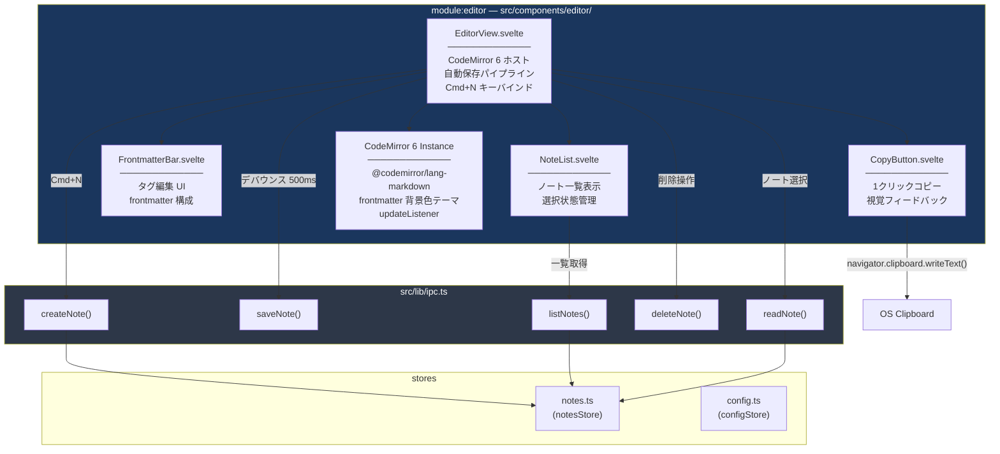
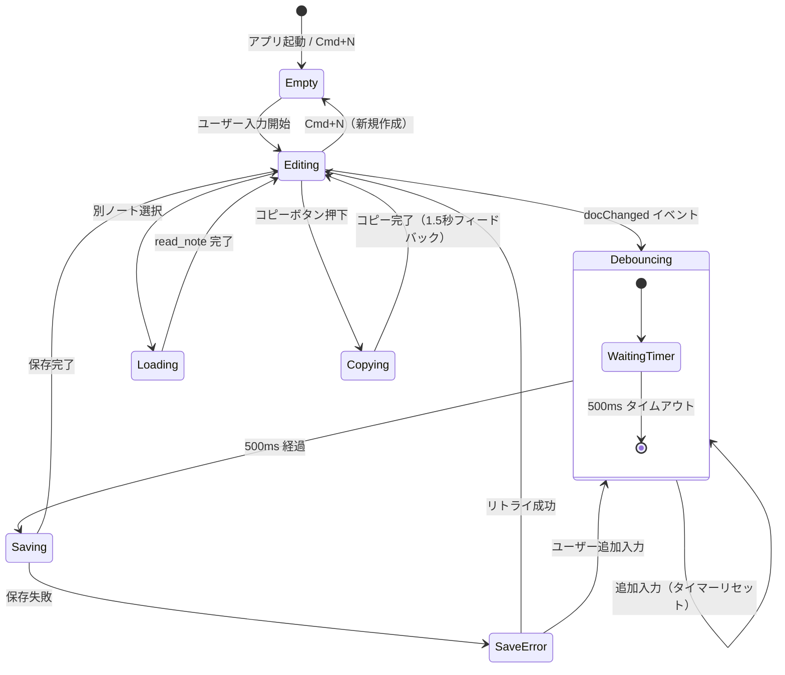
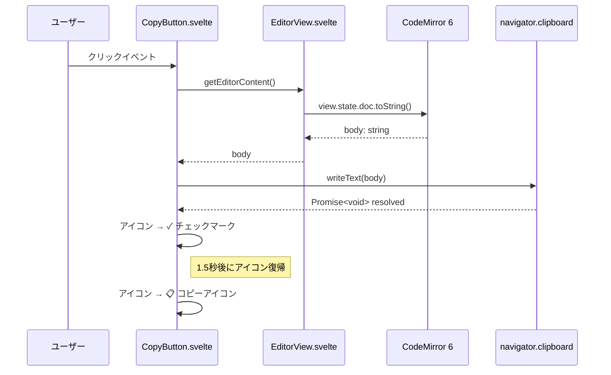

---
codd:
  node_id: detail:editor_clipboard
  type: design
  depends_on:
  - id: detail:component_architecture
    relation: depends_on
    semantic: technical
  depended_by:
  - id: plan:implementation_plan
    relation: depends_on
    semantic: technical
  conventions:
  - targets:
    - module:editor
    reason: CodeMirror 6 必須。Markdownシンタックスハイライトのみ（レンダリング禁止）。frontmatter領域は背景色で視覚的に区別必須。
  - targets:
    - module:editor
    reason: タイトル入力欄は禁止。本文のみのエディタ画面であること。
  - targets:
    - module:editor
    reason: 1クリックコピーボタンによる本文全体のクリップボードコピーはアプリの核心UX。未実装ならリリース不可。
  - targets:
    - module:editor
    reason: Cmd+N / Ctrl+N で即座に新規ノート作成しフォーカス移動必須。
  modules:
  - editor
---

# Editor & Clipboard Detailed Design

## 1. Overview

本設計書は PromptNotes アプリケーションにおける `module:editor` の詳細設計を定義する。エディタ画面は CodeMirror 6 を基盤とし、Markdown シンタックスハイライト付きの本文エディタ、frontmatter 領域の視覚的区別、1クリックコピーボタン、キーボードショートカットによる新規ノート作成を提供する。

### 設計思想

PromptNotes は「タイトル不要・本文即記・グリッド振り返り」を設計思想とするローカルデスクトップノートアプリである。エディタ画面は本文のみのエディタとして設計され、タイトル入力欄は設けない。ユーザーは起動後即座に本文を記述し、1クリックで全文をクリップボードにコピーできる。

### リリースブロッキング制約の適用

本設計書は以下の4つのリリースブロッキング制約を構造的に満たす。

1. **CodeMirror 6 必須・Markdown シンタックスハイライトのみ（レンダリング禁止）・frontmatter 背景色区別**: CodeMirror 6 の `@codemirror/lang-markdown` 拡張によりシンタックスハイライトを提供する。Markdown のプレビューレンダリング（HTML 変換表示）は一切行わない。frontmatter 領域（`---` で囲まれた YAML ブロック）には `EditorView.theme` で専用の背景色（`#f0f4f8` ライトテーマ / `#1e293b` ダークテーマ）を適用し、本文と視覚的に区別する。
2. **タイトル入力欄の禁止**: `EditorView.svelte` にはタイトルを入力するための `<input>` や `<textarea>` を配置しない。画面構成は FrontmatterBar（タグ編集のみ）、CodeMirror 6 エディタ本文、CopyButton の3要素のみで構成する。
3. **1クリックコピーボタン**: `CopyButton.svelte` は `navigator.clipboard.writeText()` を使用してエディタ本文全体をクリップボードにコピーする。このボタンは常時表示であり、コピー成功時には視覚フィードバック（アイコン変化 + 1.5秒後に復帰）を提供する。この機能が未実装の場合リリース不可とする。
4. **Cmd+N / Ctrl+N による新規ノート即座作成**: グローバルキーバインドとして `Cmd+N`（macOS）/ `Ctrl+N`（Linux）を登録し、`ipc.ts` の `createNote()` を呼び出した後、CodeMirror 6 エディタにフォーカスを移動する。レイテンシ目標は 100ms 以下。

### ファイル操作の IPC 境界遵守

`module:editor` のすべてのファイル操作（ノートの作成・読込・保存・削除）は Rust バックエンドの Tauri コマンドを経由する。フロントエンドからの直接ファイルシステムアクセスは構造的に禁止されており、`src/lib/ipc.ts` のラッパー関数のみを使用する。

---

## 2. Mermaid Diagrams

### 2.1 Editor モジュール コンポーネント構成



**所有権と境界の説明:**

- `EditorView.svelte` が `module:editor` のルートコンポーネントであり、CodeMirror 6 インスタンスのライフサイクル管理、自動保存パイプラインの制御、グローバルキーバインドの登録を排他的に担当する。
- `NoteList.svelte`、`FrontmatterBar.svelte`、`CopyButton.svelte` は `EditorView.svelte` の子コンポーネントであり、他のモジュール（`grid`、`settings`）からの再利用は想定しない。
- `CopyButton.svelte` は `navigator.clipboard.writeText()` を直接呼び出す唯一のコンポーネントである。クリップボード操作は OS WebView の標準 API を使用し、Tauri プラグインや Rust バックエンドは経由しない。
- すべてのファイル I/O は `src/lib/ipc.ts` 経由で Rust バックエンドに委譲され、`module:editor` 内のコンポーネントが `@tauri-apps/api/core` を直接インポートすることはない。

### 2.2 エディタ操作のステートマシン



**ステート遷移の実装上の意味:**

- **Empty → Editing**: `Cmd+N` / `Ctrl+N` による新規ノート作成は `createNote()` IPC 呼び出し後、CodeMirror 6 の `EditorView.focus()` を呼び出し、即座に `Editing` ステートに遷移する。この遷移は 100ms 以下で完了する。
- **Debouncing**: `setTimeout` / `clearTimeout` による 500ms デバウンス。追加入力があるたびにタイマーがリセットされ、最後の入力から 500ms 後に `saveNote()` が発行される。
- **Saving**: `invoke('save_note')` の呼び出し中。この間に追加入力があった場合、保存完了後に再度デバウンスパイプラインが起動する。
- **Copying**: `CopyButton` 押下で `navigator.clipboard.writeText()` を実行。成功時はチェックマークアイコンを 1.5秒表示して元に戻る。

### 2.3 クリップボードコピーシーケンス



**実装境界:**

- `CopyButton.svelte` はエディタ本文のみをコピーする。frontmatter（YAML ブロック）はコピー対象に含めない。`EditorView.svelte` が CodeMirror 6 の `view.state.doc.toString()` で取得した本文テキストを `CopyButton` に渡す。
- `navigator.clipboard.writeText()` は Tauri の OS WebView 上で動作し、追加のプラグインや権限設定は不要である。
- コピー失敗時（フォーカス喪失等）は `CopyButton` のアイコンを変更せず、エラー状態を視覚的に示す（赤色フラッシュ、500ms）。

---

## 3. Ownership Boundaries

### 3.1 module:editor 内部の所有権

| コンポーネント | 排他的責務 | 入力ソース | 出力先 |
|---|---|---|---|
| `EditorView.svelte` | CodeMirror 6 の初期化・破棄、自動保存デバウンス、キーバインド登録、子コンポーネントへのデータ配信 | `notesStore`（選択ノート）、`ipc.ts`（IPC 応答） | `ipc.ts`（`saveNote`、`createNote`）、CodeMirror 6 |
| `NoteList.svelte` | ノート一覧のレンダリング、選択状態の管理、削除操作の開始 | `notesStore`（ノート一覧） | `EditorView`（選択イベント）、`ipc.ts`（`deleteNote`） |
| `FrontmatterBar.svelte` | タグの表示・追加・削除 UI | `EditorView`（現在のノートの frontmatter） | `EditorView`（タグ変更イベント → 自動保存パイプラインに合流） |
| `CopyButton.svelte` | 本文全体のクリップボードコピー、視覚フィードバック | `EditorView`（`getEditorContent()` コールバック） | `navigator.clipboard` |
| CodeMirror 6 Instance | Markdown シンタックスハイライト、テキスト編集、`updateListener` による変更通知 | `EditorView`（ドキュメント設定・テーマ・拡張） | `EditorView`（`docChanged` イベント） |

### 3.2 CodeMirror 6 拡張の所有権

CodeMirror 6 のインスタンス構成は `EditorView.svelte` が排他的に担当する。以下の拡張セットを固定し、他のコンポーネントが拡張を追加・変更することはない。

| 拡張 | パッケージ | 用途 |
|---|---|---|
| `markdown()` | `@codemirror/lang-markdown` | Markdown シンタックスハイライト |
| `syntaxHighlighting(defaultHighlightStyle)` | `@codemirror/language` | 構文ハイライトのスタイル適用 |
| `EditorView.updateListener` | `@codemirror/view` | `docChanged` イベント検知 → 自動保存トリガー |
| `keymap.of([...])` | `@codemirror/view` | エディタ内キーバインド（基本編集操作） |
| `EditorView.theme({...})` | `@codemirror/view` | frontmatter 領域の背景色適用 |
| `history()` | `@codemirror/commands` | Undo / Redo |
| `EditorView.lineWrapping` | `@codemirror/view` | 行の折り返し |

**Markdown プレビュー（HTML レンダリング）は拡張として追加しない。** これは `module:editor` のリリースブロッキング制約であり、`@codemirror/lang-markdown` が提供するシンタックスハイライト（見出し・太字・リスト等の色分け）のみを使用する。

### 3.3 frontmatter 領域の視覚区別

frontmatter 領域の背景色適用は CodeMirror 6 の `Decoration` API と `ViewPlugin` を使用する。`EditorView.svelte` 内で以下のプラグインを定義する。

```typescript
// frontmatter 検出ロジック（EditorView.svelte 内に局所化）
const frontmatterPlugin = ViewPlugin.fromClass(class {
  decorations: DecorationSet;
  constructor(view: EditorView) {
    this.decorations = this.buildDecorations(view);
  }
  update(update: ViewUpdate) {
    if (update.docChanged || update.viewportChanged) {
      this.decorations = this.buildDecorations(update.view);
    }
  }
  buildDecorations(view: EditorView): DecorationSet {
    // ドキュメント先頭の ---...--- ブロックを検出し、
    // 行単位で背景色デコレーションを適用
  }
}, { decorations: v => v.decorations });
```

frontmatter プラグインの所有者は `EditorView.svelte` であり、他のコンポーネントからの干渉はない。背景色は CSS 変数 `--frontmatter-bg` で定義し、ライトテーマ（`#f0f4f8`）とダークテーマ（`#1e293b`）を切り替える。

### 3.4 クリップボード操作の所有権

クリップボードへの書き込み操作は `CopyButton.svelte` が唯一の実行者である。

- `CopyButton` は `navigator.clipboard.writeText()` のみを使用する。`document.execCommand('copy')` は使用しない。
- コピー対象は CodeMirror 6 の `view.state.doc.toString()` で取得した本文テキストであり、frontmatter YAML ブロックを含めない。
- `EditorView.svelte` は `getEditorContent(): string` メソッドを `CopyButton` に公開し、CodeMirror インスタンスへの直接アクセスを `CopyButton` に許可しない。

### 3.5 キーバインドの所有権

| キーバインド | スコープ | 所有者 | 実装方式 |
|---|---|---|---|
| `Cmd+N` / `Ctrl+N` | グローバル（アプリ全体） | `EditorView.svelte` | `window.addEventListener('keydown', ...)` |
| `Cmd+Z` / `Ctrl+Z` (Undo) | エディタフォーカス中 | CodeMirror 6 `history()` | `keymap.of([...defaultKeymap, ...historyKeymap])` |
| `Cmd+Shift+Z` / `Ctrl+Y` (Redo) | エディタフォーカス中 | CodeMirror 6 `history()` | 同上 |

`Cmd+N` / `Ctrl+N` はグローバルキーバインドとして `EditorView.svelte` の `onMount` で `window` に登録し、`onDestroy` で解除する。グリッド画面や設定画面に遷移していても新規ノート作成が可能であるため、`App.svelte` レベルでの登録も検討対象だが、ノート作成後にエディタ画面へ遷移してフォーカスを移す責務は `EditorView` が持つため、`EditorView.svelte` が所有する。

### 3.6 共有型との関係

`module:editor` は `src/lib/types.ts`（型定義の単一ソース）から以下の型をインポートする。editor モジュール固有の型を `types.ts` に追加することはせず、エディタ内部の状態型（デバウンスタイマー、コピーフィードバック状態等）はコンポーネントローカルに定義する。

| 型名 | 使用箇所 | 用途 |
|---|---|---|
| `NoteMetadata` | `NoteList.svelte` | ノート一覧表示 |
| `Note` | `EditorView.svelte` | `readNote` 応答の受け取り |
| `NoteFilter` | `NoteList.svelte` | `listNotes` のフィルタパラメータ |

---

## 4. Implementation Implications

### 4.1 CodeMirror 6 初期化コード

`EditorView.svelte` の `onMount` 内で CodeMirror 6 を初期化する。以下は構成の全体像である。

```typescript
import { EditorView, keymap, lineWrapping } from '@codemirror/view';
import { EditorState } from '@codemirror/state';
import { markdown } from '@codemirror/lang-markdown';
import { syntaxHighlighting, defaultHighlightStyle } from '@codemirror/language';
import { history, historyKeymap, defaultKeymap } from '@codemirror/commands';

let editorView: EditorView;
let editorContainer: HTMLDivElement;

onMount(() => {
  const state = EditorState.create({
    doc: '',
    extensions: [
      markdown(),
      syntaxHighlighting(defaultHighlightStyle),
      history(),
      keymap.of([...defaultKeymap, ...historyKeymap]),
      lineWrapping,
      frontmatterPlugin,  // frontmatter 背景色プラグイン
      EditorView.updateListener.of((update) => {
        if (update.docChanged) {
          debouncedSave();
        }
      }),
      EditorView.theme({
        '&': { height: '100%', fontSize: '14px' },
        '.cm-content': { fontFamily: 'monospace', padding: '16px' },
        '.cm-scroller': { overflow: 'auto' },
      }),
    ],
  });

  editorView = new EditorView({ state, parent: editorContainer });
});

onDestroy(() => {
  editorView?.destroy();
});
```

CodeMirror 6 は仮想 DOM を使用しないため、Svelte のリアクティビティシステムと競合しない。`editorView` は Svelte ストアではなくローカル変数として保持し、ドキュメントの読み書きは `editorView.state.doc` / `editorView.dispatch()` で直接操作する。

### 4.2 自動保存パイプラインの実装

```typescript
let saveTimer: ReturnType<typeof setTimeout> | null = null;
let currentNoteId: string | null = null;

function debouncedSave() {
  if (saveTimer) clearTimeout(saveTimer);
  saveTimer = setTimeout(async () => {
    if (!currentNoteId) return;
    const body = editorView.state.doc.toString();
    const tags = getCurrentTags(); // FrontmatterBar から取得
    await saveNote(currentNoteId, { tags }, body);
  }, 500);
}
```

- デバウンスタイマーは `EditorView.svelte` のコンポーネントスコープに閉じる。
- `FrontmatterBar` のタグ変更も `debouncedSave()` を呼び出し、同一パイプラインに合流する。別の保存経路は設けない。
- 保存中に追加入力があった場合、保存完了後に `updateListener` が再度 `debouncedSave()` を呼び出し、最新の内容で再保存される。

### 4.3 CopyButton の実装

```typescript
// CopyButton.svelte
export let getContent: () => string;

let copied = false;
let errorFlash = false;

async function handleCopy() {
  try {
    const text = getContent();
    await navigator.clipboard.writeText(text);
    copied = true;
    setTimeout(() => { copied = false; }, 1500);
  } catch {
    errorFlash = true;
    setTimeout(() => { errorFlash = false; }, 500);
  }
}
```

- `getContent` プロップは `EditorView.svelte` から渡されるコールバックであり、frontmatter を除いた本文テキストを返す。
- コピー成功時: ボタンアイコンがチェックマーク（✓）に切り替わり、1.5秒後にコピーアイコン（📋）に復帰する。
- コピー失敗時: ボタンが赤色フラッシュし、500ms で元に戻る。

### 4.4 Cmd+N / Ctrl+N のグローバルキーバインド実装

```typescript
function handleGlobalKeydown(e: KeyboardEvent) {
  const isMac = navigator.platform.includes('Mac');
  const modifier = isMac ? e.metaKey : e.ctrlKey;
  if (modifier && e.key === 'n') {
    e.preventDefault();
    handleCreateNote();
  }
}

async function handleCreateNote() {
  const metadata = await createNote();
  currentNoteId = metadata.id;
  editorView.dispatch({
    changes: { from: 0, to: editorView.state.doc.length, insert: '' }
  });
  editorView.focus();
  // notesStore を更新して NoteList に反映
  await refreshNoteList();
}

onMount(() => {
  window.addEventListener('keydown', handleGlobalKeydown);
});
onDestroy(() => {
  window.removeEventListener('keydown', handleGlobalKeydown);
});
```

- `createNote()` IPC 呼び出しから `editorView.focus()` までの全体レイテンシは 100ms 以下を目標とする。Rust 側の `create_note` コマンドは `tokio::fs::File::create` で空の `.md` ファイルを作成するのみであり、数 ms で完了する。
- `e.preventDefault()` でブラウザデフォルトの新規ウィンドウ動作を抑制する。

### 4.5 frontmatter 本文分離ロジック

エディタ内の Markdown テキストには frontmatter ブロック（`---` で囲まれた YAML）が含まれる場合がある。以下の分離ロジックを `EditorView.svelte` に実装する。

```typescript
function extractBody(doc: string): string {
  const match = doc.match(/^---\n[\s\S]*?\n---\n?/);
  if (match) {
    return doc.slice(match[0].length);
  }
  return doc;
}
```

- この関数は `CopyButton` 用の `getContent` コールバックで使用し、クリップボードにコピーする際に frontmatter を除外する。
- `save_note` IPC 呼び出し時には、frontmatter は `FrontmatterBar` の状態から構築し、本文は `extractBody()` で取得したテキストを送信する。Rust 側の `storage.rs` が frontmatter YAML と本文を結合してファイルに書き込む。

### 4.6 EditorView 画面レイアウト

```
┌─────────────────────────────────────────────┐
│ ┌─────────────┐ ┌─────────────────────────┐ │
│ │             │ │ FrontmatterBar          │ │
│ │  NoteList   │ │  [tag1] [tag2] [+]      │ │
│ │             │ ├─────────────────────────┤ │
│ │  ─────────  │ │                         │ │
│ │  note1.md   │ │  CodeMirror 6 Editor    │ │
│ │  note2.md   │ │  (Markdown Highlight)   │ │
│ │  note3.md   │ │                         │ │
│ │  ...        │ │  --- (frontmatter bg)   │ │
│ │             │ │  tags: [tag1]           │ │
│ │             │ │  ---                    │ │
│ │             │ │                         │ │
│ │             │ │  本文テキスト...         │ │
│ │             │ │                         │ │
│ │             │ │              [📋 Copy]  │ │
│ └─────────────┘ └─────────────────────────┘ │
└─────────────────────────────────────────────┘
```

- `NoteList` は左サイドバーとして固定幅（240px）で配置する。
- `CopyButton` はエディタ領域の右下に `position: fixed` で浮遊配置する。
- タイトル入力欄は存在しない。これはリリースブロッキング制約である。

### 4.7 IPC エラーハンドリング

`module:editor` における IPC エラーは以下の方針で処理する。

| IPC コマンド | エラー時の動作 | ユーザーへの通知 |
|---|---|---|
| `createNote` | 新規作成を中断、エディタ状態は変更しない | コンソールエラー + エディタ上部に赤帯メッセージ（3秒） |
| `saveNote` | 3秒後に自動リトライ（最大3回） | 初回失敗時は通知なし、3回失敗後にエディタ上部に赤帯メッセージ |
| `readNote` | NoteList の選択状態をリセット | エディタ上部に赤帯メッセージ（3秒） |
| `deleteNote` | 削除を中断、NoteList の状態は変更しない | エディタ上部に赤帯メッセージ（3秒） |
| `listNotes` | 空リストを表示 | NoteList 内に「読み込み失敗」テキスト |

### 4.8 非機能要件

| 項目 | 目標値 | 担保方法 |
|---|---|---|
| 新規ノート作成（Cmd+N → フォーカス） | 100ms 以下 | Rust 側で空ファイル作成のみ（数 ms）、WebView 側で `EditorView.focus()` 即時実行 |
| 自動保存デバウンス | 500ms | `EditorView.svelte` 内の `setTimeout` |
| コピー操作（ボタン押下 → クリップボード完了） | 50ms 以下 | `navigator.clipboard.writeText()` は同期的に近い速度で動作 |
| CodeMirror 6 初期化 | 200ms 以下 | 拡張セットを最小限に限定（Markdown ハイライト + history + frontmatter プラグインのみ） |
| エディタメモリ消費 | ドキュメントサイズ + 20MB 以下 | CodeMirror 6 は仮想 DOM 不使用で軽量。長大ドキュメントでもビューポート外はレンダリングしない |

---

## 5. Open Questions

| ID | 質問 | 影響コンポーネント | 判断に必要な情報 |
|---|---|---|---|
| OQ-EC-001 | `CopyButton` のコピー対象は frontmatter を除いた本文のみとしているが、ユーザーが frontmatter 付きでコピーしたい場合の UI を将来的に追加するか | `CopyButton.svelte`、`EditorView.svelte` | ユーザーフィードバック収集後に判断 |
| OQ-EC-002 | `Cmd+N` / `Ctrl+N` をグリッド画面（`/grid`）や設定画面（`/settings`）からも発火可能とするか。現設計では `EditorView.svelte` がキーバインドを所有するため、`EditorView` がマウントされていない画面では動作しない | `EditorView.svelte`、`App.svelte` | ルーティング実装の確定後に、キーバインド登録先を `App.svelte` に移動するかを判断 |
| OQ-EC-003 | frontmatter 背景色テーマのダークモード対応をどのタイミングで実装するか。初期リリースではライトテーマ（`#f0f4f8`）のみで十分か | `EditorView.svelte`（CodeMirror テーマ） | OS テーマ検出（`prefers-color-scheme`）の実装スコープ確定後に判断 |
| OQ-EC-004 | 自動保存の失敗リトライ（最大3回、3秒間隔）の仕様が十分か。ディスクフルやパーミッションエラー等の永続的エラー時にリトライし続けるのは無意味であり、エラー種別に応じた分岐が必要か | `EditorView.svelte`、`ipc.ts`、`storage.rs` | Rust 側のエラー型設計（`error.rs`）の確定後に分岐ロジックを検討 |
| OQ-EC-005 | NoteList のソート順はファイル名（タイムスタンプ）降順で固定するか、ユーザーによる並び替え機能を追加するか | `NoteList.svelte`、`notesStore` | 要件定義でのスコープ確認 |
