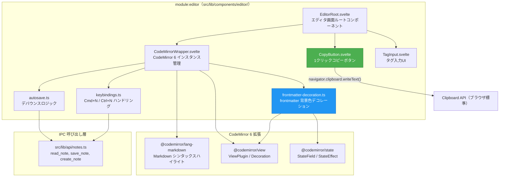
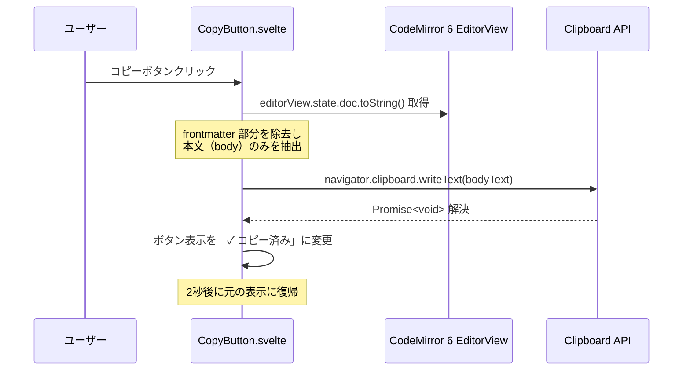
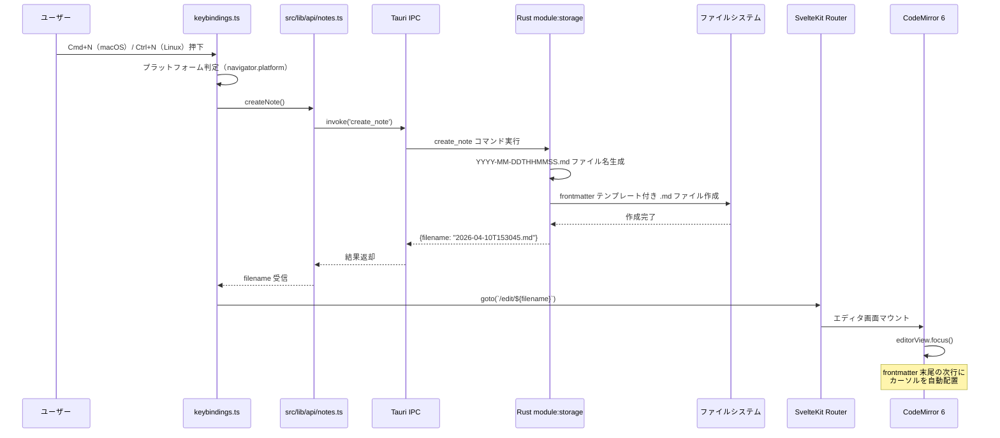
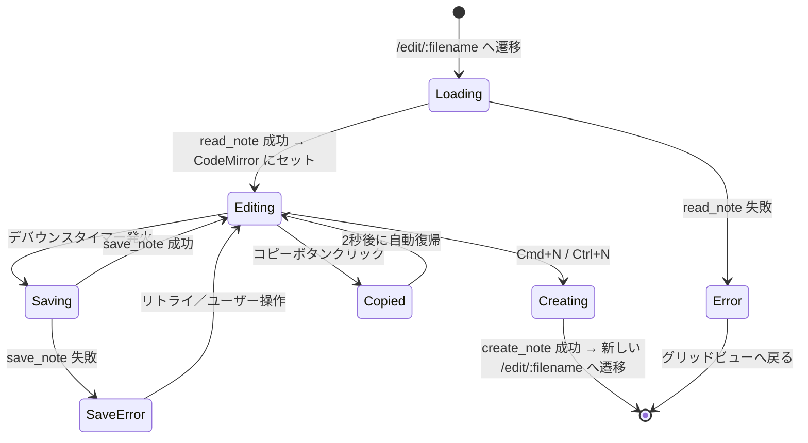
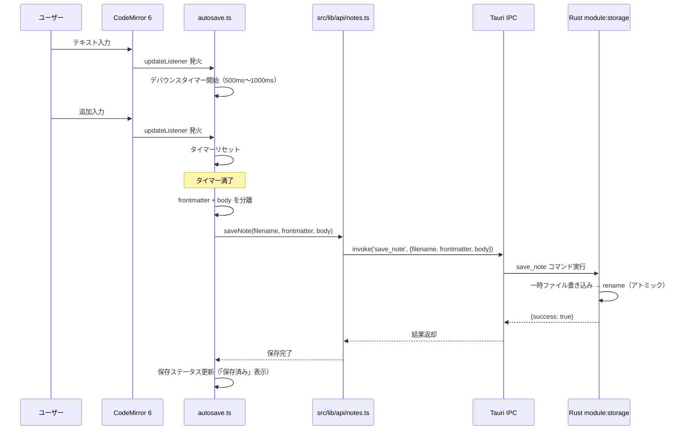

---
codd:
  node_id: detail:editor_clipboard
  type: design
  depends_on:
  - id: detail:component_architecture
    relation: depends_on
    semantic: technical
  depended_by:
  - id: plan:implementation_plan
    relation: depends_on
    semantic: technical
  conventions:
  - targets:
    - module:editor
    reason: CodeMirror 6 必須。Markdownシンタックスハイライトのみ（レンダリング禁止）。frontmatter領域は背景色で視覚的に区別必須。
  - targets:
    - module:editor
    reason: タイトル入力欄は禁止。本文のみのエディタ画面であること。
  - targets:
    - module:editor
    reason: 1クリックコピーボタンによる本文全体のクリップボードコピーはアプリの核心UX。未実装ならリリース不可。
  - targets:
    - module:editor
    reason: Cmd+N / Ctrl+N で即座に新規ノート作成しフォーカス移動必須。
  modules:
  - editor
---

# Editor & Clipboard Detailed Design

## 1. Overview

本設計書は、PromptNotes における `module:editor` のエディタ機能およびクリップボードコピー機能の詳細設計を定義する。エディタは CodeMirror 6 を基盤とし、Markdown シンタックスハイライト付きのプレーンテキスト編集のみを提供する。クリップボードへの 1 クリックコピーはアプリケーションの核心 UX であり、本設計書の中心的な対象である。

本設計書は以下のリリース不可制約（Non-negotiable conventions）に準拠する。

| 制約 ID | 対象 | 制約内容 | 本設計書での反映 |
|---|---|---|---|
| NNC-E1 | `module:editor` | CodeMirror 6 必須。Markdown シンタックスハイライトのみ（レンダリング禁止）。frontmatter 領域は背景色で視覚的に区別必須。 | §2 のエディタ構成図、§4 の CodeMirror 6 拡張構成、frontmatter デコレーション実装で反映。`@codemirror/lang-markdown` によるハイライトのみ許可し、HTML 要素（`<h1>`, `<strong>` 等）の生成を禁止する。 |
| NNC-E2 | `module:editor` | タイトル入力欄は禁止。本文のみのエディタ画面であること。 | §3 のエディタコンポーネント所有権で明示的に禁止。`<input>` や `<textarea>` によるタイトル専用フィールドを設置しない。ノートのタイトルは frontmatter 内の YAML フィールドとして本文中で編集する。 |
| NNC-E3 | `module:editor` | 1 クリックコピーボタンによる本文全体のクリップボードコピーはアプリの核心 UX。未実装ならリリース不可。 | §2 のコピーフローシーケンス図、§4 のコピーボタン実装仕様で反映。Clipboard API（`navigator.clipboard.writeText()`）を用いた即座コピーを実装する。 |
| NNC-E4 | `module:editor` | `Cmd+N` / `Ctrl+N` で即座に新規ノート作成しフォーカス移動必須。 | §2 の新規ノート作成シーケンス、§4 のキーバインド実装で反映。キー押下から CodeMirror 6 へのフォーカス移動までを一貫したフローとして定義する。 |

エディタ画面は SvelteKit ルート `/edit/:filename` に対応し、Tauri IPC 経由で `read_note`、`save_note`、`create_note` コマンドを呼び出す。フロントエンドからの直接ファイルシステムアクセスは設計上禁止されており（上位設計書 `component_architecture.md` の NNC-1 準拠）、すべてのファイル操作は Rust バックエンド経由で実行される。

対象プラットフォームは Linux および macOS である。ネットワーク通信は一切行わない。

## 2. Mermaid Diagrams

### 2.1 エディタコンポーネント内部構成



**所有権と境界**: `module:editor` 内の全コンポーネント・ユーティリティは `src/lib/components/editor/` ディレクトリに配置される。CodeMirror 6 のインスタンスライフサイクル（生成・破棄・拡張登録）は `CodeMirrorWrapper.svelte` が単独で所有する。コピーボタン（緑色）は `CopyButton.svelte` として独立コンポーネント化し、CodeMirror のドキュメント内容を受け取ってクリップボードに書き込む。frontmatter 背景色デコレーション（青色）は `frontmatter-decoration.ts` が ViewPlugin として実装し、`---` で囲まれた frontmatter 領域に CSS 背景色クラスを適用する。

IPC 呼び出しは `src/lib/api/notes.ts` に集約されており、エディタコンポーネントが `@tauri-apps/api/core` の `invoke()` を直接呼び出すことはない。これにより IPC コマンド名の変更がエディタ内部に波及しない。

### 2.2 1 クリックコピーフロー



**実装境界**: コピー対象は「本文全体」であり、frontmatter（`---` で囲まれた YAML ブロック）は除外する。frontmatter の開始・終了位置は CodeMirror のドキュメントテキストから正規表現 `/^---\n[\s\S]*?\n---\n/` で検出し、それ以降のテキストを本文として抽出する。コピー処理はブラウザ標準の Clipboard API（`navigator.clipboard.writeText()`）を使用し、Tauri の `clipboard-manager` プラグインは使用しない。これによりファイルシステム操作を伴わず、IPC を経由する必要がない。コピーボタンはエディタ画面の右上に固定配置し、1 クリックで即座にコピーが完了する。視覚フィードバック（「✓ コピー済み」表示）は 2 秒間維持した後、元の表示に戻す。

### 2.3 新規ノート作成とフォーカス移動フロー（Cmd+N / Ctrl+N）



**実装境界**: キーバインド検出は `keybindings.ts` が所有し、`document.addEventListener('keydown', ...)` でグローバルにリッスンする。`Cmd+N`（macOS）と `Ctrl+N`（Linux）の判定は `navigator.platform` または `navigator.userAgentData` を用いて行う。ファイル名生成は Rust 側 `module:storage` が排他的に所有し、フロントエンドはファイル名を生成しない。`create_note` コマンドの戻り値 `filename` を SvelteKit の `goto()` に渡してルーティング遷移し、エディタ画面マウント完了後に `editorView.focus()` でカーソルをエディタに移動する。カーソルの初期位置は frontmatter の終了 `---` の次行とし、ユーザーが即座に本文入力を開始できるようにする。

### 2.4 エディタ状態遷移



**状態所有権**: エディタの状態（`Loading`, `Editing`, `Saving`, `Error`, `Copied`, `Creating`, `SaveError`）は `EditorRoot.svelte` が Svelte のリアクティブ変数として管理する。CodeMirror 6 自体はドキュメント内容とカーソル位置を内部状態として持つが、保存状態やコピー状態はエディタコンポーネント側が所有する。`Saving` 状態ではエディタの編集は継続可能であり、保存完了を待たずにユーザーは入力を続けられる。

### 2.5 自動保存デバウンスフロー



**実装境界**: デバウンスロジックは `autosave.ts` が単独で所有する。デバウンス間隔は 500ms〜1000ms の範囲で設定し（OQ-CA-001 で最終決定）、`setTimeout` / `clearTimeout` パターンで実装する。`autosave.ts` は CodeMirror 6 の `EditorView.updateListener` 拡張として登録され、ドキュメント変更時にのみ発火する（カーソル移動のみでは発火しない）。frontmatter と body の分離はフロントエンド側で行い、Rust 側の `save_note` コマンドには分離済みのデータを渡す。

## 3. Ownership Boundaries

### 3.1 module:editor 内部の所有権マトリクス

| コンポーネント / ユーティリティ | ファイルパス | 所有する責務 | 禁止事項 |
|---|---|---|---|
| `EditorRoot.svelte` | `src/lib/components/editor/EditorRoot.svelte` | エディタ画面全体のレイアウト、状態管理（Loading/Editing/Saving/Error/Copied/Creating）、子コンポーネントの配置 | タイトル入力欄（`<input>`, `<textarea>`）の設置、Markdown レンダリング HTML 要素の生成 |
| `CodeMirrorWrapper.svelte` | `src/lib/components/editor/CodeMirrorWrapper.svelte` | CodeMirror 6 `EditorView` のライフサイクル管理（生成・破棄）、拡張の登録、ドキュメント内容の読み書き | CodeMirror 以外のエディタエンジンの使用、直接ファイルシステムアクセス |
| `CopyButton.svelte` | `src/lib/components/editor/CopyButton.svelte` | 1 クリックコピーボタンの UI 表示、クリップボード書き込み、視覚フィードバック（「✓ コピー済み」2 秒間表示） | Tauri `clipboard-manager` プラグインの使用（Clipboard API を使用する）、frontmatter を含めたコピー |
| `TagInput.svelte` | `src/lib/components/editor/TagInput.svelte` | タグの追加・削除 UI、frontmatter 内 `tags` フィールドとの双方向バインディング | `tags` 以外のメタデータフィールドの自動挿入 |
| `autosave.ts` | `src/lib/components/editor/autosave.ts` | 自動保存デバウンスロジック（タイマー管理、保存トリガー） | ファイルパスの解決、保存先ディレクトリの操作 |
| `keybindings.ts` | `src/lib/components/editor/keybindings.ts` | `Cmd+N` / `Ctrl+N` のグローバルキーバインド検出、`create_note` 呼び出しとルーティング遷移のオーケストレーション | ファイル名の生成（Rust 側 `module:storage` の責務） |
| `frontmatter-decoration.ts` | `src/lib/components/editor/frontmatter-decoration.ts` | CodeMirror 6 ViewPlugin として frontmatter 領域（`---` 〜 `---`）に背景色 CSS クラスを適用するデコレーション | frontmatter のパース・バリデーション（表示目的の範囲検出のみ行う） |

### 3.2 module:editor と他モジュールの境界

| 連携先モジュール | 連携方法 | module:editor 側の責務 | 連携先の責務 |
|---|---|---|---|
| `module:storage`（Rust） | IPC 経由 `read_note`, `save_note`, `create_note` | filename の指定、frontmatter/body の分離と送信、デバウンスによる保存頻度制御 | ファイル名生成（`YYYY-MM-DDTHHMMSS.md`）、パス解決、アトミック書き込み、frontmatter パース/シリアライズ |
| `module:shell`（Rust） | IPC コマンドディスパッチ | コマンド名と引数型の遵守 | `#[tauri::command]` ハンドラ登録、`AppState` 管理 |
| `module:grid` | SvelteKit ルーティング経由の画面遷移 | `/edit/:filename` での単一ノート編集 UI 提供 | グリッドビューからの `filename` パラメータ付き遷移 |
| `src/lib/api/notes.ts` | TypeScript 関数呼び出し | API 層の関数を呼び出し、`invoke()` を直接呼ばない | IPC コマンド呼び出しの抽象化、型安全なインターフェース提供 |

### 3.3 コピーボタンの単一所有者

コピーボタン（`CopyButton.svelte`）は `module:editor` が排他的に所有する。グリッドビュー（`module:grid`）からのコピー機能は現時点では提供しない。コピー対象テキストの取得元は CodeMirror 6 の `EditorView.state.doc` であり、`CopyButton.svelte` は親コンポーネント `EditorRoot.svelte` から `editorView` インスタンスへの参照を props として受け取る。

### 3.4 frontmatter デコレーションの単一所有者

frontmatter 領域の視覚的区別（背景色適用）は `frontmatter-decoration.ts` が単独で所有する。このモジュールは CodeMirror 6 の `ViewPlugin` として実装され、ドキュメント先頭の `---\n` から次の `\n---\n` までの範囲を検出し、`Decoration.line()` で CSS クラス `.cm-frontmatter-bg` を各行に適用する。背景色の具体的な CSS 値は `src/lib/styles/editor.css` に定義する（例: `background-color: rgba(59, 130, 246, 0.08)`）。

### 3.5 キーバインドの所有権分離

| キーバインド | 所有者 | スコープ |
|---|---|---|
| `Cmd+N` / `Ctrl+N`（新規ノート作成） | `keybindings.ts` | グローバル（`document` レベル） |
| CodeMirror 標準キーバインド（Undo, Redo, 選択等） | CodeMirror 6 内蔵 `keymap` | エディタフォーカス中のみ |
| `Cmd+S` / `Ctrl+S`（手動保存） | `autosave.ts`（デバウンスをバイパスして即時保存） | エディタフォーカス中のみ |

`Cmd+N` / `Ctrl+N` はグローバルキーバインドとして `document.addEventListener('keydown', ...)` で登録するため、エディタ画面以外（グリッドビュー、設定画面）からも新規ノート作成が可能である。ブラウザのデフォルト動作（新規ウィンドウを開く等）は `event.preventDefault()` で抑制する。

## 4. Implementation Implications

### 4.1 CodeMirror 6 拡張構成

`CodeMirrorWrapper.svelte` の `onMount` で以下の拡張を登録する。

```typescript
import { EditorView, keymap } from '@codemirror/view';
import { EditorState } from '@codemirror/state';
import { markdown, markdownLanguage } from '@codemirror/lang-markdown';
import { defaultKeymap, history, historyKeymap } from '@codemirror/commands';
import { syntaxHighlighting, defaultHighlightStyle } from '@codemirror/language';
import { frontmatterDecoration } from './frontmatter-decoration';
import { createAutoSaveExtension } from './autosave';

const extensions = [
  markdown({ base: markdownLanguage }),
  syntaxHighlighting(defaultHighlightStyle),
  frontmatterDecoration(),          // NNC-E1: frontmatter 背景色
  createAutoSaveExtension(filename), // 自動保存デバウンス
  keymap.of([...defaultKeymap, ...historyKeymap]),
  history(),
  EditorView.lineWrapping,
];
```

**NNC-E1 準拠**: `@codemirror/lang-markdown` パッケージによるシンタックスハイライトのみを使用する。`markdown-it` や `remark` 等のレンダリングエンジンは導入しない。CodeMirror のドキュメントはプレーンテキストとして表示され、Markdown 構文（`#`, `**`, `- ` 等）はハイライト色で視覚的に区別されるが、HTML 要素には変換されない。

**NNC-E2 準拠**: エディタ画面には `<input>` や `<textarea>` によるタイトル入力欄を設置しない。ノートのタイトルは frontmatter YAML 内の `title` フィールドとして、CodeMirror エディタ内で本文と同一のインターフェースで編集する。

### 4.2 frontmatter 背景色デコレーション実装

```typescript
// frontmatter-decoration.ts
import { ViewPlugin, Decoration, DecorationSet, EditorView } from '@codemirror/view';

const frontmatterLineDeco = Decoration.line({ class: 'cm-frontmatter-bg' });

export function frontmatterDecoration() {
  return ViewPlugin.fromClass(
    class {
      decorations: DecorationSet;
      constructor(view: EditorView) {
        this.decorations = this.buildDecorations(view);
      }
      update(update: any) {
        if (update.docChanged || update.viewportChanged) {
          this.decorations = this.buildDecorations(update.view);
        }
      }
      buildDecorations(view: EditorView): DecorationSet {
        const doc = view.state.doc.toString();
        if (!doc.startsWith('---\n')) return Decoration.none;
        const endIndex = doc.indexOf('\n---\n', 4);
        if (endIndex === -1) return Decoration.none;
        const endPos = endIndex + 4; // '\n---\n'.length - 1 for line end
        const widgets: any[] = [];
        for (let pos = 0; pos <= endPos; ) {
          const line = view.state.doc.lineAt(pos);
          widgets.push(frontmatterLineDeco.range(line.from));
          pos = line.to + 1;
        }
        return Decoration.set(widgets);
      }
    },
    { decorations: (v) => v.decorations }
  );
}
```

**NNC-E1 準拠**: frontmatter 領域（ドキュメント先頭の `---` から次の `---` まで）に `.cm-frontmatter-bg` CSS クラスを適用し、背景色で視覚的に区別する。CSS 定義は以下のとおり。

```css
/* src/lib/styles/editor.css */
.cm-frontmatter-bg {
  background-color: rgba(59, 130, 246, 0.08);
}
```

### 4.3 コピーボタン実装

```svelte
<!-- CopyButton.svelte -->
<script lang="ts">
  import type { EditorView } from '@codemirror/view';

  export let editorView: EditorView;

  let copied = false;
  let timer: ReturnType<typeof setTimeout> | null = null;

  function extractBody(doc: string): string {
    const match = doc.match(/^---\n[\s\S]*?\n---\n/);
    return match ? doc.slice(match[0].length) : doc;
  }

  async function handleCopy() {
    const fullText = editorView.state.doc.toString();
    const body = extractBody(fullText);
    await navigator.clipboard.writeText(body);
    copied = true;
    if (timer) clearTimeout(timer);
    timer = setTimeout(() => { copied = false; }, 2000);
  }
</script>

<button
  class="copy-button"
  on:click={handleCopy}
  aria-label="本文をコピー"
>
  {copied ? '✓ コピー済み' : 'コピー'}
</button>
```

**NNC-E3 準拠**: 1 クリックで本文全体（frontmatter 除外）をクリップボードにコピーする。`navigator.clipboard.writeText()` は HTTPS コンテキストまたは `localhost` で動作し、Tauri の WebView 環境ではセキュアコンテキストとして扱われるため利用可能である。Tauri の `clipboard-manager` プラグインは使用せず、ブラウザ標準 API のみで実装する。コピーボタンはエディタ画面右上に常時表示し、視認性と到達性を確保する。

### 4.4 Cmd+N / Ctrl+N キーバインド実装

```typescript
// keybindings.ts
import { goto } from '$app/navigation';
import { createNote } from '$lib/api/notes';

const isMac = navigator.platform.toUpperCase().indexOf('MAC') >= 0;

export function registerGlobalKeybindings() {
  const handler = async (e: KeyboardEvent) => {
    if ((isMac ? e.metaKey : e.ctrlKey) && e.key === 'n') {
      e.preventDefault();
      const { filename } = await createNote();
      await goto(`/edit/${filename}`);
      // フォーカス移動は EditorRoot.svelte の onMount で実行
    }
  };
  document.addEventListener('keydown', handler);
  return () => document.removeEventListener('keydown', handler);
}
```

**NNC-E4 準拠**: `Cmd+N`（macOS）/ `Ctrl+N`（Linux）で即座に新規ノート作成を開始する。`event.preventDefault()` でブラウザデフォルト動作を抑制する。`create_note` IPC コマンドで Rust 側がファイル名を生成し、フロントエンドは戻り値の `filename` で `/edit/:filename` へ遷移する。遷移先の `EditorRoot.svelte` は `onMount` で `editorView.focus()` を呼び出し、frontmatter 終了行の次行にカーソルを配置する。キー押下からフォーカス移動までの応答時間は、ファイル作成の I/O を含めて体感上即座（200ms 以内）を目標とする。

### 4.5 自動保存デバウンスの実装パターン

`autosave.ts` は CodeMirror 6 の `EditorView.updateListener` 拡張として実装する。

```typescript
// autosave.ts
import { EditorView } from '@codemirror/view';
import { saveNote } from '$lib/api/notes';

const DEBOUNCE_MS = 750; // OQ-CA-001 で最終調整

export function createAutoSaveExtension(filename: string) {
  let timer: ReturnType<typeof setTimeout> | null = null;

  return EditorView.updateListener.of((update) => {
    if (!update.docChanged) return;
    if (timer) clearTimeout(timer);
    timer = setTimeout(async () => {
      const doc = update.view.state.doc.toString();
      const { frontmatter, body } = parseFrontmatterAndBody(doc);
      await saveNote(filename, frontmatter, body);
    }, DEBOUNCE_MS);
  });
}
```

デバウンス間隔の初期値は 750ms とし、OQ-CA-001 のユーザーテスト結果に基づいて 500ms〜1000ms の範囲で最終調整する。

### 4.6 IPC 呼び出し層（notes.ts）のエディタ関連 API

```typescript
// src/lib/api/notes.ts
import { invoke } from '@tauri-apps/api/core';
import type { NoteMetadata, Frontmatter } from '$lib/types/note';

export async function createNote(): Promise<{ filename: string }> {
  return invoke('create_note');
}

export async function readNote(filename: string): Promise<{ frontmatter: Frontmatter; body: string }> {
  return invoke('read_note', { filename });
}

export async function saveNote(filename: string, frontmatter: Frontmatter, body: string): Promise<{ success: boolean }> {
  return invoke('save_note', { filename, frontmatter, body });
}
```

エディタコンポーネントは `invoke()` を直接使用せず、この API 層を経由する。`filename` のみを指定し、フルパスの解決は Rust バックエンド（`module:storage`）に委譲する。

### 4.7 エディタ画面のレイアウト構成

```
┌─────────────────────────────────────────┐
│  ← 戻る                    [コピー] ボタン │  ← ヘッダーバー
├─────────────────────────────────────────┤
│  ---                                     │  ← frontmatter 領域
│  title: "メモタイトル"                     │    （背景色で視覚的区別）
│  tags: [prompt, gpt]                     │
│  ---                                     │
│                                          │
│  本文テキスト...                           │  ← 本文領域
│  ## セクション                             │    （Markdown ハイライト）
│  - リスト項目                              │
│                                          │
│                                          │
│                                          │
├─────────────────────────────────────────┤
│  タグ入力: [prompt] [gpt] [+追加]         │  ← TagInput コンポーネント
└─────────────────────────────────────────┘
```

- タイトル入力欄は存在しない（NNC-E2 準拠）。タイトルは frontmatter 内の `title` フィールドとして編集する。
- コピーボタンはヘッダーバー右端に配置し、常時アクセス可能とする（NNC-E3 準拠）。
- frontmatter 領域は `.cm-frontmatter-bg` クラスによる背景色で区別する（NNC-E1 準拠）。
- CodeMirror 6 エディタはヘッダーバーとタグ入力の間の全領域を占有し、`EditorView.lineWrapping` による折り返し表示を有効にする。

### 4.8 E2E テストケース

Playwright による E2E テストで以下のエディタ固有テストケースを実装する。

| テストケース | 検証内容 | 対応する NNC |
|---|---|---|
| `editor-copy.spec.ts` | コピーボタンクリックで本文（frontmatter 除外）がクリップボードに書き込まれること | NNC-E3 |
| `editor-copy.spec.ts` | コピー後に「✓ コピー済み」表示が 2 秒間表示されること | NNC-E3 |
| `editor-new-note.spec.ts` | `Cmd+N` / `Ctrl+N` で新規ノートが作成され、エディタにフォーカスが移動すること | NNC-E4 |
| `editor-frontmatter.spec.ts` | frontmatter 領域に背景色クラス `.cm-frontmatter-bg` が適用されていること | NNC-E1 |
| `editor-no-title-input.spec.ts` | エディタ画面にタイトル専用の `input` / `textarea` が存在しないこと | NNC-E2 |
| `editor-no-render.spec.ts` | エディタ本文領域に `<h1>`, `<strong>`, `<em>` 等のレンダリング済み HTML 要素が存在しないこと | NNC-E1 |
| `editor-autosave.spec.ts` | テキスト入力後、デバウンス時間経過後に `save_note` IPC が発行されること | 自動保存機能 |

### 4.9 パフォーマンス目標

| 操作 | 目標応答時間 | 測定方法 |
|---|---|---|
| `Cmd+N` / `Ctrl+N` → エディタフォーカス移動 | 200ms 以内 | キー押下イベントから `editorView.focus()` 完了までの経過時間 |
| コピーボタンクリック → クリップボード書き込み完了 | 50ms 以内 | クリックイベントから `navigator.clipboard.writeText()` の Promise 解決まで |
| 自動保存（デバウンス発火後） | 100ms 以内（I/O 含む） | `save_note` IPC 呼び出しから結果返却まで |
| エディタ画面初回ロード（`read_note` + CodeMirror マウント） | 300ms 以内 | ルーティング遷移開始からエディタ表示完了まで |

## 5. Open Questions

| ID | 質問 | 影響範囲 | 解決トリガー |
|---|---|---|---|
| OQ-EC-001 | コピーボタンクリック時のフィードバックとして、「✓ コピー済み」テキスト表示に加えてツールチップやトースト通知を追加するか。現設計ではボタンテキスト変更（2 秒間）のみ。 | `CopyButton.svelte` | UI プロトタイプでのユーザーテスト |
| OQ-EC-002 | frontmatter 背景色の具体的な色値（現設計: `rgba(59, 130, 246, 0.08)`）をダークモード対応時にどう切り替えるか。現時点ではライトテーマのみ。 | `frontmatter-decoration.ts`, `editor.css` | ダークモード対応の設計開始時 |
| OQ-EC-003 | `Cmd+S` / `Ctrl+S` による手動保存を実装するか。自動保存のみで十分と判断する場合は不要だが、ユーザーの保存習慣を考慮すると実装が望ましい可能性がある。 | `autosave.ts`, `keybindings.ts` | ユーザーテスト時のフィードバック |
| OQ-EC-004 | コピー対象を「frontmatter を除いた本文全体」から「ユーザー選択テキスト（選択がある場合）」に拡張するか。選択テキストコピーは OS 標準の `Cmd+C` / `Ctrl+C` で既に可能であるため、1 クリックコピーボタンは本文全体コピーに専念する方針で進めるか。 | `CopyButton.svelte` | 核心 UX レビュー時 |
| OQ-EC-005 | タグ入力 UI（`TagInput.svelte`）の変更を frontmatter に反映する際、CodeMirror のドキュメントを直接編集するか、保存時に frontmatter を再構築するか。前者はリアルタイム反映だが CodeMirror トランザクション管理が複雑化する。 | `TagInput.svelte`, `autosave.ts` | エディタコンポーネント実装開始時 |
