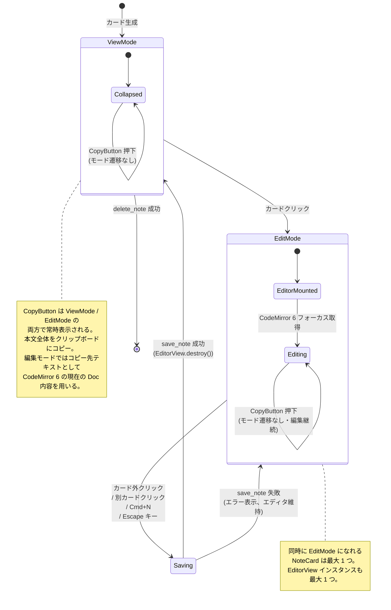
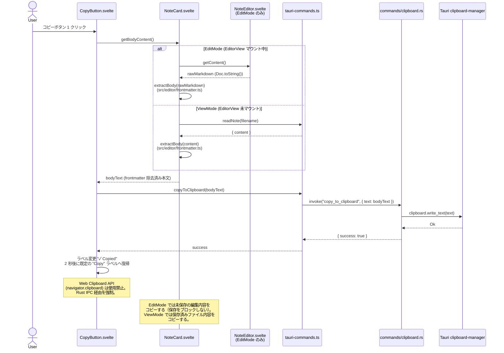
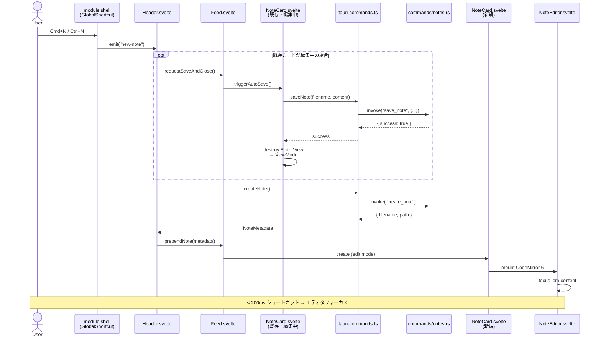
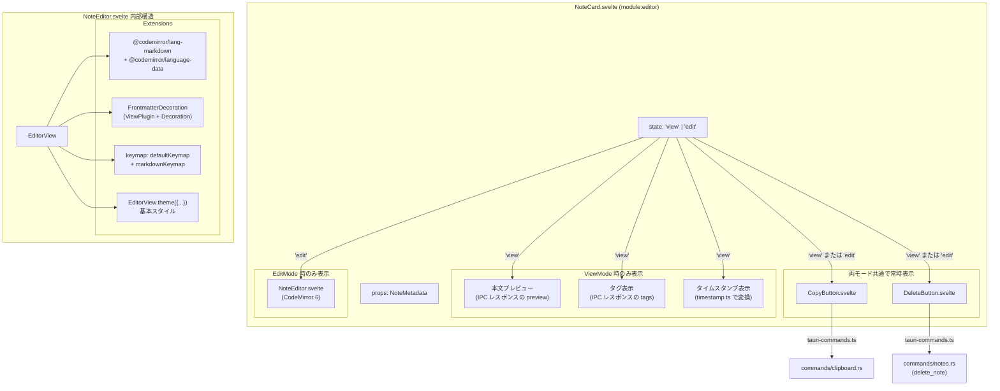

---
codd:
  node_id: detail:editor_clipboard
  type: design
  depends_on:
  - id: detail:component_architecture
    relation: depends_on
    semantic: technical
  depended_by:
  - id: plan:implementation_plan
    relation: depends_on
    semantic: technical
  conventions:
  - targets:
    - module:editor
    reason: CodeMirror 6 必須。Markdownシンタックスハイライトのみ（レンダリング禁止）。frontmatter領域は背景色で視覚的に区別必須。
  - targets:
    - module:editor
    reason: タイトル入力欄は禁止。本文のみのエディタ画面であること。
  - targets:
    - module:editor
    reason: 1クリックコピーボタンによる本文全体のクリップボードコピーはアプリの核心UX。未実装ならリリース不可。
  - targets:
    - module:editor
    reason: Cmd+N / Ctrl+N で即座に新規ノート作成しフォーカス移動必須。
  modules:
  - editor
---

# Editor & Clipboard Detailed Design

## 1. Overview

本設計書は PromptNotes の `module:editor` に属するエディタおよびクリップボード機能の詳細設計を定義する。上流の Component Architecture（detail:component_architecture）で規定されたコンポーネント分割・IPC 境界・所有権ルールを前提に、CodeMirror 6 エディタの内部構造、frontmatter 領域の視覚区別、1 クリックコピー、新規ノート作成ショートカット、自動保存トリガーの各機能を実装可能な粒度で設計する。

### 対象コンポーネント

| コンポーネント | ファイルパス | 責務 |
|---|---|---|
| `NoteCard.svelte` | `src/editor/NoteCard.svelte` | 表示/編集モードの切り替え制御、自動保存トリガー発火、`NoteEditor` / `CopyButton` / `DeleteButton` のコンテナ |
| `NoteEditor.svelte` | `src/editor/NoteEditor.svelte` | CodeMirror 6 インスタンスのライフサイクル管理、Markdown シンタックスハイライト、frontmatter 背景色装飾 |
| `CopyButton.svelte` | `src/editor/CopyButton.svelte` | 本文全体の 1 クリッククリップボードコピー、視覚フィードバック |
| `DeleteButton.svelte` | `src/editor/DeleteButton.svelte` | ノート削除 UI |
| `frontmatter.ts` | `src/editor/frontmatter.ts` | フロントエンド側の body 意味論実装（編集モードのコピー操作専用、ADR-008 準拠）。`extractBody` は読み取り、`generateNoteContent` は再構築を担当 |

### リリースブロッキング制約への準拠

本設計書は以下の 4 つの非交渉条件を全セクションにわたって反映する。

| # | 制約 | 準拠方法 |
|---|---|---|
| 1 | CodeMirror 6 必須。Markdown シンタックスハイライトのみ（レンダリング禁止）。frontmatter 領域は背景色で視覚的に区別必須。 | §2 の状態図および §4 で `NoteEditor.svelte` の拡張構成を規定し、`@codemirror/lang-markdown` によるハイライトのみを許可。`ViewPlugin` + `Decoration` による frontmatter 背景色装飾を必須実装として定義する。Markdown の HTML レンダリング / プレビューモードは一切実装しない。 |
| 2 | タイトル入力欄は禁止。本文のみのエディタ画面であること。 | §4 で `NoteEditor.svelte` の DOM 構造を規定し、`<input>` / `<textarea>` 等のタイトル専用フィールドを持たないことを明記する。エディタ領域は CodeMirror 6 の `.cm-editor` 単体で構成する。 |
| 3 | 1 クリックコピーボタンによる本文全体のクリップボードコピーはアプリの核心 UX。表示モード・編集モードの両方で常時利用可能であること。未実装ならリリース不可。 | §2 のシーケンス図および §4 で `CopyButton.svelte` → `tauri-commands.ts` → `commands/clipboard.rs` → Tauri `clipboard-manager` プラグインの一貫した IPC フローを定義する。`CopyButton` は ViewMode / EditMode の双方で描画し、モード遷移でアンマウントされないことを §4 の DOM 構造で規定する。Web Clipboard API (`navigator.clipboard`) の使用は禁止し、Rust バックエンド経由を強制する。 |
| 4 | Cmd+N / Ctrl+N で即座に新規ノート作成しフォーカス移動必須。 | §2 のシーケンス図で `module:shell` の `GlobalShortcut` → `Header.svelte` → IPC `create_note` → `NoteCard` 編集モード → CodeMirror 6 フォーカスまでの全経路を定義する。200ms 以内の完了を §4 のパフォーマンス制約として規定する。 |

## 2. Mermaid Diagrams

### 2.1 NoteCard 状態遷移図



**所有権と実装境界の説明:**

`NoteCard.svelte` は表示モード（ViewMode）と編集モード（EditMode）の 2 状態を管理するステートマシンである。状態遷移の制御は `NoteCard.svelte` が単一所有者として担い、`Feed.svelte` や他のコンポーネントが直接状態を操作することはない。

同時に編集モードになれる `NoteCard` は最大 1 つであり、この不変条件は `Feed.svelte` が `editingNoteId: string | null` を管理することで強制する。あるカードが編集モードに遷移するとき、`Feed.svelte` は既存の編集中カードに対して自動保存 → ViewMode 遷移を指示してから、新しいカードの EditMode 遷移を許可する。

`CopyButton` は **ViewMode / EditMode のどちらでも常時表示される**。`NoteCard.svelte` は `{#if editing}` / `{:else}` 分岐の外側（モード共通領域）に `CopyButton` を配置し、モード遷移によってアンマウントされないことを保証する。編集モードでは CodeMirror 6 の選択範囲コピー（OS 標準の Cmd+C / Ctrl+C）と 1 クリックコピーが併存するが、両者は役割が異なる（部分選択 vs 本文全体）ため競合しない。編集モード時のコピー対象テキストは CodeMirror 6 の現在の `EditorView.state.doc` 内容（frontmatter 除去後）とし、表示モード時は `read_note` で取得した保存済みファイル内容（frontmatter 除去後）とする。

### 2.2 クリップボードコピー シーケンス図



**所有権と実装境界の説明:**

クリップボードコピーの IPC フローは `CopyButton.svelte` → `tauri-commands.ts` → `commands/clipboard.rs` → Tauri `clipboard-manager` プラグインの 4 段階で構成される。フロントエンドが `navigator.clipboard` API を直接呼び出すことは禁止であり、この制約は ESLint ルール `no-restricted-globals` で `navigator.clipboard` を禁止することで構造的に強制する。

`CopyButton.svelte` がコピー対象とするのは **frontmatter を除去した本文テキスト** である。frontmatter の除去は `src/editor/frontmatter.ts` の `extractBody(rawMarkdown): string` 関数で実行する。この関数は ADR-008 の body 意味論に従い、閉じフェンス `---\n` 直後の区切り `\n` 1 つを body に含めない形で本文を返す。

ソース Markdown の取得元はモードによって異なる。`NoteCard.svelte` が `getBodyContent()` の内部で以下のように分岐する。

- **EditMode**: `NoteEditor.getContent()`（`EditorView.state.doc.toString()`）を呼び出し、未保存の最新 Doc 内容を取得する。このパスは `read_note` IPC を経由しないため、コピー操作は自動保存を誘発せず編集状態も維持する。これは detail:component_architecture §3.1 で `src/editor/frontmatter.ts` を編集モードのコピー操作専用と定義した用途に一致する。
- **ViewMode**: `read_note` IPC で保存済みファイル内容を読み取る。EditorView は存在しないため、ファイルが単一信頼源となる。

両経路とも、最終的に `extractBody()` を通してから `copyToClipboard()` に渡す。

`commands/clipboard.rs` は `module:shell` の所有であり、`module:editor` はこのコマンドの利用者である。`CopyButton.svelte` は `tauri-commands.ts` の `copyToClipboard(text: string): Promise<void>` 関数のみをインポートし、Rust 側の実装詳細を知らない。

### 2.3 新規ノート作成 → エディタフォーカス シーケンス図



**所有権と実装境界の説明:**

Cmd+N / Ctrl+N ショートカットは `module:shell` が `tauri-plugin-global-shortcut` を通じて登録し、`new-note` イベントを `Header.svelte` に emit する。`Header.svelte` はイベントを受信して `tauri-commands.ts` 経由で `create_note` IPC を発行する。

既存カードが編集中の場合は、新規ノート作成前に自動保存 → EditorView 破棄 → ViewMode 遷移を実行する。この前処理を含めても 200ms 以内を目標とする。`create_note` コマンドは固定文字列 `"---\ntags: []\n---\n\n"` を書き込む同期処理であるため、IPC のラウンドトリップ時間を含めても 50ms 以内に完了する。

CodeMirror 6 の初期化は最小拡張セットで実行する。カーソルはドキュメント末尾（`doc.length`）に配置し、フォーカスは `EditorView` の `focus()` メソッドで `.cm-content` に移動する。これにより新規ノート（Body 空）・既存ノートを問わず、ユーザーは Body 末尾から即座に入力を開始できる（AC-EDIT-13）。カーソル位置は `EditorView.destroy()` で揮発し、再編集時は毎回末尾にリセットされる。

### 2.4 エディタ内部コンポーネント構造図



**所有権と実装境界の説明:**

`NoteCard.svelte` はエディタモジュールのルートコンテナであり、`NoteEditor.svelte`、`CopyButton.svelte`、`DeleteButton.svelte` を子コンポーネントとして保持する。各子コンポーネントは `NoteCard.svelte` からのみインスタンス化され、`Feed.svelte` や `Header.svelte` が直接生成することはない。

ViewMode におけるタグ表示と本文プレビューは、`list_notes` / `read_note` IPC レスポンスに含まれるパース済み構造化データ（`NoteMetadata.tags`, `NoteMetadata.preview`）をそのまま使用する。フロントエンドが frontmatter を独自に再パースすることはなく、この分担は detail:component_architecture §3.3 の所有権ルールに従う。

`NoteEditor.svelte` 内部の CodeMirror 6 拡張は 4 つの要素で構成される。このうち `FrontmatterDecoration` は本設計書固有の実装であり、他の拡張は CodeMirror 6 標準パッケージからインポートする。タイトル入力欄は存在せず、エディタ領域は `EditorView` 単体で構成される。

## 3. Ownership Boundaries

### 3.1 モジュール内所有権

`module:editor` 内の各コンポーネントが所有する責務を以下に定義する。

| コンポーネント | 単一所有する責務 | 禁止事項 |
|---|---|---|
| `NoteCard.svelte` | 表示/編集モード切り替え、自動保存トリガー発火、子コンポーネントへの `NoteMetadata` 供給 | IPC コマンドの直接呼び出し（`tauri-commands.ts` 経由を強制）、frontmatter の書き込み正規化 |
| `NoteEditor.svelte` | CodeMirror 6 インスタンスのライフサイクル（生成・破棄）、Markdown シンタックスハイライト拡張の構成、frontmatter 背景色装飾の適用 | Markdown の HTML レンダリング / プレビュー、タイトル入力欄の実装、`invoke` の直接呼び出し |
| `CopyButton.svelte` | 1 クリックコピー UI、コピー成功/失敗の視覚フィードバック（ラベル変化） | `navigator.clipboard` API の使用、frontmatter を含むテキストのコピー |
| `DeleteButton.svelte` | 削除操作 UI、ゴミ箱移動失敗時の完全削除確認ダイアログ表示 | ファイルシステムへの直接アクセス |
| `src/editor/frontmatter.ts` | **編集モードのコピー操作 / ViewMode コピー時の `readNote()` レスポンス整形専用**の body 抽出 (`extractBody`) と本文再構築 (`generateNoteContent`)。ADR-008 body 意味論の TypeScript 本番実装。**公開 API はこの 2 関数のみ**（内部ヘルパーは export しない） | IPC レスポンス (`list_notes` / `search_notes` の `NoteMetadata`) の frontmatter 再解析、ファイル I/O 経路での利用（Rust 側 `storage/frontmatter.rs` が排他所有）、`parseTags` 等の内部実装の外部利用 |

### 3.2 モジュール間の依存と所有権境界

`module:editor` は他モジュールが所有する以下のリソースに依存する。再実装ドリフトを防止するため、インポートのみを許可し、同等機能の再実装を禁止する。

| 依存先 | 所有モジュール | `module:editor` の利用方法 | 禁止事項 |
|---|---|---|---|
| `tauri-commands.ts` | `module:shell`（API 定義管理） | `saveNote()`, `deleteNote()`, `forceDeleteNote()`, `copyToClipboard()`, `readNote()`, `createNote()` をインポートして呼び出し | `invoke` の直接呼び出し、新しい IPC ラッパーの独自定義 |
| `timestamp.ts` | `module:storage`（フォーマット仕様決定） | `filenameToDate(filename): Date` をインポートしてタイムスタンプ表示に使用 | ファイル名パースロジックの再実装 |
| `notes.ts` store | `module:feed` | ノート一覧データの購読（`$notes` による reactive 参照） | ストアへの直接書き込み（書き込みは `Feed.svelte` 経由で `module:feed` が制御） |
| `commands/clipboard.rs` | `module:shell` | `copy_to_clipboard` IPC コマンドの利用（`tauri-commands.ts` 経由） | クリップボードプラグインの直接呼び出し |
| `commands/notes.rs` | `module:storage` | `save_note`, `delete_note`, `force_delete_note`, `read_note`, `create_note` IPC コマンドの利用 | ファイル CRUD の独自実装 |
| `NoteMetadata` / `TauriCommandError` 型 | `module:storage` / 共有（`tauri-commands.ts`） | 型のインポートのみ | 型の再定義、フィールド追加 |

### 3.3 frontmatter 処理における所有権分離（ADR-008 準拠）

frontmatter の処理は Rust 側と TypeScript 側で責務を明確に分離し、detail:component_architecture §3.3 の所有権ルールに厳密に従う。

| レイヤー | ファイル | 所有モジュール | 操作対象 | 用途 |
|---|---|---|---|---|
| バックエンド | `src-tauri/src/storage/frontmatter.rs` | `module:storage` | **ファイル I/O に伴う**パース / シリアライズ / 正規化 (`parse` / `reassemble`) | `save_note`, `read_note`, `list_notes`, `search_notes` の内部処理（**source of truth**） |
| フロントエンド | `src/editor/frontmatter.ts` | `module:editor` | **CodeMirror 6 の未保存テキスト**からの body 抽出 (`extractBody`) と本文再構築 (`generateNoteContent`) | 編集モードでの `CopyButton` によるコピー操作 **のみ** |

**重要な禁止事項:**

1. `src/editor/frontmatter.ts` は **IPC レスポンスのパース用途には使用しない**。`list_notes` / `read_note` のレスポンスはすでに Rust 側で構造化されているため、タグ・プレビュー・本文は `NoteMetadata` のフィールドをそのまま利用する。
2. `saveNote()` に渡すのは CodeMirror 6 から取得した生の Markdown テキスト全体であり、フロントエンド側で frontmatter を組み立てて保存することは禁止である。
3. ViewMode での `CopyButton` は `readNote()` で取得したファイル内容に対して `extractBody()` を適用する。この場合も body 意味論は ADR-008 に準拠する。

**body 意味論の統一（ADR-008 準拠）:** フロントエンド側 `src/editor/frontmatter.ts` の `extractBody` とバックエンド側 `src-tauri/src/storage/frontmatter.rs` の `parse` は、body の範囲について同一の意味論に従う。すなわち body には「frontmatter 閉じフェンス `---\n` とその直後の区切り `\n` 1 つ」を含めない。例えば入力 `---\ntags: []\n---\n\nHello` に対して、両実装とも body = `"Hello"` を返す（先頭の `\n` を含まない）。本文生成側（Rust の `reassemble`、TS の `generateNoteContent`）は frontmatter と body の間に空行 1 行（区切り `\n` 1 つ）を挿入する責務を負い、body 空時は末尾 `\n` を残す。往復冪等性（`parse → serialize → parse` で `(tags, body)` が変化しない）を両実装の不変条件として保ち、`tests/unit/frontmatter.test.ts` と Rust `#[cfg(test)] mod tests` の双方で検証する。詳細は ADR-008 および detail:component_architecture §4.11 を参照。

### 3.4 CopyButton のコピー対象テキスト所有権

`CopyButton.svelte` がクリップボードにコピーするテキストは **frontmatter を除去した本文** である。除去ロジックは `src/editor/frontmatter.ts` の `extractBody()` 関数が単一所有する。

```
extractBody(rawMarkdown: string): string
```

この関数は ADR-008 の body 意味論に従い、先頭の `---\n...\n---\n` ブロックとその直後の区切り `\n` 1 つを除去し、残りの本文テキストを返す。frontmatter が存在しない場合は入力テキストをそのまま返す。`CopyButton.svelte` はこの関数の戻り値を `copyToClipboard()` に渡し、独自の文字列加工を行わない。

## 4. Implementation Implications

### 4.1 CodeMirror 6 拡張構成

`NoteEditor.svelte` の `EditorView` は以下の拡張セットで初期化する。

```typescript
import { EditorView, keymap } from "@codemirror/view";
import { EditorState } from "@codemirror/state";
import { markdown, markdownLanguage } from "@codemirror/lang-markdown";
import { languages } from "@codemirror/language-data";
import { defaultKeymap, history, historyKeymap } from "@codemirror/commands";
import { syntaxHighlighting, defaultHighlightStyle } from "@codemirror/language";
import { frontmatterDecoration } from "./frontmatter-decoration";

const extensions = [
  history(),
  markdown({ base: markdownLanguage, codeLanguages: languages }),
  syntaxHighlighting(defaultHighlightStyle),
  keymap.of([
    { key: "Escape", run: exitEditMode },
    ...defaultKeymap,
    ...historyKeymap,
  ]),
  frontmatterDecoration(),
  EditorView.theme({
    "&": { height: "100%", fontSize: "14px" },
    ".cm-content": { fontFamily: "monospace", padding: "12px" },
    ".cm-focused": { outline: "none" },
  }),
  EditorView.lineWrapping,
];
```

**Undo/Redo サポート (AC-EDIT-XX / requirements):** `history()` 拡張と `historyKeymap` を必須とする。これにより `Cmd+Z` / `Ctrl+Z` で元に戻し、`Cmd+Shift+Z` / `Ctrl+Y` でやり直しが可能。ブラウザ標準の contentEditable Undo 挙動に頼らず、CodeMirror 6 の履歴管理を正規の仕組みとする。

**Escape キーによる編集終了:** `Escape` キーを押下すると現在の Doc を保存して ViewMode に戻る（詳細は §4.6 自動保存参照）。この挙動は `defaultKeymap` の前段にバインドし、CodeMirror 標準コマンドが上書きしないようにする。

**禁止される拡張:**
- `@codemirror/lang-html` やその他の HTML レンダリング関連拡張
- Markdown プレビュー / WYSIWYG プラグイン
- リッチテキスト装飾（太字・イタリックのインラインレンダリング）

本設計は制約 1「Markdown シンタックスハイライトのみ（レンダリング禁止）」に準拠する。CodeMirror 6 はプレーンテキストエディタとして機能し、Markdown 構文要素（`#`, `**`, `` ` `` 等）をシンタックスハイライトで色分け表示するのみとする。

### 4.2 frontmatter 背景色装飾の実装

frontmatter 領域（`---` 〜 `---`）を視覚的に区別するため、`ViewPlugin` と `Decoration` を組み合わせたカスタム拡張を実装する。

```typescript
import { ViewPlugin, Decoration, DecorationSet, EditorView, ViewUpdate } from "@codemirror/view";

const frontmatterMark = Decoration.line({ class: "cm-frontmatter-line" });

const frontmatterDecoration = () => ViewPlugin.fromClass(
  class {
    decorations: DecorationSet;

    constructor(view: EditorView) {
      this.decorations = this.buildDecorations(view);
    }

    update(update: ViewUpdate) {
      if (update.docChanged || update.viewportChanged) {
        this.decorations = this.buildDecorations(update.view);
      }
    }

    buildDecorations(view: EditorView): DecorationSet {
      const doc = view.state.doc;
      const text = doc.toString();
      const match = text.match(/^---\n[\s\S]*?\n---/);
      if (!match) return Decoration.none;

      const endPos = match[0].length;
      const decorations = [];

      for (let pos = 0; pos <= endPos; ) {
        const line = doc.lineAt(pos);
        decorations.push(frontmatterMark.range(line.from));
        pos = line.to + 1;
      }

      return Decoration.set(decorations);
    }
  },
  { decorations: (v) => v.decorations }
);
```

対応する CSS は `EditorView.baseTheme({...})` で拡張自体に同梱し、以下の CSS カスタムプロパティを参照する:

```typescript
EditorView.baseTheme({
  ".cm-frontmatter-line": {
    backgroundColor: "var(--frontmatter-bg)",
  },
}),
```

`--frontmatter-bg` は `src/styles/global.css` で定義し、ライトモード / ダークモードそれぞれで視認性の高い控えめな背景色を提供する（例: ライト `#f8f9fa` / ダーク `#252526`）。ユーザーの OS 設定に追従した `@media (prefers-color-scheme: dark)` で切り替わる。本設計は制約 1「frontmatter 領域は背景色で視覚的に区別必須」に準拠する。

### 4.3 タイトル入力欄の不在

`NoteEditor.svelte` の DOM 構造は以下のとおりである。

```svelte
<div class="note-editor">
  <div bind:this={editorContainer} class="editor-container"></div>
</div>
```

エディタ画面は `EditorView` が生成する `.cm-editor` 要素のみで構成される。`<input>`, `<textarea>`, `<h1>` 等のタイトル専用フィールドは一切存在しない。ノートのタイトルは概念として存在せず、ファイル名はタイムスタンプ（`YYYY-MM-DDTHHMMSS.md`）から自動生成される。本設計は制約 2「タイトル入力欄は禁止。本文のみのエディタ画面であること」に準拠する。

### 4.4 CopyButton の実装仕様

`CopyButton.svelte` は以下の動作を実装する。

| 項目 | 仕様 |
|---|---|
| 表示条件 | **ViewMode / EditMode の両方で常時表示**。`NoteCard.svelte` は `{#if editing}` / `{:else}` 分岐の外側（モード共通領域）に `CopyButton` を配置し、モード遷移で再マウントしない |
| コピー対象 | frontmatter を除去した本文全体（`src/editor/frontmatter.ts` の `extractBody()` で生成、ADR-008 body 意味論準拠）。ソース取得元は EditMode では `NoteEditor.getContent()`（未保存 Doc）、ViewMode では `readNote()`（保存済みファイル） |
| 編集への副作用 | EditMode でのコピー操作は自動保存を誘発せず、EditorView のフォーカス・選択状態・Undo 履歴を変更しない |
| レイアウト | EditMode では CodeMirror 6 の入力領域と重ならない位置（例: カード右上固定、またはモード共通フッタ）に配置する。**ボタンは枠線・背景・テキストラベルを持ち、絵文字フォント非依存で常に視認可能であること**（後述の視認性要件参照） |
| IPC 経路 | `tauri-commands.ts` の `copyToClipboard(text)` → `commands/clipboard.rs` の `copy_to_clipboard` → Tauri `clipboard-manager` プラグイン |
| ラベル表記 | 既定: `Copy`（テキスト）。成功時: `✓ Copied`。失敗時: `✕ Failed`。**絵文字単体での表示は禁止**（描画フォントに依存して不可視化するリスクがあるため、テキストとの併記または SVG アイコンを用いる） |
| 視覚フィードバック | コピー成功時: ラベルを `✓ Copied` に変更し、`color: var(--success)` および同色の `border-color` を適用。2,000ms 後に既定の `Copy` ラベルへ復帰 |
| エラー時 | コピー失敗時: ラベルを `✕ Failed` に変更し、`color: var(--danger)` および同色の `border-color` を適用。3,000ms 後に既定へ復帰。加えて `module:shell` の `handleCommandError()` 経由でグローバルトースト (`ErrorToast`) にも通知する |
| 状態機械 | `idle → copying → success | error → idle` の遷移を `state: 'idle' | 'copying' | 'success' | 'error'` で管理する。`idle` 以外のとき `disabled` を立てて連打を防止 |
| テスト属性 | `data-testid="copy-button"` を付与（E2E: `navigation.spec.ts` / `inline-editing-invariant.spec.ts` が参照） |
| スタイル基盤 | プロジェクトは Tailwind を採用しないため、**カラー指定は `src/styles/global.css` で定義する CSS カスタムプロパティ**（`--surface`, `--surface-secondary`, `--border`, `--text`, `--success`, `--danger`, `--accent`）を使用する。デフォルト時はカード背景と区別できる枠線（`1px solid var(--border)`）と背景（`var(--surface)`）を持ち、ホバー時は `var(--surface-secondary)` + `var(--accent)` 枠で強調する |
| 連打防止 | フィードバック表示中（2,000ms / 3,000ms）はボタンを `disabled` にし、重複 IPC 呼び出しを防止 |
| 視認性要件 | DOM への描画だけでなく、bounding box の幅・高さがいずれも 0 でないこと、親 (`NoteCard` / `Feed`) の `overflow` 制約・flex 縮小によりクリップされないこと、`elementFromPoint()` でボタン要素が取得できること（被覆されていないこと）。AC-EDIT-06 / AC-EDIT-06b の否定条件と一致する |

```svelte
<script lang="ts">
  type CopyState = 'idle' | 'copying' | 'success' | 'error';
  let state = $state<CopyState>('idle');

  async function handleCopy() {
    if (state !== 'idle') return;
    state = 'copying';
    try {
      const text = await getContent();
      await copyToClipboard(text);
      state = 'success';
      setTimeout(() => { if (state === 'success') state = 'idle'; }, 2000);
    } catch (error) {
      state = 'error';
      handleCommandError(error);
      setTimeout(() => { if (state === 'error') state = 'idle'; }, 3000);
    }
  }
</script>

<button
  class="copy-btn"
  class:success={state === 'success'}
  class:error={state === 'error'}
  onclick={handleCopy}
  disabled={state !== 'idle'}
  aria-label="Copy note body to clipboard"
  data-testid="copy-button"
>
  {#if state === 'success'}✓ Copied{:else if state === 'error'}✕ Failed{:else}Copy{/if}
</button>

<style>
  .copy-btn {
    padding: 4px 10px;
    border: 1px solid var(--border);
    border-radius: 4px;
    font-size: 12px;
    background: var(--surface);
    color: var(--text);
    transition: all 0.15s;
  }
  .copy-btn:hover:not(:disabled) { background: var(--surface-secondary); border-color: var(--accent); }
  .copy-btn:disabled { opacity: 0.6; cursor: not-allowed; }
  .success { color: var(--success); border-color: var(--success); }
  .error { color: var(--danger); border-color: var(--danger); }
</style>
```

本設計は制約 3「1 クリックコピーボタンによる本文全体のクリップボードコピーはアプリの核心 UX。未実装ならリリース不可」に準拠する。

### 4.4b DeleteButton の実装仕様

`DeleteButton.svelte` は以下の動作を実装する。CopyButton と同様に **絵文字単体表示は禁止** し、テキストラベルと枠線で常に視認可能とする。

| 項目 | 仕様 |
|---|---|
| 表示条件 | `NoteCard.svelte` の表示モード（`{:else}` 分岐内）のフッタ領域に常時マウントされる。編集モード中は `NoteEditor` がカード内を占有するため非表示で良い |
| ラベル表記 | 既定: `Delete`（テキスト）。**絵文字単体での表示は禁止**。確認ダイアログ表示時は `削除する` / `キャンセル` のボタンに置き換わる |
| IPC 経路 | `tauri-commands.ts` の `trashNote(filename)` → `commands/notes.rs` の `delete_note` → `trash` クレートで OS のゴミ箱へ移動。**成功時は確認ダイアログを挟まず即時削除**（requirements.md §機能要件 ノートカード: 「確認ダイアログなし、即時削除」に準拠）。ゴミ箱が利用不可な場合 `TauriCommandError { code: "TRASH_FAILED" }` を返却し、**UI 側で確認ダイアログを表示 → ユーザーが明示同意した場合のみ `forceDeleteNote()` で `std::fs::remove_file()` による完全削除を行う**（OQ-EDIT-004 / OQ-ARCH-003 の決定に従う。ゴミ箱経由なら復元可能だが、完全削除は復元不能のため同意を要する） |
| イベント | 削除成功時に `onDeleted()` プロパティコールバックを呼び、親 `NoteCard` 経由で `Feed` の `notes` store からノートを除去する |
| 状態管理 | `deleting: boolean` (IPC in-flight) と `confirmForce: boolean` (完全削除確認ダイアログ表示) の 2 つの状態フラグを持つ。`deleting` 中はボタンを `disabled` にし、二重発行を防止 |
| テスト属性 | 通常状態: `data-testid="delete-button"`。確認ダイアログ: `data-testid="force-delete-confirm"` / `data-testid="force-delete-cancel"` |
| スタイル基盤 | プロジェクトは Tailwind を採用しないため、カラー指定は `src/styles/global.css` の CSS カスタムプロパティ（`--surface`, `--surface-secondary`, `--border`, `--danger`）を使用する。デフォルト時は枠線（`1px solid var(--border)`）と背景（`var(--surface)`）、文字色は危険操作を示す `var(--danger)`、ホバー時に枠線も `var(--danger)` に変化させる |
| 視認性要件 | bounding box の幅・高さがいずれも 0 でないこと、親 (`NoteCard` / `Feed`) の `overflow` 制約・flex 縮小によりクリップされないこと、`elementFromPoint()` でボタン要素が取得できること（被覆されていないこと）。AC-EDIT-07 の否定条件と一致する |

```svelte
<script lang="ts">
  let deleting = $state(false);
  let confirmForce = $state(false);

  async function handleDelete() {
    if (deleting) return;
    deleting = true;
    try {
      await trashNote(filename);        // 通常経路: ゴミ箱へ即時移動（確認なし）
      onDeleted();
    } catch (trashError) {
      confirmForce = true;               // ゴミ箱失敗時のみ確認ダイアログを表示
    } finally {
      deleting = false;
    }
  }

  async function handleForceDelete() {
    if (deleting) return;
    deleting = true;
    try {
      await forceDeleteNote(filename);
      onDeleted();
    } catch (error) {
      handleCommandError(error);
    } finally {
      deleting = false;
      confirmForce = false;
    }
  }
</script>

{#if confirmForce}
  <div class="confirm-dialog" role="alertdialog" aria-label="Confirm permanent delete">
    <span>ゴミ箱が利用できません。完全に削除しますか？</span>
    <button
      class="btn-danger"
      onclick={handleForceDelete}
      disabled={deleting}
      data-testid="force-delete-confirm"
    >削除する</button>
    <button
      onclick={() => (confirmForce = false)}
      disabled={deleting}
      data-testid="force-delete-cancel"
    >キャンセル</button>
  </div>
{:else}
  <button
    class="delete-btn"
    onclick={handleDelete}
    disabled={deleting}
    aria-label="Delete note"
    title="ノートを削除"
    data-testid="delete-button"
  >Delete</button>
{/if}

<style>
  .delete-btn {
    padding: 4px 10px;
    border: 1px solid var(--border);
    border-radius: 4px;
    font-size: 12px;
    background: var(--surface);
    color: var(--danger);
  }
  .delete-btn:hover:not(:disabled) { background: var(--surface-secondary); border-color: var(--danger); }
  .delete-btn:disabled { opacity: 0.5; cursor: not-allowed; }
</style>
```

### 4.5 新規ノート作成ショートカットの実装

Cmd+N（macOS）/ Ctrl+N（Linux）ショートカットの登録と処理フローを以下に定義する。

| ステップ | 担当 | 処理内容 | 目標レイテンシ |
|---|---|---|---|
| 1. ショートカット登録 | `module:shell` (`main.rs`) | `tauri-plugin-global-shortcut` で `CmdOrCtrl+N` を登録し、`new-note` イベントを WebView に emit | 起動時 1 回 |
| 2. イベント受信 | `Header.svelte` | `listen("new-note")` でイベントを受信し、新規ノート作成フローを開始 | < 5ms |
| 3. 既存編集の保存 | `Feed.svelte` | 編集中のカードがあれば自動保存 → ViewMode 遷移 → EditorView 破棄 | < 50ms |
| 4. IPC 呼び出し | `tauri-commands.ts` | `createNote()` → `invoke("create_note")` | < 30ms |
| 5. Rust 処理 | `commands/notes.rs` | ファイル名生成 → 空 frontmatter（`"---\ntags: []\n---\n\n"`、ADR-008 準拠）書き込み → レスポンス返却 | < 20ms |
| 6. カード生成 | `Feed.svelte` → `NoteCard.svelte` | フィード先頭に新規カードを prepend し、EditMode で生成 | < 30ms |
| 7. エディタマウント | `NoteEditor.svelte` | CodeMirror 6 初期化 → `.cm-content` にフォーカス移動 | < 65ms |

合計 200ms 以内を目標とする。本設計は制約 4「Cmd+N / Ctrl+N で即座に新規ノート作成しフォーカス移動必須」に準拠する。

### 4.6 自動保存の実装

自動保存は **二層構造** で動作する:

- **中間保存層 (debounce, `NoteEditor.svelte` が担当):** CodeMirror の `updateListener` で入力変化を検知し、2,000ms の debounce 後に `saveNote()` を呼ぶ。長時間の入力中でもクラッシュ耐性を持たせる目的。中間保存中は ViewMode 遷移を起こさない。
- **確定保存層 (外部イベント, `NoteCard.svelte` / `Feed.svelte` / `Header.svelte` が担当):** 下表のイベントで debounce を待たず即時に `saveNote()` を呼び、続けて ViewMode へ遷移させる。

| トリガー | 担当 | 条件 | 処理 |
|---|---|---|---|
| カード外クリック | `Feed.svelte` | EditMode 中にカード外の領域をクリック | `getContent()` → `saveNote()` → ViewMode 遷移 |
| 別カードクリック | `Feed.svelte` | EditMode 中に別の `NoteCard` をクリック | 現カードの `getContent()` → `saveNote()` → ViewMode 遷移 → 新カードの EditMode 遷移 |
| Cmd+N / Ctrl+N | `Header.svelte` | EditMode 中にショートカット押下 | 現カードの `getContent()` → `saveNote()` → ViewMode 遷移 → 新規ノート作成フロー |
| `Escape` キー | `NoteEditor.svelte` | EditMode 中に CodeMirror 内で押下 | `getContent()` → `saveNote()` → `onExit()` コールバックで ViewMode 遷移 |
| コンポーネント破棄 | `NoteEditor.svelte` | `onDestroy` 時に未保存差分がある | `saveNote()` を fire-and-forget で発行（セーフティネット。ウィンドウ閉じ・プロセス終了には `registerPendingSave` 経由の `beforeunload` で対応） |

`saveNote()` は `tauri-commands.ts` 経由で `save_note` IPC コマンドを呼び出す。送信するのは CodeMirror 6 の `EditorView.state.doc.toString()` で取得した生の Markdown テキスト全体であり、frontmatter の組み立てや正規化はフロントエンドでは行わない。Rust 側の `storage/frontmatter.rs` が frontmatter のパースと ADR-008 準拠の再構築（`reassemble`）を担当する。

レスポンスとして返される `NoteMetadata`（`tags`, `preview` 等）はそのまま `notes.ts` store の該当エントリを更新するために使用し、フロントエンドによる frontmatter の再解析は行わない。

自動保存の目標レイテンシは 100ms 以内である。

### 4.7 EditorView ライフサイクル管理

`NoteEditor.svelte` は Svelte の `onMount` / `onDestroy` ライフサイクルで CodeMirror 6 インスタンスを管理する。

```typescript
let editorView: EditorView | null = null;

onMount(() => {
  editorView = new EditorView({
    state: EditorState.create({
      doc: initialContent,
      selection: { anchor: initialContent.length },
      extensions,
    }),
    parent: editorContainer,
  });
  editorView.focus();
});

onDestroy(() => {
  if (editorView) {
    editorView.destroy();
    editorView = null;
  }
});
```

カード遷移時に EditorView を destroy → recreate する方式を採用する（OQ-ARCH-001 の確定方針に準拠）。非表示で保持・再利用する方式は採用しない。これにより、メモリ消費を最小化し、古い状態がリークするリスクを排除する。

### 4.8 ESLint による構造的制約の強制

`module:editor` に対する構造的制約を ESLint ルールで強制する。

```json
{
  "rules": {
    "no-restricted-imports": ["error", {
      "paths": [
        {
          "name": "@tauri-apps/plugin-fs",
          "message": "Direct filesystem access from frontend is prohibited. Use tauri-commands.ts IPC wrappers."
        },
        {
          "name": "@tauri-apps/plugin-clipboard-manager",
          "message": "Direct clipboard access is prohibited. Use tauri-commands.ts copyToClipboard()."
        }
      ]
    }],
    "no-restricted-globals": ["error", {
      "name": "navigator.clipboard",
      "message": "Web Clipboard API is prohibited. Use tauri-commands.ts copyToClipboard()."
    }]
  }
}
```

### 4.9 パフォーマンス閾値まとめ

| 操作 | 閾値 | 計測方法 |
|---|---|---|
| Cmd+N → エディタフォーカス | ≤ 200ms | `performance.now()` でショートカットイベント受信 → `EditorView.focus()` 完了までを計測 |
| CopyButton クリック → クリップボード書き込み完了 | ≤ 100ms | `performance.now()` でクリックハンドラ開始 → IPC レスポンス受信までを計測 |
| 自動保存（カード外クリック → save_note 完了） | ≤ 100ms | `performance.now()` で `saveNote()` 呼び出し → IPC レスポンス受信までを計測 |
| CodeMirror 6 初期化（`new EditorView` → `focus()`） | ≤ 65ms | `performance.now()` で `onMount` 開始 → `focus()` 完了までを計測 |

### 4.10 ADR-008 往復冪等性テストへの関与

`src/editor/frontmatter.ts` の `extractBody` / `generateNoteContent` は ADR-008 body 意味論の TypeScript 本番実装として、`tests/unit/frontmatter.test.ts` における以下の不変条件テストの検証対象となる。

1. `generateNoteContent(tags, body) → extractBody(...)` の擬似往復で `body` が変化しないこと
2. N 回繰り返しても body 先頭に改行 `\n` が累積しないこと（AC-STOR-06 回帰防止）
3. body 空時に末尾 `\n` が残ること

これにより、Rust 側 `src-tauri/src/storage/frontmatter.rs` の `#[cfg(test)] mod tests` と合わせて、ファイル I/O 経路と編集モードコピー経路の両者が ADR-008 の共通仕様に準拠することを保証する。

## 5. Open Questions

全 Open Questions は解決済みである。以下に決定事項を記録する。

| ID | 質問 | 影響コンポーネント | 決定 |
|---|---|---|---|
| OQ-EDIT-001 | frontmatter 背景色をユーザーがカスタマイズ可能にするか、固定値とするか | `NoteEditor.svelte` (`frontmatter-decoration.ts`) | **CSS カスタムプロパティ `--frontmatter-bg` (src/styles/global.css) を参照する**。ライト/ダークモードそれぞれで視認性の高い背景色を定義し、OS 設定 `prefers-color-scheme` で自動切替。ユーザーによる追加カスタマイズ機能は MVP では非対応 |
| OQ-EDIT-002 | CopyButton のコピー対象を「frontmatter 除去済み本文」とするか「frontmatter 含む生テキスト」とするか | `CopyButton.svelte`, `src/editor/frontmatter.ts` | **frontmatter 除去済み本文とする。** PromptNotes の用途（LLM プロンプトの保存・コピー）では frontmatter はメタデータであり、コピー対象に含めるとユーザー体験を損なう |
| OQ-EDIT-003 | 編集中にブラウザ / アプリがクラッシュした場合の未保存データ復旧機構を設けるか | `NoteEditor.svelte`, `NoteCard.svelte` | **MVP ではクラッシュ復旧機構を実装しない。** 自動保存がカード外クリック時に発火するため、データ損失リスクは限定的。将来的には `localStorage` への定期的なドラフト保存を検討する |
| OQ-EDIT-004 | DeleteButton に確認ダイアログを表示するか（OQ-ARCH-003 からの引き継ぎ） | `DeleteButton.svelte` | **OQ-ARCH-003 の決定に従う。** `trash` クレートで OS のゴミ箱に移動（確認ダイアログなし）。ゴミ箱移動失敗時（`TRASH_FAILED`）のみ確認ダイアログを表示し、ユーザーが `forceDeleteNote()` による完全削除を選択可能 |
| OQ-EDIT-005 | CodeMirror 6 のキーバインドとして Vim / Emacs モードをサポートするか | `NoteEditor.svelte` | **MVP ではデフォルトキーバインド（`defaultKeymap`）のみをサポートする。** Emacs モードは OS 標準ショートカット（`Ctrl+A` 等）と多数衝突するため、設定 UI での ON/OFF 切り替えが前提。Vim / Emacs モードは `@codemirror/vim` / `@codemirror/legacy-modes` で将来設定 UI と併せて追加する |
