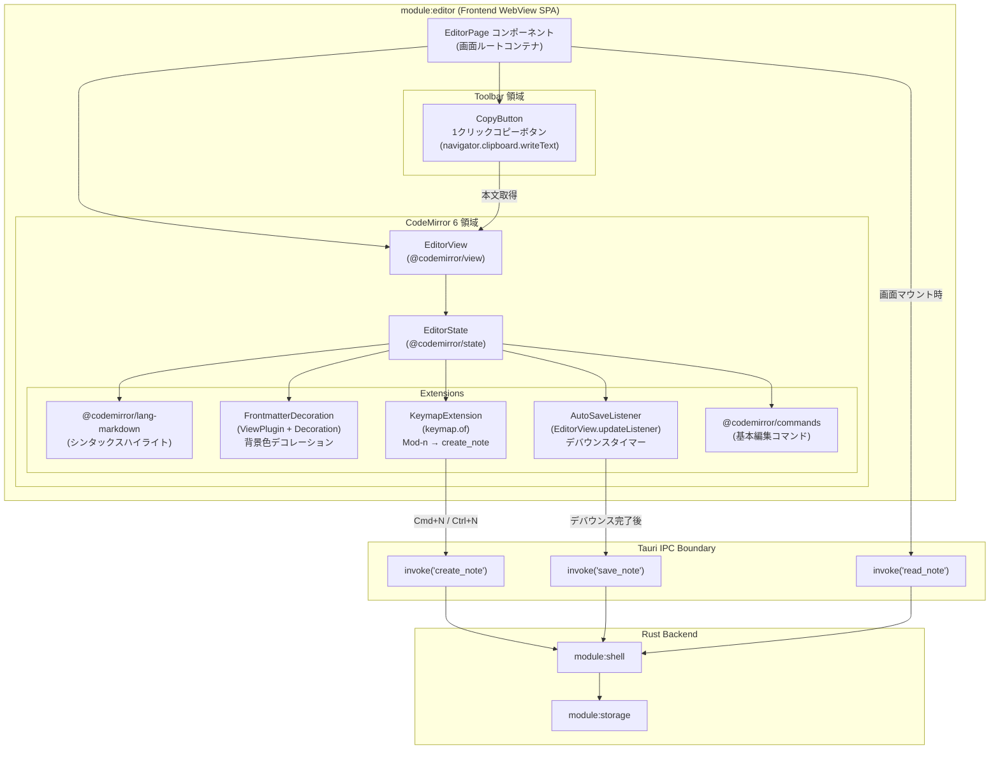
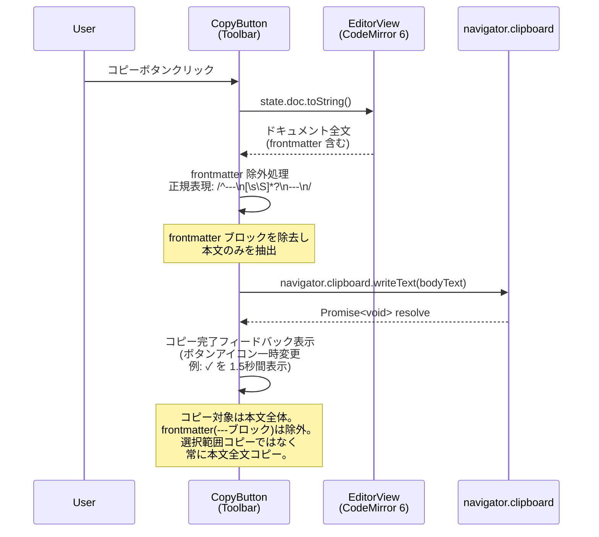
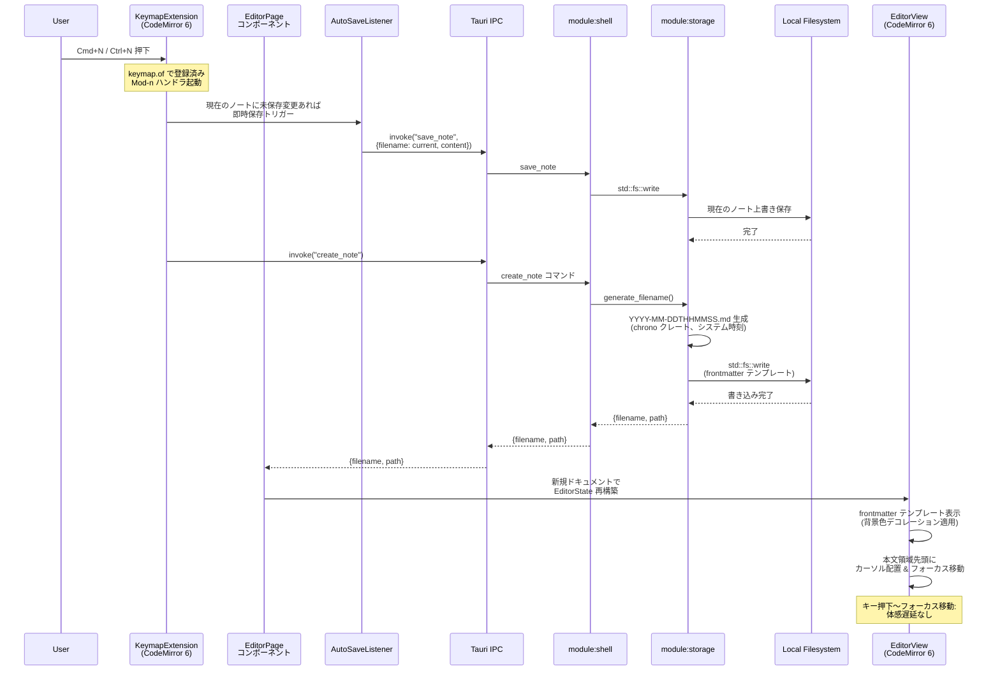
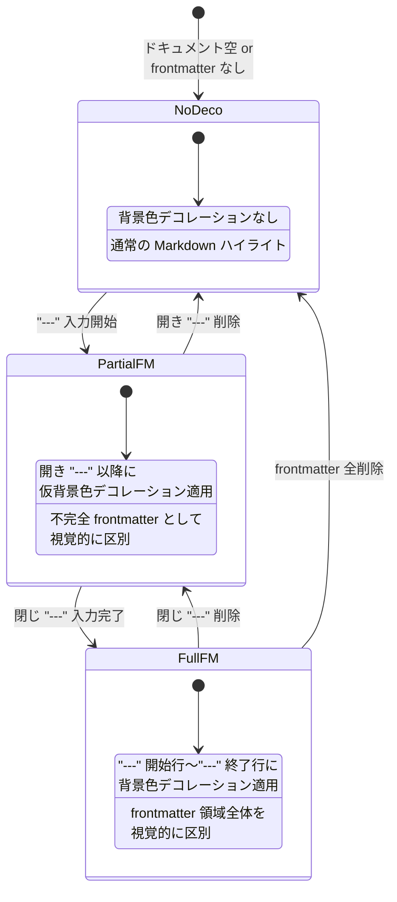
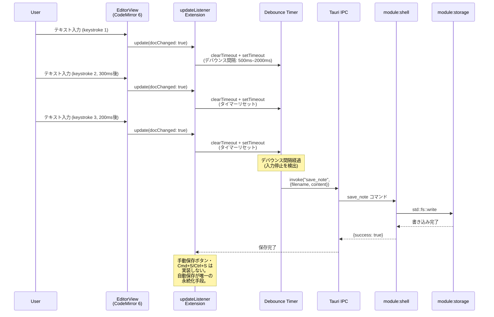

---
codd:
  node_id: detail:editor_clipboard
  type: design
  depends_on:
  - id: detail:component_architecture
    relation: depends_on
    semantic: technical
  depended_by:
  - id: plan:implementation_plan
    relation: depends_on
    semantic: technical
  conventions:
  - targets:
    - module:editor
    reason: CodeMirror 6 必須。Markdownシンタックスハイライトのみ（レンダリング禁止）。frontmatter領域は背景色で視覚的に区別必須。
  - targets:
    - module:editor
    reason: タイトル入力欄は禁止。本文のみのエディタ画面であること。
  - targets:
    - module:editor
    reason: 1クリックコピーボタンによる本文全体のクリップボードコピーはアプリの核心UX。未実装ならリリース不可。
  - targets:
    - module:editor
    reason: Cmd+N / Ctrl+N で即座に新規ノート作成しフォーカス移動必須。
  modules:
  - editor
---

# Editor & Clipboard Detailed Design

## 1. Overview

本設計書は PromptNotes における `module:editor` の詳細設計を定義する。`module:editor` は CodeMirror 6 ベースの Markdown エディタ画面およびクリップボードコピー機能を所有し、アプリケーションの中核 UX を担うフロントエンド WebView SPA コンポーネントである。

エディタ画面はユーザーがプロンプトノートを作成・編集する唯一のインターフェースであり、以下の4つのリリース不可制約に直接対応する。

| リリース不可制約 | 本設計書での反映 |
|-----------------|----------------|
| CodeMirror 6 必須。Markdown シンタックスハイライトのみ（レンダリング禁止）。frontmatter 領域は背景色で視覚的に区別必須。 | §2（エディタ構成図・frontmatter デコレーションシーケンス）、§3（CodeMirror 6 エクステンション所有権）、§4.1（CodeMirror 6 統合実装）、§4.2（frontmatter 背景色デコレーション実装） |
| タイトル入力欄は禁止。本文のみのエディタ画面であること。 | §3（エディタ画面 DOM 構成の所有権）、§4.3（タイトル入力欄排除ガード） |
| 1クリックコピーボタンによる本文全体のクリップボードコピーはアプリの核心 UX。未実装ならリリース不可。 | §2（クリップボードコピーシーケンス図）、§3（コピーボタン所有権）、§4.4（クリップボードコピー実装） |
| `Cmd+N` / `Ctrl+N` で即座に新規ノート作成しフォーカス移動必須。 | §2（新規ノート作成シーケンス図）、§3（キーバインド所有権）、§4.5（新規ノート作成フロー実装） |

`module:editor` はフロントエンド WebView SPA 内で動作し、ファイル I/O は一切行わない。ノートの保存・読み込みは Tauri IPC 境界を通じて Rust バックエンド（`module:shell` → `module:storage`）に委譲する。エディタが使用する IPC コマンドは `create_note`、`save_note`、`read_note` の3つである。

### 1.1 スコープ

本設計書がカバーする範囲:

- CodeMirror 6 エクステンション構成（シンタックスハイライト、frontmatter デコレーション、キーバインド）
- エディタ画面の DOM 構成とコンポーネント階層
- 1クリックコピーボタンのクリップボード統合
- `Cmd+N` / `Ctrl+N` による新規ノート作成フロー
- 自動保存デバウンスメカニズム
- frontmatter 領域の視覚的区別（背景色デコレーション）

本設計書がカバーしない範囲:

- グリッドビュー（`module:grid`）のレイアウト・フィルタ・検索
- 設定画面（`module:settings`）のディレクトリ選択 UI
- Rust バックエンド（`module:storage`）のファイル I/O 実装詳細
- Tauri IPC コマンドルーティング（`module:shell`）の内部構造

---

## 2. Mermaid Diagrams

### 2.1 エディタコンポーネント構成と依存関係



**所有権と実装境界の説明:**

`module:editor` の全構成要素はフロントエンド WebView SPA が単独所有する。`EditorPage` コンポーネントが画面ルートコンテナとして、CodeMirror 6 エディタ領域と Toolbar 領域（コピーボタン）の両方を保持する。タイトル入力欄（`<input>` や `<textarea>`）は DOM ツリーに一切存在しない。

CodeMirror 6 のエクステンション群（`@codemirror/lang-markdown`、`FrontmatterDecoration`、`AutoSaveListener`、`KeymapExtension`、`@codemirror/commands`）はすべて `EditorState` の `extensions` 配列として構成され、`module:editor` 内に閉じる。他モジュール（`module:grid`、`module:settings`）がこれらのエクステンションを直接参照・再利用することはない。

IPC 境界を超えるデータフローは3種類（`create_note`、`save_note`、`read_note`）のみであり、ファイルシステムへの直接アクセスは構造的に不可能である。`CopyButton` は CodeMirror 6 の `EditorView` から `state.doc.toString()` で本文を取得し、`navigator.clipboard.writeText()` でクリップボードに書き込む。この処理はフロントエンド内で完結し、IPC を経由しない。

### 2.2 1クリックコピー（クリップボード書き込み）シーケンス



**所有権と実装上の意味:**

1クリックコピー機能は `module:editor` が単独所有する。コピー対象は常に frontmatter を除外した本文全文であり、ユーザーのテキスト選択状態に依存しない。この設計は「1クリックでプロンプト全体をクリップボードにコピーしてすぐに LLM に貼り付ける」というアプリの核心ユースケースに最適化されている。

`navigator.clipboard.writeText()` は Secure Context（HTTPS またはローカルホスト）でのみ動作するが、Tauri の WebView はローカル環境として Secure Context 要件を満たすため、追加の権限設定なしで利用可能である。コピー完了時のユーザーフィードバック（ボタンアイコンの一時変更）は視覚的確認手段として必須であり、非同期の `Promise<void>` 解決後に表示する。

### 2.3 新規ノート作成シーケンス（`Cmd+N` / `Ctrl+N`）



**所有権と責務分離:**

キーバインド `Mod-n`（macOS: `Cmd+N`、Linux: `Ctrl+N`）の登録・ハンドリングは `module:editor` のフロントエンド側が所有する。ファイル名 `YYYY-MM-DDTHHMMSS.md` の生成は `module:storage`（Rust 側）が単独所有し、フロントエンドはタイムスタンプ生成に関与しない。

新規ノート作成時、現在編集中のノートに未保存変更がある場合は、デバウンスタイマーをバイパスして即時に `save_note` を呼び出してから `create_note` を実行する。これにより、キーボードショートカットの連打によるデータ消失を防止する。`create_note` の IPC 応答を受信した後、`EditorState` を新規ドキュメントで再構築し、本文領域先頭にカーソルを配置してフォーカスを移動する。キー押下からフォーカス移動完了までの全体遅延は体感遅延なし（ファイル I/O が単一ファイルの空テンプレート書き込みのみのため）を目標とする。

### 2.4 frontmatter 背景色デコレーション状態遷移



**所有権と実装上の意味:**

frontmatter 背景色デコレーションは `FrontmatterDecoration`（`ViewPlugin` + `Decoration.line` で実装）が単独所有する。このプラグインは CodeMirror 6 のドキュメント変更イベントごとに frontmatter ブロックの開始行（`---`）と終了行（`---`）の位置を再計算し、該当行に背景色の `Decoration.line` を適用する。

3つの状態（デコレーションなし・部分 frontmatter・完全 frontmatter）は `ViewPlugin.update` メソッド内で遷移する。完全な frontmatter ブロック（開き `---` と閉じ `---` の両方が存在）が検出された場合のみ、正式な背景色デコレーションが適用される。部分的な frontmatter（開き `---` のみ）にも仮の背景色を適用することで、ユーザーが frontmatter 入力中であることを視覚的に把握できるようにする。これは Markdown レンダリング（HTML 変換）ではなく、あくまでエディタ内のテキストデコレーション（色付け）であり、リリース不可制約の「レンダリング禁止」に抵触しない。

### 2.5 自動保存デバウンスフロー



**所有権と責務の分離:**

デバウンス処理はフロントエンド側（`AutoSaveListener` エクステンション）が所有する。これは入力頻度の制御が UI 層の責務であるためである。`save_note` IPC コマンドの呼び出しはデバウンスタイマー完了後に1回のみ発生する。手動保存（`Cmd+S`/`Ctrl+S` やボタン）は実装しない。自動保存が唯一の永続化手段であり、`save_note` コマンドに渡す `content` はその時点の `editorView.state.doc.toString()` の全文である。Rust バックエンド側の `module:storage` は受け取った content をファイル全体として `std::fs::write` で上書き保存する。

---

## 3. Ownership Boundaries

### 3.1 `module:editor` 全体の所有権

`module:editor` はフロントエンド WebView SPA が単独所有するモジュールである。他モジュールが `module:editor` の内部状態（CodeMirror 6 の `EditorState`、`EditorView`、デバウンスタイマー等）に直接アクセスすることはない。

| コンポーネント | 単独所有者 | 再実装禁止ルール |
|---------------|-----------|-----------------|
| `EditorPage` コンポーネント | `module:editor` (Frontend) | `module:grid` や `module:settings` がエディタ画面を独自に構築してはならない |
| CodeMirror 6 インスタンス (`EditorView`, `EditorState`) | `module:editor` (Frontend) | 他モジュールが CodeMirror 6 の別インスタンスを生成してはならない |
| `FrontmatterDecoration` ViewPlugin | `module:editor` (Frontend) | frontmatter の視覚的区別ロジックは本プラグインに集約する |
| `CopyButton` コンポーネント | `module:editor` (Frontend) | クリップボード書き込みロジックは本コンポーネントに集約する |
| `AutoSaveListener` エクステンション | `module:editor` (Frontend) | デバウンスロジックは本エクステンションに集約する |
| `KeymapExtension` エクステンション | `module:editor` (Frontend) | アプリ固有キーバインド（`Mod-n`）の登録は本エクステンションに集約する |

### 3.2 CodeMirror 6 エクステンション所有権

CodeMirror 6 の `EditorState.create` に渡す `extensions` 配列の構成と順序は `module:editor` が単独所有する。以下に確定エクステンション一覧と所有権を示す。

| エクステンション | npm パッケージ | 所有形態 | 説明 |
|-----------------|---------------|---------|------|
| `markdown()` | `@codemirror/lang-markdown` | 外部ライブラリ利用 | Markdown シンタックスハイライト。HTML レンダリングは行わない（シンタックスカラーリングのみ）。 |
| `FrontmatterDecoration` | カスタム実装 | `module:editor` 単独所有 | `ViewPlugin.fromClass` で実装。`---` 開始行から `---` 終了行まで `Decoration.line` で背景色 CSS クラスを付与。 |
| `AutoSaveListener` | カスタム実装 | `module:editor` 単独所有 | `EditorView.updateListener.of` で実装。`docChanged` 検出後デバウンスし `save_note` IPC を呼び出す。 |
| `promptNotesKeymap` | カスタム実装 | `module:editor` 単独所有 | `keymap.of` で実装。`Mod-n` を `create_note` IPC に紐付け。 |
| `defaultKeymap` | `@codemirror/commands` | 外部ライブラリ利用 | 標準編集コマンド（undo, redo, 選択等）。 |
| `history()` | `@codemirror/commands` | 外部ライブラリ利用 | Undo/Redo 履歴管理。 |

カスタムエクステンション（`FrontmatterDecoration`、`AutoSaveListener`、`promptNotesKeymap`）は `module:editor` ディレクトリ内に配置し、他モジュールからの import を禁止する。

### 3.3 エディタ画面 DOM 構成の所有権

エディタ画面の DOM 構成は以下の階層に限定される。タイトル入力欄（`<input>`、`<textarea>`、`contenteditable` 属性を持つタイトル専用要素）は DOM ツリーに一切含めない。

```
EditorPage
├── Toolbar
│   └── CopyButton  (1クリックコピーボタン)
└── CodeMirrorContainer
    └── EditorView DOM (CodeMirror 6 が管理)
```

**タイトル入力欄排除の所有権:** `EditorPage` コンポーネントが画面構成を単独所有し、タイトル入力欄を含まないことを保証する。この制約は受け入れテスト（FAIL-04）で自動検証する。

**Markdown プレビュー排除の所有権:** `EditorPage` コンポーネントにプレビューパネル・スプリットビュー・レンダリング出力表示領域を含めない。CodeMirror 6 によるシンタックスハイライト（テキストの色分け）のみを提供する。この制約は受け入れテスト（FAIL-05）で自動検証する。

### 3.4 IPC コマンド呼び出しの所有権

`module:editor` が呼び出す IPC コマンドとその所有関係:

| IPC コマンド | 呼び出しトリガー | 呼び出し所有者 | バックエンド実行者 |
|-------------|----------------|---------------|-------------------|
| `create_note` | `Cmd+N` / `Ctrl+N` キー押下 | `KeymapExtension` (Frontend) | `module:shell` → `module:storage` |
| `save_note` | デバウンスタイマー完了 | `AutoSaveListener` (Frontend) | `module:shell` → `module:storage` |
| `read_note` | エディタ画面マウント時 / ノート切り替え時 | `EditorPage` コンポーネント (Frontend) | `module:shell` → `module:storage` |

`module:editor` はこれら3つの IPC コマンドの「呼び出し側」として唯一の所有者である。`module:grid` や `module:settings` がこれらのコマンドを呼び出すことはない（`module:grid` は `list_notes`、`search_notes`、`get_all_tags` を使用する）。

### 3.5 クリップボードコピーの所有権

1クリックコピーボタンの動作ロジックは `CopyButton` コンポーネントが単独所有する。

| 責務 | 所有者 | 実装手段 |
|------|--------|---------|
| 本文全文取得 | `CopyButton` | `editorView.state.doc.toString()` |
| frontmatter 除外 | `CopyButton` | 正規表現 `/^---\n[\s\S]*?\n---\n/` |
| クリップボード書き込み | `CopyButton` | `navigator.clipboard.writeText()` |
| コピー完了フィードバック | `CopyButton` | ボタンアイコン一時変更（✓ を 1.5秒間表示） |

クリップボードコピー処理はフロントエンド内で完結し、IPC を経由しない。frontmatter 除外ロジックを `CopyButton` に集約することで、除外パターンの変更時に影響範囲が本コンポーネントに限定される。

### 3.6 frontmatter テンプレートの所有権

新規ノート作成時に挿入される frontmatter テンプレートは `module:storage`（Rust バックエンド）が所有する。

```markdown
---
tags: []
---

```

フロントエンド側はテンプレートの内容・フォーマットを知らず、`create_note` IPC の応答後に `read_note` で取得したコンテンツをそのまま `EditorState` に設定する。テンプレート変更時は `module:storage` のみを修正する。

---

## 4. Implementation Implications

### 4.1 CodeMirror 6 統合実装

**必須 npm パッケージ:**

| パッケージ | 用途 | リリース不可制約との関係 |
|-----------|------|----------------------|
| `@codemirror/state` | エディタ状態管理 | CodeMirror 6 必須 |
| `@codemirror/view` | エディタビュー・DOM 統合 | CodeMirror 6 必須 |
| `@codemirror/lang-markdown` | Markdown シンタックスハイライト | シンタックスハイライトのみ（レンダリング禁止） |
| `@codemirror/commands` | 基本編集コマンド（undo/redo 等） | 標準エディタ操作 |
| `@codemirror/language` | 言語サポート基盤 | `lang-markdown` の依存 |

**禁止パッケージ:**

| パッケージ/ライブラリ | 禁止理由 |
|---------------------|---------|
| `marked`, `markdown-it`, `remark-html` 等 Markdown → HTML 変換ライブラリ | Markdown プレビュー（レンダリング）禁止 |
| `@codemirror/view` の `Decoration.widget` を使った HTML プレビューウィジェット | 同上 |

**EditorState 構成（実装パターン）:**

```typescript
import { EditorState } from "@codemirror/state";
import { EditorView, keymap } from "@codemirror/view";
import { markdown } from "@codemirror/lang-markdown";
import { defaultKeymap, history, historyKeymap } from "@codemirror/commands";
import { frontmatterDecoration } from "./extensions/frontmatter-decoration";
import { autoSaveListener } from "./extensions/auto-save-listener";
import { promptNotesKeymap } from "./extensions/prompt-notes-keymap";

const state = EditorState.create({
  doc: initialContent,
  extensions: [
    markdown(),
    frontmatterDecoration(),
    autoSaveListener(currentFilename, invoke),
    keymap.of(promptNotesKeymap),
    keymap.of(defaultKeymap),
    keymap.of(historyKeymap),
    history(),
    EditorView.lineWrapping,
  ],
});

const view = new EditorView({
  state,
  parent: document.getElementById("editor-container"),
});
```

この構成により、Markdown シンタックスハイライト・frontmatter 背景色デコレーション・自動保存・キーバインドがすべて CodeMirror 6 のエクステンション機構を通じて統合される。

### 4.2 frontmatter 背景色デコレーション実装

`FrontmatterDecoration` は `ViewPlugin.fromClass` で実装する。

```typescript
import { ViewPlugin, Decoration, DecorationSet, EditorView, ViewUpdate } from "@codemirror/view";
import { RangeSetBuilder } from "@codemirror/state";

const frontmatterLineClass = Decoration.line({
  class: "cm-frontmatter-line",
});

class FrontmatterDecoPlugin {
  decorations: DecorationSet;

  constructor(view: EditorView) {
    this.decorations = this.buildDecorations(view);
  }

  update(update: ViewUpdate) {
    if (update.docChanged || update.viewportChanged) {
      this.decorations = this.buildDecorations(update.view);
    }
  }

  buildDecorations(view: EditorView): DecorationSet {
    const builder = new RangeSetBuilder<Decoration>();
    const doc = view.state.doc;
    const text = doc.toString();

    // frontmatter 検出: 先頭 "---" で開始し "---" で終了
    const match = text.match(/^(---\n[\s\S]*?\n---)/);
    if (match) {
      const fmEnd = match[0].length;
      const startLine = doc.lineAt(0);
      const endLine = doc.lineAt(fmEnd - 1);
      for (let i = startLine.number; i <= endLine.number; i++) {
        const line = doc.line(i);
        builder.add(line.from, line.from, frontmatterLineClass);
      }
    }

    return builder.finish();
  }
}

export function frontmatterDecoration() {
  return ViewPlugin.fromClass(FrontmatterDecoPlugin, {
    decorations: (v) => v.decorations,
  });
}
```

**CSS スタイル定義:**

```css
.cm-frontmatter-line {
  background-color: rgba(135, 206, 250, 0.12);  /* 薄い青系背景 */
}
```

背景色は視覚的に frontmatter 領域を本文から区別する目的であり、lightblue 系の半透明色をデフォルトとする。ダークモード対応時はメディアクエリまたは CSS カスタムプロパティで切り替える。

この実装は純粋に `Decoration.line` による行レベルの CSS クラス付与であり、Markdown → HTML レンダリングではない。frontmatter の YAML 内容を解析して構造化表示することも行わない。リリース不可制約「レンダリング禁止」に準拠している。

### 4.3 タイトル入力欄排除ガード

`module:editor` のエディタ画面にタイトル入力欄が存在しないことを以下の手段で保証する。

| 検証手段 | 実装 | タイミング |
|---------|------|-----------|
| 受け入れテスト（FAIL-04） | エディタ画面の DOM に `[data-testid="title-input"]`、`<input>` のうちタイトル用途のもの、`<h1 contenteditable>` 等が存在しないことを Playwright で検証 | CI/CD パイプライン |
| コードレビューチェックリスト | `EditorPage` コンポーネントのテンプレート/JSX にタイトル入力要素が含まれていないことをレビュー時に確認 | PR マージ前 |

`EditorPage` コンポーネントの DOM 構成は §3.3 に定義した階層（Toolbar + CodeMirrorContainer のみ）に厳密に従い、タイトル入力欄を含めない。

### 4.4 クリップボードコピー実装

1クリックコピーボタンはアプリの核心 UX であり、未実装ならリリース不可とする。

**`CopyButton` コンポーネント実装パターン:**

```typescript
async function handleCopy(editorView: EditorView): Promise<void> {
  const fullText = editorView.state.doc.toString();

  // frontmatter ブロック除外
  const bodyText = fullText.replace(/^---\n[\s\S]*?\n---\n/, "");

  // 先頭・末尾の空白行をトリム
  const trimmedBody = bodyText.trim();

  // クリップボードに書き込み
  await navigator.clipboard.writeText(trimmedBody);

  // コピー完了フィードバック表示（呼び出し元で状態管理）
}
```

**コピー対象の仕様:**

| 要素 | コピー対象に含まれるか |
|------|---------------------|
| frontmatter ブロック (`---` 〜 `---`) | 含まれない（除外） |
| 本文テキスト | 含まれる（全文） |
| 本文先頭の空行（frontmatter 直後） | トリムして除外 |
| 本文末尾の空行 | トリムして除外 |

**コピー完了フィードバック:**

コピーボタンのアイコンをクリップボードアイコン（📋）からチェックマーク（✓）に一時変更し、1.5秒後に元に戻す。これによりユーザーはコピーが成功したことを視覚的に確認できる。トースト通知やモーダルダイアログは使用しない（操作の軽快さを損なうため）。

**エラーハンドリング:**

`navigator.clipboard.writeText()` が失敗した場合（WebView の Secure Context 要件未充足等の異常ケース）、ボタンにエラー状態を表示する。ただし、Tauri WebView 環境では Secure Context 要件を満たすため、通常この失敗は発生しない。

### 4.5 新規ノート作成フロー実装

**`Cmd+N` / `Ctrl+N` キーバインド実装:**

```typescript
import { keymap } from "@codemirror/view";
import { invoke } from "@tauri-apps/api/core";

interface CreateNoteResponse {
  filename: string;
  path: string;
}

export const promptNotesKeymap = [
  {
    key: "Mod-n",
    run: (view: EditorView) => {
      handleCreateNote(view);
      return true; // イベント伝播を停止
    },
  },
];

async function handleCreateNote(currentView: EditorView): Promise<void> {
  // 1. 現在のノートに未保存変更があれば即時保存
  if (hasUnsavedChanges) {
    await invoke("save_note", {
      filename: currentFilename,
      content: currentView.state.doc.toString(),
    });
  }

  // 2. 新規ノート作成
  const result = await invoke<CreateNoteResponse>("create_note");

  // 3. 新規ノートの内容を読み込み
  const note = await invoke<{ content: string; tags: string[] }>(
    "read_note",
    { filename: result.filename }
  );

  // 4. EditorState を新規ドキュメントで再構築
  const newState = EditorState.create({
    doc: note.content,
    extensions: [/* 既存エクステンション群 */],
  });
  currentView.setState(newState);

  // 5. 本文領域先頭にカーソル配置 & フォーカス移動
  const fmMatch = note.content.match(/^---\n[\s\S]*?\n---\n/);
  const bodyStart = fmMatch ? fmMatch[0].length : 0;
  currentView.dispatch({
    selection: { anchor: bodyStart },
  });
  currentView.focus();
}
```

`Mod` キーは CodeMirror 6 が OS を自動検出し、macOS では `Cmd`、Linux では `Ctrl` にマッピングする。`return true` によりブラウザデフォルトの `Cmd+N`（新規ウィンドウ）を抑制する。

**フォーカス移動の仕様:** 新規ノート作成後、カーソルは frontmatter ブロックの直後（本文先頭）に配置される。frontmatter ブロック内にカーソルを置かないことで、ユーザーは即座に本文入力を開始できる。

**パフォーマンス要件:** キー押下（`Cmd+N`/`Ctrl+N`）からフォーカス移動完了までの遅延は体感遅延なしとする。`create_note` IPC コマンドは空の frontmatter テンプレート（数十バイト）の `std::fs::write` のみであり、ディスク I/O は最小限である。

### 4.6 自動保存デバウンス実装

```typescript
import { EditorView, ViewUpdate } from "@codemirror/view";
import { invoke } from "@tauri-apps/api/core";

export function autoSaveListener(
  getFilename: () => string,
  debounceMs: number = 1000 // OQ-002: 500ms–2000ms の範囲で決定
) {
  let timer: ReturnType<typeof setTimeout> | null = null;
  let saving = false;

  return EditorView.updateListener.of((update: ViewUpdate) => {
    if (!update.docChanged) return;

    // デバウンスタイマーをリセット
    if (timer !== null) {
      clearTimeout(timer);
    }

    timer = setTimeout(async () => {
      if (saving) return;
      saving = true;

      try {
        const content = update.view.state.doc.toString();
        await invoke("save_note", {
          filename: getFilename(),
          content,
        });
      } finally {
        saving = false;
      }
    }, debounceMs);
  });
}
```

**デバウンス間隔:** デフォルト値は 1000ms（1秒）とし、OQ-002 のユーザーテスト結果に基づいて 500ms〜2000ms の範囲で最終調整する。

**重複保存防止:** `saving` フラグにより、前回の `save_note` IPC が完了する前に次のデバウンスタイマーが発火した場合、新規保存をスキップする。次のドキュメント変更時に再度デバウンスタイマーが起動される。

**手動保存の不在:** `Cmd+S`/`Ctrl+S` および保存ボタンは実装しない。自動保存がノート永続化の唯一の手段である。ただし、`Cmd+N`/`Ctrl+N` による新規ノート作成時には、デバウンスタイマーをバイパスして現在のノートを即時保存する（§2.3 参照）。

### 4.7 エディタ画面ナビゲーション

`module:editor` はクライアントサイドルーター経由でアクセスされる。ルーティングパスは `/edit/:filename` 形式を想定する。

| ルート | 動作 |
|-------|------|
| `/edit/:filename` | 指定ファイルの `read_note` IPC を呼び出し、内容を CodeMirror 6 に表示 |
| `/edit/new` | `create_note` IPC を呼び出し、新規ノートを作成してエディタに表示（`Cmd+N`/`Ctrl+N` と同等） |

グリッドビュー（`module:grid`）からノートカードクリック時に `/edit/:filename` へ遷移する。`Cmd+N`/`Ctrl+N` キーバインドはエディタ画面内でもグリッドビュー画面内でも機能するが、キーバインドの登録・ハンドリングは `module:editor` が所有する。

### 4.8 エラーハンドリング

| エラーケース | 発生箇所 | ハンドリング |
|-------------|---------|-------------|
| `save_note` IPC 失敗 | `AutoSaveListener` | エディタ上部にインライン警告バーを表示。次のドキュメント変更時に再度保存を試行。 |
| `create_note` IPC 失敗 | `KeymapExtension` | エラーメッセージをインライン表示。現在のノートの編集状態は維持。 |
| `read_note` IPC 失敗 | `EditorPage` マウント時 | エラー画面を表示し、グリッドビューへの戻りリンクを提供。 |
| `navigator.clipboard.writeText` 失敗 | `CopyButton` | ボタンにエラーアイコンを一時表示。 |

### 4.9 リリース不可制約への準拠サマリー

| 制約 | 実装手段 | 検証手段 |
|------|---------|---------|
| CodeMirror 6 必須 | `@codemirror/state`, `@codemirror/view`, `@codemirror/lang-markdown` を `package.json` 依存に含める | CI で `package.json` の依存チェック |
| Markdown シンタックスハイライトのみ（レンダリング禁止） | `@codemirror/lang-markdown` のみ使用。`marked`、`markdown-it` 等の HTML 変換ライブラリを禁止 | `package.json` にレンダリングライブラリが含まれないことの CI チェック。受け入れテスト（FAIL-05） |
| frontmatter 領域は背景色で視覚的に区別必須 | `FrontmatterDecoration` ViewPlugin で `Decoration.line` による背景色 CSS クラス付与 | Visual regression テスト。手動 UI レビュー。 |
| タイトル入力欄は禁止 | `EditorPage` DOM にタイトル入力要素を含めない | 受け入れテスト（FAIL-04）で DOM 検証 |
| 1クリックコピーボタンによる本文全体のクリップボードコピー | `CopyButton` コンポーネントで `navigator.clipboard.writeText()` を使用し frontmatter 除外後の本文全文をコピー | E2E テストでクリップボード内容を検証 |
| `Cmd+N` / `Ctrl+N` で即座に新規ノート作成しフォーカス移動 | `keymap.of([{ key: "Mod-n", run: ... }])` で `create_note` IPC 呼び出し → `EditorState` 再構築 → 本文先頭フォーカス | E2E テストでキーバインド動作を検証 |

---

## 5. Open Questions

| ID | 対象 | 質問 | 影響範囲 | 優先度 | 暫定方針 |
|----|------|------|---------|--------|---------|
| OQ-001 | フロントエンド全体 | フロントエンド UI フレームワークとして React と Svelte のどちらを採用するか。CodeMirror 6 統合の安定性（React の場合 `@uiw/react-codemirror` ラッパーの品質、Svelte の場合直接 DOM マウント）、frontmatter 背景色カスタムデコレーション実装容易性、ビルドサイズ比較が検証項目。 | `EditorPage` コンポーネント、`CopyButton` コンポーネントの実装方式。CodeMirror 6 ラッパーの選定。 | 高（開発開始前に解決必須） | 技術検証プロトタイプで両フレームワークの CodeMirror 6 統合を比較評価する。 |
| OQ-002 | `module:editor` | 自動保存デバウンス間隔の最適値。500ms では IPC 呼び出し頻度とディスク I/O が過大になるリスク、2000ms ではクラッシュ時データ消失量が2秒分に達するリスクがある。 | `AutoSaveListener` エクステンションの `debounceMs` パラメータ。 | 中 | 初期値 1000ms でユーザーテストを実施し、体感遅延と保存信頼性のバランスで最終値を決定。 |
| OQ-007 | `module:editor` | frontmatter 背景色の具体的なカラー値とダークモード対応方針。ライトモード/ダークモードの両方で frontmatter 領域が視認可能であることを保証する必要がある。 | `FrontmatterDecoration` の CSS スタイル定義。 | 低 | ライトモード: `rgba(135, 206, 250, 0.12)`、ダークモード: `rgba(135, 206, 250, 0.08)` を仮値とし、デザインレビューで確定。 |
| OQ-008 | `module:editor` | 新規ノート作成時（`Cmd+N`/`Ctrl+N`）に現在のノートが未保存の場合、即時保存をデバウンスバイパスで実行する設計としたが、保存完了を待つことで新規ノート作成の体感遅延が生じうる。保存を非同期（fire-and-forget）で実行するか、await で完了を待つか。 | `handleCreateNote` のフロー制御。データ消失リスク vs 操作の即応性。 | 中 | データ消失防止を優先し await で保存完了を待つ方式を採用。保存処理は単一ファイル上書き（数ms）であり体感遅延は発生しない見込み。 |
| OQ-009 | `module:editor` | `CopyButton` のコピー完了フィードバック（✓ 表示）の表示時間 1.5秒は適切か。短すぎるとユーザーが見逃し、長すぎると連続コピー操作時に前回のフィードバックが残り混乱を生む。 | `CopyButton` コンポーネントの状態管理タイマー。 | 低 | 1.5秒を初期値とし、ユーザーテストで調整。連続クリック時は即座にリセットして新たに ✓ を 1.5秒間表示する。 |
