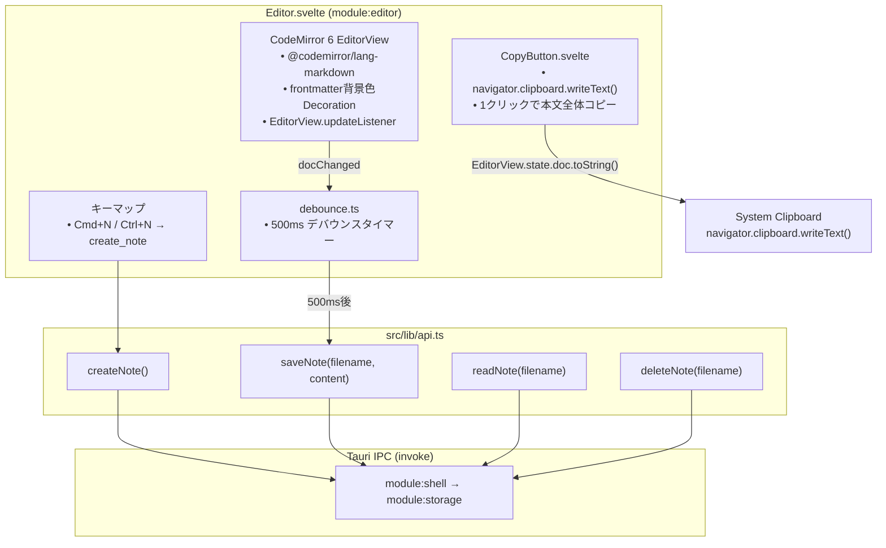
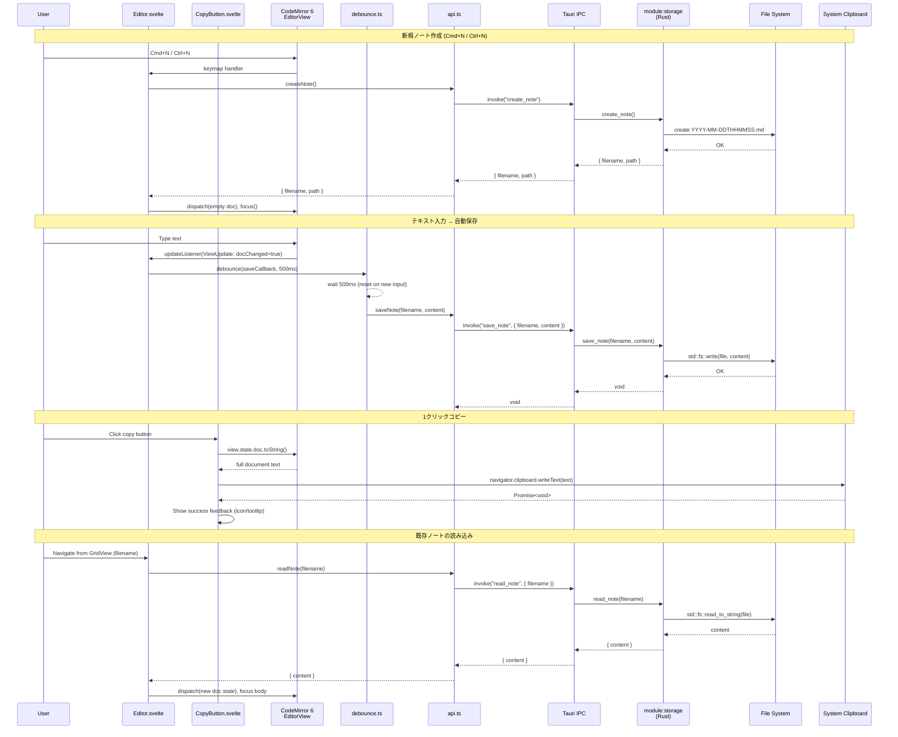
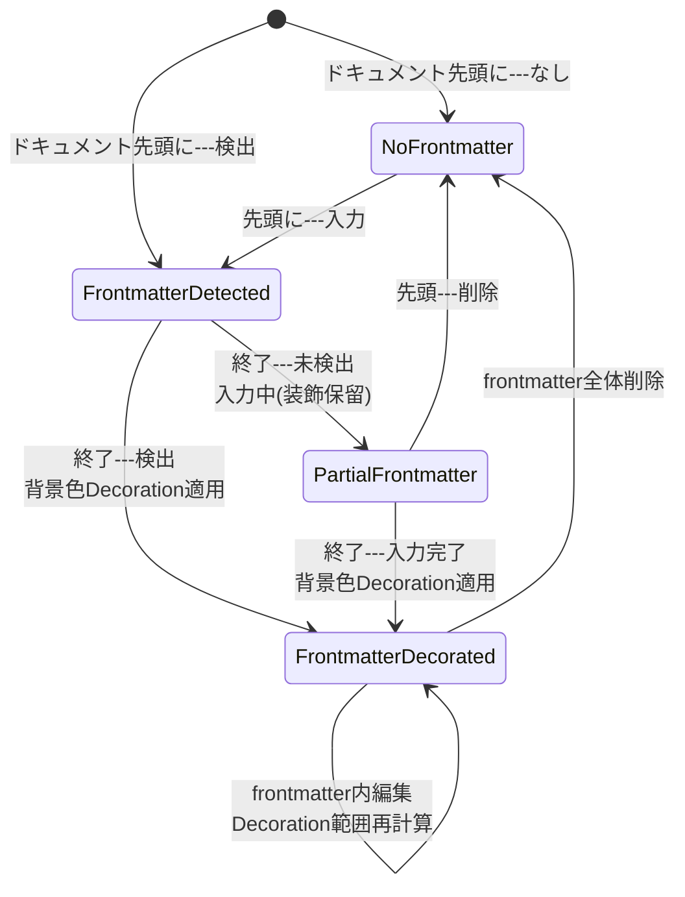

---
codd:
  node_id: detail:editor_clipboard
  type: design
  depends_on:
  - id: detail:component_architecture
    relation: depends_on
    semantic: technical
  depended_by:
  - id: plan:implementation_plan
    relation: depends_on
    semantic: technical
  conventions:
  - targets:
    - module:editor
    reason: CodeMirror 6 必須。Markdownシンタックスハイライトのみ（レンダリング禁止）。frontmatter領域は背景色で視覚的に区別必須。
  - targets:
    - module:editor
    reason: タイトル入力欄は禁止。本文のみのエディタ画面であること。
  - targets:
    - module:editor
    reason: 1クリックコピーボタンによる本文全体のクリップボードコピーはアプリの核心UX。未実装ならリリース不可。
  - targets:
    - module:editor
    reason: Cmd+N / Ctrl+N で即座に新規ノート作成しフォーカス移動必須。
  modules:
  - editor
---

# Editor & Clipboard Detailed Design

## 1. Overview

本設計書は PromptNotes アプリケーションにおける `module:editor` の詳細設計を定義する。`module:editor` は Svelte フロントエンド上で **CodeMirror 6** を統合した Markdown プレーンテキストエディタであり、1クリックコピーボタンによるクリップボード連携をアプリケーションの核心 UX として提供する。

`module:editor` は以下の責務を持つ。

| 責務 | 詳細 |
|------|------|
| Markdown 編集 | CodeMirror 6 による Markdown シンタックスハイライト付きプレーンテキスト編集。HTML レンダリング（プレビュー）は実装禁止 |
| frontmatter 視覚区別 | YAML frontmatter 領域を背景色デコレーションにより視覚的に区別する |
| 1クリックコピーボタン | 本文全体をクリップボードにコピーするボタン。本機能が未実装の場合リリース不可 |
| 自動保存 | EditorView.updateListener による変更検知と 500ms デバウンスによる IPC 経由の自動保存 |
| 新規ノート作成 | Cmd+N（macOS）/ Ctrl+N（Linux）でのノート即時作成とフォーカス移動 |

**リリース不可制約（Release-Blocking Constraints）への準拠:**

- **CONV-1（CodeMirror 6 必須・Markdown シンタックスハイライトのみ）:** エディタエンジンは CodeMirror 6 を使用し、`@codemirror/lang-markdown` による Markdown シンタックスハイライトのみを適用する。Markdown のプレビュー（HTML レンダリング）は実装しない。frontmatter 領域は `ViewPlugin` または `StateField` + `Decoration` を用いて背景色を変更し、視覚的に区別する。これらが欠如している場合リリース不可。
- **CONV-2（タイトル入力欄禁止）:** エディタ画面にはタイトル入力用の独立フィールドを一切設けない。画面は本文エディタ領域のみで構成する。タイトル入力欄が存在する場合リリース不可。
- **CONV-3（1クリックコピーボタン）:** エディタ画面に常時表示されるコピーボタンを配置し、1クリックで本文全体（frontmatter 含む `.md` ファイルの全コンテンツ）をシステムクリップボードにコピーする。この機能はアプリの核心 UX であり、未実装ならリリース不可。
- **CONV-4（Cmd+N / Ctrl+N による新規ノート作成）:** キーバインドにより即座に `create_note` IPC コマンドを呼び出し、新規ノートを作成してエディタにフォーカスを移動する。キーバインド発動からフォーカス移動完了まで体感上の遅延がないこと。未実装ならリリース不可。

**IPC 境界の準拠:** `module:editor` は `module:storage` へのすべてのファイル操作を Tauri IPC（`invoke`）経由で行い、フロントエンドからの直接ファイルシステムアクセスは禁止する。IPC 呼び出しは `src/lib/api.ts` のラッパー関数を通じて行い、コンポーネント内での直接 `invoke` 呼び出しは避ける。

フロントエンドフレームワークは **Svelte** で確定している。`Editor.svelte` コンポーネントが `module:editor` の主要実装単位であり、`CopyButton.svelte` を子コンポーネントとして内包する。

## 2. Mermaid Diagrams

### 2.1 エディタ画面コンポーネント構成



このダイアグラムは `module:editor` の内部コンポーネント構成と外部依存を示す。

**所有権と境界:**

- **Editor.svelte** が CodeMirror 6 の `EditorView` インスタンスのライフサイクル（生成・破棄・状態管理）を排他的に所有する。Svelte の `onMount` で `EditorView` を生成し、`onDestroy` で `EditorView.destroy()` を呼び出す。
- **CopyButton.svelte** はコピー機能の UI 表示とクリックイベントハンドリングを所有するが、コピー対象テキストの取得は親コンポーネント（`Editor.svelte`）の `EditorView` から `state.doc.toString()` で取得する。`CopyButton.svelte` は `Editor.svelte` の子コンポーネントとしてのみ使用され、他モジュールからの再利用は想定しない。
- **debounce.ts** は `src/lib/debounce.ts` に配置される汎用ユーティリティであり、`module:editor` が主要な利用者である。JavaScript の `setTimeout` / `clearTimeout` で実装する。
- **api.ts** が IPC 呼び出しの唯一のエントリポイントであり、`module:editor` 内のコンポーネントは `api.ts` の関数（`createNote()`, `saveNote()`, `readNote()`, `deleteNote()`）のみを呼び出す。`@tauri-apps/api` の `invoke` を直接呼び出すコードは `api.ts` 内にのみ存在させる。

### 2.2 エディタ操作シーケンス



このシーケンス図は `module:editor` の4つの主要操作フローを時系列で示す。

**実装境界の注記:**

- 新規ノート作成において、ファイル名（`YYYY-MM-DDTHHMMSS.md`）の生成は `module:storage`（Rust 側、`chrono` クレート）が排他的に行う。`module:editor` はファイル名を生成せず、IPC レスポンスとして受領する。
- 自動保存のデバウンスタイマー（500ms）は `module:editor`（Svelte / JavaScript 側）が管理する。Rust 側はステートレスな上書き保存のみを実行する。
- 1クリックコピーではクリップボード API（`navigator.clipboard.writeText()`）を使用し、IPC を経由しない。これは WebView 内で完結するブラウザ標準 API であり、ファイルシステムアクセスに該当しないため、Tauri IPC 経由を強制する CONV-1 の適用対象外である。
- 既存ノートの読み込みでは、`module:grid` から `filename` が渡され、`module:editor` が `readNote` IPC コマンドでコンテンツを取得する。画面遷移は `App.svelte` の `currentView` 状態変数による条件レンダリングで実現する。

### 2.3 frontmatter デコレーション状態遷移



この状態遷移図は CodeMirror 6 の frontmatter デコレーション（背景色による視覚的区別）のライフサイクルを示す。

**実装境界の注記:**

- frontmatter 検出ロジック（先頭 `---` の検出と終了 `---` の検出）は `module:editor` 内の CodeMirror 6 エクステンションが所有する。これはフロントエンド側のリアルタイム視覚表示のためのロジックであり、`module:storage` 側の `serde_yaml` による frontmatter パース（データ抽出目的）とは独立している。
- frontmatter デコレーションの実装方式は `ViewPlugin` または `StateField` + `Decoration` のいずれかで行う（OQ-002 で最終判断）。いずれの方式でもドキュメント変更時に frontmatter 領域の行範囲を再計算し、`Decoration.set()` で背景色マークを適用する。
- 背景色は CSS 変数で定義し、OS のダークモード / ライトモードに応じた切り替えを容易にする。

## 3. Ownership Boundaries

### 3.1 module:editor 内部の所有権マトリクス

| 資源 / 関心事 | 排他的所有者 | 利用者 | 制約 |
|--------------|------------|-------|------|
| `EditorView` インスタンス | `Editor.svelte` | `CopyButton.svelte`（読み取りのみ） | `onMount` で生成、`onDestroy` で破棄。他コンポーネントからの `EditorView` 直接操作禁止 |
| frontmatter 背景色デコレーション | `Editor.svelte` 内 CM6 エクステンション | なし | `ViewPlugin` または `StateField` + `Decoration` で実装。視覚表示専用 |
| Markdown シンタックスハイライト | `Editor.svelte` 内 CM6 エクステンション（`@codemirror/lang-markdown`） | なし | `@codemirror/lang-markdown` パッケージを使用。カスタムパーサーは不要 |
| 自動保存デバウンスタイマー | `Editor.svelte`（`debounce.ts` 利用） | なし | 500ms。JavaScript `setTimeout` / `clearTimeout` で管理 |
| クリップボードコピー実行 | `CopyButton.svelte` | なし | `navigator.clipboard.writeText()` を使用。IPC 非経由 |
| 新規ノートキーバインド | `Editor.svelte` 内 CM6 キーマップ | なし | `Mod-n` で登録。CodeMirror の `keymap.of()` を使用 |
| IPC 呼び出しラッパー | `src/lib/api.ts`（`module:editor` 外部） | `Editor.svelte` | `api.ts` が `invoke` の単一エントリポイント。コンポーネント内での直接 `invoke` 禁止 |
| ファイル名生成 | `module:storage`（Rust 側） | `module:editor`（戻り値として受領） | `chrono` クレートによるタイムスタンプ生成は Rust 側のみ |

### 3.2 コンポーネントファイル構成と所有権

```
src/components/
├── Editor.svelte        # module:editor の主要コンポーネント（排他的所有者）
│                         # - CodeMirror 6 統合
│                         # - frontmatter デコレーション
│                         # - 自動保存ロジック
│                         # - Cmd+N / Ctrl+N キーバインド
│                         # - CopyButton.svelte を子として内包
└── CopyButton.svelte    # 1クリックコピーボタン（Editor.svelte 専用子コンポーネント）
                          # - クリップボード書き込み
                          # - コピー完了フィードバック表示
```

`CopyButton.svelte` は `Editor.svelte` の子コンポーネントとしてのみ使用される。`module:grid` や他のコンポーネントが `CopyButton.svelte` を直接利用することは想定しない。コピー対象テキストは `Editor.svelte` が `EditorView.state.doc.toString()` で取得し、props として `CopyButton.svelte` に渡すか、コールバック関数を props として渡す設計とする。

### 3.3 module:editor と他モジュールの境界

| 関係 | 境界の定義 | 通信方式 |
|------|-----------|---------|
| `module:editor` → `module:storage` | ノートの CRUD（`create_note`, `save_note`, `read_note`, `delete_note`） | Tauri IPC（`api.ts` 経由） |
| `module:grid` → `module:editor` | ノート選択時にエディタ画面に遷移（`filename` を渡す） | `App.svelte` の `currentView` 状態変数と Svelte props |
| `module:editor` → `module:grid` | なし（`module:editor` は `module:grid` に依存しない） | — |
| `module:editor` → `module:settings` | なし（設定変更は `module:settings` の責務） | — |

### 3.4 共有型の所有と参照

`module:editor` が使用する共有型は以下の通り。いずれも Rust 側が正（canonical）であり、TypeScript 側は `src/lib/types.ts` で型注釈として定義する。

| 型 | Rust 側正定義 | TypeScript 側参照 | module:editor での用途 |
|----|-------------|------------------|----------------------|
| `NoteEntry` | `module:storage` 内 `models.rs` | `src/lib/types.ts` | `create_note` 戻り値の型 |
| IPC コマンド引数型 | 各 `#[tauri::command]` 関数引数 | `src/lib/api.ts` | `saveNote`, `readNote`, `deleteNote` の引数型 |

## 4. Implementation Implications

### 4.1 CodeMirror 6 統合の Svelte 実装パターン

`Editor.svelte` における CodeMirror 6 の統合は、Svelte のライフサイクルフックを用いて以下のように実装する。

```
Editor.svelte 実装構造:
- <script>
    - import: @codemirror/view, @codemirror/state, @codemirror/lang-markdown
    - import: api.ts (createNote, saveNote, readNote, deleteNote)
    - import: debounce.ts
    - let editorContainer: HTMLElement  // CM6 マウント先 DOM 要素
    - let editorView: EditorView       // CM6 インスタンス
    - let currentFilename: string      // 現在編集中のファイル名

    - onMount():
        editorView = new EditorView({
          state: EditorState.create({
            doc: "",
            extensions: [
              markdown(),                    // @codemirror/lang-markdown
              frontmatterDecoration(),       // カスタムエクステンション（背景色）
              keymap.of([{ key: "Mod-n", run: handleCreateNote }]),
              EditorView.updateListener.of(handleDocChange),
            ]
          }),
          parent: editorContainer
        })

    - onDestroy():
        editorView.destroy()

    - handleDocChange(update: ViewUpdate):
        if (update.docChanged) {
          debouncedSave()
        }

    - debouncedSave = debounce(async () => {
        const content = editorView.state.doc.toString()
        await saveNote(currentFilename, content)
      }, 500)

    - handleCreateNote():
        const { filename } = await createNote()
        currentFilename = filename
        editorView.dispatch({
          changes: { from: 0, to: editorView.state.doc.length, insert: frontmatterTemplate() }
        })
        editorView.focus()

    - getCopyText(): string
        return editorView.state.doc.toString()

- <div bind:this={editorContainer}></div>
- <CopyButton getTextFn={getCopyText} />
```

**CONV-1 準拠:** `@codemirror/lang-markdown` を唯一のシンタックスハイライトソースとして使用する。`markdown-it` や `remark` 等による HTML レンダリングは行わない。エディタ画面に Markdown プレビューパネルを配置しない。

**CONV-2 準拠:** エディタ画面のテンプレートにタイトル入力用の `<input>` や `<textarea>` を配置しない。画面は CodeMirror 6 のエディタ領域と `CopyButton.svelte` のみで構成される。ノートのタイトル情報が必要な場合は frontmatter 内の YAML フィールドとしてユーザーが手入力する（アプリが専用 UI を提供しない）。

### 4.2 frontmatter 背景色デコレーション実装

frontmatter 領域の背景色による視覚的区別は CodeMirror 6 の Decoration API を用いて実装する。

**検出ロジック:**
1. ドキュメントの先頭行が `---` で始まるかを判定する。
2. 先頭 `---` が検出された場合、2行目以降で最初に出現する `---` のみの行を検索する。
3. 先頭 `---` から終了 `---` までの行範囲を frontmatter 領域として認識する。
4. 該当行範囲に対して `Decoration.line({ class: "cm-frontmatter-line" })` を適用する。

**CSS スタイル:**
```css
.cm-frontmatter-line {
  background-color: var(--frontmatter-bg, rgba(59, 130, 246, 0.08));
}
```

CSS 変数 `--frontmatter-bg` により、テーマ変更やダークモード対応を容易にする。

**パフォーマンス考慮:** frontmatter は常にドキュメント先頭に位置するため、検出ロジックの走査範囲は限定的であり、大規模ドキュメントでもパフォーマンス影響は無視できる。ドキュメント変更時（`docChanged`）に毎回再計算するが、先頭からの走査は O(n) で n は frontmatter の行数（通常 10 行以下）である。

### 4.3 1クリックコピーボタンの実装

**CONV-3 準拠:** `CopyButton.svelte` は以下の仕様で実装する。

| 項目 | 仕様 |
|------|------|
| 配置位置 | エディタ画面の右上または右下に固定表示（`position: fixed` または `absolute`） |
| コピー対象 | `EditorView.state.doc.toString()` の戻り値（frontmatter 含むファイル全文） |
| クリップボード API | `navigator.clipboard.writeText(text)` |
| フィードバック | コピー成功時にアイコン変更またはツールチップでフィードバック表示（1〜2秒間） |
| エラーハンドリング | `navigator.clipboard.writeText()` の Promise rejection をキャッチし、フォールバックとして `document.execCommand('copy')` を試行する |
| アクセシビリティ | `aria-label="本文をクリップボードにコピー"` を付与 |

**実装詳細:**

```
CopyButton.svelte 実装構造:
- Props:
    - getTextFn: () => string  // 親コンポーネントからテキスト取得関数を受け取る

- State:
    - copied: boolean = false  // コピー成功フィードバック表示フラグ

- handleCopy():
    try {
      const text = getTextFn()
      await navigator.clipboard.writeText(text)
      copied = true
      setTimeout(() => { copied = false }, 1500)
    } catch (err) {
      // フォールバック: textarea 経由の execCommand('copy')
      fallbackCopy(getTextFn())
    }

- <button on:click={handleCopy} aria-label="本文をクリップボードにコピー">
    {#if copied} ✓ {else} 📋 {/if}
  </button>
```

`navigator.clipboard.writeText()` は Secure Context（HTTPS またはローカルホスト）で動作するが、Tauri の WebView は Secure Context として扱われるため、追加の設定なく使用可能である。WebKitGTK（Linux）および WKWebView（macOS）の両環境で `navigator.clipboard` API がサポートされている。

### 4.4 新規ノート作成（Cmd+N / Ctrl+N）の実装

**CONV-4 準拠:** 新規ノート作成は以下のフローで即座に実行される。

1. CodeMirror 6 のキーマップに `{ key: "Mod-n", run: handleCreateNote }` を登録する。`Mod` は macOS では `Cmd`、Linux では `Ctrl` に自動マッピングされる。
2. `handleCreateNote` 内で `api.ts` の `createNote()` を呼び出す（IPC 経由で `module:storage` の `create_note` コマンドを実行）。
3. `create_note` の戻り値 `{ filename, path }` を受け取り、`currentFilename` を更新する。
4. `EditorView.dispatch()` でドキュメントを空の frontmatter テンプレートに置き換える。
5. `EditorView.focus()` でエディタにフォーカスを移動し、frontmatter 終了 `---` の次の行にカーソルを配置する。

**frontmatter テンプレート:**

```markdown
---
tags: []
---

```

テンプレートの生成は `module:editor`（Svelte 側）が担う。これは UI 表示用の初期テンプレートであり、ファイルの永続化（テンプレートを含むコンテンツの書き込み）は自動保存フローの 500ms デバウンス後に `save_note` IPC コマンドで行われる。

**パフォーマンス要件:** `Cmd+N` / `Ctrl+N` 押下からフォーカス移動完了まで体感上の遅延がないこと。`create_note` IPC コマンドの Rust 側処理（`chrono` によるタイムスタンプ生成 + `std::fs::File::create`）は 1ms 以下で完了する想定であり、IPC オーバーヘッドを含めても 10ms 以内に収まる。

### 4.5 自動保存の実装詳細

自動保存はユーザーの明示的な保存操作（Cmd+S 等）を不要にする設計であり、UI 上に保存ボタンは配置しない。

| パラメータ | 値 | 根拠 |
|-----------|-----|------|
| デバウンス間隔 | 500ms | 体感の即時性とファイル I/O 頻度のバランス（OQ-004 で最終調整の可能性あり） |
| トリガー | `EditorView.updateListener` の `ViewUpdate.docChanged === true` | ドキュメント内容の変更のみを対象。カーソル移動やスクロールでは発火しない |
| IPC コマンド | `save_note` | `{ filename: string, content: string }` を引数に渡す |
| Rust 側処理 | `std::fs::write(path, content)` | ステートレスな全文上書き。差分保存は行わない |
| エラーハンドリング | IPC エラー発生時のユーザー通知方式は OQ-006 で決定 | トースト通知・インライン表示・ダイアログのいずれか |

**自動保存のライフサイクル管理:**

- ノート切替時（グリッドビューからのノート選択）に、デバウンス中の未保存変更がある場合は即座に `saveNote` を呼び出してから新しいノートを読み込む。
- `onDestroy` 時にもデバウンス中の未保存変更をフラッシュする。
- ブラウザの `beforeunload` イベントに相当する Tauri のウィンドウクローズイベントで、未保存変更をフラッシュする。

### 4.6 IPC コマンドの利用パターン

`module:editor` が利用する IPC コマンドと、`api.ts` ラッパー関数の対応:

| api.ts 関数 | IPC コマンド | 引数 | 戻り値 | 呼び出し元 |
|------------|------------|------|--------|-----------|
| `createNote()` | `create_note` | なし | `{ filename: string, path: string }` | `handleCreateNote`（Cmd+N / Ctrl+N） |
| `saveNote(filename, content)` | `save_note` | `{ filename: string, content: string }` | `void` | デバウンスタイマー消化時 |
| `readNote(filename)` | `read_note` | `{ filename: string }` | `{ content: string }` | ノート読み込み時（グリッドからの遷移） |
| `deleteNote(filename)` | `delete_note` | `{ filename: string }` | `void` | 将来のノート削除 UI |

すべての IPC 呼び出しは非同期（`async/await`）で行い、エラー時は `try/catch` でキャッチする。`api.ts` の各関数は TypeScript の型注釈により、引数と戻り値の型安全性を保証する。

### 4.7 プラットフォーム固有の考慮事項

| 項目 | Linux (GTK WebKitGTK) | macOS (WKWebView) |
|------|----------------------|-------------------|
| 新規ノートキーバインド | `Ctrl+N` | `Cmd+N` |
| CM6 の `Mod` キー | `Ctrl` | `Cmd` |
| クリップボード API | `navigator.clipboard.writeText()` | `navigator.clipboard.writeText()` |
| クリップボード API のフォールバック | `document.execCommand('copy')` | `document.execCommand('copy')` |
| CodeMirror 6 の IME 対応 | WebKitGTK の IME 統合に依存 | WKWebView の IME 統合に依存 |

CodeMirror 6 のキーマップで `Mod` プレフィックスを使用することにより、プラットフォーム間のキーバインド差異を CM6 が自動的に吸収する。`module:editor` のコードにプラットフォーム分岐は不要である。

### 4.8 セキュリティ境界

- **ファイルシステムアクセス禁止:** `module:editor` はすべてのファイル操作を `api.ts` → Tauri IPC → `module:storage` の経路で実行する。フロントエンドコード内で `fs` モジュールや `fetch('file://...')` を使用しない。Tauri の `allowlist` 設定で WebView からの直接ファイルアクセスを遮断する。
- **パストラバーサル防止:** `save_note` / `read_note` / `delete_note` の `filename` 引数は `module:storage`（Rust 側）でバリデーションされる。`module:editor` は `create_note` の戻り値として受け取ったファイル名をそのまま使用し、ファイル名を自力で生成・改変しない。
- **クリップボード:** `navigator.clipboard.writeText()` はユーザーの明示的なクリックイベント内でのみ呼び出し、自動的なクリップボード操作は行わない。

### 4.9 スコープ外（実装禁止）の明示

以下の機能は `module:editor` において実装禁止であり、存在する場合リリース不可となる。

- タイトル入力欄（独立したテキストフィールド）
- Markdown プレビュー / HTML レンダリングパネル
- リッチテキストエディタ（WYSIWYG）
- AI 呼び出し機能（プロンプト送信 UI、LLM 応答表示）
- 手動保存ボタン（Cmd+S による保存は自動保存と重複するため不要）
- ファイル名の手動入力・変更 UI

## 5. Open Questions

| ID | 対象 | 質問 | 依存先 | 判断時期 |
|----|------|------|--------|---------|
| OQ-002 | frontmatter デコレーション | CodeMirror 6 の frontmatter 背景色デコレーションを `ViewPlugin` で実装するか `StateField` + `Decoration` で実装するか。`ViewPlugin` は DOM 効果の副作用管理に適し、`StateField` + `Decoration` は状態管理の一貫性に適する。Svelte の `onMount` / `onDestroy` ライフサイクルとの統合パターンによって最適解が異なる。 | component_architecture OQ-002 | 開発着手時の技術検証（プロトタイプ）で決定 |
| OQ-004 | 自動保存デバウンス間隔 | デバウンス間隔を 500ms とするか、より長い間隔（1000ms 等）とするか。500ms はタイピング中の頻繁な IPC 呼び出しを抑制しつつ、体感的な即時保存を実現するバランス値として設定しているが、実ユーザーテストで最適値を検証する。 | component_architecture OQ-004 | プロトタイプでのユーザーテスト後に決定 |
| OQ-006 | エラーハンドリング通知 | `save_note` 等の IPC エラー（ファイル書き込み失敗、ディスク容量不足等）発生時のユーザー通知方式。トースト通知（非侵入的）、エディタ上部のインライン警告バー、またはモーダルダイアログのいずれを採用するか。 | component_architecture OQ-006 | UI プロトタイプ時に決定 |
| OQ-E01 | CopyButton フィードバック | コピー成功時のフィードバック表現をアイコン変更（クリップボードアイコン → チェックマーク）とするか、ツールチップ表示（「コピーしました」）とするか、またはその両方とするか。フィードバック表示時間は 1.5 秒を仮設定している。 | なし | UI プロトタイプ時に決定 |
| OQ-E02 | EditorView 共有方式 | `CopyButton.svelte` が `EditorView` のテキストを取得する方式として、(a) 親コンポーネントがコールバック関数 `getTextFn` を props として渡す方式と、(b) Svelte の `getContext` / `setContext` を用いて `EditorView` インスタンスを共有する方式のどちらを採用するか。(a) は依存関係が明示的であり、(b) は props バケツリレーを回避できる。 | なし | 開発着手時に決定 |
