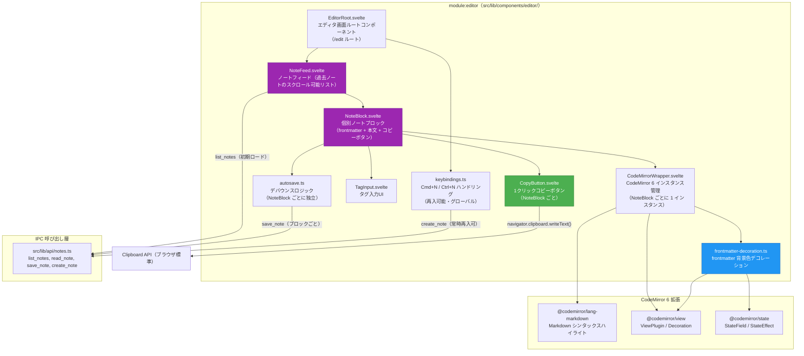
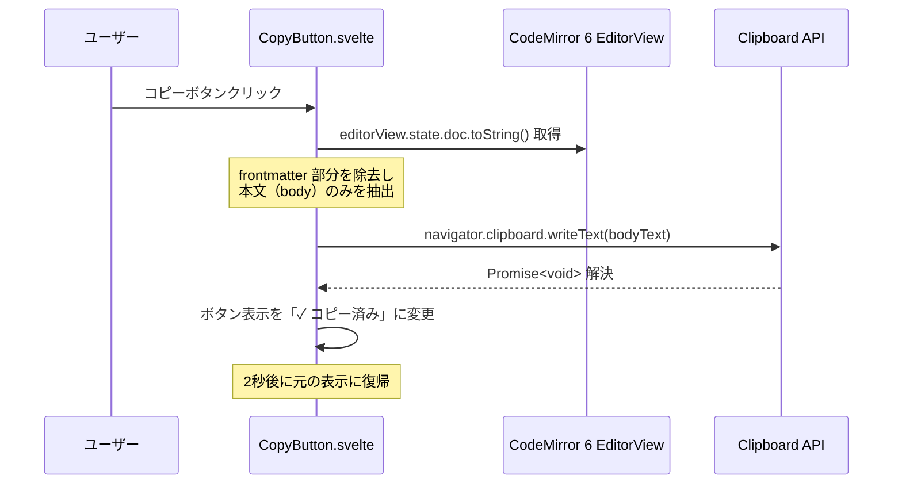
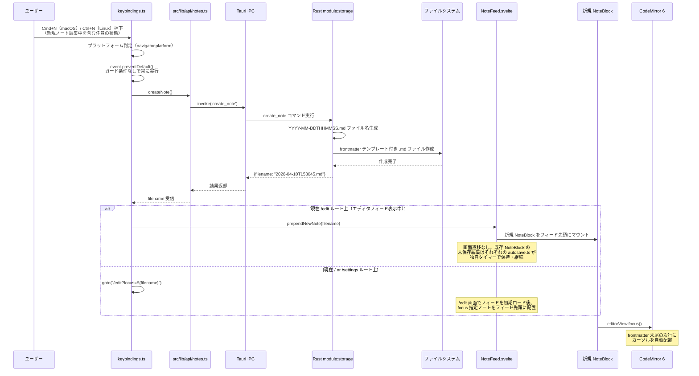
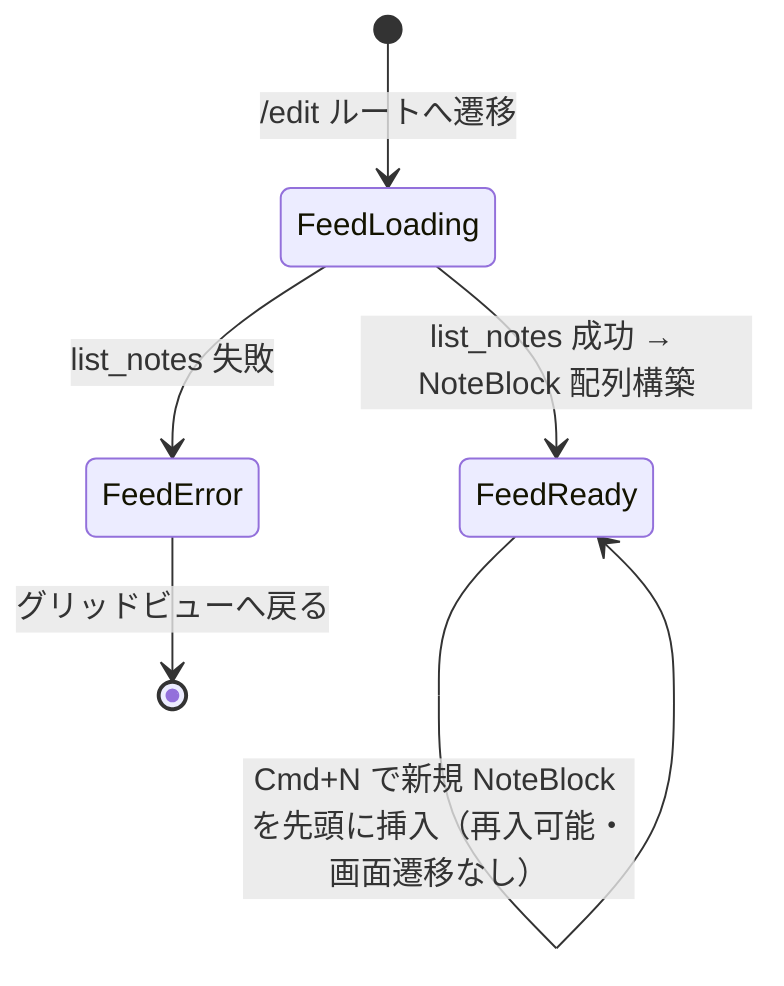
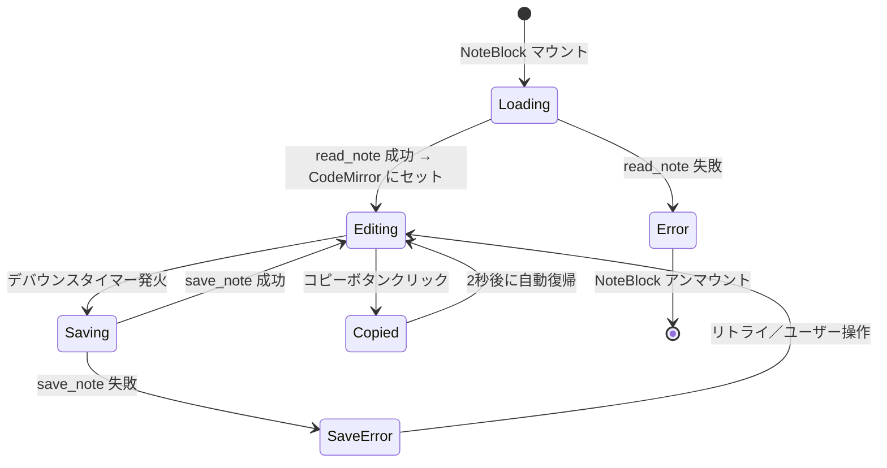
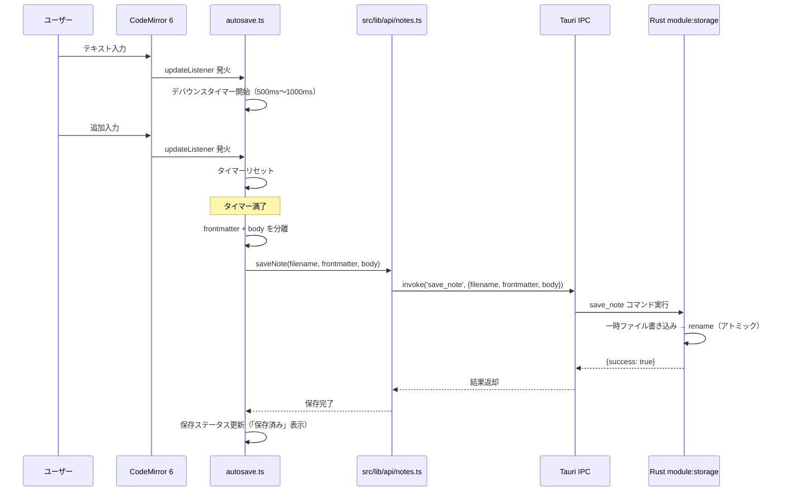

---
codd:
  node_id: detail:editor_clipboard
  type: design
  modules: [lib/editor]
  depends_on:
  - id: detail:component_architecture
    relation: depends_on
    semantic: technical
  depended_by:
  - id: plan:implementation_plan
    relation: depends_on
    semantic: technical
  conventions:
  - targets:
    - module:editor
    reason: CodeMirror 6 必須。Markdownシンタックスハイライトのみ（レンダリング禁止）。frontmatter領域は背景色で視覚的に区別必須。
  - targets:
    - module:editor
    reason: タイトル入力欄は禁止。本文のみのエディタ画面であること。
  - targets:
    - module:editor
    reason: 1クリックコピーボタンによる本文全体のクリップボードコピーはアプリの核心UX。未実装ならリリース不可。
  - targets:
    - module:editor
    reason: Cmd+N / Ctrl+N で即座に新規ノート作成しフォーカス移動必須。新規ノート編集中でも追加の新規ノートを作成できること（再入可能）。
  - targets:
    - module:editor
    reason: エディタ画面は過去のノートをスクロール可能なリスト（ノートフィード）として表示し、任意のノートを選択してその場で編集可能。未実装ならリリース不可。
  modules:
  - editor
---

# Editor & Clipboard Detailed Design

## 1. Overview

本設計書は、PromptNotes における `module:editor` のエディタ機能およびクリップボードコピー機能の詳細設計を定義する。エディタは CodeMirror 6 を基盤とし、Markdown シンタックスハイライト付きのプレーンテキスト編集のみを提供する。エディタ画面はノートフィード（現在編集中のノートに加え、過去のノートをスクロール可能なリストとして表示する単一画面）として構成され、各ノートブロックは独立した CodeMirror 6 インスタンス・独立した自動保存デバウンス・独立したコピーボタンを保持する。クリップボードへの 1 クリックコピーはアプリケーションの核心 UX であり、本設計書の中心的な対象である。

本設計書は以下のリリース不可制約（Non-negotiable conventions）に準拠する。

| 制約 ID | 対象 | 制約内容 | 本設計書での反映 |
|---|---|---|---|
| NNC-E1 | `module:editor` | CodeMirror 6 必須。Markdown シンタックスハイライトのみ（レンダリング禁止）。frontmatter 領域は背景色で視覚的に区別必須。 | §2 のエディタ構成図、§4 の CodeMirror 6 拡張構成、frontmatter デコレーション実装で反映。`@codemirror/lang-markdown` によるハイライトのみ許可し、HTML 要素（`<h1>`, `<strong>` 等）の生成を禁止する。 |
| NNC-E2 | `module:editor` | タイトル入力欄は禁止。本文のみのエディタ画面であること。 | §3 のエディタコンポーネント所有権で明示的に禁止。`<input>` や `<textarea>` によるタイトル専用フィールドを設置しない。ノートのタイトルは frontmatter 内の YAML フィールドとして本文中で編集する。 |
| NNC-E3 | `module:editor` | 1 クリックコピーボタンによる本文全体のクリップボードコピーはアプリの核心 UX。未実装ならリリース不可。 | §2 のコピーフローシーケンス図、§4 のコピーボタン実装仕様で反映。Clipboard API（`navigator.clipboard.writeText()`）を用いた即座コピーを実装する。 |
| NNC-E4 | `module:editor` | `Cmd+N` / `Ctrl+N` で即座に新規ノート作成しフォーカス移動必須。新規ノート編集中であっても再入可能であること。 | §2 の新規ノート作成シーケンス、§4 のキーバインド実装で反映。キー押下から CodeMirror 6 へのフォーカス移動までを一貫したフローとして定義し、ハンドラはルート・編集状態によらず常に動作する。 |
| NNC-E5 | `module:editor` | エディタ画面は過去のノートをスクロール可能なリストとして表示し、任意のノートを選択してその場で編集可能とする。 | §2.1 のコンポーネント構成図、§3 の所有権マトリクス、§4 のノートフィード実装仕様で反映。`NoteFeed.svelte` が複数の `NoteBlock.svelte` を縦に並べ、各ブロックが独立した `CodeMirrorWrapper` と自動保存を保持する。 |

エディタ画面は SvelteKit ルート `/edit` に対応し、Tauri IPC 経由で `list_notes`、`read_note`、`save_note`、`create_note` コマンドを呼び出す。個別ノートごとにルートを持たず、フィード全体が単一ルート上で描画される。クエリパラメータ `?focus=:filename` で初期フォーカス対象を指定する。フロントエンドからの直接ファイルシステムアクセスは設計上禁止されており（上位設計書 `component_architecture.md` の NNC-1 準拠）、すべてのファイル操作は Rust バックエンド経由で実行される。

対象プラットフォームは Linux および macOS である。ネットワーク通信は一切行わない。

## 2. Mermaid Diagrams

### 2.1 エディタコンポーネント内部構成



**所有権と境界**: `module:editor` 内の全コンポーネント・ユーティリティは `src/lib/components/editor/` ディレクトリに配置される。`EditorRoot.svelte` は `/edit` ルートに対応する画面全体のルートで、フィード外の全体状態（初期ロード、エラー、グローバルキーバインド）を所有する。`NoteFeed.svelte`（紫色）は `list_notes` を発行して初期のノート一覧を取得し、縦方向のスクロール可能リストとして `NoteBlock.svelte` を並べる。`NoteBlock.svelte`（紫色）は単一ノートを表現する独立ユニットで、`CodeMirrorWrapper`・`TagInput`・`CopyButton`・`autosave.ts` インスタンスを各自 1 個ずつ保持する。CodeMirror 6 のインスタンスライフサイクル（生成・破棄・拡張登録）は `CodeMirrorWrapper.svelte` が所有し、ブロックの初期マウント時に生成され、アンマウント時に破棄される。コピーボタン（緑色）は `CopyButton.svelte` として独立コンポーネント化し、各 NoteBlock の CodeMirror ドキュメント内容を受け取ってクリップボードに書き込む。frontmatter 背景色デコレーション（青色）は `frontmatter-decoration.ts` が ViewPlugin として実装し、`---` で囲まれた frontmatter 領域に CSS 背景色クラスを適用する。

IPC 呼び出しは `src/lib/api/notes.ts` に集約されており、エディタコンポーネントが `@tauri-apps/api/core` の `invoke()` を直接呼び出すことはない。これにより IPC コマンド名の変更がエディタ内部に波及しない。

### 2.2 1 クリックコピーフロー



**実装境界**: コピー対象は「本文全体」であり、frontmatter（`---` で囲まれた YAML ブロック）は除外する。frontmatter の開始・終了位置は CodeMirror のドキュメントテキストから正規表現 `/^---\n[\s\S]*?\n---\n/` で検出し、それ以降のテキストを本文として抽出する。コピー処理はブラウザ標準の Clipboard API（`navigator.clipboard.writeText()`）を使用し、Tauri の `clipboard-manager` プラグインは使用しない。これによりファイルシステム操作を伴わず、IPC を経由する必要がない。コピーボタンはエディタ画面の右上に固定配置し、1 クリックで即座にコピーが完了する。視覚フィードバック（「✓ コピー済み」表示）は 2 秒間維持した後、元の表示に戻す。

### 2.3 新規ノート作成とフォーカス移動フロー（Cmd+N / Ctrl+N、再入可能）



**実装境界**: キーバインド検出は `keybindings.ts` が所有し、`document.addEventListener('keydown', ...)` でグローバルにリッスンする。`Cmd+N`（macOS）と `Ctrl+N`（Linux）の判定は `navigator.platform` または `navigator.userAgentData` を用いて行う。ファイル名生成は Rust 側 `module:storage` が排他的に所有し、フロントエンドはファイル名を生成しない。ハンドラは現在のルート・現在フォーカスされているノートの編集状態（新規ノート編集中・未保存・空の新規ノート含む）に関係なく常に `create_note` を発行する。既存のフォーカス対象ノートがあれば、そのノートの `autosave.ts` がタイマーを保持したまま独立して最後の編集を保存する。新規 NoteBlock のマウント後、`editorView.focus()` でカーソルを新規ノートに移動し、frontmatter の終了 `---` の次行に初期配置する。

### 2.4 エディタ状態遷移

状態はフィード全体（`FeedLoading` / `FeedReady` / `FeedError`）と各 `NoteBlock` のブロック単位状態（`Loading` / `Editing` / `Saving` / `Copied` / `SaveError`）の 2 階層で管理される。

#### フィード全体の状態



#### 個別 NoteBlock の状態



**状態所有権**: フィード全体の状態（`FeedLoading`, `FeedReady`, `FeedError`）は `EditorRoot.svelte` または `NoteFeed.svelte` のいずれかが Svelte ストアとして所有し、一意に決定する。個別 `NoteBlock` の状態（`Loading`, `Editing`, `Saving`, `Copied`, `SaveError`）は各 `NoteBlock.svelte` インスタンスが独立したリアクティブ変数として保有し、他のブロックに影響を与えない。CodeMirror 6 自体はドキュメント内容とカーソル位置を内部状態として持つが、保存状態やコピー状態は `NoteBlock` 側が所有する。`Saving` 状態ではそのブロックの編集は継続可能であり、保存完了を待たずにユーザーは入力を続けられる。あるブロックの保存処理が別ブロックの編集や `Cmd+N` による新規ノート挿入をブロックすることはない。

### 2.5 自動保存デバウンスフロー



**実装境界**: デバウンスロジックは `autosave.ts` が単独で所有する。デバウンス間隔は 500ms〜1000ms の範囲で設定し（OQ-CA-001 で最終決定）、`setTimeout` / `clearTimeout` パターンで実装する。`autosave.ts` は CodeMirror 6 の `EditorView.updateListener` 拡張として登録され、ドキュメント変更時にのみ発火する（カーソル移動のみでは発火しない）。frontmatter と body の分離はフロントエンド側で行い、Rust 側の `save_note` コマンドには分離済みのデータを渡す。

## 3. Ownership Boundaries

### 3.1 module:editor 内部の所有権マトリクス

| コンポーネント / ユーティリティ | ファイルパス | 所有する責務 | 禁止事項 |
|---|---|---|---|
| `EditorRoot.svelte` | `src/lib/components/editor/EditorRoot.svelte` | `/edit` ルート全体のレイアウト、フィード全体の状態管理（FeedLoading / FeedReady / FeedError）、`NoteFeed` の配置、グローバルキーバインドの登録 | タイトル入力欄（`<input>`, `<textarea>`）の設置、Markdown レンダリング HTML 要素の生成 |
| `NoteFeed.svelte` | `src/lib/components/editor/NoteFeed.svelte` | 初期ロード時の `list_notes` 呼び出し、取得したノートの `NoteBlock` 配列への展開、新規ノート作成時のフィード先頭への挿入、`?focus=:filename` クエリに基づく初期フォーカス位置の決定、スクロール位置の管理 | 個別ノートの CodeMirror 状態管理（各 `NoteBlock` の責務）、ファイル名生成、直接ファイルシステムアクセス |
| `NoteBlock.svelte` | `src/lib/components/editor/NoteBlock.svelte` | 単一ノート（frontmatter + 本文 + コピーボタン）のレイアウト、そのノート専用の `CodeMirrorWrapper`・`TagInput`・`CopyButton`・`autosave.ts` インスタンスの保有、ブロック単位の状態（Editing/Saving/Copied/SaveError）管理 | 他ノートブロックの状態への干渉、フィード全体レイアウトの制御 |
| `CodeMirrorWrapper.svelte` | `src/lib/components/editor/CodeMirrorWrapper.svelte` | CodeMirror 6 `EditorView` のライフサイクル管理（`NoteBlock` マウント時に生成、アンマウント時に破棄）、拡張の登録、ドキュメント内容の読み書き | CodeMirror 以外のエディタエンジンの使用、直接ファイルシステムアクセス、複数 `NoteBlock` 間での単一 EditorView の共有 |
| `CopyButton.svelte` | `src/lib/components/editor/CopyButton.svelte` | 1 クリックコピーボタンの UI 表示、親 `NoteBlock` の CodeMirror ドキュメントからの本文抽出、クリップボード書き込み、視覚フィードバック（「✓ コピー済み」2 秒間表示） | Tauri `clipboard-manager` プラグインの使用（Clipboard API を使用する）、frontmatter を含めたコピー、他ノートブロックの本文への参照 |
| `TagInput.svelte` | `src/lib/components/editor/TagInput.svelte` | タグの追加・削除 UI、親 `NoteBlock` の frontmatter 内 `tags` フィールドとの双方向バインディング | `tags` 以外のメタデータフィールドの自動挿入 |
| `autosave.ts` | `src/lib/components/editor/autosave.ts` | `NoteBlock` ごとに独立した自動保存デバウンスロジック（タイマー管理、保存トリガー）。`Cmd+N` 等による新規ノート挿入時に他 `NoteBlock` のタイマーを中断しない | ファイルパスの解決、保存先ディレクトリの操作、グローバルな単一デバウンスタイマーの共有 |
| `keybindings.ts` | `src/lib/components/editor/keybindings.ts` | `Cmd+N` / `Ctrl+N` のグローバルキーバインド検出、現在のルート・編集状態によるガードなしの `create_note` 発行、現在ルートが `/edit` ならフィード先頭へのノート挿入、それ以外なら `/edit?focus=:filename` への遷移 | ファイル名の生成（Rust 側 `module:storage` の責務）、現在のフォーカス状態に基づく `Cmd+N` のスキップ |
| `frontmatter-decoration.ts` | `src/lib/components/editor/frontmatter-decoration.ts` | CodeMirror 6 ViewPlugin として frontmatter 領域（`---` 〜 `---`）に背景色 CSS クラスを適用するデコレーション | frontmatter のパース・バリデーション（表示目的の範囲検出のみ行う） |

### 3.2 module:editor と他モジュールの境界

| 連携先モジュール | 連携方法 | module:editor 側の責務 | 連携先の責務 |
|---|---|---|---|
| `module:storage`（Rust） | IPC 経由 `read_note`, `save_note`, `create_note` | filename の指定、frontmatter/body の分離と送信、デバウンスによる保存頻度制御 | ファイル名生成（`YYYY-MM-DDTHHMMSS.md`）、パス解決、アトミック書き込み、frontmatter パース/シリアライズ |
| `module:shell`（Rust） | IPC コマンドディスパッチ | コマンド名と引数型の遵守 | `#[tauri::command]` ハンドラ登録、`AppState` 管理 |
| `module:grid` | SvelteKit ルーティング経由の画面遷移 | `/edit?focus=:filename` でフィードを表示し指定ノートを先頭付近に配置 | グリッドビューからの `filename` クエリパラメータ付き遷移 |
| `src/lib/api/notes.ts` | TypeScript 関数呼び出し | API 層の関数を呼び出し、`invoke()` を直接呼ばない | IPC コマンド呼び出しの抽象化、型安全なインターフェース提供 |

### 3.3 コピーボタンの単一所有者

コピーボタン（`CopyButton.svelte`）は `module:editor` が排他的に所有する。グリッドビュー（`module:grid`）からのコピー機能は現時点では提供しない。コピー対象テキストの取得元は CodeMirror 6 の `EditorView.state.doc` であり、`CopyButton.svelte` は親コンポーネント `EditorRoot.svelte` から `editorView` インスタンスへの参照を props として受け取る。

### 3.4 frontmatter デコレーションの単一所有者

frontmatter 領域の視覚的区別（背景色適用）は `frontmatter-decoration.ts` が単独で所有する。このモジュールは CodeMirror 6 の `ViewPlugin` として実装され、ドキュメント先頭の `---\n` から次の `\n---\n` までの範囲を検出し、`Decoration.line()` で CSS クラス `.cm-frontmatter-bg` を各行に適用する。背景色の具体的な CSS 値は `src/lib/styles/editor.css` に定義する（例: `background-color: rgba(59, 130, 246, 0.08)`）。

### 3.5 キーバインドの所有権分離

| キーバインド | 所有者 | スコープ |
|---|---|---|
| `Cmd+N` / `Ctrl+N`（新規ノート作成） | `keybindings.ts` | グローバル（`document` レベル） |
| CodeMirror 標準キーバインド（Undo, Redo, 選択等） | CodeMirror 6 内蔵 `keymap` | エディタフォーカス中のみ |
| `Cmd+S` / `Ctrl+S`（手動保存） | `autosave.ts`（デバウンスをバイパスして即時保存） | エディタフォーカス中のみ |

`Cmd+N` / `Ctrl+N` はグローバルキーバインドとして `document.addEventListener('keydown', ...)` で登録するため、エディタ画面以外（グリッドビュー、設定画面）からも新規ノート作成が可能である。また、エディタフィード上で新規ノートを編集中であっても再入可能であり、ハンドラ内に「現在編集中のノートが新規ノートかどうか」「未保存変更があるか」等のガード条件を一切持たない。ブラウザのデフォルト動作（新規ウィンドウを開く等）は `event.preventDefault()` で抑制する。

## 4. Implementation Implications

### 4.1 CodeMirror 6 拡張構成

`CodeMirrorWrapper.svelte` の `onMount` で以下の拡張を登録する。

```typescript
import { EditorView, keymap } from '@codemirror/view';
import { EditorState } from '@codemirror/state';
import { markdown, markdownLanguage } from '@codemirror/lang-markdown';
import { defaultKeymap, history, historyKeymap } from '@codemirror/commands';
import { syntaxHighlighting, defaultHighlightStyle } from '@codemirror/language';
import { frontmatterDecoration } from './frontmatter-decoration';
import { createAutoSaveExtension } from './autosave';

const extensions = [
  markdown({ base: markdownLanguage }),
  syntaxHighlighting(defaultHighlightStyle),
  frontmatterDecoration(),          // NNC-E1: frontmatter 背景色
  createAutoSaveExtension(filename), // 自動保存デバウンス
  keymap.of([...defaultKeymap, ...historyKeymap]),
  history(),
  EditorView.lineWrapping,
];
```

**NNC-E1 準拠**: `@codemirror/lang-markdown` パッケージによるシンタックスハイライトのみを使用する。`markdown-it` や `remark` 等のレンダリングエンジンは導入しない。CodeMirror のドキュメントはプレーンテキストとして表示され、Markdown 構文（`#`, `**`, `- ` 等）はハイライト色で視覚的に区別されるが、HTML 要素には変換されない。

**NNC-E2 準拠**: エディタ画面には `<input>` や `<textarea>` によるタイトル入力欄を設置しない。ノートのタイトルは frontmatter YAML 内の `title` フィールドとして、CodeMirror エディタ内で本文と同一のインターフェースで編集する。

### 4.2 frontmatter 背景色デコレーション実装

```typescript
// frontmatter-decoration.ts
import { ViewPlugin, Decoration, DecorationSet, EditorView } from '@codemirror/view';

const frontmatterLineDeco = Decoration.line({ class: 'cm-frontmatter-bg' });

export function frontmatterDecoration() {
  return ViewPlugin.fromClass(
    class {
      decorations: DecorationSet;
      constructor(view: EditorView) {
        this.decorations = this.buildDecorations(view);
      }
      update(update: any) {
        if (update.docChanged || update.viewportChanged) {
          this.decorations = this.buildDecorations(update.view);
        }
      }
      buildDecorations(view: EditorView): DecorationSet {
        const doc = view.state.doc.toString();
        if (!doc.startsWith('---\n')) return Decoration.none;
        const endIndex = doc.indexOf('\n---\n', 4);
        if (endIndex === -1) return Decoration.none;
        const endPos = endIndex + 4; // '\n---\n'.length - 1 for line end
        const widgets: any[] = [];
        for (let pos = 0; pos <= endPos; ) {
          const line = view.state.doc.lineAt(pos);
          widgets.push(frontmatterLineDeco.range(line.from));
          pos = line.to + 1;
        }
        return Decoration.set(widgets);
      }
    },
    { decorations: (v) => v.decorations }
  );
}
```

**NNC-E1 準拠**: frontmatter 領域（ドキュメント先頭の `---` から次の `---` まで）に `.cm-frontmatter-bg` CSS クラスを適用し、背景色で視覚的に区別する。CSS 定義は以下のとおり。

```css
/* src/lib/styles/editor.css */
.cm-frontmatter-bg {
  background-color: rgba(59, 130, 246, 0.08);
}
```

### 4.3 コピーボタン実装

```svelte
<!-- CopyButton.svelte -->
<script lang="ts">
  import type { EditorView } from '@codemirror/view';

  export let editorView: EditorView;

  let copied = false;
  let timer: ReturnType<typeof setTimeout> | null = null;

  function extractBody(doc: string): string {
    const match = doc.match(/^---\n[\s\S]*?\n---\n/);
    return match ? doc.slice(match[0].length) : doc;
  }

  async function handleCopy() {
    const fullText = editorView.state.doc.toString();
    const body = extractBody(fullText);
    await navigator.clipboard.writeText(body);
    copied = true;
    if (timer) clearTimeout(timer);
    timer = setTimeout(() => { copied = false; }, 2000);
  }
</script>

<button
  class="copy-button"
  on:click={handleCopy}
  aria-label="本文をコピー"
>
  {copied ? '✓ コピー済み' : 'コピー'}
</button>
```

**NNC-E3 準拠**: 1 クリックで本文全体（frontmatter 除外）をクリップボードにコピーする。`navigator.clipboard.writeText()` は HTTPS コンテキストまたは `localhost` で動作し、Tauri の WebView 環境ではセキュアコンテキストとして扱われるため利用可能である。Tauri の `clipboard-manager` プラグインは使用せず、ブラウザ標準 API のみで実装する。コピーボタンはエディタ画面右上に常時表示し、視認性と到達性を確保する。

### 4.4 Cmd+N / Ctrl+N キーバインド実装（再入可能）

```typescript
// keybindings.ts
import { goto } from '$app/navigation';
import { page } from '$app/stores';
import { get } from 'svelte/store';
import { createNote } from '$lib/api/notes';
import { noteFeed } from '$lib/components/editor/noteFeedStore';

const isMac = navigator.platform.toUpperCase().indexOf('MAC') >= 0;

export function registerGlobalKeybindings() {
  const handler = async (e: KeyboardEvent) => {
    if ((isMac ? e.metaKey : e.ctrlKey) && e.key === 'n') {
      e.preventDefault();
      // ガード条件なし。現在の編集状態・フォーカス状態に関係なく常に発行する。
      const { filename } = await createNote();
      const currentPath = get(page).url.pathname;
      if (currentPath === '/edit') {
        // 既にエディタフィード表示中：画面遷移せずフィード先頭に挿入
        noteFeed.prependNewNote(filename);
      } else {
        // グリッドビューや設定画面から：/edit へ遷移し focus を指定
        await goto(`/edit?focus=${filename}`);
      }
      // 新規 NoteBlock のマウント完了後、NoteBlock 側の onMount で editorView.focus() を実行
    }
  };
  document.addEventListener('keydown', handler);
  return () => document.removeEventListener('keydown', handler);
}
```

**NNC-E4 準拠**: `Cmd+N`（macOS）/ `Ctrl+N`（Linux）で即座に新規ノート作成を開始する。`event.preventDefault()` でブラウザデフォルト動作を抑制する。`create_note` IPC コマンドで Rust 側がファイル名を生成し、フロントエンドは戻り値の `filename` を用いて以下のいずれかを実行する:

- 現在ルートが `/edit` の場合: `noteFeed` ストアの `prependNewNote()` を呼び出し、フィード先頭に新規 `NoteBlock` を挿入する。画面遷移は発生しない。既存の `NoteBlock` とその `autosave.ts` タイマーはそのまま継続し、未保存編集は独立に保存される。
- それ以外のルート（`/`, `/settings` 等）の場合: `goto('/edit?focus=:filename')` で `/edit` ルートへ遷移する。`NoteFeed.svelte` はマウント時に `list_notes` で初期ロードし、`focus` 指定ノートを先頭に配置する。

いずれの場合も新規 `NoteBlock` の `onMount` で `editorView.focus()` を呼び出し、frontmatter 終了行の次行にカーソルを配置する。キー押下からフォーカス移動までの応答時間は、ファイル作成の I/O を含めて体感上即座（200ms 以内）を目標とする。重要な制約として、ハンドラ内に「既に新規ノートを編集中である」「直前にも `Cmd+N` を押した」等のガード条件を**一切設けない**。これは NNC-E4 の再入可能要件（AC-ED-08 / FC-ED-07）を満たすためである。

### 4.5 自動保存デバウンスの実装パターン

`autosave.ts` は CodeMirror 6 の `EditorView.updateListener` 拡張として実装する。

```typescript
// autosave.ts
import { EditorView } from '@codemirror/view';
import { saveNote } from '$lib/api/notes';

const DEBOUNCE_MS = 750; // OQ-CA-001 で最終調整

export function createAutoSaveExtension(filename: string) {
  let timer: ReturnType<typeof setTimeout> | null = null;

  return EditorView.updateListener.of((update) => {
    if (!update.docChanged) return;
    if (timer) clearTimeout(timer);
    timer = setTimeout(async () => {
      const doc = update.view.state.doc.toString();
      const { frontmatter, body } = parseFrontmatterAndBody(doc);
      await saveNote(filename, frontmatter, body);
    }, DEBOUNCE_MS);
  });
}
```

デバウンス間隔の初期値は 750ms とし、OQ-CA-001 のユーザーテスト結果に基づいて 500ms〜1000ms の範囲で最終調整する。

### 4.6 IPC 呼び出し層（notes.ts）のエディタ関連 API

```typescript
// src/lib/api/notes.ts
import { invoke } from '@tauri-apps/api/core';
import type { NoteMetadata, Frontmatter } from '$lib/types/note';

export async function createNote(): Promise<{ filename: string }> {
  return invoke('create_note');
}

export async function readNote(filename: string): Promise<{ frontmatter: Frontmatter; body: string }> {
  return invoke('read_note', { filename });
}

export async function saveNote(filename: string, frontmatter: Frontmatter, body: string): Promise<{ success: boolean }> {
  return invoke('save_note', { filename, frontmatter, body });
}
```

エディタコンポーネントは `invoke()` を直接使用せず、この API 層を経由する。`filename` のみを指定し、フルパスの解決は Rust バックエンド（`module:storage`）に委譲する。

### 4.7 エディタ画面のレイアウト構成

エディタ画面は `NoteFeed` が縦方向に複数の `NoteBlock` を並べた単一のスクロールビューである。各 `NoteBlock` はヘッダー・frontmatter 領域・本文領域から構成され、コピーボタンを各ブロックに保持する。

```
┌─────────────────────────────────────────┐
│  ← 戻る                                  │  ← グローバルヘッダー
├─────────────────────────────────────────┤ ▲
│  ┌─────────────────────────────┐        │ │
│  │ NoteBlock #1（新規・先頭）     [コピー]│ │ ← 各ブロックのヘッダー
│  │ ---                           │        │ │
│  │ tags: [prompt]                │        │ │ ← frontmatter 領域
│  │ ---                           │        │ │   （背景色で視覚的区別）
│  │ 新しい本文テキスト...           │        │ │ ← 本文領域
│  └─────────────────────────────┘        │ │   （CodeMirror 6）
│                                          │ │
│  ┌─────────────────────────────┐        │ │
│  │ NoteBlock #2（過去ノート）    [コピー]│ │
│  │ ---                           │        │ │  スクロール
│  │ tags: [gpt, coding]           │        │ │  可能
│  │ ---                           │        │ │
│  │ 前回書いたプロンプト...         │        │ │
│  └─────────────────────────────┘        │ │
│                                          │ │
│  ┌─────────────────────────────┐        │ │
│  │ NoteBlock #3              [コピー]    │ │
│  │  ...                          │        │ │
│  └─────────────────────────────┘        │ ▼
└─────────────────────────────────────────┘
```

- タイトル入力欄は存在しない（NNC-E2 準拠）。タイトルは frontmatter 内の `title` フィールドとして編集する。
- コピーボタンは各 `NoteBlock` のヘッダー右端に配置し、そのブロック本文のみを対象とする（NNC-E3 準拠）。
- frontmatter 領域は `.cm-frontmatter-bg` クラスによる背景色で区別する（NNC-E1 準拠）。
- 各 `NoteBlock` の CodeMirror 6 エディタは `EditorView.lineWrapping` による折り返し表示を有効にする。ブロック高さは本文の行数に応じて可変とする。
- フィード全体のスクロールは `NoteFeed` が所有し、個別 `NoteBlock` は内部スクロールを持たない。
- タグ入力 UI は各 `NoteBlock` の frontmatter 領域と連動する `TagInput.svelte` が提供する（ブロックごとに独立）。

### 4.8 E2E テストケース

Playwright による E2E テストで以下のエディタ固有テストケースを実装する。

| テストケース | 検証内容 | 対応する NNC |
|---|---|---|
| `editor-copy.spec.ts` | コピーボタンクリックで本文（frontmatter 除外）がクリップボードに書き込まれること | NNC-E3 |
| `editor-copy.spec.ts` | コピー後に「✓ コピー済み」表示が 2 秒間表示されること | NNC-E3 |
| `editor-new-note.spec.ts` | `Cmd+N` / `Ctrl+N` で新規ノートが作成され、エディタにフォーカスが移動すること | NNC-E4 |
| `editor-new-note.spec.ts` | 新規ノート編集中に再度 `Cmd+N` / `Ctrl+N` を押すと、追加の新規ノートがフィード先頭に挿入されフォーカスが移動する。先に入力中だった新規ノートの内容は失われず自動保存される | NNC-E4（再入可能要件） |
| `editor-feed.spec.ts` | エディタ画面初期ロード時に複数の過去ノートブロックが DOM 上に同時描画されていること | NNC-E5 |
| `editor-feed.spec.ts` | 過去ノートブロックの本文にクリック→入力→デバウンス経過後に該当ファイルのみが `save_note` 経由で更新されること | NNC-E5 |
| `editor-feed.spec.ts` | ブロックごとに独立した CodeMirror インスタンスが生成されていること（DOM 上の `.cm-editor` 要素数がブロック数と一致） | NNC-E5 |
| `editor-frontmatter.spec.ts` | frontmatter 領域に背景色クラス `.cm-frontmatter-bg` が適用されていること | NNC-E1 |
| `editor-no-title-input.spec.ts` | エディタ画面にタイトル専用の `input` / `textarea` が存在しないこと | NNC-E2 |
| `editor-no-render.spec.ts` | エディタ本文領域に `<h1>`, `<strong>`, `<em>` 等のレンダリング済み HTML 要素が存在しないこと | NNC-E1 |
| `editor-autosave.spec.ts` | テキスト入力後、デバウンス時間経過後に `save_note` IPC が発行されること（ブロックごとに独立） | 自動保存機能 |

### 4.9 パフォーマンス目標

| 操作 | 目標応答時間 | 測定方法 |
|---|---|---|
| `Cmd+N` / `Ctrl+N` → エディタフォーカス移動 | 200ms 以内 | キー押下イベントから `editorView.focus()` 完了までの経過時間 |
| コピーボタンクリック → クリップボード書き込み完了 | 50ms 以内 | クリックイベントから `navigator.clipboard.writeText()` の Promise 解決まで |
| 自動保存（デバウンス発火後） | 100ms 以内（I/O 含む） | `save_note` IPC 呼び出しから結果返却まで |
| エディタ画面初回ロード（`read_note` + CodeMirror マウント） | 300ms 以内 | ルーティング遷移開始からエディタ表示完了まで |

## 5. Open Questions

| ID | 質問 | 影響範囲 | 解決トリガー |
|---|---|---|---|
| OQ-EC-001 | コピーボタンクリック時のフィードバックとして、「✓ コピー済み」テキスト表示に加えてツールチップやトースト通知を追加するか。現設計ではボタンテキスト変更（2 秒間）のみ。 | `CopyButton.svelte` | UI プロトタイプでのユーザーテスト |
| OQ-EC-002 | frontmatter 背景色の具体的な色値（現設計: `rgba(59, 130, 246, 0.08)`）をダークモード対応時にどう切り替えるか。現時点ではライトテーマのみ。 | `frontmatter-decoration.ts`, `editor.css` | ダークモード対応の設計開始時 |
| OQ-EC-003 | `Cmd+S` / `Ctrl+S` による手動保存を実装するか。自動保存のみで十分と判断する場合は不要だが、ユーザーの保存習慣を考慮すると実装が望ましい可能性がある。 | `autosave.ts`, `keybindings.ts` | ユーザーテスト時のフィードバック |
| OQ-EC-004 | コピー対象を「frontmatter を除いた本文全体」から「ユーザー選択テキスト（選択がある場合）」に拡張するか。選択テキストコピーは OS 標準の `Cmd+C` / `Ctrl+C` で既に可能であるため、1 クリックコピーボタンは本文全体コピーに専念する方針で進めるか。 | `CopyButton.svelte` | 核心 UX レビュー時 |
| OQ-EC-005 | タグ入力 UI（`TagInput.svelte`）の変更を frontmatter に反映する際、CodeMirror のドキュメントを直接編集するか、保存時に frontmatter を再構築するか。前者はリアルタイム反映だが CodeMirror トランザクション管理が複雑化する。 | `TagInput.svelte`, `autosave.ts` | エディタコンポーネント実装開始時 |
| OQ-EC-006 | ノートフィードの初期ロード件数と追加読み込み方式（無限スクロール / ページング / 仮想スクロール）。件数が数百件規模に達した場合の DOM ノード数と CodeMirror インスタンス数を管理する方針を決定する必要がある。 | `NoteFeed.svelte`, `module:storage` | フィード実装開始時 |
| OQ-EC-007 | 各 `NoteBlock` が保持する CodeMirror インスタンスのメモリフットプリント。ブロック数が増えた場合にオフスクリーンブロックの EditorView を破棄して軽量なプレビュー表示に切り替えるか、全ブロックで EditorView を保持し続けるか。 | `NoteBlock.svelte`, `NoteFeed.svelte` | パフォーマンステスト時 |
| OQ-EC-008 | 新規ノート編集中に `Cmd+N` が再入したとき、既存の新規ノートが空（frontmatter テンプレートのみで本文未入力）だった場合にその空ノートを物理削除するか、そのまま保持するか。保持する場合、空の `.md` ファイルがストレージに蓄積するため定期的なクリーンアップが必要。 | `NoteFeed.svelte`, `module:storage` | ユーザビリティレビュー時 |
