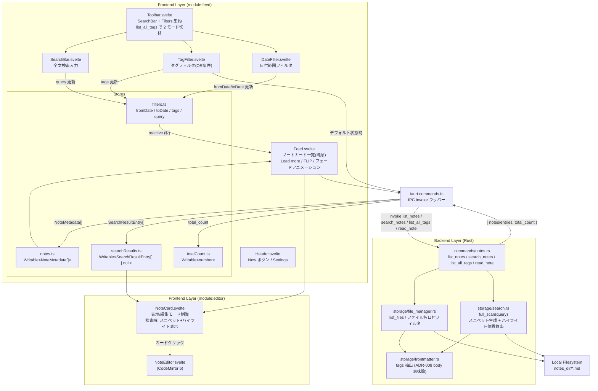
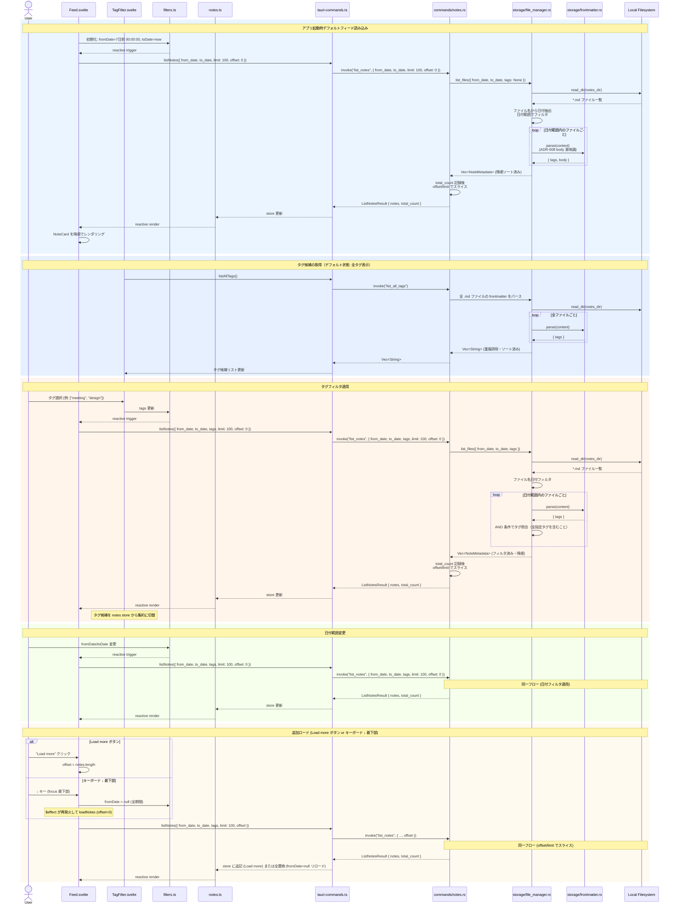
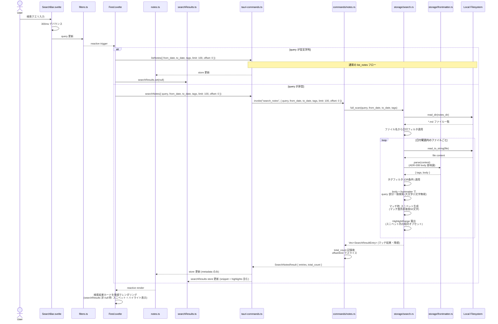
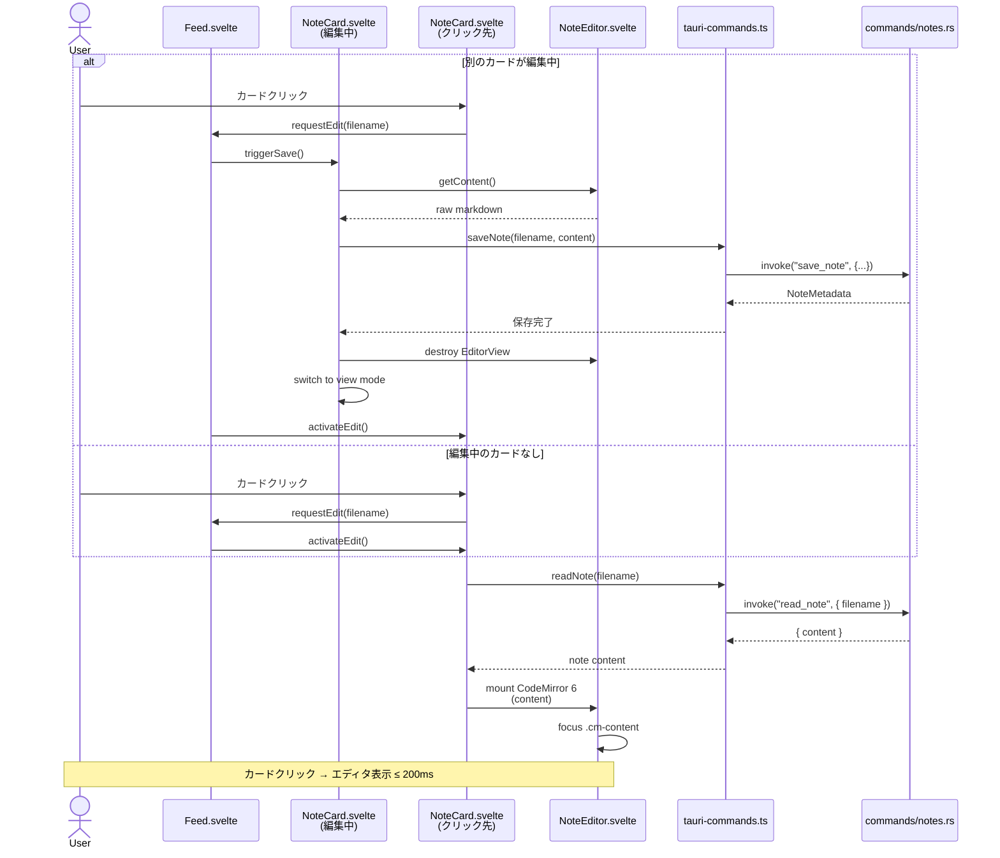
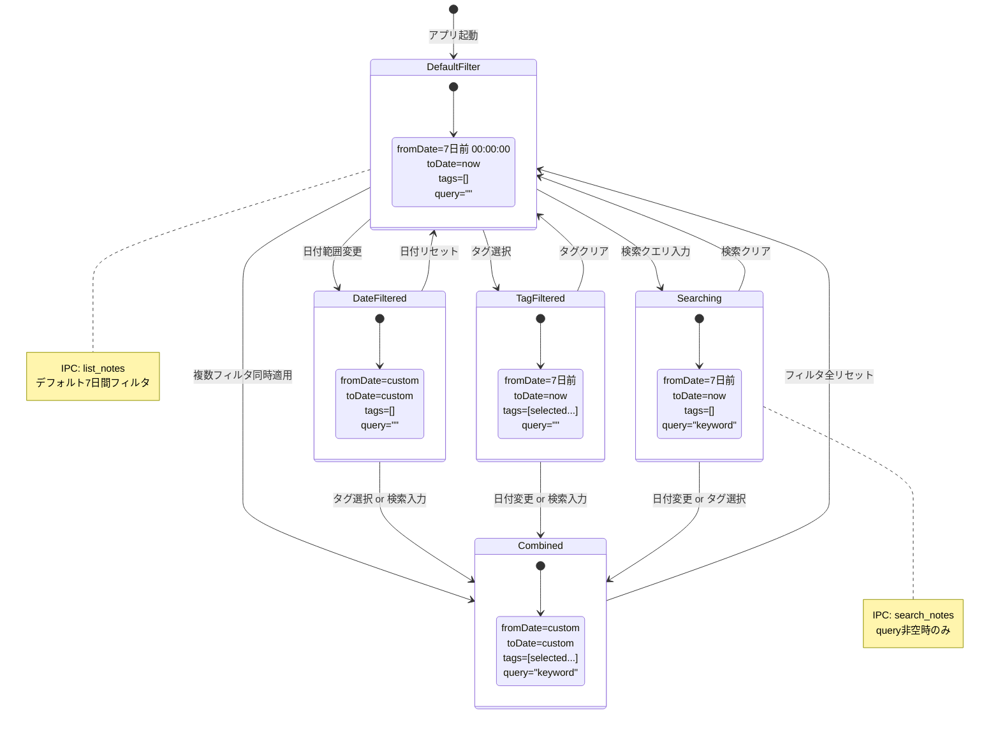

---
codd:
  node_id: detail:feed_search
  type: design
  depends_on:
  - id: detail:component_architecture
    relation: depends_on
    semantic: technical
  - id: detail:storage_fileformat
    relation: depends_on
    semantic: technical
  depended_by:
  - id: plan:implementation_plan
    relation: depends_on
    semantic: technical
  conventions:
  - targets:
    - module:feed
    reason: デフォルトフィルタは直近7日間。ノートは降順フィード表示。
  - targets:
    - module:feed
    reason: タグ・日付フィルタおよび全文検索（ファイル全走査）は必須機能。
  - targets:
    - module:feed
    - module:editor
    reason: カードクリックで編集モードへ遷移必須。
  modules:
  - feed
  - storage
---

# Feed & Search Detailed Design

## 1. Overview

本設計書は PromptNotes における `module:feed` のフィード表示・フィルタリング・全文検索機能を詳細に定義する。上流の Component Architecture（detail:component_architecture）で規定されたフロントエンド `Feed.svelte` / `SearchBar.svelte` / `TagFilter.svelte` / `DateFilter.svelte` コンポーネント群と、Rust バックエンドの `storage/search.rs` / `commands/notes.rs` の連携を、実装可能な粒度まで分解する。Storage & File Format Design（detail:storage_fileformat）で定義されたファイル命名規則・frontmatter スキーマ・`NoteMetadata` 構造体を前提とし、フィード画面からノート編集モードへの遷移フローを含めて規定する。

### 対象スコープ

| 領域 | 内容 |
|---|---|
| フィード表示 | ノートカードの降順一覧表示。デフォルトフィルタは直近 7 日間 |
| 日付フィルタ | ファイル名ベースの日付範囲フィルタリング |
| タグフィルタ | frontmatter `tags` フィールドによるフィルタリング。`list_notes`: AND 条件（全指定タグを含む）、`search_notes`: OR 条件（いずれかのタグを含む） |
| 全文検索 | `storage/search.rs` によるファイル全走査検索 |
| カード→編集遷移 | カードクリックで `NoteCard.svelte` が編集モードへ遷移 |
| アニメーション | ノート追加時のフェードイン・削除時のフェードアウト・残存カードの FLIP アニメーション（AC-UI-09, AC-UI-10） |

### リリースブロッキング制約への準拠

本設計書は以下の非交渉条件を全セクションにわたって反映する。

| 制約 | 準拠方法 |
|---|---|
| デフォルトフィルタは直近 7 日間。ノートは降順フィード表示。 | §2 のフローチャートおよびシーケンス図で、アプリ起動時に `filters` store の `fromDate` を 7 日前の `00:00:00`、`toDate` を現在日時に初期化し、`list_notes` を発行するフローを明示する。`Feed.svelte` はレスポンスの `NoteMetadata[]` を `created_at` 降順でレンダリングする。 |
| タグ・日付フィルタおよび全文検索（ファイル全走査）は必須機能。 | §2 のシーケンス図でタグフィルタ（list_notes: AND 条件、search_notes: OR 条件）・日付フィルタ・全文検索の 3 つのフローを網羅する。§4 で各機能の実装方針とパフォーマンス閾値を定義する。 |
| カードクリックで編集モードへ遷移必須。 | §2 のシーケンス図でカードクリックから `NoteCard.svelte` の表示モード→編集モード遷移、CodeMirror 6 マウント、フォーカスまでのフローを定義する。§4 で遷移時の自動保存連携を規定する。 |

### IPC 境界制約への準拠

Component Architecture で規定された Tauri IPC 境界制約に従い、フィード・検索に関わるすべてのファイルシステムアクセスは Rust バックエンド経由で実行される。フロントエンドの `Feed.svelte` / `SearchBar.svelte` / `TagFilter.svelte` / `DateFilter.svelte` は `tauri-commands.ts` の型安全ラッパーのみを経由して IPC コマンド（`list_notes`, `search_notes`, `list_all_tags`, `read_note`）を呼び出す。`@tauri-apps/plugin-fs` の直接インポートは ESLint ルール `no-restricted-imports` で禁止される。

## 2. Mermaid Diagrams

### 2.1 フィード・検索のコンポーネント構成図



この図は `module:feed` を中心としたフィード・検索のコンポーネント依存関係を示す。重要な設計制約は以下の通り。

- **フィルタ→データ取得の一方向フロー**: `SearchBar.svelte`、`TagFilter.svelte`、`DateFilter.svelte` が `filters` store を更新し、`Feed.svelte` の reactive ブロック（`$:` ステートメント）がフィルタ変更を検知して `tauri-commands.ts` 経由で適切な IPC コマンドを発行する。UI コンポーネントは直接 IPC を呼び出さない。ただし `TagFilter.svelte` はデフォルト状態（`tags=[]` かつ `query=""`）でのタグ候補取得のために `list_all_tags` を直接発行する（フィルタ更新を伴わないため）。
- **モジュール境界の明確化**: `Feed.svelte`（`module:feed`）はカード一覧のレンダリングを所有し、各カード内の表示/編集モード遷移は `NoteCard.svelte`（`module:editor`）が所有する。`Feed.svelte` が CodeMirror 6 のインスタンス管理に関与することは禁止される。
- **IPC 経由の排他的データ取得**: フロントエンドからファイルシステムへの直接アクセスは存在しない。`notes.ts` store の更新は必ず `tauri-commands.ts` → `commands/notes.rs` のレスポンスによって行われる。
- **frontmatter パースの単一所有**: ファイル I/O を伴う frontmatter パースは `storage/frontmatter.rs` が単一所有する（ADR-008 body 意味論の Rust 側所有者）。`search.rs` および `file_manager.rs` は `frontmatter.rs` を経由してタグを抽出し、フロントエンドは IPC レスポンスの `tags` 配列をそのまま利用する。

### 2.2 フィード表示・フィルタリングシーケンス図



このシーケンスは、デフォルトフィード読み込み・タグ候補取得・タグフィルタ・日付範囲変更・スクロールロードの 5 つのフローを示す。`filters.ts` store が単一のフィルタ状態管理ポイントであり、`Feed.svelte` の reactive ブロックが変更を検知してデータ取得を発行する。フロントエンドはフィルタパラメータの組み立てのみを担当し、実際のフィルタリングロジック（ファイル名日付パース、list_notes タグ AND 条件照合）はすべて Rust バックエンドの `storage/file_manager.rs` が実行する。フィルタ変更時は `offset` を `0` にリセットして先頭ページから再取得し、スクロール末尾到達時は `offset` を加算して次ページを追記する。

### 2.3 全文検索シーケンス図



全文検索は `storage/search.rs` が `notes_dir` 内の全 `.md` ファイルを走査する。検索フローの設計上の重要ポイントは以下の通り。

- **デバウンス**: `SearchBar.svelte` は入力から 300ms のデバウンス後に `filters.ts` の `query` を更新する。これにより、タイピング中の不要な IPC 呼び出しを抑制する。
- **フィルタとの統合**: 全文検索はタグフィルタ・日付フィルタと併用可能である。`search_notes` コマンドは `query` に加えて `from_date`、`to_date`、`tags` パラメータを受け取り、日付フィルタ → タグフィルタ → テキスト検索の順で絞り込みを行う。
- **クエリ空文字列時のフォールバック**: `query` が空文字列の場合は `search_notes` ではなく `list_notes` を発行し、通常のフィード表示に戻る。`searchResults` store は `null` にリセットされ、`NoteCard.svelte` は通常の `body_preview` を表示する。
- **スニペットとハイライト**: `search_notes` のレスポンスには `SearchResultEntry`（`metadata` + `snippet` + `highlights`）が含まれる。`NoteCard.svelte` は `searchResults` store が非 `null` の場合、`body_preview` の代わりにスニペットを表示し、`highlights` の範囲を `<mark>` タグで強調する。
- **ページネーション**: 全文検索にも `limit` / `offset` が適用される。フィルタ変更時は `offset=0` から再取得し、スクロール末尾到達時は次ページを追記する。
- **body 境界**: `search.rs` はマッチング対象の body を `frontmatter.rs` の `parse` が返した body（ADR-008: 閉じフェンス `---\n` 直後の区切り `\n` を含まない）を使用する。これにより検索結果のハイライト位置が正規化後の body に対する相対オフセットとして一意に定まる。

### 2.4 カードクリック→編集モード遷移シーケンス図



カードクリック→編集モード遷移において、`Feed.svelte` が編集状態の調停者（coordinator）として機能する。重要な設計制約は以下の通り。

- **自動保存の先行実行**: 別のカードが編集中の場合、新しいカードの編集モード遷移前に現在のカードの自動保存が完了する。これにより、未保存の編集内容が失われることを防止する。
- **シングルエディタ制約**: 同時に編集モードとなるカードは 1 つだけである。`Feed.svelte` がこの制約を管理し、新しい編集リクエスト時に既存の編集を先にクローズする。
- **CodeMirror 6 のライフサイクル**: `NoteEditor.svelte` は編集モード遷移時に `EditorView` を新規生成し、非編集モード遷移時に `destroy()` で解放する（Component Architecture OQ-ARCH-001 準拠）。

### 2.5 フィルタ状態管理のステート図



`filters.ts` store は上記の状態遷移に従って管理される。`Feed.svelte` の reactive ブロックは `filters` store の変更ごとに IPC コマンドの選択（`list_notes` vs `search_notes`）を決定し、適切なパラメータで発行する。`query` フィールドが空文字列の場合は常に `list_notes` を使用し、非空の場合は `search_notes` を使用する。

## 3. Ownership Boundaries

### 3.1 フィード・検索関連の所有権マトリクス

| ファイル / コンポーネント | 所有モジュール | 責務の単一所有 | 再実装禁止範囲 |
|---|---|---|---|
| `src/feed/Feed.svelte` | `module:feed` | ノートカード一覧のレンダリング（降順ソート）、`$filters` 変更に追従する `$effect`、編集状態の調停、ノート追加・削除時のアニメーション管理（Component Architecture §4.12 参照） | `module:editor` が一覧レンダリングロジックやアニメーションディレクティブを持つことを禁止 |
| `src/feed/Toolbar.svelte` | `module:feed` | 検索バー + タグフィルタ + 日付フィルタ + Reset ボタンを集約するツールバー。タグ候補の 2 モード切替 (`list_all_tags` IPC 呼び出し) を所有 | `Feed.svelte` や `Header.svelte` がフィルタ UI を直接マウントすることを禁止 |
| `src/feed/SearchBar.svelte` | `module:feed` | 検索クエリ入力 UI、300ms デバウンス | デバウンスロジックは `SearchBar.svelte` 内にカプセル化。他コンポーネントでの再実装禁止 |
| `src/feed/TagFilter.svelte` | `module:feed` | タグフィルタ UI（複数選択時 OR 条件）。**タグ候補リストは props で受け取り、内部で IPC を呼ばない** | フロントエンドでのタグフィルタリングロジック実行禁止。`list_all_tags` の呼び出しは `Toolbar.svelte` の責務 |
| `src/feed/DateFilter.svelte` | `module:feed` | 日付範囲フィルタ UI | フロントエンドでの日付フィルタリングロジック実行禁止 |
| `src/feed/Header.svelte` | `module:feed` | ヘッダー統合コンポーネント (New ボタン、Settings ボタン)。アプリ名は表示しない。**検索/フィルタは `Toolbar.svelte` が所有するためここには置かない** | 検索・フィルタ UI の直接マウントを禁止 |
| `src/feed/notes.ts` | `module:feed` | ノート一覧の状態管理（`Writable<NoteMetadata[]>`） | store の更新は IPC レスポンス受信時・`create_note` / `delete_note` 成功時のみ。直接の手動操作禁止 |
| `src/feed/filters.ts` | `module:feed` | フィルタ状態管理（`fromDate`, `toDate`, `tags`, `query`）。セッション内は状態保持、アプリ再起動時にデフォルト（7 日間）にリセット | フィルタ状態の唯一の信頼源。各フィルタ UI コンポーネントはこの store のみを更新する |
| `src/feed/searchResults.ts` | `module:feed` | 検索結果のスニペット・ハイライト情報（`Writable<SearchResultEntry[] | null>`） | `search_notes` レスポンス受信時に更新。`list_notes` フォールバック時は `null` にリセット。`NoteCard.svelte` が表示モードの切替に使用 |
| `src/feed/totalCount.ts` | `module:feed` | フィルタ条件に合致する全ノート数（`Writable<number>`） | `list_notes` / `search_notes` レスポンスの `total_count` で更新。`Feed.svelte` がスクロールロードの次ページ有無判定に使用 |
| `src-tauri/src/storage/search.rs` | `module:feed` | 全文検索ロジック（ファイル全走査）、スニペット生成、ハイライト位置算出 | `commands/notes.rs` が直接ファイルを走査して検索することを禁止 |
| `src-tauri/src/storage/file_manager.rs` の `list_files()` | `module:storage` | ファイル一覧取得・日付フィルタ・タグフィルタ適用 | `module:feed` が所有する `search.rs` はファイル読み取り時に `file_manager.rs` のバリデーション関数を利用する |

### 3.2 フィルタリングロジックの所有権分離

フィルタリングにおいてフロントエンドとバックエンドの責務を厳密に分離する。

| 責務 | 所有者 | 所在 |
|---|---|---|
| フィルタ UI の表示・操作 | `module:feed`（フロントエンド） | `SearchBar.svelte`, `TagFilter.svelte`, `DateFilter.svelte` |
| フィルタ状態の管理 | `module:feed`（フロントエンド） | `filters.ts` store |
| フィルタ変更の検知と IPC 発行判断 | `module:feed`（フロントエンド） | `Feed.svelte` の reactive ブロック |
| ファイル名ベースの日付フィルタリング | `module:storage`（Rust バックエンド） | `storage/file_manager.rs` の `list_files()` |
| frontmatter `tags` による OR 条件フィルタリング | `module:storage`（Rust バックエンド） | `storage/file_manager.rs` の `list_files()` |
| 全文検索（本文 + frontmatter の部分一致） | `module:feed`（Rust バックエンド） | `storage/search.rs` の `full_scan()` |
| スニペット生成・ハイライト位置算出 | `module:feed`（Rust バックエンド） | `storage/search.rs` の `full_scan()` 内で実行 |
| 検索結果の降順ソート | `module:storage` / `module:feed`（Rust バックエンド） | `file_manager.rs` / `search.rs` がそれぞれソート済みで返却 |
| ページネーション（`offset` / `limit` スライス） | `module:storage` / `module:feed`（Rust バックエンド） | `commands/notes.rs` がソート後にスライス適用。`total_count` をレスポンスに含める |
| 全タグ一覧の集約 | `module:storage`（Rust バックエンド） | `commands/notes.rs` の `list_all_tags` コマンドが `file_manager.rs` 経由で全ファイルの frontmatter をパース |
| タグ候補モードの切替判定 | `module:feed`（フロントエンド） | `TagFilter.svelte` が `filters` store の `tags` と `query` を監視し、デフォルト状態か否かを判定 |
| スクロールロードの制御 | `module:feed`（フロントエンド） | `Feed.svelte` がスクロール末尾到達を検知し、`offset` を加算して次ページを取得 |

フロントエンドがフィルタリングロジック（日付比較、タグ照合、テキスト検索）を実行することは禁止する。フロントエンドはフィルタパラメータを Rust に送信し、Rust がフィルタ適用済みの結果を返却する。

### 3.3 編集モード遷移の所有権境界

カードクリック→編集モード遷移は `module:feed` と `module:editor` の協調によって実現される。

| 責務 | 所有モジュール | 説明 |
|---|---|---|
| 編集リクエストの調停（シングルエディタ制約の強制） | `module:feed` (`Feed.svelte`) | 同時に編集中のカードが 1 つだけであることを保証 |
| 既存編集の自動保存トリガー | `module:feed` (`Feed.svelte`) | 新しいカードの編集前に、既存編集中のカードの保存をトリガー |
| 表示モード / 編集モードの切り替え | `module:editor` (`NoteCard.svelte`) | カード内部のモード遷移とレンダリングを所有 |
| CodeMirror 6 のマウント / アンマウント | `module:editor` (`NoteEditor.svelte`) | `EditorView` のライフサイクルを所有 |
| ノート内容の読み込み（`read_note`） | `module:storage`（Rust バックエンド） | ファイル読み取りと内容の返却 |

`Feed.svelte` はカード間の調停のみを担当し、個別カードの内部状態管理には関与しない。`NoteCard.svelte` は `Feed.svelte` から `activateEdit()` / `triggerSave()` の呼び出しを受けるインターフェースを公開するが、内部実装の詳細は `module:editor` にカプセル化される。

### 3.4 共有型の利用規約

| 型 | 正規所有者 | `module:feed` での利用方法 |
|---|---|---|
| `NoteMetadata` (TypeScript) | `module:storage`（`tauri-commands.ts` で定義） | `notes.ts` store の要素型として使用。フィールドの追加・変更は `module:storage` の責務 |
| `NoteMetadata` (Rust struct) | `module:storage`（`commands/notes.rs` で定義） | `search.rs` が `full_scan()` の戻り値型として使用。`search.rs` が独自のメタデータ型を定義することは禁止 |
| `SearchResultEntry` (Rust struct) | `module:feed`（`storage/search.rs` で定義） | `metadata: NoteMetadata` + `snippet: String` + `highlights: Vec<HighlightRange>` を持つ。`search_notes` IPC コマンド専用のレスポンス要素型 |
| `SearchResultEntry` (TypeScript) | `module:feed`（`tauri-commands.ts` で定義） | `searchResults.ts` store の要素型。`NoteCard.svelte` がスニペット・ハイライト表示に使用 |
| `HighlightRange` (Rust struct / TypeScript) | `module:feed`（Rust: `storage/search.rs`、TS: `tauri-commands.ts`） | `start: u32`, `end: u32` のスニペット内相対オフセット（UTF-8 バイト位置）。フロントエンドで `<mark>` タグ生成に使用 |
| `ListNotesResult` (Rust struct) | `module:storage`（`commands/notes.rs` で定義） | `notes: Vec<NoteMetadata>` + `total_count: u32`。`list_notes` IPC コマンドのレスポンス型 |
| `SearchNotesResult` (Rust struct) | `module:feed`（`commands/notes.rs` で定義） | `entries: Vec<SearchResultEntry>` + `total_count: u32`。`search_notes` IPC コマンドのレスポンス型 |
| `ListOptions` (Rust struct) | `module:storage`（`commands/notes.rs` で定義） | `from_date`, `to_date`, `tags`, `limit`, `offset` パラメータの IPC 受け渡し用。`search.rs` も同一の型を入力として受け取る |
| ファイル名正規表現 `^\d{4}-\d{2}-\d{2}T\d{6}\.md$` | `module:storage`（`file_manager.rs`） | `search.rs` がファイル走査時にバリデーションを行う際、`file_manager.rs` の定数をインポートして使用 |
| ADR-008 body 意味論 | `module:storage`（`storage/frontmatter.rs` が Rust 側単一所有） | `search.rs` はマッチング対象 body を `frontmatter.rs` の `parse` 戻り値から取得し、独自の body 境界抽出を実装しない |

## 4. Implementation Implications

### 4.1 デフォルト 7 日間フィルタの初期化

アプリ起動時のフィード初期化は以下の手順で実行される。

1. `filters.ts` が module 初期化時に writable store を `{ fromDate: 7日前(YYYY-MM-DD), toDate: 今日(YYYY-MM-DD), tags: [], query: "" }` で生成
2. `Feed.svelte` の `$effect(() => { const f = $filters; ... })` が初回実行され、`query` が空のため `loadNotes()` を自動発行
3. `commands/notes.rs` の `list_notes` コマンドが `file_manager.rs` の `list_files()` を呼び出し
4. `list_files()` がファイル名から日付を抽出し、7 日間の範囲フィルタを適用
5. レスポンスの `NoteMetadata[]` は `created_at` 降順でソート済み
6. `notes.ts` store が更新され、`Feed.svelte` がカードを降順でレンダリング

日付のフォーマットは `YYYY-MM-DD`（`<input type="date">` の返却形式）を IPC パラメータとして使用する。Rust 側の `file_manager.rs` はファイル名の `YYYY-MM-DDTHHMMSS` 部分を `YYYY-MM-DD` プレフィックスで辞書順比較する (例: `2026-04-15T120000 >= 2026-04-15`)。フロントエンドで時刻まで保持する必要はない。

### 4.2 タグフィルタの実装

タグフィルタは以下の仕様で実装する。

| 項目 | 仕様 |
|---|---|
| 選択方式 | 複数タグ選択可能 |
| フィルタ条件 | AND 条件（選択タグのすべてがノートの `tags` に含まれること） |
| 未選択時 | フィルタ無効（全ノートが対象） |
| タグ一覧の取得元 | 2 モード切替（下記参照） |

`TagFilter.svelte` はタグの選択/解除を行い、`filters.ts` の `tags` フィールドを更新する。AND 条件のフィルタリングは Rust バックエンドの `commands/notes.rs` の `list_notes` が実行する。具体的には、`tags` パラメータで指定されたタグがすべてノートの `tags` に含まれるかを検査する（全タグ一致）。

**タグ候補リストの 2 モード切替:**

タグ候補の取得元はフィルタ状態に応じて切り替える。

| フィルタ状態 | タグ候補の取得元 | 取得方法 |
|---|---|---|
| デフォルト状態（`tags=[]` かつ `query=""`） | 全ノートの全タグ | `list_all_tags` IPC コマンドで取得。アプリ起動時および検索クリア時に発行する |
| フィルタ適用中（タグ選択済み or 検索クエリあり） | フィルタ適用後のノート群のタグ | `notes.ts` store 内の `NoteMetadata[]` から `tags` フィールドを集約 |

デフォルト状態で全タグを表示することにより、「あのタグのプロンプトどこだっけ」というタグ起点の検索導線が起動直後から機能する。タグを選択した瞬間にフィルタが適用され、タグ候補はフィルタ後の notes store からの集約に切り替わる。

`TagFilter.svelte` は `filters` store の `tags` フィールドと `query` フィールドを監視し、両方が空の場合は `list_all_tags` の結果を、それ以外の場合は `notes` store からの集約結果をタグ候補リストとして使用する。

### 4.3 全文検索の実装

`storage/search.rs` の `full_scan()` 関数は以下の仕様で実装する。

```
入力: SearchOptions {
    query: String,
    from_date: Option<String>,
    to_date: Option<String>,
    tags: Option<Vec<String>>,
    limit: Option<u32>,
    offset: Option<u32>,
}
出力: SearchResult {
    entries: Vec<SearchResultEntry>,
    total_count: u32,
}
```

**`SearchResultEntry` 型:**

```
SearchResultEntry {
    metadata: NoteMetadata,       // 既存のノートメタデータ
    snippet: String,              // マッチ箇所周辺のスニペット（前後各 50 文字 + マッチ文字列）
    highlights: Vec<HighlightRange>,  // スニペット内のマッチ位置
}

HighlightRange {
    start: u32,   // スニペット内の開始オフセット（UTF-8 バイト位置）
    end: u32,     // スニペット内の終了オフセット（UTF-8 バイト位置）
}
```

`snippet` はマッチ箇所を含む周辺テキストを切り出したものである。1 つのノート内に複数のマッチがある場合は、最初のマッチ箇所のスニペットを返却する。`highlights` はスニペット文字列内の相対オフセットであり、フロントエンドが `<mark>` タグ等でハイライト表示するために使用する。

`query` が空文字列の場合（`list_notes` フォールバック時）は `SearchResultEntry` ではなく従来の `NoteMetadata[]` が返却されるため、この型は `search_notes` IPC コマンド専用である。

**検索アルゴリズム:**

1. `notes_dir` 内の `.md` ファイル一覧を取得
2. ファイル名から日付を抽出し、`from_date` / `to_date` で範囲フィルタ
3. 日付範囲内のファイルを `std::fs::read_to_string()` で読み込み
4. `frontmatter.rs` の `parse` で frontmatter と body を ADR-008 body 意味論に従って分離（閉じフェンス `---\n` 直後の区切り `\n` は body に含めない）
5. `tags` フィルタ（OR 条件）を適用
6. frontmatter のテキスト（`tags` の文字列表現）と body テキストの両方に対して `query` の部分一致検索（大文字小文字無視、`str::to_lowercase().contains()` ベース）を実行
7. マッチしたノートについてスニペットとハイライト位置を算出
8. マッチ結果を `created_at` 降順でソートし、`total_count` を記録後、`offset` / `limit` でページネーション適用
9. `SearchResult { entries, total_count }` を返却

**スニペット生成ロジック:**

1. body 内で `query` の最初のマッチ位置を特定（`str::to_lowercase().find()` ベース）
2. マッチ位置の前後各 50 文字を含む範囲を切り出し（ファイル先頭・末尾でクランプ）
3. 切り出し範囲が UTF-8 文字境界に揃うよう `char_indices()` で調整し、単語の途中で始まる/終わる場合は最寄りの空白文字まで拡張
4. `HighlightRange` はスニペット文字列内の相対オフセット（UTF-8 バイト位置）として算出

**パフォーマンス考慮:**

| 規模 | 閾値 | 方針 |
|---|---|---|
| 数十件（通常使用） | 200ms 以内 | `std::fs::read_dir` + `read_to_string` による逐次走査で達成可能 |
| 数百件 | 200ms 以内 | 日付フィルタによるファイル数の事前絞り込みで I/O を最小化 |
| 1,000 件超過 | 200ms 超過のリスク | tantivy + lindera ベースのインデックス検索への移行を検討（Component Architecture OQ-ARCH-004 に対応） |

`SearchBar.svelte` の 300ms デバウンスにより、ユーザーのタイピング中に連続的な全走査が発生することを防止する。

### 4.4 フィード表示の降順ソート

`Feed.svelte` が受信する `NoteMetadata[]` は Rust バックエンド側でソート済みである。ソートキーは `created_at`（ファイル名から導出）の降順であり、フロントエンドでの追加ソートは不要である。

ソートは `file_manager.rs` の `list_files()` および `search.rs` の `full_scan()` の戻り値生成時に適用される。ソートの実装はファイル名の文字列比較（`YYYY-MM-DDTHHMMSS` 形式は辞書順 = 時系列順）で実行し、日時パースのオーバーヘッドを回避する。

### 4.4b ノート数変化時のアニメーション

`Feed.svelte` はノートの追加・削除時に Svelte 組み込みのアニメーションディレクティブを適用する（Component Architecture §4.12 準拠）。

**`{#each}` ブロックへの適用:**

`Feed.svelte` の `{#each $notes as note (note.filename)}` ブロック内の各カードラッパー要素に対して、以下のディレクティブを付与する。

| ディレクティブ | 効果 |
|---|---|
| `in:fade` | 新規追加カードがフェードインで登場 |
| `out:fade` | 削除対象カードがフェードアウトで退場 |
| `animate:flip` | 残存カードが追加・削除後の位置移動を滑らかにアニメーション |

**フィルタ変更時のアニメーション抑制:**

フィルタ変更（日付範囲・タグ・検索クエリ）による `notes` store の全置換時は、カード一覧全体が入れ替わるため FLIP アニメーションが大量に発火し、UX を損なう可能性がある。フィルタ変更時はアニメーションを抑制し、即座に新しい一覧を描画する。抑制方法として `{#each}` ブロックの外側に `{#key}` ブロックを使用し、フィルタ状態をキーとすることで全カードを再マウントさせる（transition/animate が発火しない）。

**スクロールロードとの共存:**

スクロール末尾到達による追加ロード時は `notes` store への追記（`update(prev => [...prev, ...newNotes])`）であり、既存カードの位置は変わらない。新規追加分のみ `in:fade` が発火し、`animate:flip` は既存カードの位置移動がないため事実上 no-op となる。

**所有権:** アニメーションディレクティブの適用と抑制ロジックは `Feed.svelte`（`module:feed`）が単一所有する。`NoteCard.svelte`（`module:editor`）はアニメーションの知識を持たない。

### 4.4c ノートカードのレイアウト制約

`Feed.svelte` は `display: flex; flex-direction: column; overflow-y: auto` の縦スクロールコンテナとしてカードを並べる。この構成下では各 `NoteCard.svelte` が **flex item** として扱われるため、フィード内のノート件数や個別カードの本文長によっては子要素が縦方向に圧縮される可能性がある。`NoteCard.svelte` は `overflow: hidden` を持つため、圧縮された場合フッタ領域（タグ・タイムスタンプ・`CopyButton` / `DeleteButton`）が視覚的にクリップされ、AC-EDIT-06 / 06b / 07 の視認性要件に違反する。

これを構造的に防ぐため、以下のレイアウト制約を必須とする。

| 制約 | 適用先 | 内容 | 理由 |
|---|---|---|---|
| flex 縮小の禁止 | `.note-card` | `flex-shrink: 0` を必ず付与する | フィードのコンテナ高さや兄弟カードのサイズに関わらず、各カードが自然サイズ（ヘッダ + 本文 + マージン）を維持すること |
| スクロール制御の単一所有 | `.feed-list` | 縦スクロール (`overflow-y: auto`) は `Feed.svelte` の `.feed-list` が単独で持ち、子カードに二重のスクロール領域を作らない | Load more ボタンとキーボードナビゲーションの挙動を一意に保つ |

**本文の表示ポリシー（モード別）:** 本プロジェクトは LLM プロンプトの全文を**取得できる**ことを主要 UX と位置付けるため、データ層では本文を切り詰めない。一方でフィード上の視認性とスクロール体験を保つため、表示モードでは**冒頭プレビュー**に視覚的にクリップする（AC-UI-04）。

- **表示モード**: 各カードに `max-height`（既定 **300px**、本リリースではアプリケーション内定数）を適用し、本文がそれを超える場合は **`overflow: hidden`** で冒頭部分のみを描画する。本文全量の確認は編集モードへの遷移を介して行う。長文ノートが縦方向にフィードを占有することを防ぎ、`+ New Note` 等の上部 UI へのアクセス性を保つ。
- **編集モード**: `max-height` を適用せず、本文量に応じてカード自体の高さを伸ばす（`overflow: visible`）。
- **カード内スクロール禁止（両モード共通）**: 表示モード・編集モードのいずれにおいても `.note-card` 自身に `overflow-y: auto` / `overflow-y: scroll` を付与しない。フィードの縦スクロールは `Feed.svelte` の `.feed-list` が単独で所有し、カード内スクロールとの二重化を構造的に禁止する。

`max-height` を「設定モーダル/`config.json` への永続化済み設定値」として扱うことは本リリースのスコープ外。将来昇格させる余地は残す。

**アクションボタンの配置:** `CopyButton` / `DeleteButton` は `.note-card-header` の右端 (`.note-actions`) に配置する (footer 分離は採用しない)。ヘッダ内配置のため、視認性は card の上端が画面内に入っている限り保証される。`flex-shrink: 0` と `.feed-list` 単一スクロールの 2 点で AC-EDIT-06 / 06b / 07 の視認性条件（bounding box 非ゼロ、親 `overflow` でクリップされない、`elementFromPoint()` で取得できる）を満たす。

### 4.5 カードクリック→編集遷移の実装

`Feed.svelte` は現在編集中のカードの `filename` を状態として保持する（`let editingFilename: string | null = null`）。カードクリック時の処理は以下の通り。

1. `NoteCard.svelte` がクリックイベントを `Feed.svelte` に伝搬（`requestEdit` カスタムイベント）
2. `Feed.svelte` は `editingFilename` をチェック
   - 別カードが編集中の場合: 編集中カードの `triggerSave()` を呼び出し、保存完了を `await`
   - 編集中カードなしの場合: 即座に遷移
3. `Feed.svelte` が新カードの `activateEdit()` を呼び出し、`editingFilename` を更新
4. `NoteCard.svelte` は `read_note` で最新のノート内容を取得し、`NoteEditor.svelte` をマウント
5. `NoteEditor.svelte` は CodeMirror 6 の `EditorView` を生成し、`.cm-content` にフォーカス

カードクリックから CodeMirror 6 フォーカスまでの目標レイテンシは 200ms 以内である。自動保存の先行実行を含む場合、保存（100ms）+ 読み込み・マウント（100ms）で 200ms 以内に収まる設計とする。

### 4.6 IPC コマンドのパラメータ仕様

フィード・検索で使用する IPC コマンドのパラメータ仕様を以下に定義する。

**`list_notes` コマンド:**

| パラメータ | 型 | 必須 | デフォルト値 | 説明 |
|---|---|---|---|---|
| `from_date` | `String` | No | なし（全期間） | 開始日時 `YYYY-MM-DDTHHMMSS` 形式 |
| `to_date` | `String` | No | なし（全期間） | 終了日時 `YYYY-MM-DDTHHMMSS` 形式 |
| `tags` | `Vec<String>` | No | `[]`（フィルタなし） | AND 条件で照合するタグリスト（全タグを含むノートのみ） |
| `limit` | `u32` | No | `100` | 取得件数の上限 |
| `offset` | `u32` | No | `0` | 取得開始位置（ページネーション用） |

**`list_notes` レスポンス:**

```
ListNotesResult {
    notes: Vec<NoteMetadata>,  // ページネーション適用済みのノート一覧（降順）
    total_count: u32,          // フィルタ条件に合致する全ノート数（ページネーション前）
}
```

`total_count` はフロントエンドがスクロール末尾到達時に次ページの有無を判定するために使用する。`offset + notes.len() < total_count` であれば追加ページが存在する。

**`search_notes` コマンド:**

| パラメータ | 型 | 必須 | デフォルト値 | 説明 |
|---|---|---|---|---|
| `query` | `String` | Yes | — | 検索クエリ（部分一致、大文字小文字無視） |
| `from_date` | `String` | No | なし（全期間） | 開始日時 |
| `to_date` | `String` | No | なし（全期間） | 終了日時 |
| `tags` | `Vec<String>` | No | `[]`（フィルタなし） | OR 条件で照合するタグリスト |
| `limit` | `u32` | No | `100` | 取得件数の上限 |
| `offset` | `u32` | No | `0` | 取得開始位置（ページネーション用） |

**`search_notes` レスポンス:**

```
SearchNotesResult {
    entries: Vec<SearchResultEntry>,  // ページネーション適用済みの検索結果（降順）
    total_count: u32,                 // マッチした全ノート数（ページネーション前）
}

SearchResultEntry {
    metadata: NoteMetadata,
    snippet: String,                  // マッチ箇所周辺のスニペット
    highlights: Vec<HighlightRange>,  // スニペット内のマッチ位置
}

HighlightRange {
    start: u32,  // スニペット内の開始オフセット
    end: u32,    // スニペット内の終了オフセット
}
```

**`list_all_tags` コマンド:**

| パラメータ | 型 | 必須 | 説明 |
|---|---|---|---|
| （なし） | — | — | パラメータなし。`notes_dir` 内の全 `.md` ファイルの frontmatter `tags` を集約して返却する |

**`list_all_tags` レスポンス:**

```
Vec<String>  // 重複排除・アルファベット順ソート済みの全タグ一覧
```

`list_all_tags` は `TagFilter.svelte` がデフォルト状態（`tags=[]` かつ `query=""`）でタグ候補を表示する際に使用する。全ファイルの frontmatter をパースするため、ファイル数が多い場合のパフォーマンスに注意が必要である。ただし、frontmatter は先頭 `---` 〜 `---` のみ走査するため、本文の読み込みは不要であり、数百件規模でも 200ms 以内に収まる見込みである。

**`read_note` コマンド:**

| パラメータ | 型 | 必須 | 説明 |
|---|---|---|---|
| `filename` | `String` | Yes | `YYYY-MM-DDTHHMMSS.md` 形式のファイル名 |

`read_note` は `file_manager.rs` の `validate_filename()` によるバリデーション（正規表現 `^\d{4}-\d{2}-\d{2}T\d{6}\.md$`、パストラバーサル検証）を経てファイル内容をそのまま返却する。CodeMirror 6 はこの生の Markdown テキストを受け取り、ユーザーが frontmatter も含めて編集可能となる。

### 4.7 Store のリアクティブ連携設計

`filters.ts` store と `Feed.svelte` の reactive 連携は Svelte 5 の `$effect` で以下の疑似コードで表現される。

```typescript
// Feed.svelte (Svelte 5 runes)
const PAGE_SIZE = 100;

$effect(() => {
    const f = $filters;  // reactive 依存登録
    if (f.query.trim() !== "") {
        void searchNotesAction(f.query);  // notes.ts 内で全文検索 IPC を発行
    } else {
        void loadNotes();                  // notes.ts 内で list_notes IPC を発行
    }
});

// notes.ts (名前付きオブジェクト引数)
async function loadNotes(): Promise<void> {
    const f = get(filters);
    const result = await listNotes({
        offset: 0,
        limit: PAGE_SIZE,
        tags: f.tags.length > 0 ? f.tags : undefined,
        fromDate: f.fromDate,
        toDate: f.toDate,
    });
    notes.set(result.notes);
    searchResults.set(null);
    totalCount.set(result.total_count);
}

async function loadMoreNotes(): Promise<void> {
    const f = get(filters);
    const current = get(notes);
    const result = await listNotes({
        offset: current.length,
        limit: PAGE_SIZE,
        tags: f.tags.length > 0 ? f.tags : undefined,
        fromDate: f.fromDate,
        toDate: f.toDate,
    });
    notes.update((list) => [...list, ...result.notes]);
    totalCount.set(result.total_count);
}
```

```typescript
// Toolbar.svelte (タグ候補の 2 モード切替)
let isDefaultFilter = $derived(
    $filters.tags.length === 0 && $filters.query.trim() === ""
);
let globalTags = $state<string[]>([]);
let displayedTags = $derived(isDefaultFilter ? globalTags : allTags);

$effect(() => {
    if (isDefaultFilter) {
        listAllTags().then((tags) => { globalTags = tags; });
    }
});
```

`filters` store のいずれかのフィールドが変更されるたびに `$effect` が再実行される。フィルタ変更時は `offset=0` で先頭ページを取得する（差分更新ではなく全置換）。スクロール時の追加ロードは、フィード末尾に常時表示される **Load more ボタン** のクリック、あるいはキーボード navigation で最下部まで到達したときの **↓ キー** をトリガーとする。`↓` キー最下部時は `filters.fromDate = null` を設定することで `$effect` が全期間での `list_notes` 再発行を行う (requirements §キーボードナビゲーション L157「最下部で ↓ → より古いノートをロード」)。

`searchResults` store は `search_notes` 専用のスニペット・ハイライト情報を保持する。`NoteCard.svelte` は `searchResults` が `null` でない場合にスニペットとハイライトを表示し、`null` の場合は従来の `body_preview` を表示する。

### 4.8 パフォーマンス閾値の整理

| 操作 | 閾値 | 実装方針 |
|---|---|---|
| アプリ起動 → フィード表示 | 2 秒以内 | `list_notes` でデフォルト 7 日間分のみ読み込み。frontmatter パースは先頭 `---` 〜 `---` のみ走査 |
| フィルタ変更 → フィード更新 | 200ms 以内（数十件規模） | ファイル名ベースの日付フィルタで I/O を最小化 |
| 全文検索結果表示 | 200ms 以内（数十件規模） | `search.rs` による全ファイル走査。日付フィルタを先行適用して走査対象を削減 |
| カードクリック → エディタ表示 | 200ms 以内 | 自動保存先行実行（100ms）+ 読み込み・マウント（100ms） |
| 検索入力デバウンス | 300ms | `SearchBar.svelte` 内で `setTimeout` ベースのデバウンスを実装 |

### 4.9 エラーハンドリング

フィード・検索で発生しうるエラーと対応方針を以下に定義する。エラーレスポンスは Component Architecture §4.5（OQ-ARCH-002）で定義された統一フォーマット `TauriCommandError { code: string, message: string }` に準拠し、`MODULE_REASON` 形式のエラーコードを返却する。

| エラーコード | 発生条件 | フロントエンド対応 |
|---|---|---|
| `STORAGE_WRITE_FAILED` / `STORAGE_NOT_FOUND` | `list_notes` / `search_notes` / `list_all_tags` でのファイル読み取り失敗 | フィード上部にエラーバナーを表示。直前のキャッシュ（`notes` store の現在値）を保持 |
| `CONFIG_DIR_NOT_FOUND` | 起動時・実行時に `notes_dir` が `ENOENT`（削除・移動の疑い） | 「保存ディレクトリが見つかりません: `<path>`。削除または移動された可能性があります。」を表示し、`[再試行] / [別のディレクトリを選ぶ] / [デフォルトに戻す]` の 3 択を提示（requirements 不可侵条項 4） |
| `CONFIG_DIR_NOT_ACCESSIBLE` | `notes_dir` が `EACCES`（権限不足） | 「保存ディレクトリへのアクセス権限がありません: `<path>`。」を表示し、3 択を提示 |
| `CONFIG_DIR_DEVICE_ERROR` | `notes_dir` が `EIO` / `ENODEV` / `ESTALE`（外部デバイス/ネット切断の疑い） | 「外付けディスクまたはネットワークドライブが接続されていない可能性があります: `<path>`。」を表示し、3 択を提示（`[再試行]` でディスク再接続後にリカバリ可能） |
| `CONFIG_DIR_NOT_A_DIRECTORY` | `notes_dir` が `ENOTDIR`（ファイル等を指している） | 「指定されたパスはディレクトリではありません: `<path>`。」を表示し、再選択を促す |
| `STORAGE_NOT_FOUND` | `read_note` で指定ファイルが存在しない（削除済み等） | 該当カードをフィードから除去し、`notes` store を更新 |
| `STORAGE_INVALID_FILENAME` / `STORAGE_PATH_TRAVERSAL` | `read_note` のファイル名バリデーション違反 | 該当カードをフィードから除去し、開発者コンソールに詳細ログを出力 |
| `STORAGE_FRONTMATTER_PARSE` | frontmatter の YAML パース失敗（ADR-008 不変条件違反時のみ致命化） | 該当ノートのタグ・スニペットを空として扱い、フィード表示は継続。開発者コンソールに詳細ログを出力 |

`tauri-commands.ts` がエラーを受け取り、`Feed.svelte` にエラー状態を伝搬する。フロントエンドは `code` を switch 文で分岐し、ユーザー向けメッセージを表示する。`message` はデバッグ用の詳細情報を含み、開発者コンソールに出力する。

## 5. Open Questions

| ID | 質問 | 決定 | 決定理由 |
|---|---|---|---|
| OQ-FEED-001 | 全文検索で日本語の形態素解析を行うか、単純な部分一致のみとするか | 単純な部分一致検索（`String::contains` ベース、大文字小文字無視）で実装する。形態素解析・ファジー検索は将来検討 | PromptNotes のデータ規模（数十〜数百件）と用途（自分が書いたプロンプトの検索）では部分一致で実用上問題なし。形態素解析単体の導入は中途半端であり、将来 tantivy + lindera をセットで導入する方が合理的。lindera の ipadic 辞書（約 30MB）によるバイナリサイズ増は Tauri の軽量メリットと矛盾する |
| OQ-FEED-002 | `TagFilter.svelte` のタグ候補リストをフィルタ適用後の結果から生成するか、全ノートのタグから生成するか | 2 モード切替方式。`tags=[]` かつ `query=""` の場合は `list_all_tags` IPC コマンドで全ノートの全タグを取得・表示する。タグ選択済みまたは検索クエリありの場合はフィルタ適用後の `notes` store から集約する | バックエンド・ページネーション（OQ-FEED-004）により初期ロードが 100 件に限定されるため、デフォルト状態では全タグを表示しないとタグ起点の検索導線が機能しない。フィルタ適用後はフィルタ結果と一貫したタグ候補を表示することで UX の整合性を保つ |
| OQ-FEED-003 | 検索結果のハイライト表示（マッチ箇所の強調）を実装するか | `body_preview`（カード上のプレビューテキスト）内のマッチ箇所をハイライト表示する。CodeMirror 6（編集モード）内のハイライトは不要 | `search_notes` のレスポンスにマッチ箇所周辺のスニペットとハイライト位置情報（`snippet: String`, `highlights: Vec<{ start: u32, end: u32 }>`）を追加し、`NoteCard.svelte` が検索モード時にスニペットとハイライトを表示する |
| OQ-FEED-004 | フィード表示のページネーションまたは無限スクロールを実装するか | バックエンド・ページネーション方式（`limit` + `offset`）を採用。初期ロード 100 件、フィード末尾の **Load more ボタン** をクリックで次ページを IPC で取得。加えて **キーボード ↓ キーで最下部到達時は `filters.fromDate = null` として全期間を再フェッチ** (requirements L157 対応)。レスポンスに `total_count` を追加 | 自動スクロール検出はスクロール位置が動く違和感があり、デスクトップアプリでは明示的な Load more ボタンの方が UX 予測性が高い |
| OQ-FEED-005 | フィルタ状態の URL パラメータ永続化またはセッション保持を行うか | Tauri デスクトップアプリのため URL パラメータは不要。フィルタ状態はアプリ起動ごとにデフォルト（7 日間）にリセットする。セッション内（設定モーダル開閉等）ではフィルタ状態を保持する | `filters.ts` が Svelte の writable store であり、`Feed.svelte` が破棄されない限り状態は自然に保持される。設定モーダルはオーバーレイ表示のため追加実装不要 |
