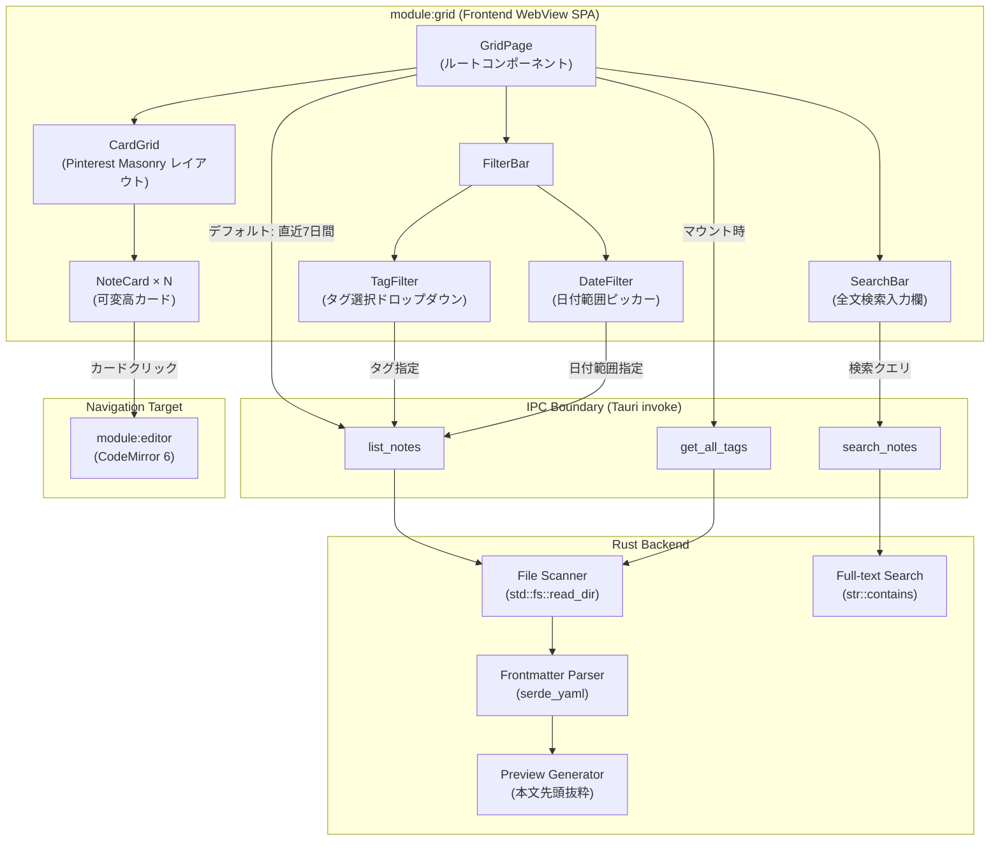
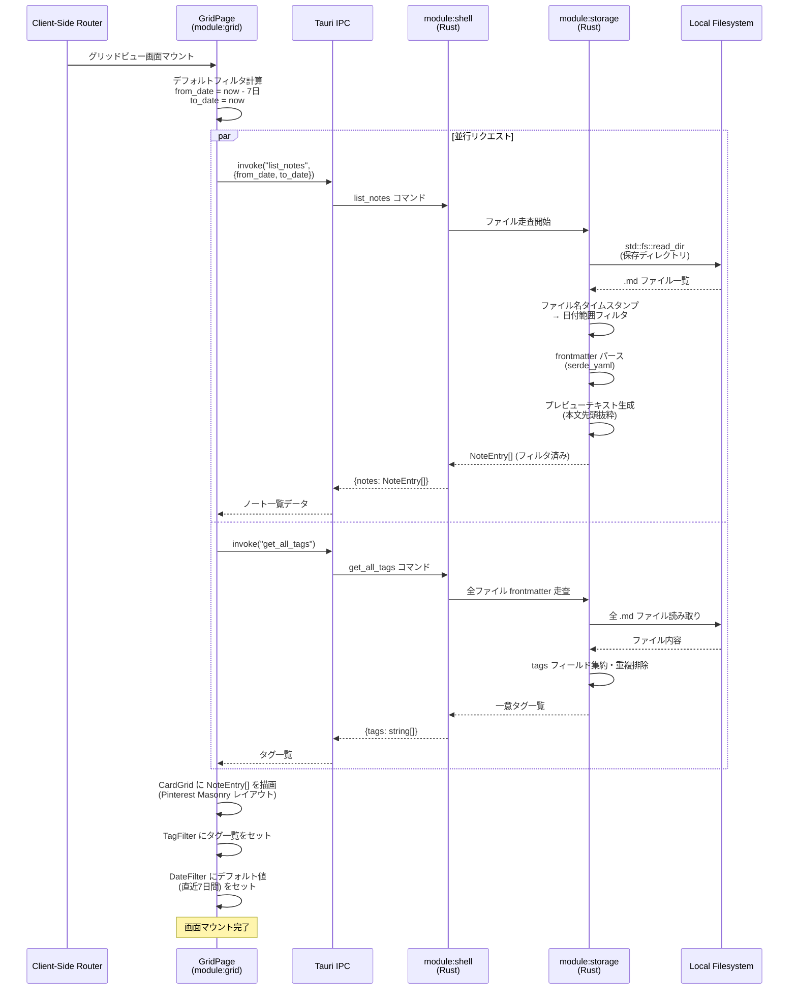
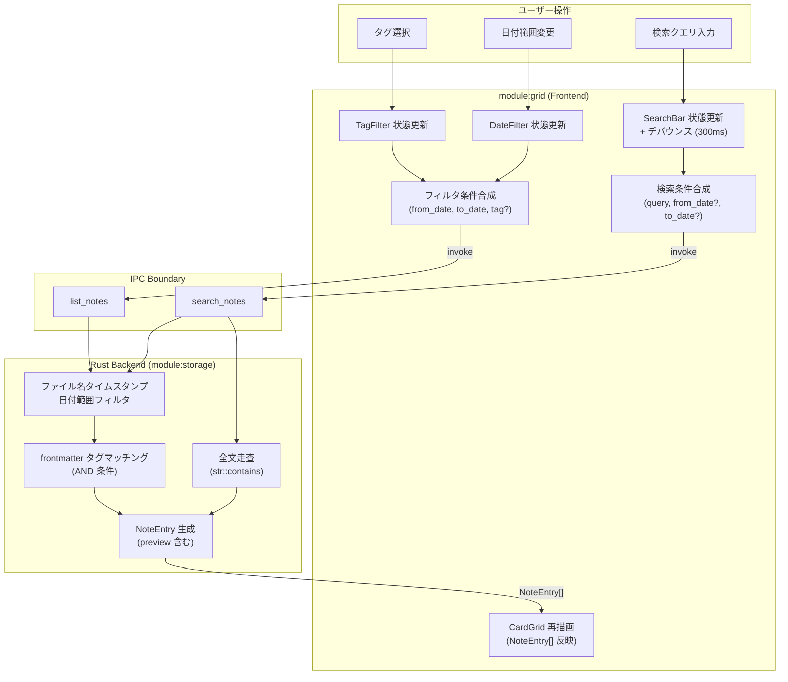
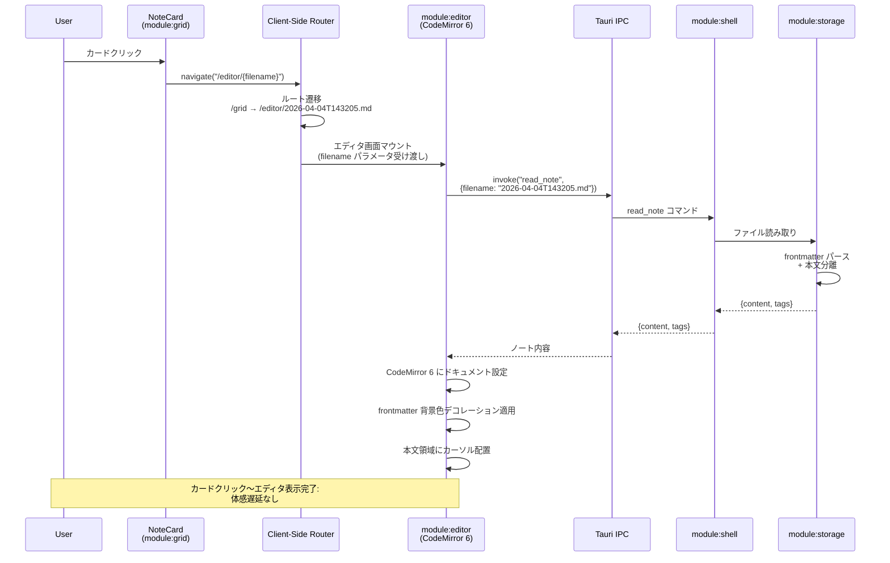

---
codd:
  node_id: detail:grid_search
  type: design
  depends_on:
  - id: detail:component_architecture
    relation: depends_on
    semantic: technical
  - id: detail:storage_fileformat
    relation: depends_on
    semantic: technical
  depended_by:
  - id: plan:implementation_plan
    relation: depends_on
    semantic: technical
  conventions:
  - targets:
    - module:grid
    reason: Pinterestスタイル可変高カード必須。デフォルトフィルタは直近7日間。
  - targets:
    - module:grid
    reason: タグ・日付フィルタおよび全文検索（ファイル全走査）は必須機能。
  - targets:
    - module:grid
    - module:editor
    reason: カードクリックでエディタ画面へ遷移必須。
  modules:
  - grid
  - storage
---

# Grid View & Search Detailed Design

## 1. Overview

本設計書は PromptNotes アプリケーションにおける `module:grid` の詳細設計を定義する。`module:grid` はフロントエンド WebView SPA 上で Pinterest スタイルの可変高カードレイアウトによるノート一覧表示、タグ・日付フィルタリング、全文検索（ファイル全走査）、およびカードクリックによるエディタ画面（`module:editor`）への遷移を担当する。

PromptNotes は Tauri（Rust + WebView）アーキテクチャ上に構築されるローカルファーストのプロンプトノートアプリケーションであり、ノートデータはすべてローカルの `.md` ファイルとして保存される。`module:grid` はフロントエンド側で UI レイアウト・フィルタ条件構築・画面遷移を所有し、データ取得・フィルタリングロジック・検索処理はすべて Rust バックエンド（`module:shell` → `module:storage` / Search Engine）が Tauri IPC 経由で実行する。フロントエンドからの直接ファイルシステムアクセスは Tauri の CSP および `allowlist` 設定（`fs: { all: false }`）により物理的に禁止される。

### 1.1 リリース不可制約への準拠

本設計書は以下のリリース不可制約に準拠しており、各制約がグリッドビュー設計にどのように反映されているかを本文全体を通じて明示する。

| 制約 | 対象 | 本設計書での反映箇所 |
|------|------|---------------------|
| Pinterest スタイル可変高カード必須。デフォルトフィルタは直近7日間。 | `module:grid` | §2.1（グリッドビュー画面構成図）、§2.2（デフォルトフィルタ初期化シーケンス）、§4.1（カードレイアウト実装）、§4.2（デフォルト7日間フィルタ実装） |
| タグ・日付フィルタおよび全文検索（ファイル全走査）は必須機能。 | `module:grid` | §2.3（フィルタ・検索データフロー図）、§3.2（フィルタ・検索の責務分離）、§4.3（タグフィルタ実装）、§4.4（日付フィルタ実装）、§4.5（全文検索実装） |
| カードクリックでエディタ画面へ遷移必須。 | `module:grid`, `module:editor` | §2.4（画面遷移シーケンス）、§3.3（遷移責務の所有権）、§4.6（カードクリック遷移実装） |

### 1.2 IPC 境界制約への準拠

Component Architecture 設計書の制約に従い、`module:grid` のすべてのデータアクセスは Tauri IPC 境界を経由する。グリッドビューが使用する IPC コマンドは以下の3つに限定される。

| IPC コマンド | 引数 | 戻り値 | 用途 |
|-------------|------|--------|------|
| `list_notes` | `{ from_date: string, to_date: string, tag?: string }` | `{ notes: NoteEntry[] }` | ノート一覧取得（日付・タグフィルタ適用） |
| `search_notes` | `{ query: string, from_date?: string, to_date?: string }` | `{ results: NoteEntry[] }` | 全文検索 |
| `get_all_tags` | なし | `{ tags: string[] }` | タグ一覧取得（フィルタ UI 用） |

フロントエンドはフィルタ条件の構築と結果の表示のみを担当し、ファイルシステム走査・frontmatter パース・テキスト検索のロジックには一切関与しない。

---

## 2. Mermaid Diagrams

### 2.1 グリッドビュー画面構成とコンポーネントツリー



**所有権と実装境界:** `GridPage` はグリッドビュー画面のルートコンポーネントであり、`module:grid` フロントエンド側の単一エントリポイントとして機能する。`FilterBar`（`TagFilter` + `DateFilter`）、`SearchBar`、`CardGrid`（`NoteCard` × N）はすべて `GridPage` の子コンポーネントである。これらのコンポーネントは `module:grid` が単独所有し、他モジュールからの再利用・インポートは想定しない。

カードクリックによる `module:editor` への遷移は Client-Side Router（React Router / SvelteKit）経由で行われる。`NoteCard` コンポーネントは遷移先のルートパスと `filename` パラメータのみを知り、`module:editor` の内部実装には依存しない。

Rust バックエンド側の File Scanner、Frontmatter Parser、Preview Generator、Full-text Search はすべて `module:storage` / Search Engine（`module:shell` 内）が所有する。`module:grid` のフロントエンドコンポーネントがこれらのバックエンドロジックを再実装することは禁止される。

### 2.2 グリッドビュー初期化・デフォルト7日間フィルタシーケンス



**デフォルト7日間フィルタの所有権:** 7日間の算出ロジック（`new Date(now.getTime() - 7 * 24 * 60 * 60 * 1000)`）はフロントエンド `module:grid` の `GridPage` コンポーネントが所有する。Rust バックエンドは受け取った `from_date`・`to_date` の範囲でファイル名タイムスタンプを比較するのみであり、「7日間」というビジネスルールを知らない。この分離により、デフォルトフィルタ期間の変更がフロントエンド側のみで完結する。

`list_notes` と `get_all_tags` はグリッドビューマウント時に並行して呼び出される。`get_all_tags` は全ファイルの frontmatter を走査するため、`list_notes`（日付フィルタ付き）よりもレスポンス時間が長くなる可能性がある。タグ一覧の取得完了を待たずにカードグリッドの描画を開始し、タグフィルタ UI は非同期にポピュレートする。

### 2.3 フィルタ・検索操作のデータフロー



**フィルタ・検索モードの排他制御:** `module:grid` のフロントエンドは2つの排他的なデータ取得モードを持つ。

1. **フィルタモード（`list_notes`）:** タグ選択または日付範囲変更時に発火する。`from_date`・`to_date` は必須、`tag` は任意。日付フィルタとタグフィルタは AND 条件で結合される。
2. **検索モード（`search_notes`）:** 検索バーにクエリが入力された場合に発火する。検索モードでは `list_notes` の代わりに `search_notes` を使用し、日付範囲は任意パラメータとして渡す。

検索バーにクエリが入力されている間はフィルタモードから検索モードに切り替わり、クエリが空になるとフィルタモードに戻る。これにより、ユーザーはフィルタと検索を直感的に使い分けられる。

Rust バックエンド側のフィルタリングはファイル名タイムスタンプ（`YYYY-MM-DDTHHMMSS.md` パース）による日付判定と、frontmatter（`serde_yaml`）によるタグマッチングを組み合わせる。全文検索は `str::contains` によるファイル全走査で実行される。検索インデックス（Tantivy、SQLite FTS 等）は構築しない。

### 2.4 カードクリック → エディタ画面遷移シーケンス



**遷移の所有権:** カードクリックのイベントハンドリングは `module:grid` の `NoteCard` コンポーネントが所有する。`NoteCard` は `filename` を識別子として保持し、クリック時に Client-Side Router の `navigate` 関数を呼び出してエディタ画面のルート（`/editor/{filename}`）に遷移する。`module:grid` は `module:editor` の内部実装（CodeMirror 6 インスタンス、frontmatter デコレーション等）について知識を持たない。遷移後のデータ取得（`read_note` IPC）は `module:editor` が独立して実行する。

---

## 3. Ownership Boundaries

### 3.1 `module:grid` フロントエンドコンポーネントの所有権

`module:grid` のフロントエンド UI コンポーネントは以下の責務を単独所有する。他モジュールがこれらのコンポーネントを再実装・複製することは禁止される。

| コンポーネント | 責務 | 実装手段 | 再実装禁止ルール |
|--------------|------|---------|-----------------|
| `GridPage` | グリッドビュー画面のルート。初期化時に `list_notes` + `get_all_tags` を並行呼び出し。デフォルト7日間フィルタの算出。 | React/Svelte コンポーネント | 他画面からの `list_notes` 直接呼び出し禁止。グリッドビューへのエントリポイントは `GridPage` のみ。 |
| `FilterBar` | `TagFilter` と `DateFilter` をグルーピングするコンテナ。 | React/Svelte コンポーネント | フィルタ UI は `module:grid` 内に閉じる。 |
| `TagFilter` | `get_all_tags` で取得したタグ一覧からユーザーが選択。選択値を `GridPage` に伝播。 | ドロップダウン / チップ選択 UI | タグ一覧の取得・表示は `module:grid` が唯一の消費者。 |
| `DateFilter` | 日付範囲（`from_date`, `to_date`）の入力。初期値は直近7日間。 | 日付ピッカー UI | 7日間デフォルトのビジネスルールは `GridPage` が所有。 |
| `SearchBar` | 全文検索クエリの入力。入力デバウンス（300ms）の制御。 | テキスト入力 + デバウンス | 検索 UI は `module:grid` 内に閉じる。`module:editor` に検索バーを設けない。 |
| `CardGrid` | `NoteEntry[]` を Pinterest スタイル可変高 Masonry レイアウトで描画。 | CSS Grid / Masonry ライブラリ | カードレイアウトの実装は `module:grid` が単独所有。 |
| `NoteCard` | 個別ノートのカード表示。`filename`, `created_at`, `tags`, `preview` を表示。クリックでエディタ画面へ遷移。 | React/Svelte コンポーネント | カードクリック遷移ロジックは `NoteCard` が所有。 |

### 3.2 フィルタ・検索ロジックの責務分離

フィルタリングと検索の責務はフロントエンドとバックエンドで明確に分離される。

**フロントエンド（`module:grid`）が所有する責務:**

| 責務 | 詳細 |
|------|------|
| デフォルト7日間の算出 | `new Date(now - 7 * 24 * 60 * 60 * 1000)` でフロントエンド側で計算。Rust バックエンドは「7日間」を知らない。 |
| フィルタ条件の合成 | `TagFilter` と `DateFilter` の値を組み合わせて `list_notes` の引数を構築。 |
| 検索クエリのデバウンス | 検索バー入力後 300ms のデバウンスを経て `search_notes` を呼び出し。IPC 呼び出し頻度を制御。 |
| フィルタモード / 検索モードの切り替え | 検索バーが空なら `list_notes`、クエリがあれば `search_notes` を使用。 |
| `NoteEntry[]` の表示 | バックエンドから返却された `NoteEntry[]` を `CardGrid` に描画。フロントエンド側での追加フィルタリングは行わない。 |

**Rust バックエンド（`module:storage` / Search Engine）が所有する責務:**

| 責務 | 詳細 |
|------|------|
| ファイル名からの日付パース | `YYYY-MM-DDTHHMMSS.md` → `NaiveDateTime` 変換。ファイルシステムメタデータ（`mtime`）は使用しない。 |
| 日付範囲フィルタリング | `from_date` ≤ ファイル名日付 ≤ `to_date` の判定。 |
| タグフィルタリング | frontmatter の `tags` フィールドに指定タグが含まれるかの判定。日付フィルタとの AND 結合。 |
| 全文検索 | 全 `.md` ファイルの `std::fs::read_to_string` → `str::contains`（case-insensitive はデフォルト方針）によるファイル全走査。 |
| `NoteEntry` の生成 | `filename`、`created_at`（ファイル名から導出）、`tags`（frontmatter から抽出）、`preview`（本文先頭抜粋）の組み立て。 |
| タグ一覧集約 | 全ファイルの frontmatter から `tags` を収集し、重複排除して返却。 |

フロントエンドはバックエンドから返却された `NoteEntry[]` をそのまま描画する。フロントエンド側でのソート・追加フィルタリング・テキスト検索を行わないことで、データ処理の一貫性を保証し、フロントエンドからの直接ファイルアクセス禁止制約に準拠する。

### 3.3 画面遷移の所有権 — `module:grid` と `module:editor` の境界

カードクリックによるエディタ画面への遷移は、Client-Side Router を介したルーティングで実現される。

| 責務 | 所有者 | 実装 |
|------|--------|------|
| カードクリックイベント処理 | `module:grid` (`NoteCard`) | `onClick` → `navigate("/editor/{filename}")` |
| ルートパス定義 `/editor/:filename` | Client-Side Router（共有） | ルート設定ファイル |
| `filename` パラメータの受け渡し | Client-Side Router（共有） | URL パラメータ |
| エディタ画面のマウント・データ取得 | `module:editor` | `read_note` IPC 呼び出し |

`module:grid` は遷移先ルートパス（`/editor/{filename}`）のみを知り、`module:editor` の内部構造には依存しない。`module:editor` は URL パラメータから `filename` を受け取り、`read_note` IPC を呼び出してノート内容を取得する。この疎結合により、両モジュールを独立して開発・テストできる。

### 3.4 共有型 `NoteEntry` の消費者としての `module:grid`

`NoteEntry` の正規定義は Rust バックエンド側（`module:storage` 内）が所有する。`module:grid` は `NoteEntry` の消費者（読み取り専用）であり、フィールドの追加・変更権限を持たない。

```typescript
// module:grid が使用する NoteEntry 型（TypeScript、読み取り専用）
interface NoteEntry {
  filename: string;       // "2026-04-04T143205.md" — カードクリック遷移の識別子
  created_at: string;     // "2026-04-04T14:32:05" — カード上の日時表示
  tags: string[];         // ["gpt", "coding"] — カード上のタグ表示
  preview: string;        // 本文先頭の抜粋テキスト — カード本文プレビュー
}
```

`NoteEntry` のスキーマ変更は Rust バックエンド側を先に更新し、TypeScript 型定義を追従させる（`tauri-specta` による自動生成または手動同期）。`module:grid` のフロントエンドコンポーネントは `NoteEntry` の全フィールドをカード表示に使用する。

### 3.5 ルーティング定義の所有権

グリッドビュー関連のルート定義は Client-Side Router の設定ファイル内で管理される。

| ルートパス | 画面 | 所有モジュール |
|-----------|------|--------------|
| `/grid` または `/`（デフォルト） | グリッドビュー | `module:grid` |
| `/editor/:filename` | エディタ画面 | `module:editor` |
| `/settings` | 設定画面 | `module:settings` |

グリッドビュー（`/grid`）はアプリケーションのデフォルト画面として機能し、起動時にこのルートにナビゲートされる。エディタ画面からグリッドビューへの「戻る」操作は Router のバックナビゲーションまたはナビゲーションバーのリンクで実現する。

---

## 4. Implementation Implications

### 4.1 Pinterest スタイル可変高カードレイアウトの実装

**レイアウト方式:** CSS Grid ベースの Masonry レイアウトを採用する。カードの高さはプレビューテキストの長さとタグ数に応じて可変となる。

```typescript
// CardGrid コンポーネントの実装概要
const CardGrid = ({ notes }: { notes: NoteEntry[] }) => {
  return (
    <div className="card-grid">
      {notes.map((note) => (
        <NoteCard key={note.filename} note={note} />
      ))}
    </div>
  );
};
```

```css
/* Pinterest スタイル Masonry レイアウト */
.card-grid {
  columns: 3;            /* 3カラムレイアウト（レスポンシブ調整あり） */
  column-gap: 16px;
}

.note-card {
  break-inside: avoid;   /* カードがカラム境界で分割されない */
  margin-bottom: 16px;
  border-radius: 8px;
  padding: 16px;
  background: var(--card-bg);
  cursor: pointer;       /* クリック可能であることを示す */
}
```

CSS `columns` プロパティまたは CSS Grid の `masonry` 値（ブラウザサポート状況により判断）、もしくは軽量 Masonry ライブラリ（例: `react-masonry-css`）を使用する。Tauri の WebView（Linux: WebKitGTK、macOS: WKWebView）での動作を技術検証で確認する。

**NoteCard の表示要素:**

| 表示要素 | データソース | 表示位置 |
|---------|------------|---------|
| 作成日時 | `NoteEntry.created_at` | カード上部 |
| タグ一覧 | `NoteEntry.tags` | カード上部（チップ形式） |
| プレビューテキスト | `NoteEntry.preview` | カード中央（可変高） |

カードにタイトル表示欄は設けない。PromptNotes はタイトル入力欄を禁止しており（FAIL-04）、ファイルにタイトルメタデータを持たないため、カード表示もプレビューテキストのみとする。

### 4.2 デフォルト直近7日間フィルタの実装

グリッドビューのマウント時に実行される初期化ロジック:

```typescript
import { invoke } from "@tauri-apps/api/tauri";

// GridPage マウント時の初期化
async function initializeGridView() {
  const now = new Date();
  const sevenDaysAgo = new Date(now.getTime() - 7 * 24 * 60 * 60 * 1000);

  // 並行リクエスト
  const [notesResult, tagsResult] = await Promise.all([
    invoke<{ notes: NoteEntry[] }>("list_notes", {
      from_date: formatDate(sevenDaysAgo),  // "YYYY-MM-DD" 形式
      to_date: formatDate(now),
    }),
    invoke<{ tags: string[] }>("get_all_tags"),
  ]);

  setNotes(notesResult.notes);
  setAvailableTags(tagsResult.tags);
  setDateRange({ from: sevenDaysAgo, to: now });
}
```

`formatDate` はフロントエンド側のユーティリティ関数で、`Date` オブジェクトを `YYYY-MM-DD` 形式の文字列に変換する。Rust バックエンド側ではこの日付文字列をパースし、ファイル名の `YYYY-MM-DD` 部分と比較してフィルタリングを行う。

7日間というデフォルト値はフロントエンド側に定数として定義される。この値の変更はフロントエンド側の修正のみで完結し、バックエンド側の変更は不要である。

### 4.3 タグフィルタの実装

**フロントエンド（TagFilter コンポーネント）:**

```typescript
const TagFilter = ({
  availableTags,
  selectedTag,
  onTagChange,
}: TagFilterProps) => {
  return (
    <select
      value={selectedTag ?? ""}
      onChange={(e) => onTagChange(e.target.value || undefined)}
    >
      <option value="">すべてのタグ</option>
      {availableTags.map((tag) => (
        <option key={tag} value={tag}>{tag}</option>
      ))}
    </select>
  );
};
```

タグ選択時、`GridPage` は `list_notes` を `tag` 引数付きで再呼び出しする。日付範囲フィルタ（`from_date`, `to_date`）は現在の `DateFilter` の値をそのまま使用する。

**Rust バックエンド側のタグフィルタリング:**

`list_notes` コマンドは `tag` 引数が指定された場合、日付範囲フィルタ通過後のファイル群に対して追加で frontmatter の `tags` フィールドをチェックする。日付フィルタとタグフィルタは AND 条件で結合される。

```rust
// list_notes 内のタグフィルタリング（概念コード）
if let Some(ref tag) = params.tag {
    entries.retain(|entry| entry.tags.contains(tag));
}
```

### 4.4 日付フィルタの実装

**フロントエンド（DateFilter コンポーネント）:**

```typescript
const DateFilter = ({
  dateRange,
  onDateRangeChange,
}: DateFilterProps) => {
  return (
    <div className="date-filter">
      <input
        type="date"
        value={formatDateInput(dateRange.from)}
        onChange={(e) => onDateRangeChange({
          ...dateRange,
          from: new Date(e.target.value),
        })}
      />
      <span>〜</span>
      <input
        type="date"
        value={formatDateInput(dateRange.to)}
        onChange={(e) => onDateRangeChange({
          ...dateRange,
          to: new Date(e.target.value),
        })}
      />
    </div>
  );
};
```

日付範囲が変更されると `GridPage` が `list_notes` を新しい `from_date`・`to_date` で再呼び出しする。

**Rust バックエンド側の日付フィルタリング:**

バックエンドはファイル名 `YYYY-MM-DDTHHMMSS.md` の日付部分をパースして `NaiveDate` に変換し、`from_date` ≤ ファイル日付 ≤ `to_date` の範囲チェックを行う。ファイルシステムのメタデータ（`mtime`、`ctime`）は使用しない。これにより、Git クローンやファイルコピー後もフィルタリングの正確性が保持される。

```rust
fn parse_date_from_filename(filename: &str) -> Option<NaiveDate> {
    // "2026-04-04T143205.md" → "2026-04-04" をパース
    let date_str = filename.get(..10)?;
    NaiveDate::parse_from_str(date_str, "%Y-%m-%d").ok()
}
```

`YYYY-MM-DDTHHMMSS.md` 形式に一致しないファイル（外部ツールが作成したファイル等）はフィルタリング結果から除外される。

### 4.5 全文検索の実装

**フロントエンド（SearchBar コンポーネント）:**

```typescript
const SEARCH_DEBOUNCE_MS = 300;

const SearchBar = ({ onSearch }: SearchBarProps) => {
  const [query, setQuery] = useState("");
  const debounceTimer = useRef<ReturnType<typeof setTimeout> | null>(null);

  const handleInput = (value: string) => {
    setQuery(value);
    if (debounceTimer.current) clearTimeout(debounceTimer.current);
    debounceTimer.current = setTimeout(() => {
      onSearch(value);
    }, SEARCH_DEBOUNCE_MS);
  };

  return (
    <input
      type="text"
      placeholder="全文検索..."
      value={query}
      onInput={(e) => handleInput(e.currentTarget.value)}
    />
  );
};
```

検索バーの入力にはフロントエンド側で 300ms のデバウンスを適用し、IPC 呼び出し頻度を制御する。デバウンス完了後に `search_notes` IPC コマンドを呼び出す。

**Rust バックエンド側の全文検索:**

```rust
#[tauri::command]
fn search_notes(
    query: &str,
    from_date: Option<&str>,
    to_date: Option<&str>,
    state: State<AppState>,
) -> Result<SearchResult, String> {
    let query_lower = query.to_lowercase();
    let mut results = Vec::new();

    for entry in std::fs::read_dir(&state.notes_dir).map_err(|e| e.to_string())? {
        let entry = entry.map_err(|e| e.to_string())?;
        let filename = entry.file_name().to_string_lossy().to_string();

        // 日付範囲フィルタ（任意）
        if let (Some(from), Some(to)) = (from_date, to_date) {
            if let Some(date) = parse_date_from_filename(&filename) {
                let from_date = NaiveDate::parse_from_str(from, "%Y-%m-%d")
                    .map_err(|e| e.to_string())?;
                let to_date = NaiveDate::parse_from_str(to, "%Y-%m-%d")
                    .map_err(|e| e.to_string())?;
                if date < from_date || date > to_date {
                    continue;
                }
            }
        }

        // 全文検索（case-insensitive）
        let content = std::fs::read_to_string(entry.path())
            .map_err(|e| e.to_string())?;
        if content.to_lowercase().contains(&query_lower) {
            let (frontmatter, body) = parse_frontmatter(&content);
            results.push(NoteEntry {
                filename,
                created_at: extract_created_at(&entry.file_name()),
                tags: frontmatter.tags,
                preview: generate_preview(body, 200),
            });
        }
    }

    Ok(SearchResult { results })
}
```

全文検索は `str::contains` によるファイル全走査で実行する。case-insensitive をデフォルトとし、`query.to_lowercase()` と `content.to_lowercase()` の比較で実装する。検索インデックス（Tantivy、SQLite FTS 等）は構築しない。5,000 件超過時にパフォーマンスが許容範囲を超える場合に Tantivy 導入を検討する。

### 4.6 カードクリックによるエディタ画面遷移の実装

```typescript
const NoteCard = ({ note }: { note: NoteEntry }) => {
  const navigate = useNavigate(); // React Router / SvelteKit navigation

  const handleClick = () => {
    navigate(`/editor/${note.filename}`);
  };

  return (
    <div className="note-card" onClick={handleClick} role="button" tabIndex={0}>
      <div className="note-card__date">{formatDateTime(note.created_at)}</div>
      <div className="note-card__tags">
        {note.tags.map((tag) => (
          <span key={tag} className="tag-chip">{tag}</span>
        ))}
      </div>
      <div className="note-card__preview">{note.preview}</div>
    </div>
  );
};
```

**遷移先のルート設定:**

```typescript
// ルート定義（React Router の場合）
const routes = [
  { path: "/", element: <GridPage /> },
  { path: "/grid", element: <GridPage /> },
  { path: "/editor/:filename", element: <EditorPage /> },
  { path: "/settings", element: <SettingsPage /> },
];
```

`NoteCard` のクリック時に `navigate("/editor/{filename}")` が呼ばれ、Client-Side Router がルート遷移を処理する。`module:editor`（`EditorPage`）は URL パラメータから `filename` を取得し、`read_note` IPC で内容をロードする。この遷移は SPA 内のクライアントサイドルーティングであり、ページリロードは発生しない。

**アクセシビリティ:** `NoteCard` は `role="button"` と `tabIndex={0}` を設定し、キーボードナビゲーション（Tab キーでのフォーカス移動、Enter/Space キーでの遷移発火）にも対応する。

### 4.7 セキュリティ制御

`module:grid` に関連するセキュリティ制御は以下の通りである。

| 制御 | 実装方法 | 対象 |
|------|---------|------|
| ファイルシステム直接アクセス禁止 | `tauri.conf.json` の `allowlist: { fs: { all: false } }` | `module:grid` を含むフロントエンド全体 |
| CSP によるネットワーク通信遮断 | `connect-src: ipc:` のみ許可 | `module:grid` を含むフロントエンド全体 |
| パストラバーサル防止 | `list_notes`・`search_notes` のバックエンド側で保存ディレクトリ外アクセスを拒否 | Rust バックエンド |
| ファイル名形式検証 | `YYYY-MM-DDTHHMMSS.md` 形式に一致しないファイルの除外 | Rust バックエンド |

`module:grid` のフロントエンドコンポーネントはユーザー入力（検索クエリ、タグ選択、日付範囲）を IPC 経由でバックエンドに送信するのみであり、ファイルパスの組み立てやファイルシステムへの直接アクセスは構造的に不可能である。

### 4.8 パフォーマンス閾値

| 操作 | 想定規模 | 実装方式 | 閾値 |
|------|---------|---------|------|
| 初期表示（デフォルト7日間フィルタ） | 数十件〜数百件 | `list_notes` + `get_all_tags` 並行呼び出し | グリッドビューマウント後、ユーザーが遅延を感じない速度 |
| タグ・日付フィルタ変更 | `list_notes` 再呼び出し | ファイル名走査 + frontmatter パース | フィルタ変更後、実用的応答速度でカード再描画 |
| 全文検索 | 5,000 件以下 | `search_notes`（ファイル全走査） | 検索デバウンス 300ms + バックエンド処理で実用的応答速度 |
| カードクリック → エディタ表示 | 単一ファイル読み取り | `read_note` IPC | 体感遅延なし |
| `list_notes` 一覧取得 | 5,000 件以下 | `std::fs::read_dir` + frontmatter パース | 実用的応答速度（5,000 件超過時 Tantivy 導入検討） |

5,000 件規模でのベンチマークを実施し、`list_notes` および `search_notes` の応答時間がユーザー許容範囲を超える場合に Tantivy 導入 ADR を起票する。

### 4.9 プラットフォーム固有の考慮事項

`module:grid` のフロントエンド実装はプラットフォーム非依存であり、WebView（Linux: WebKitGTK、macOS: WKWebView）の差異は Tauri が吸収する。ただし、以下の点で WebView エンジン間の動作差異を検証する必要がある。

| 検証項目 | WebKitGTK (Linux) | WKWebView (macOS) |
|---------|-------------------|-------------------|
| CSS `columns` / Masonry レイアウト | サポート状況確認 | サポート状況確認 |
| `<input type="date">` の日付ピッカー UI | ネイティブ UI の有無 | ネイティブ UI の有無 |
| クリップボード API（`navigator.clipboard`） | サポート状況確認（カード操作ではなくエディタ側の責務だが関連） | サポート状況確認 |

CSS Masonry レイアウトのブラウザサポートが不十分な場合、CSS `columns` によるフォールバックまたは JavaScript ベースの Masonry ライブラリ（例: `react-masonry-css`、`masonry-layout`）で代替する。

---

## 5. Open Questions

| ID | 対象モジュール | 質問 | 影響範囲 | 優先度 | 解決条件 |
|----|---------------|------|---------|--------|---------|
| GS-OQ-001 | `module:grid` | Pinterest Masonry レイアウトの実装方式として CSS `columns`、CSS Grid `masonry` 値、JavaScript ライブラリ（`react-masonry-css` 等）のどれを採用するか。WebKitGTK と WKWebView の双方で安定動作するか。 | カードグリッドの表示品質・パフォーマンス。WebView エンジン互換性に直接影響。 | 高（グリッド UI 実装開始前に解決必須） | Tauri WebView 上での技術検証プロトタイプを実装し、Linux・macOS 双方で表示品質とスクロールパフォーマンスを比較評価する。 |
| GS-OQ-002 | `module:grid` | フロントエンド UI フレームワーク選定（React vs Svelte）の決定。Component Architecture 設計書 OQ-001 と同一の未決定事項であり、`module:grid` のコンポーネント設計に直接影響する。 | `CardGrid`、`NoteCard`、`FilterBar`、`SearchBar` 等の全コンポーネント実装。状態管理パターン（React hooks vs Svelte stores）にも影響。 | 高（開発開始前に解決必須） | Component Architecture 設計書 OQ-001 の解決に依存。技術検証プロトタイプの結果を待つ。 |
| GS-OQ-003 | `module:grid` | `NoteEntry.preview` のプレビュー文字数上限。可変高カードの視覚的バランスとカード間の高さの差異に直接影響する。暫定値は 200 文字。 | カードの表示品質、`list_notes` レスポンスのペイロードサイズ、IPC 通信量。 | 低 | デザインモックアップとプロトタイプで視覚的に検証し、具体値を決定する。Storage & File Format 設計書 OQ-004 と同一の未決定事項。 |
| GS-OQ-004 | `module:grid` | 全文検索の大文字小文字区別。case-insensitive をデフォルト方針として暫定決定しているが、日本語等のマルチバイト文字での `to_lowercase` 挙動を検証する必要がある。 | 検索結果の網羅性・精度。Rust バックエンドの `search_notes` 実装に影響。Component Architecture 設計書 OQ-003、Storage 設計書 OQ-005 と関連。 | 中 | 日本語・英語混在テキストでの検索精度をプロトタイプで検証する。`to_lowercase` では不十分な場合、Unicode case folding 等の代替手段を評価する。 |
| GS-OQ-005 | `module:grid` | 5,000 件超過時の `list_notes`・`search_notes` パフォーマンス。全ファイル走査 + frontmatter パースの応答時間がユーザー許容範囲を超えるか。 | Tantivy 導入の要否。仮想スクロール（windowing）の導入要否にも影響する。Component Architecture 設計書 OQ-005、Storage 設計書 OQ-006 と同一の未決定事項。 | 低（5,000 件超過時に検討） | 5,000 件規模のベンチマークを実施する。応答時間が許容範囲を超える場合、Tantivy 導入 ADR を起票し、フロントエンド側には仮想スクロール（`react-window` / `svelte-virtual-list` 等）を導入する。 |
| GS-OQ-006 | `module:grid` | グリッドビューのカラム数をレスポンシブに変更するか、固定とするか。ウィンドウサイズ変更時・フルスクリーン時のカラム数調整ルール。 | CSS レイアウト実装方式、ユーザー体験。 | 低 | デザインモックアップで最小・最大ウィンドウサイズでの表示を検証し、ブレークポイントとカラム数のルールを確定する。 |
| GS-OQ-007 | `module:grid` | 検索モードからフィルタモードに戻る際のフィルタ状態復元。検索バーをクリアした時、直前のフィルタ条件（タグ・日付）を保持して `list_notes` を再呼び出しするか、デフォルト7日間にリセットするか。 | ユーザー体験、フロントエンド状態管理設計。 | 低 | ユーザビリティテストで検索→フィルタ切り替え時の期待動作を確認し決定する。暫定方針として、直前のフィルタ条件を保持する。 |
