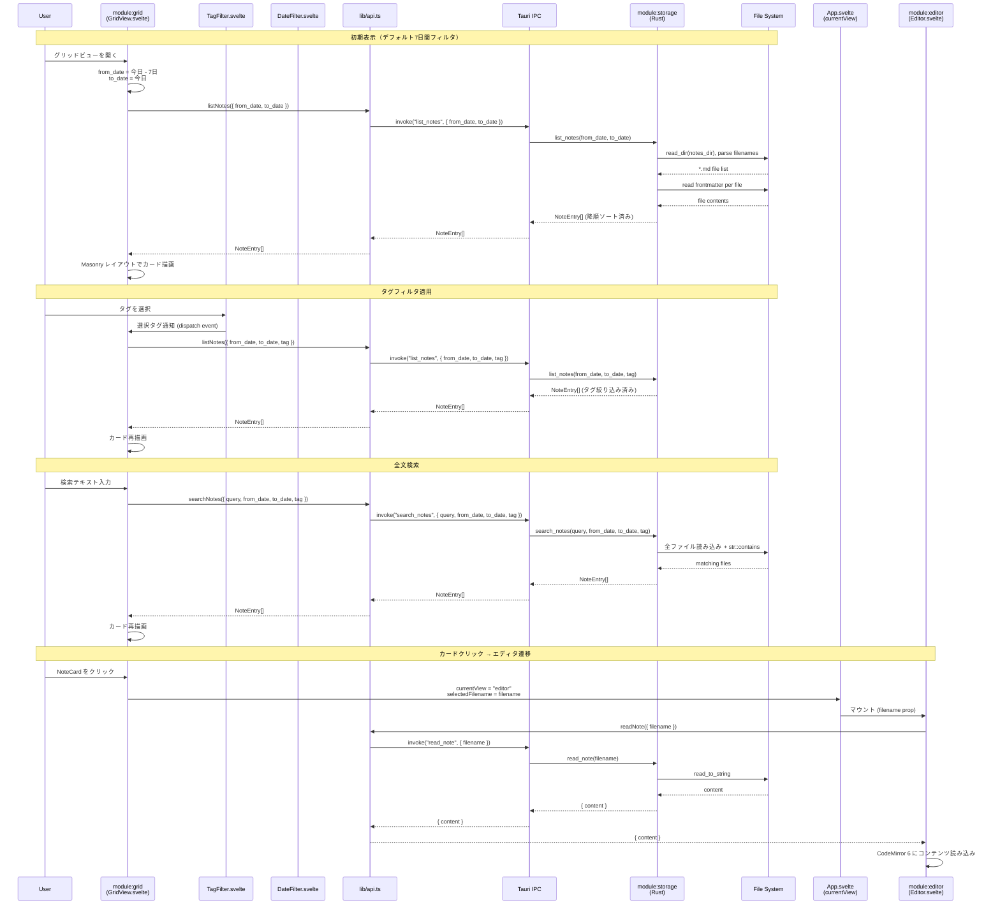
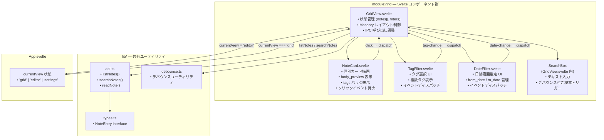
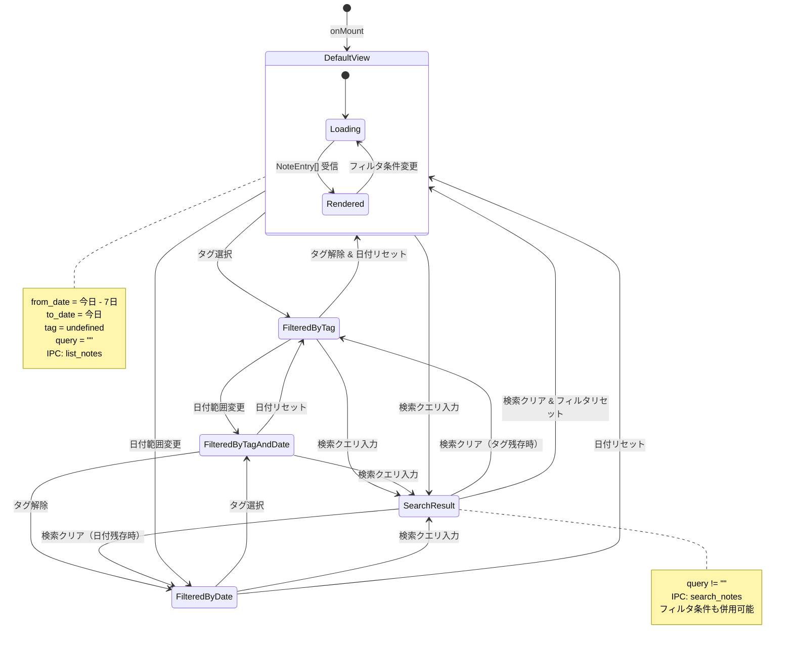

---
codd:
  node_id: detail:grid_search
  type: design
  depends_on:
  - id: detail:component_architecture
    relation: depends_on
    semantic: technical
  - id: detail:storage_fileformat
    relation: depends_on
    semantic: technical
  depended_by:
  - id: plan:implementation_plan
    relation: depends_on
    semantic: technical
  conventions:
  - targets:
    - module:grid
    reason: Pinterestスタイル可変高カード必須。デフォルトフィルタは直近7日間。
  - targets:
    - module:grid
    reason: タグ・日付フィルタおよび全文検索（ファイル全走査）は必須機能。
  - targets:
    - module:grid
    - module:editor
    reason: カードクリックでエディタ画面へ遷移必須。
  modules:
  - grid
  - storage
---

# Grid View & Search Detailed Design

## 1. Overview

本設計書は PromptNotes アプリケーションにおける `module:grid` の詳細設計を定義する。`module:grid` は Svelte フロントエンド上で動作するグリッドビュー画面であり、Pinterest スタイルの Masonry 可変高カードレイアウト、直近7日間のデフォルトフィルタ、タグ/日付フィルタ、およびファイル全走査による全文検索の4機能を必須として実装する。

PromptNotes は Tauri（Rust + WebView）上で動作するローカルファーストのプロンプトノートアプリであり、フロントエンドに **Svelte**、バックエンドに **Rust** を採用する。データはローカルファイルシステム上の `.md` ファイルのみに保存し、データベース（SQLite・IndexedDB 等）やクラウド同期、AI 呼び出し機能は一切使用しない。`module:grid` はデータ取得・検索をすべて Tauri IPC（`invoke`）経由で `module:storage`（Rust バックエンド）に委譲し、フロントエンドからの直接ファイルシステムアクセスは禁止される。

### リリース不可制約への準拠

本設計書は以下の非交渉制約（Release-Blocking Constraints）に完全準拠する。

| 制約 ID | 対象モジュール | 制約内容 | 本設計書における準拠箇所 |
|---------|--------------|---------|----------------------|
| CONV-GRID-1 | `module:grid` | Pinterest スタイル可変高カード必須。デフォルトフィルタは直近7日間。 | §1.1 Masonry レイアウト仕様、§4.1 デフォルトフィルタ実装、§4.3 カードレイアウト実装 |
| CONV-GRID-2 | `module:grid` | タグ・日付フィルタおよび全文検索（ファイル全走査）は必須機能。 | §4.2 フィルタ・検索実装、§2 シーケンス図で全フローを明示 |
| CONV-GRID-3 | `module:grid`, `module:editor` | カードクリックでエディタ画面へ遷移必須。 | §4.4 カードクリック遷移、§2 シーケンス図の「カードクリック→エディタ遷移」フロー |
| CONV-IPC（上流） | `framework:tauri`, `module:shell` | フロントエンドからの直接ファイルシステムアクセス禁止。全ファイル操作は Rust バックエンド経由。 | §3 所有権境界、§4.5 IPC 通信の排他性 |
| CONV-SETTINGS（上流） | `module:storage`, `module:settings` | 設定変更（保存ディレクトリ）は Rust バックエンド経由で永続化。 | §4.6 設定変更連携 |

### 1.1 グリッドビューの機能要件

`module:grid` が提供する必須機能は以下の通りである。

| 機能 | 説明 | IPC コマンド | 制約根拠 |
|------|------|-------------|---------|
| Masonry カードレイアウト | Pinterest スタイルの可変高カードを縦方向に密接配置 | `list_notes`, `search_notes` | CONV-GRID-1 |
| デフォルト7日間フィルタ | コンポーネントマウント時に直近7日間のノートを自動表示 | `list_notes` | CONV-GRID-1 |
| タグフィルタ | ユーザーが選択したタグでノートを絞り込み | `list_notes` | CONV-GRID-2 |
| 日付フィルタ | ユーザーが指定した日付範囲でノートを絞り込み | `list_notes` | CONV-GRID-2 |
| 全文検索 | 入力テキストでノート本文をファイル全走査検索 | `search_notes` | CONV-GRID-2 |
| カードクリック遷移 | ノートカードクリックでエディタ画面（`module:editor`）へ遷移 | `read_note` | CONV-GRID-3 |

### 1.2 データ型依存

`module:grid` が依存する共有型 `NoteEntry` は `module:storage`（Rust 側 `models.rs`）が正規の定義元であり、TypeScript 側の型定義（`src/lib/types.ts`）は Rust 側に追従する。

```typescript
// src/lib/types.ts（Rust 側に追従。module:storage が canonical owner）
export interface NoteEntry {
    filename: string;       // "2026-04-04T143052.md"
    created_at: string;     // "2026-04-04T14:30:52"（ファイル名からパース）
    tags: string[];         // frontmatter の tags フィールド
    body_preview: string;   // 本文先頭 200 文字のプレビュー
}
```

`module:grid` は `NoteEntry` の構造を定義・変更する権限を持たない。表示に必要なフィールド追加は `module:storage` への要件変更を経る必要がある。

## 2. Mermaid Diagrams

### 2.1 グリッドビューのユーザーフローシーケンス



このシーケンス図は `module:grid` が関与する4つの主要ユーザーフロー（初期表示、タグフィルタ、全文検索、カードクリック遷移）のすべてを示す。

**所有権と実装境界の解説:**

- **日付算出の所有権:** デフォルト7日間フィルタの `from_date` / `to_date` 算出は `GridView.svelte`（Svelte 側）が行う。Rust 側はフロントエンドから渡された日付範囲パラメータに対してフィルタリングを実行するのみで、デフォルト値の判断ロジックを持たない。
- **データ取得の排他経路:** `module:grid` は `lib/api.ts` の `listNotes()` / `searchNotes()` 関数のみを通じてデータを取得する。`@tauri-apps/api` の `invoke` を `GridView.svelte` 内で直接呼び出すことは禁止される。
- **画面遷移メカニズム:** カードクリック時の画面遷移は SPA ルーティングライブラリを使用せず、`App.svelte` の `currentView` 状態変数による条件レンダリングで実現する。`GridView.svelte` は `App.svelte` に `currentView` と `selectedFilename` の変更を通知するのみであり、`module:editor` のマウントと `read_note` IPC 呼び出しは `Editor.svelte` 自身が行う。
- **検索実行の所有権:** 全文検索ロジック（`str::to_lowercase().contains(&query.to_lowercase())`）は `module:storage`（Rust 側）が排他的に所有する。Svelte 側はクエリ文字列を `search_notes` IPC コマンドに渡すのみで、クライアントサイド検索は一切実装しない。

### 2.2 グリッドビューのコンポーネント構成



このコンポーネント構成図は `module:grid` 内部の Svelte コンポーネント階層とデータフローの方向を示す。

**所有権:**

- **`GridView.svelte`** は `module:grid` のルートコンポーネントであり、グリッドビュー画面全体の状態管理（`notes: NoteEntry[]`、フィルタ条件、検索クエリ）を所有する。子コンポーネント（`NoteCard`, `TagFilter`, `DateFilter`）はプレゼンテーショナルであり、独自に IPC 呼び出しを行わない。
- **`NoteCard.svelte`** は単一ノートカードの描画を所有する。`NoteEntry` の `body_preview`, `tags`, `created_at` を受け取り、可変高カードとして表示する。クリックイベントは Svelte の `dispatch` でバブルアップし、`GridView.svelte` が処理する。
- **`TagFilter.svelte`** はタグ選択 UI の表示とユーザー操作の受付を所有する。選択状態の変更は `dispatch('tag-change', { tag })` で `GridView.svelte` に通知する。
- **`DateFilter.svelte`** は日付範囲指定 UI を所有する。変更通知は `dispatch('date-change', { from_date, to_date })` で行う。
- **`lib/api.ts`** は IPC 呼び出しの単一エントリポイントとして `module:grid` と `module:storage` の間の通信を仲介する。`api.ts` は `module:grid` 専用ではなく、`module:editor` と `module:settings` UI も共有する。`api.ts` の所有権はアプリケーション共有層にあり、特定モジュールに帰属しない。

### 2.3 フィルタ・検索の状態遷移



この状態遷移図は `GridView.svelte` のフィルタ・検索状態の遷移を示す。重要な実装ルールは以下の通り。

- **IPC コマンドの使い分け:** `query` が空文字列の場合は `list_notes` を呼び出し、`query` が非空の場合は `search_notes` を呼び出す。`search_notes` はフィルタ条件（`from_date`, `to_date`, `tag`）も受け付けるため、検索とフィルタの組み合わせが可能。
- **DefaultView の初期状態:** コンポーネントマウント時に `from_date = 今日 - 7日`, `to_date = 今日` を Svelte 側で算出し、`list_notes` を呼び出す。これは CONV-GRID-1（デフォルトフィルタは直近7日間）への準拠。
- **Loading → Rendered 遷移:** IPC 呼び出しは非同期であるため、呼び出し中は Loading 状態を表示する。ノート件数が少ない（数百件）場合は瞬時に完了するが、UI の一貫性のためにローディングインジケーターを用意する。

## 3. Ownership Boundaries

### 3.1 `module:grid` の排他的所有範囲

| リソース / 操作 | 排他的所有者 | 利用者 | 備考 |
|---------------|------------|-------|------|
| Masonry カードレイアウトの描画 | `module:grid` (`GridView.svelte`) | なし | CSS Columns または JavaScript ライブラリで実装。`module:editor` とは独立 |
| フィルタ条件の状態管理 (`from_date`, `to_date`, `tag`, `query`) | `module:grid` (`GridView.svelte`) | なし | Svelte リアクティブ変数で管理 |
| デフォルト7日間フィルタの算出ロジック | `module:grid` (`GridView.svelte`) | なし | `new Date()` から7日前を算出。Rust 側はデフォルト値を判断しない |
| `NoteCard.svelte` コンポーネント | `module:grid` | なし | カード表示のみ。IPC 呼び出しは行わない |
| `TagFilter.svelte` コンポーネント | `module:grid` | なし | タグ選択 UI のみ。IPC 呼び出しは行わない |
| `DateFilter.svelte` コンポーネント | `module:grid` | なし | 日付範囲 UI のみ。IPC 呼び出しは行わない |
| 検索テキスト入力のデバウンス | `module:grid` (`GridView.svelte`) | なし | `lib/debounce.ts` を利用。検索入力に対する IPC 呼び出し頻度を制御 |

### 3.2 `module:grid` が利用するが所有しないリソース

| リソース / 操作 | 所有者 | `module:grid` の利用方法 | 制約 |
|---------------|-------|------------------------|------|
| `NoteEntry` 型定義 | `module:storage` (`models.rs` が canonical) | `src/lib/types.ts` の TypeScript 型をインポートして使用 | Rust 側が正。TypeScript 側は追従のみ |
| `list_notes` IPC コマンド | `module:storage` | `lib/api.ts` の `listNotes()` 経由で呼び出し | フィルタパラメータの解釈は Rust 側。Svelte 側はパラメータ構成のみ |
| `search_notes` IPC コマンド | `module:storage` | `lib/api.ts` の `searchNotes()` 経由で呼び出し | 全文検索ロジック（`str::contains`）は Rust 側。Svelte 側はクエリ送信のみ |
| `read_note` IPC コマンド | `module:storage` | カードクリック後にエディタ画面へ `filename` を渡す（直接呼び出しは `module:editor` が行う） | `module:grid` は `filename` を渡すのみ。ファイル読み込みは `module:editor` が実行 |
| `delete_note` IPC コマンド | `module:storage` | グリッドビューからの削除操作時に `lib/api.ts` の `deleteNote()` 経由で呼び出し | ファイル物理削除は Rust 側で完結 |
| `lib/api.ts` IPC ラッパー | 共有層（単一所有者なし） | 全 IPC 呼び出しの経路 | `@tauri-apps/api` の `invoke` 直接呼び出しは `api.ts` 内にのみ限定 |
| `lib/debounce.ts` ユーティリティ | 共有層 | 検索デバウンスに使用 | `module:editor` の自動保存デバウンスとも共有 |
| `currentView` 状態変数 | `App.svelte` | カードクリック時に `'editor'` に設定 | `App.svelte` が画面切替の最終決定権を持つ |

### 3.3 `module:grid` と `module:editor` の境界

カードクリックからエディタ画面表示までのフローにおいて、`module:grid` と `module:editor` の責務は明確に分離される。

| フェーズ | 責務モジュール | 操作 |
|---------|-------------|------|
| カードクリック検出 | `module:grid` (`NoteCard.svelte`) | クリックイベントを `dispatch` でバブルアップ |
| 遷移指示 | `module:grid` (`GridView.svelte`) | `App.svelte` の `currentView = 'editor'` を設定、`selectedFilename` を渡す |
| エディタマウント | `module:editor` (`Editor.svelte`) | `onMount` で `filename` を受け取り、`read_note` IPC を呼び出す |
| コンテンツ表示 | `module:editor` (`Editor.svelte`) | CodeMirror 6 にコンテンツをロード |

`module:grid` は `read_note` IPC コマンドを直接呼び出さない。ファイル内容の取得と表示は `module:editor` が単独で担う。`module:grid` はノートの `filename` を画面遷移パラメータとして渡す役割のみを持つ。

### 3.4 `module:storage` との IPC 境界

`module:grid` が呼び出す IPC コマンドの完全なインタフェースは以下の通り。これらのコマンドは `module:storage`（Rust バックエンド）が排他的に所有し、フロントエンドが実装を変更する手段はない。

| コマンド名 | 引数 | 戻り値 | `module:grid` の呼び出しパターン |
|-----------|------|--------|-------------------------------|
| `list_notes` | `{ from_date?: string, to_date?: string, tag?: string }` | `NoteEntry[]` | 初期表示、タグフィルタ変更、日付範囲変更時 |
| `search_notes` | `{ query: string, from_date?: string, to_date?: string, tag?: string }` | `NoteEntry[]` | 検索クエリ非空時 |
| `delete_note` | `{ filename: string }` | `void` | グリッドビューからの削除操作時 |

`list_notes` / `search_notes` のレスポンスは `NoteEntry[]` であり、`created_at` 降順（新しい順）でソートされた状態で返却される。ソートロジックは `module:storage` が所有し、Svelte 側での再ソートは不要。

## 4. Implementation Implications

### 4.1 デフォルト7日間フィルタの実装（CONV-GRID-1 準拠）

`GridView.svelte` のマウント時にデフォルトフィルタを適用する。

```typescript
// GridView.svelte — onMount フック内（概念コード）
import { onMount } from 'svelte';
import { listNotes } from '$lib/api';
import type { NoteEntry } from '$lib/types';

let notes: NoteEntry[] = [];
let fromDate: string;
let toDate: string;

onMount(async () => {
    const now = new Date();
    const sevenDaysAgo = new Date(now);
    sevenDaysAgo.setDate(now.getDate() - 7);

    toDate = formatDate(now);       // "YYYY-MM-DD"
    fromDate = formatDate(sevenDaysAgo); // "YYYY-MM-DD"

    notes = await listNotes({ from_date: fromDate, to_date: toDate });
});
```

- `from_date` / `to_date` の算出は Svelte 側（JavaScript `Date` オブジェクト）で行う。
- Rust 側（`module:storage`）はフロントエンドから渡された日付文字列とファイル名タイムスタンプを比較してフィルタリングする。デフォルト値の概念を持たない。
- 日付フォーマットは `YYYY-MM-DD` 文字列とし、Rust 側で `chrono::NaiveDate::parse_from_str` によりパースする。

### 4.2 フィルタ・検索の実装（CONV-GRID-2 準拠）

#### タグフィルタ

`TagFilter.svelte` はタグ選択 UI を提供する。表示するタグ候補は `list_notes` のレスポンスに含まれる `NoteEntry.tags` フィールドから動的に収集する。

- タグ選択時、`TagFilter.svelte` は `dispatch('tag-change', { tag: selectedTag })` で親コンポーネント `GridView.svelte` に通知する。
- `GridView.svelte` は受信したタグを `list_notes` または `search_notes` の `tag` パラメータに設定して IPC 呼び出しを再実行する。
- タグフィルタは単一タグ選択とし、Rust 側の `list_notes` は `NoteEntry.tags` 配列に指定タグが含まれるノートを返却する。

#### 日付フィルタ

`DateFilter.svelte` は日付範囲指定 UI を提供する。

- 初期状態はデフォルト7日間（`from_date = 今日 - 7日`, `to_date = 今日`）が設定される。
- ユーザーが日付範囲を変更すると `dispatch('date-change', { from_date, to_date })` で `GridView.svelte` に通知する。
- `GridView.svelte` は新しい日付範囲で `list_notes` を再呼び出しする。

#### 全文検索

検索テキストボックスは `GridView.svelte` 内に配置する。

- ユーザーの入力に対してデバウンス（`lib/debounce.ts` 使用、300ms）を適用し、入力停止後に `search_notes` IPC コマンドを呼び出す。
- `search_notes` は `query` パラメータに加えて現在のフィルタ条件（`from_date`, `to_date`, `tag`）も併せて送信する。
- Rust 側はファイル全走査で `content.to_lowercase().contains(&query.to_lowercase())` による大文字小文字非区別の部分文字列一致を実行する。インデックスエンジンは使用しない。
- 検索テキストが空になった場合は `list_notes` に切り替えて通常のフィルタ結果を表示する。

### 4.3 Masonry カードレイアウトの実装（CONV-GRID-1 準拠）

Pinterest スタイルの可変高カードレイアウトは以下の方針で実装する。

**レイアウト方式の選定:**

CSS Grid の `grid-template-rows: masonry` は 2026 年4月時点で Firefox のみの実験的サポートであり、WebKitGTK（Linux）および WKWebView（macOS）での標準対応は未確定（OQ-003 参照）。そのため、以下の優先順位で実装を選定する。

1. **CSS Columns（`column-count` / `column-width`）:** WebKitGTK / WKWebView の両方で安定サポートされている。カードの上→下→次列 の配置順序となるが、Pinterest スタイルの可変高レイアウトとして十分機能する。
2. **JavaScript ライブラリ（svelte-masonry 等）:** CSS Columns で表現しきれない場合のフォールバック。DOM 操作によるレイアウト計算を行うため、パフォーマンスへの影響を評価した上で採用する。

**NoteCard.svelte の表示要素:**

| 要素 | ソース | 表示仕様 |
|------|-------|---------|
| 本文プレビュー | `NoteEntry.body_preview` | 先頭 200 文字（Rust 側で切り出し済み）。カードの高さはプレビュー文字量に応じて可変 |
| タグバッジ | `NoteEntry.tags` | タグごとにバッジ表示。複数タグ対応 |
| 作成日時 | `NoteEntry.created_at` | 人間可読な日時表示（例: "2026-04-04 14:30"） |
| クリック領域 | カード全体 | カード全体がクリック可能。クリックでエディタ画面へ遷移 |

カードの高さは `body_preview` のテキスト量とタグ数に応じて自然に変動し、Masonry レイアウトによって隙間なく配置される。固定高の指定は行わない。

### 4.4 カードクリック遷移の実装（CONV-GRID-3 準拠）

カードクリックからエディタ画面への遷移は、`App.svelte` の `currentView` 状態変数を用いた条件レンダリングで実現する。

**遷移フロー:**

1. ユーザーが `NoteCard.svelte` をクリックする。
2. `NoteCard.svelte` は `dispatch('card-click', { filename })` で `GridView.svelte` に通知する。
3. `GridView.svelte` は `App.svelte` にバインドされた `currentView` を `'editor'` に設定し、`selectedFilename` を渡す。
4. `App.svelte` の条件レンダリングにより `GridView.svelte` がアンマウントされ、`Editor.svelte` がマウントされる。
5. `Editor.svelte` の `onMount` で `readNote({ filename: selectedFilename })` を呼び出し、ノート内容を CodeMirror 6 にロードする。

**重要な実装制約:**

- `module:grid` が `read_note` IPC コマンドを呼び出すことは禁止。ファイル内容の取得は `module:editor` の責務である。
- SPA ルーティングライブラリは使用しない（3画面のみのため `currentView` 状態変数で十分）。
- エディタ画面からグリッドビューへの戻り遷移は、`module:editor` が `currentView = 'grid'` を設定することで実現する（本設計書のスコープ外。`module:editor` の詳細設計で定義）。

### 4.5 IPC 通信の排他性（上流 CONV-IPC 準拠）

`module:grid` のすべてのデータ取得は Tauri IPC 経由で `module:storage` に委譲される。以下の制約を遵守する。

- **`@tauri-apps/api` の `invoke` 直接呼び出し禁止:** `GridView.svelte`, `NoteCard.svelte`, `TagFilter.svelte`, `DateFilter.svelte` 内で `invoke` を直接呼び出さない。すべて `lib/api.ts` の関数（`listNotes()`, `searchNotes()`, `deleteNote()`）を経由する。
- **クライアントサイドのファイル操作禁止:** Svelte コンポーネント内で `File API`、`FileReader`、`fetch('file://...')` 等によるファイルシステムアクセスを行わない。
- **クライアントサイド検索禁止:** レスポンスの `NoteEntry[]` に対する追加のフィルタリングや検索を Svelte 側で実装しない。全フィルタリング・検索ロジックは Rust 側（`module:storage`）に集約する。

### 4.6 設定変更時のグリッドビュー挙動

`module:settings` 経由で `notes_dir` が変更された場合、`module:grid` は以下の挙動をとる。

- 設定変更画面からグリッドビューに戻った際、`onMount` で `list_notes` を再実行し、新しいディレクトリのノートを表示する。
- 旧ディレクトリのノートは表示されなくなる（Rust 側が新 `notes_dir` のみを走査するため）。
- 設定変更のパス検証・永続化は `module:settings`（Rust バックエンド）が排他的に行い、`module:grid` は設定変更プロセスに関与しない。

### 4.7 パフォーマンス閾値

| 操作 | 期待レイテンシ | 計測条件 | 閾値超過時の対策 |
|------|-------------|---------|---------------|
| 初期表示（デフォルト7日間） | 100ms 以下 | 7日間分のノート（想定数十件）の `list_notes` + Masonry 描画 | N/A（超過は想定外） |
| タグフィルタ適用 | 100ms 以下 | 1,000 件のノートから `tag` で絞り込み + 再描画 | 5,000 件超過時に `tantivy` 導入を検討 |
| 日付フィルタ変更 | 100ms 以下 | 1,000 件のノートから日付範囲で絞り込み + 再描画 | 5,000 件超過時に `tantivy` 導入を検討 |
| 全文検索 | 200ms 以下 | 1,000 件のノートの全文走査 + 再描画 | 5,000 件超過時に `tantivy` 導入を検討 |
| カードクリック→エディタ表示 | 体感上の遅延なし | `currentView` 切替 + `read_note` IPC + CodeMirror ロード | `read_note` は 1ms 以下で完了する想定 |
| 検索デバウンス | 300ms | ユーザー入力停止から IPC 呼び出しまで | 体感の即時性とネットワーク負荷のバランスで調整 |

全文検索の Rust 側実装（`str::to_lowercase().contains()`）はインデックスエンジンを使用しないファイル全走査方式であるため、ノート蓄積が 5,000 件を超過した時点で応答時間を計測し、`tantivy` クレート（Rust 製全文検索エンジン）の導入を検討する。

### 4.8 エラーハンドリング

`module:grid` における IPC 呼び出しのエラーハンドリング方針を以下に定義する。

| エラーケース | 検出元 | `module:grid` の対応 |
|------------|-------|---------------------|
| `list_notes` / `search_notes` のファイル走査失敗 | `module:storage` → IPC エラーレスポンス | 空のカードリストを表示し、エラーメッセージをユーザーに通知（通知方式は OQ-006 で決定） |
| `notes_dir` が存在しない | `module:storage` → IPC エラーレスポンス | 設定画面への誘導メッセージを表示 |
| frontmatter パースエラー | `module:storage` 側でサイレントフォールバック（`tags: []`） | `module:grid` は対応不要。`tags` が空配列のカードとして表示 |
| ネットワーク / IPC タイムアウト | Tauri IPC 層 | ローカル操作のためタイムアウトは原則発生しない。発生時は `try-catch` でキャッチしてエラー表示 |

### 4.9 Svelte コンポーネントファイル配置

`module:grid` のコンポーネントは以下のディレクトリ構造に配置する。

```
src/
├── App.svelte              # currentView 状態管理（module:grid 外部）
├── lib/
│   ├── api.ts              # listNotes(), searchNotes(), deleteNote() — 共有層
│   ├── types.ts            # NoteEntry interface — module:storage が canonical
│   └── debounce.ts         # デバウンスユーティリティ — 共有層
└── components/
    ├── GridView.svelte     # module:grid ルートコンポーネント
    ├── NoteCard.svelte     # 個別カードコンポーネント
    ├── TagFilter.svelte    # タグフィルタ UI
    └── DateFilter.svelte   # 日付フィルタ UI
```

`GridView.svelte` 内の検索テキストボックスは独立コンポーネントとして切り出さず、`GridView.svelte` 内にインラインで実装する。検索状態は `GridView.svelte` が一元管理するため、コンポーネント分離のメリットが薄いと判断した。

### 4.10 スコープ外（実装禁止）の明示

以下の機能は `module:grid` のスコープ外であり、実装された場合リリース不可となる。

- クライアントサイド検索（Svelte 側での `NoteEntry[]` フィルタリング）
- 無限スクロール / ページネーション（全件取得前提。5,000 件超過時に再検討）
- ドラッグ＆ドロップによるカード並び替え
- カードのインライン編集（編集は `module:editor` でのみ行う）
- AI による検索サジェスト
- クラウド同期によるデータ取得

## 5. Open Questions

| ID | 対象モジュール | 質問 | 判断時期 |
|----|--------------|------|---------|
| OQ-003 | `module:grid` | Masonry レイアウトを CSS Columns で実装するか、JavaScript ライブラリ（svelte-masonry 等）で実装するか。CSS Grid の `grid-template-rows: masonry` は WebKitGTK / WKWebView での対応状況が未確定であるため、対応状況調査結果に基づいて決定する。 | WebKitGTK / WKWebView のサポート状況調査後に決定 |
| OQ-GRID-001 | `module:grid` | 検索テキストボックスのデバウンス間隔を 300ms とするか、より長い間隔（500ms 等）とするか。検索体感の即時性とファイル全走査の負荷バランスを検証する。自動保存のデバウンス（500ms）とは独立に設定可能。 | プロトタイプでのユーザーテスト後に決定 |
| OQ-GRID-002 | `module:grid` | タグフィルタを単一タグ選択にするか、複数タグの AND/OR 選択に対応するか。Rust 側 `list_notes` の `tag` パラメータが単一文字列であるため、複数タグ対応には IPC インタフェースの変更が必要。 | UI プロトタイプでのユーザーフィードバック後に決定 |
| OQ-GRID-003 | `module:grid` | カード上での削除操作 UI（削除ボタン、スワイプ削除等）の有無と表示方式。`delete_note` IPC コマンドは `module:storage` が提供しているが、グリッドビューでの削除 UX を確定する必要がある。 | UI プロトタイプ時に決定 |
| OQ-SF-002（上流） | `module:storage` | `NoteEntry.body_preview` の文字数上限（現在 200 文字）がグリッドビューのカード表示デザインと整合するか。カードの可変高レイアウトとプレビュー長のバランスを検証する。 | `module:grid` の Masonry カードデザイン確定時に決定 |
| OQ-006（上流） | `module:storage`, `module:grid` | IPC エラーハンドリングのユーザー通知方式（トースト通知、インライン表示、ダイアログ）。`module:grid` のエラー表示 UI に直接影響する。 | UI プロトタイプ時に決定 |
