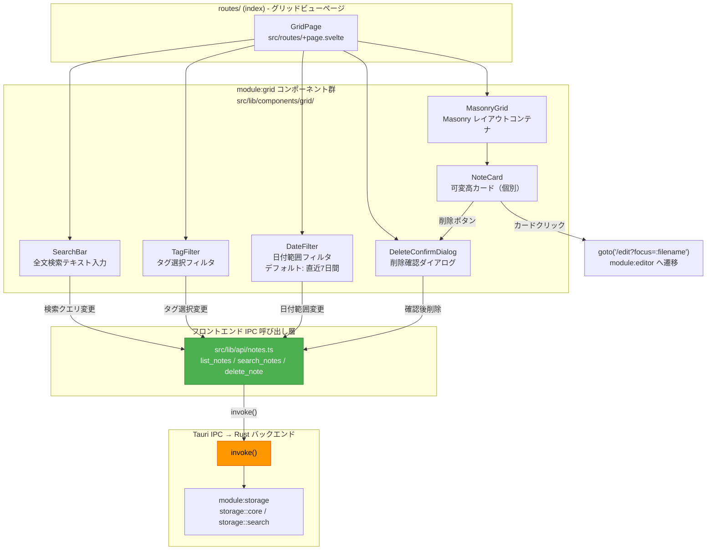
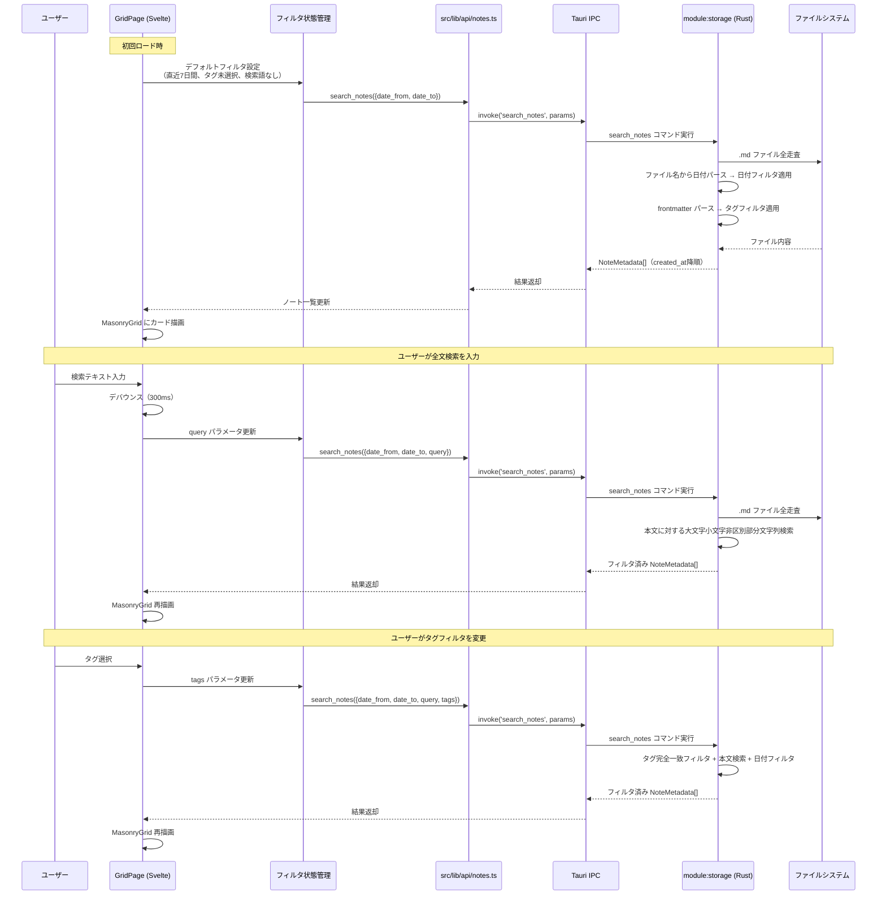
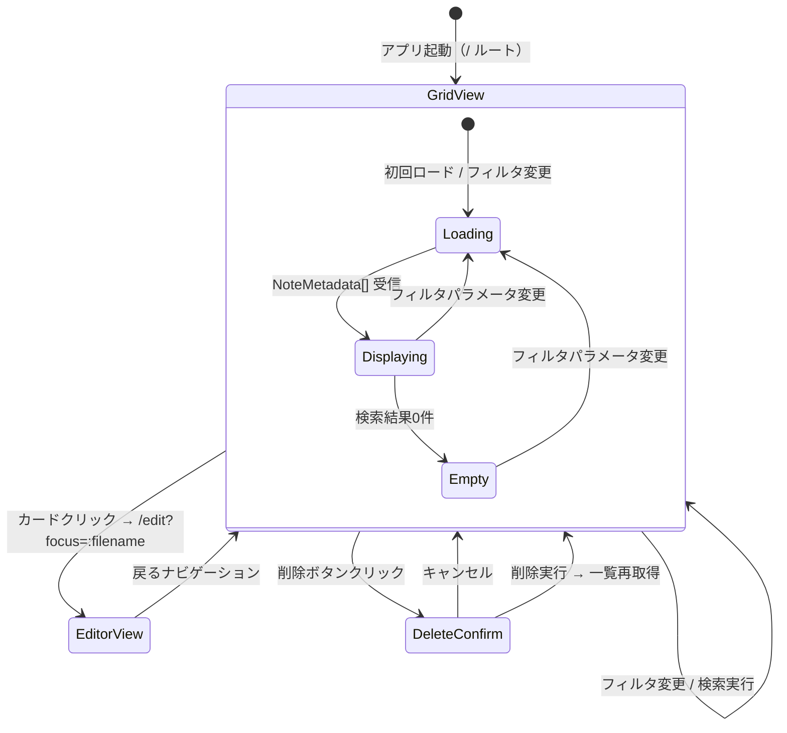
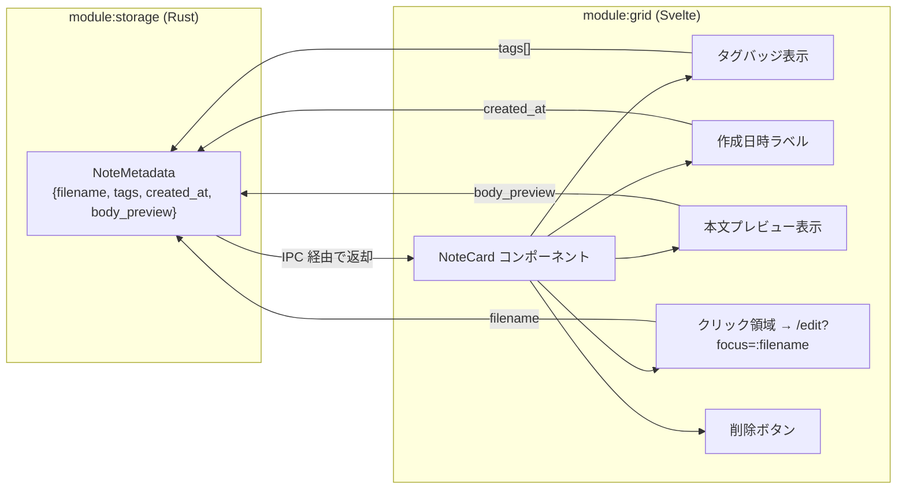

---
codd:
  node_id: detail:grid_search
  type: design
  modules: [lib/components, src-tauri/src/notes]
  depends_on:
  - id: detail:component_architecture
    relation: depends_on
    semantic: technical
  - id: detail:storage_fileformat
    relation: depends_on
    semantic: technical
  depended_by:
  - id: plan:implementation_plan
    relation: depends_on
    semantic: technical
  conventions:
  - targets:
    - module:grid
    reason: Pinterestスタイル可変高カード必須。デフォルトフィルタは直近7日間。
  - targets:
    - module:grid
    reason: タグ・日付フィルタおよび全文検索（ファイル全走査）は必須機能。
  - targets:
    - module:grid
    - module:editor
    reason: カードクリックでエディタ画面へ遷移必須。
  modules:
  - grid
  - storage
---

# Grid View & Search Detailed Design

## 1. Overview

本設計書は、PromptNotes の `module:grid` におけるグリッドビュー表示・フィルタリング・全文検索・画面遷移の詳細設計を定義する。グリッドビューはアプリケーションのインデックス画面（`/` ルート）として機能し、ノートを Pinterest スタイルの可変高カード（Masonry レイアウト）で一覧表示する。

`module:grid` は Svelte フロントエンド（`src/lib/components/grid/`）に配置され、データ取得はすべて Tauri IPC 経由で `module:storage`（Rust バックエンド）に委譲する。フロントエンドからの直接ファイルシステムアクセスは Tauri IPC 境界により技術的に遮断されており、ノート一覧の取得・検索・削除はすべて `#[tauri::command]` ハンドラ（`list_notes`、`search_notes`、`delete_note`）を通じて実行される。

### リリース不可制約（Non-negotiable conventions）への準拠

| 制約 ID | 対象 | 制約内容 | 本設計書での反映箇所 |
|---|---|---|---|
| NNC-G1 | `module:grid` | Pinterest スタイル可変高カード必須。デフォルトフィルタは直近 7 日間。 | §2.1 Masonry レイアウト構成図、§4.1 カードコンポーネント設計、§4.3 デフォルトフィルタ仕様 |
| NNC-G2 | `module:grid` | タグ・日付フィルタおよび全文検索（ファイル全走査）は必須機能。 | §2.2 検索・フィルタシーケンス図、§4.2 フィルタリング・検索 UI 設計、§4.4 全文検索連携仕様 |
| NNC-G3 | `module:grid`, `module:editor` | カードクリックでエディタ画面へ遷移必須。 | §2.3 画面遷移フロー図、§4.5 カードクリック遷移仕様 |

グリッドビューが依存する IPC コマンドと対応する Rust モジュールは以下のとおり。

| IPC コマンド | 用途 | 所有 Rust モジュール |
|---|---|---|
| `list_notes` | ノートメタデータ一覧取得（`NoteMetadata[]` 返却） | `module:storage` (`storage::core`) |
| `search_notes` | 全文検索・タグフィルタ・日付フィルタ適用済み一覧取得 | `module:storage` (`storage::search`) |
| `delete_note` | 指定ノートの物理削除 | `module:storage` (`storage::core`) |

データはローカル `.md` ファイルのみで管理され、クラウド同期・データベース（SQLite, Tantivy 等）・インデックスエンジンは一切使用しない。対象プラットフォームは Linux および macOS である。

## 2. Mermaid Diagrams

### 2.1 グリッドビュー コンポーネント構成



**所有権と境界**: `module:grid` はグリッドビューの UI 表示とユーザーインタラクション（フィルタ操作、カードクリック、削除確認）を排他的に所有する。データ取得ロジック（ファイル走査、frontmatter パース、全文検索）は `module:storage`（Rust バックエンド）が所有し、`module:grid` は `src/lib/api/notes.ts` を経由して IPC コマンドを呼び出すのみである。`module:grid` がファイルシステムに直接アクセスすること、および検索ロジックをフロントエンド側に実装することは禁止される。

緑色で示された `src/lib/api/notes.ts` は IPC 呼び出しの抽象層であり、`@tauri-apps/api/core` の `invoke()` を各 Svelte コンポーネントが直接呼び出すことを防ぐ。IPC コマンド名やパラメータ形式の変更は `notes.ts` のみに影響し、`module:grid` のコンポーネント群には波及しない。

### 2.2 検索・フィルタリング シーケンス



**実装境界**: フィルタリングのすべてのロジック（日付範囲比較、タグ一致判定、全文検索の部分文字列マッチ）は `module:storage`（Rust 側 `storage::search`）が所有する。フロントエンド側の `module:grid` はフィルタパラメータの組み立てと IPC コマンドの発行のみを行い、返却された `NoteMetadata[]` をそのまま表示する。フロントエンド側でのクライアントサイドフィルタリングは行わない。

検索テキスト入力のデバウンスは 300ms とし、エディタの自動保存デバウンス（500ms〜1000ms、`module:editor` 所有）とは独立したタイマーである。このデバウンスロジックは `module:grid` の `SearchBar` コンポーネントが所有する。

### 2.3 画面遷移フロー



**遷移の所有権**: カードクリックによるエディタ画面（`/edit?focus=:filename`）への遷移は `module:grid` の `NoteCard` コンポーネントが発火する。遷移先の `/edit` ルート（`module:editor` 所有）はノートフィード全体を表示する単一ルートであり、`focus` クエリパラメータで初期フォーカス対象ノートを指定する。`NoteFeed` は `list_notes` でフィードを初期ロード後、`focus` 指定ノートを先頭付近に配置して `read_note` でそのノートの内容を取得する。`module:grid` は遷移先のエディタロジック・フィード構築・フォーカス処理には一切関与しない。

削除フローでは、`NoteCard` 上の削除ボタンが `DeleteConfirmDialog` を表示し、ユーザー確認後に `delete_note` コマンドを発行する。削除完了後は `search_notes`（現在のフィルタパラメータ）を再発行して一覧を更新する。

### 2.4 NoteCard データフロー



**データ所有権**: `NoteMetadata` 構造体は `module:storage` の Rust コード内（`src-tauri/src/storage/types.rs`）に正規定義を持つ。フロントエンド側の TypeScript ミラー型（`src/lib/types/note.ts`）は正規定義ではなく、Rust 側の変更に追随する。`body_preview` のテキスト切り出し（先頭 N 文字）は `module:storage` が実行し、`module:grid` は受け取った文字列をそのまま表示する。

## 3. Ownership Boundaries

### 3.1 module:grid の排他的責務

| 責務 | 詳細 | 制約根拠 |
|---|---|---|
| Masonry レイアウト表示 | Pinterest スタイルの可変高カードレイアウト。CSS Grid または専用ライブラリによる実装。 | NNC-G1 |
| フィルタリング UI | 日付範囲選択、タグ選択、全文検索テキスト入力の各 UI コンポーネント提供。 | NNC-G2 |
| デフォルトフィルタ適用 | 初回表示時に直近 7 日間のフィルタを自動適用。 | NNC-G1 |
| カードクリック遷移 | `NoteCard` クリック時に `/edit?focus=:filename` へ SvelteKit ルーター遷移を発火。 | NNC-G3 |
| 削除確認 UI | 削除ボタン押下時の確認ダイアログ表示、確認後に `delete_note` コマンド発行。 | — |
| 検索デバウンス | `SearchBar` 入力のデバウンス（300ms）管理。 | — |

### 3.2 module:grid の禁止事項

| 禁止事項 | 理由 |
|---|---|
| ファイルシステムへの直接アクセス | Tauri IPC 境界制約（NNC-1 from component_architecture）。全操作は `invoke()` 経由。 |
| ファイル走査ロジックの実装 | 検索・一覧取得は `module:storage` の `search_notes` / `list_notes` に委譲。 |
| クライアントサイドフィルタリング | フィルタロジックは Rust 側で一元実行。フロントエンドでの二重フィルタは禁止。 |
| `NoteMetadata` の正規定義 | 正規定義は `module:storage` が所有。フロントエンドは TypeScript ミラー型のみ。 |
| `body_preview` のテキスト加工 | プレビュー文字数の切り出しは `module:storage` が実行済み。 |

### 3.3 module:grid と module:storage の境界

| 関心事 | 所有者 | `module:grid` からの利用方法 |
|---|---|---|
| ノートメタデータ一覧取得 | `module:storage` (`list_notes`) | `src/lib/api/notes.ts` 経由で IPC 呼び出し |
| 全文検索（本文部分文字列検索） | `module:storage` (`search_notes`) | `search_notes` にクエリ文字列を渡す |
| タグフィルタリング | `module:storage` (`search_notes`) | `search_notes` に `tags` パラメータを渡す |
| 日付フィルタリング | `module:storage` (`search_notes`) | `search_notes` に `date_from` / `date_to` パラメータを渡す |
| ノート物理削除 | `module:storage` (`delete_note`) | `delete_note` に `filename` を渡す |
| `NoteMetadata` 型定義 | `module:storage` (Rust 正規定義) | `src/lib/types/note.ts` の TypeScript ミラー型を参照 |
| ソート順 | `module:storage` | `created_at` 降順でソート済みの配列を返却。フロントエンドでの再ソートは不要。 |

### 3.4 module:grid と module:editor の境界

`module:grid` と `module:editor` の間の唯一のインタラクションはカードクリックによる画面遷移である。

- **遷移方向**: `module:grid` → `module:editor`（一方向）。`NoteCard` クリック時に SvelteKit の `goto('/edit?focus=:filename')` を呼び出す。
- **受け渡しデータ**: URL パラメータ `:filename`（`YYYY-MM-DDTHHMMSS.md` 形式）のみ。ノートの内容やメタデータは遷移先の `module:editor` が `read_note` コマンドで独立取得する。
- **戻り遷移**: エディタ画面からグリッドビューへの戻り遷移時、`module:grid` は `search_notes` を再発行してデータを最新化する。自動保存で更新されたタグや本文の変更が反映される。

### 3.5 共有型の所有権（module:grid 視点）

| 共有型 | 正規所有者 | module:grid での利用 |
|---|---|---|
| `NoteMetadata` | `module:storage` (Rust `src-tauri/src/storage/types.rs`) | `src/lib/types/note.ts` のミラー型をインポートしてカード描画に使用 |
| `SearchParams` | `module:grid` が TypeScript 型として定義 | `src/lib/types/search.ts` に定義。`search_notes` コマンドの引数型。 |

`SearchParams` 型は `module:grid` のフィルタ状態をコマンド引数に変換するための型であり、フロントエンド側で定義する。Rust 側では `search_notes` コマンドの引数として個別パラメータ（`query: Option<String>`, `tags: Option<Vec<String>>`, `date_from: Option<String>`, `date_to: Option<String>>`）で受け取る。

## 4. Implementation Implications

### 4.1 Masonry レイアウト実装（NNC-G1 準拠）

Pinterest スタイルの可変高カードレイアウトを CSS Grid で実装する。

```svelte
<!-- src/lib/components/grid/MasonryGrid.svelte -->
<div class="masonry-grid">
  {#each notes as note (note.filename)}
    <NoteCard {note} on:click={() => navigateToEditor(note.filename)} on:delete={() => confirmDelete(note.filename)} />
  {/each}
</div>

<style>
  .masonry-grid {
    columns: 3;
    column-gap: 16px;
    padding: 16px;
  }
  /* レスポンシブ対応 */
  @media (max-width: 900px) {
    .masonry-grid { columns: 2; }
  }
  @media (max-width: 600px) {
    .masonry-grid { columns: 1; }
  }
</style>
```

各 `NoteCard` は以下の情報を表示する（すべて `NoteMetadata` から取得）。

| 表示要素 | データソース | 表示仕様 |
|---|---|---|
| 本文プレビュー | `body_preview` | `module:storage` が切り出した先頭 N 文字をそのまま表示。カード高さはプレビュー長に応じて可変。 |
| タグバッジ | `tags[]` | 各タグをバッジ（チップ）UI で表示。クリック時にタグフィルタへの追加が可能。 |
| 作成日時 | `created_at` | 人間可読形式（例: `2026-04-10 09:15`）でフォーマット。フォーマット処理はフロントエンド側で実行。 |
| 削除ボタン | — | カード右上にアイコンボタン配置。クリック時に `DeleteConfirmDialog` を表示。 |

カード全体がクリック領域であり、クリック時に `/edit?focus=:filename` へ遷移する（NNC-G3 準拠）。削除ボタンのクリックイベントは `stopPropagation()` でカードクリックへの伝播を防止する。

### 4.2 フィルタリング・検索 UI 設計（NNC-G2 準拠）

フィルタリング UI は `GridPage` の上部に配置し、以下の 3 つのフィルタコンポーネントで構成する。

| コンポーネント | 入力タイプ | パラメータ名 | 動作 |
|---|---|---|---|
| `SearchBar` | テキスト入力 | `query` | 入力テキストで本文の部分文字列検索（大文字小文字非区別）。300ms デバウンス。 |
| `TagFilter` | 複数選択（チェックボックスまたはチップ） | `tags` | 選択されたすべてのタグを含むノートを AND 条件でフィルタ。 |
| `DateFilter` | 日付範囲セレクタ | `date_from`, `date_to` | ファイル名の作成日時に対する範囲フィルタ。 |

フィルタ変更時の動作:
1. いずれかのフィルタが変更されると、全フィルタパラメータを統合して `search_notes` コマンドを発行する。
2. 複数フィルタは AND 条件で結合される（日付範囲内 AND 指定タグを含む AND 本文にクエリ文字列を含む）。
3. すべてのフィルタが未指定の場合（デフォルト状態を除く）、`list_notes` 相当の全件取得となる。

タグ候補の取得: `list_notes` の結果から全ノートのタグを収集し、重複排除してタグフィルタの選択肢とする。タグ候補専用の IPC コマンドは設けず、既存の `NoteMetadata.tags` から抽出する。

### 4.3 デフォルトフィルタ仕様（NNC-G1 準拠）

グリッドビューの初回表示時に、`DateFilter` のデフォルト値として **直近 7 日間** を自動設定する。

- `date_from`: 現在日時から 7 日前の `YYYY-MM-DD` 形式文字列。
- `date_to`: 現在日時の `YYYY-MM-DD` 形式文字列。
- `query`: 空文字列（全文検索なし）。
- `tags`: 空配列（タグフィルタなし）。

デフォルトフィルタの計算はフロントエンド側（`module:grid` の `DateFilter` コンポーネント）で実行する。日付フィルタの範囲変更はユーザーが自由に行え、「全期間」選択でフィルタを解除できる。

直近 7 日間にノートが存在しない場合は、空の Masonry グリッドを表示し、「この期間のノートはありません。日付フィルタを変更してください。」のメッセージを表示する。

### 4.4 全文検索連携仕様（NNC-G2 準拠）

全文検索は `module:storage`（Rust 側 `storage::search`）が所有するファイル全走査方式で実装される。`module:grid` は検索クエリを `search_notes` コマンドに渡すのみで、検索アルゴリズムの実装に関与しない。

`search_notes` コマンドのパラメータ:

```typescript
// src/lib/types/search.ts
export interface SearchParams {
  query?: string;       // 全文検索クエリ（大文字小文字非区別部分文字列）
  tags?: string[];      // タグフィルタ（AND 条件）
  date_from?: string;   // 日付フィルタ開始（YYYY-MM-DD）
  date_to?: string;     // 日付フィルタ終了（YYYY-MM-DD）
}
```

対応する Rust 側コマンド:

```rust
#[tauri::command]
pub async fn search_notes(
    query: Option<String>,
    tags: Option<Vec<String>>,
    date_from: Option<String>,
    date_to: Option<String>,
    state: tauri::State<'_, AppState>,
) -> Result<Vec<NoteMetadata>, String> {
    let storage = state.storage.lock().await;
    storage.search(&query, &tags, &date_from, &date_to)
        .map_err(|e| e.to_string())
}
```

性能目標:
- 直近 7 日間のノート（数十件規模）に対して **100ms 以内** で応答。
- 数千件規模に達して体感遅延が発生した場合は ADR FU-002 として Tantivy 等の導入判断を行う。

検索中の UI 状態: `search_notes` の応答待ち中はローディングインジケータを表示する。100ms 以内で応答が返る通常ケースではインジケータは視認されないが、件数増大時の UX 劣化を防ぐ保険として実装する。

### 4.5 カードクリック遷移仕様（NNC-G3 準拠）

`NoteCard` のクリックイベントハンドラは SvelteKit の `goto()` 関数を使用してエディタ画面へ遷移する。

```typescript
// src/lib/components/grid/NoteCard.svelte 内
import { goto } from '$app/navigation';

function handleCardClick(filename: string) {
  goto(`/edit?focus=${encodeURIComponent(filename)}`);
}
```

- 遷移先: `/edit?focus=:filename`（`module:editor` 所有のルート）。
- パラメータ: `filename`（`YYYY-MM-DDTHHMMSS.md` 形式、`NoteMetadata.filename` の値）。
- 遷移先の `module:editor` は `NoteFeed` 初期ロードで `list_notes` を発行し、`focus` 指定の `filename` を用いて該当 `NoteBlock` の `read_note` を独立発行する。`module:grid` から `module:editor` へのノートデータの直接受け渡しは行わない。

### 4.6 削除フローの実装

削除操作は以下のフローで実行する。

1. `NoteCard` の削除ボタンクリック → `DeleteConfirmDialog` を表示。
2. ユーザーが「削除」を確認 → `src/lib/api/notes.ts` の `deleteNote(filename)` を呼び出し。
3. `invoke('delete_note', { filename })` → Rust 側 `module:storage` がファイルを物理削除。
4. 削除成功後、現在のフィルタパラメータで `search_notes` を再発行し、一覧を更新。
5. 削除対象のカードがアニメーション付きで消去される。

ゴミ箱機能は実装しない（ファイルは即時削除）。削除確認ダイアログにはノートの `body_preview` 先頭部分を表示し、ユーザーの誤削除を防止する。

### 4.7 フロントエンド状態管理

`module:grid` のフィルタ状態は Svelte のリアクティブストアで管理する。

```typescript
// src/lib/stores/gridFilter.ts
import { writable } from 'svelte/store';
import type { SearchParams } from '$lib/types/search';

function getDefaultDateFrom(): string {
  const d = new Date();
  d.setDate(d.getDate() - 7);
  return d.toISOString().slice(0, 10);
}

function getDefaultDateTo(): string {
  return new Date().toISOString().slice(0, 10);
}

export const gridFilter = writable<SearchParams>({
  query: '',
  tags: [],
  date_from: getDefaultDateFrom(),
  date_to: getDefaultDateTo(),
});
```

`gridFilter` ストアの変更を `$:` リアクティブステートメントで監視し、変更時に `search_notes` を発行する。グリッドビューからエディタに遷移して戻った場合、`gridFilter` の値は保持され、前回のフィルタ状態が復元される。

### 4.8 Tauri IPC セキュリティ制約の反映

`module:grid` は以下の Tauri IPC セキュリティ設定に従う（`tauri.conf.json` で強制）。

- `fs` プラグイン: `deny`。`module:grid` がファイルシステムに直接アクセスすることは技術的に不可能。
- `http` プラグイン: `deny`。外部 API 呼び出し（検索エンジンへの問い合わせ等）は禁止。
- すべてのデータ取得は `invoke()` による IPC コマンド経由のみ許可。

### 4.9 テスト要件

| テストケース | テスト種別 | 検証内容 |
|---|---|---|
| グリッド初期表示 | E2E (Playwright) | 初回ロード時にデフォルト直近 7 日間フィルタが適用され、該当ノートが Masonry レイアウトで表示される |
| 全文検索 | E2E (Playwright) | 検索テキスト入力後 300ms のデバウンス経過後に `search_notes` が発行され、結果がカードとして表示される |
| タグフィルタ | E2E (Playwright) | タグ選択時にフィルタ結果が更新され、選択タグを含むノートのみ表示される |
| 日付フィルタ | E2E (Playwright) | 日付範囲変更時にフィルタ結果が更新される |
| カードクリック遷移 | E2E (Playwright) | カードクリック時に `/edit?focus=:filename` へ遷移し、エディタ画面が表示される |
| 削除確認ダイアログ | E2E (Playwright) | 削除ボタンクリックで確認ダイアログが表示され、確認後にカードが消去される |
| 空結果表示 | E2E (Playwright) | 検索結果 0 件時に空状態メッセージが表示される |
| IPC 境界違反なし | E2E (Playwright) | `fetch` / `XMLHttpRequest` の不在確認（ネットワーク通信禁止） |

### 4.10 ファイルディレクトリ構成

```
src/lib/components/grid/
├── MasonryGrid.svelte       # Masonry レイアウトコンテナ
├── NoteCard.svelte           # 個別カードコンポーネント
├── SearchBar.svelte          # 全文検索テキスト入力
├── TagFilter.svelte          # タグ選択フィルタ
├── DateFilter.svelte         # 日付範囲フィルタ
└── DeleteConfirmDialog.svelte # 削除確認ダイアログ

src/lib/stores/
└── gridFilter.ts             # フィルタ状態ストア

src/lib/types/
├── note.ts                   # NoteMetadata TypeScript ミラー型
└── search.ts                 # SearchParams 型定義

src/lib/api/
└── notes.ts                  # IPC 呼び出し抽象層（list_notes, search_notes, delete_note）

src/routes/
└── +page.svelte              # GridPage（/ ルート）
```

## 5. Open Questions

| ID | 質問 | 影響モジュール | 解決トリガー |
|---|---|---|---|
| OQ-GS-001 | `body_preview` の文字数上限をいくつにするか（現在 200 文字想定）。Masonry レイアウトのカード高さバランスに直接影響する。カード最大高さの CSS 制限との組み合わせも検討が必要。 | `module:grid`, `module:storage` | UI プロトタイプ作成時に視覚的バランスを評価 |
| OQ-GS-002 | タグフィルタの AND/OR 条件をどちらにするか。現設計では AND 条件（選択タグをすべて含むノートのみ表示）としているが、OR 条件（いずれかのタグを含むノートを表示）の方がユースケースに適合する可能性がある。 | `module:grid`, `module:storage` | ユーザーテスト実施時 |
| OQ-GS-003 | Masonry レイアウトの列数をウィンドウ幅に応じて動的に変更するブレークポイント（現在 900px / 600px を仮定）の最適値。Tauri ウィンドウのデフォルトサイズとの整合性を確認する必要がある。 | `module:grid` | UI プロトタイプ作成時 |
| OQ-GS-004 | ノート削除の UI 配置について、グリッドビューのカード上の削除ボタンに加えて、エディタ画面内にも削除機能を設けるか。設ける場合、`delete_note` の呼び出し後にグリッドビューへの自動遷移が必要になる。 | `module:grid`, `module:editor` | UI 設計レビュー時（component_architecture OQ-CA-005 と同一論点） |
| OQ-GS-005 | グリッドビューに戻った際のスクロール位置復元。エディタからの戻り遷移時に前回のスクロール位置を復元するか、先頭にリセットするか。SvelteKit の `afterNavigate` フックでの実装可否を検証する必要がある。 | `module:grid` | UI プロトタイプ作成時 |
| OQ-GS-006 | 全文検索のハイライト表示。検索クエリに一致する `body_preview` 内のテキスト部分をハイライト表示するか。実装する場合、`search_notes` の戻り値にマッチ位置情報を含めるか、フロントエンド側で再マッチングするかの設計判断が必要。 | `module:grid`, `module:storage` | 初回実装完了後のユーザーフィードバック |
