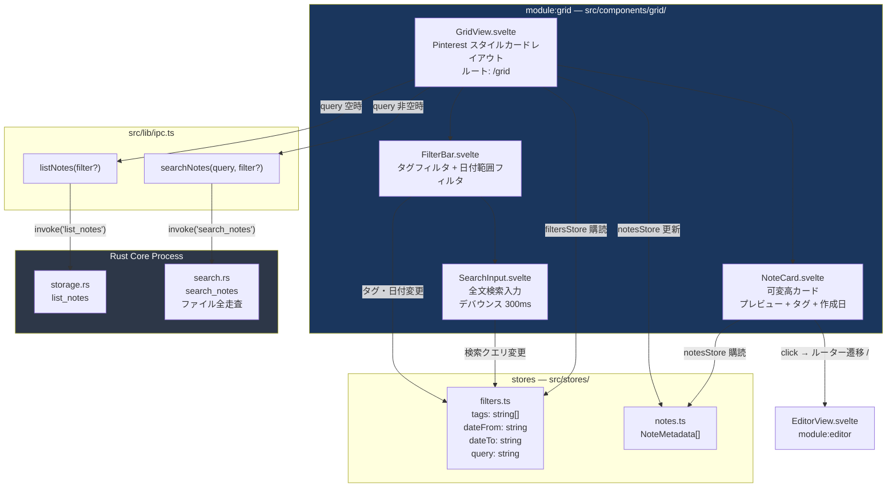
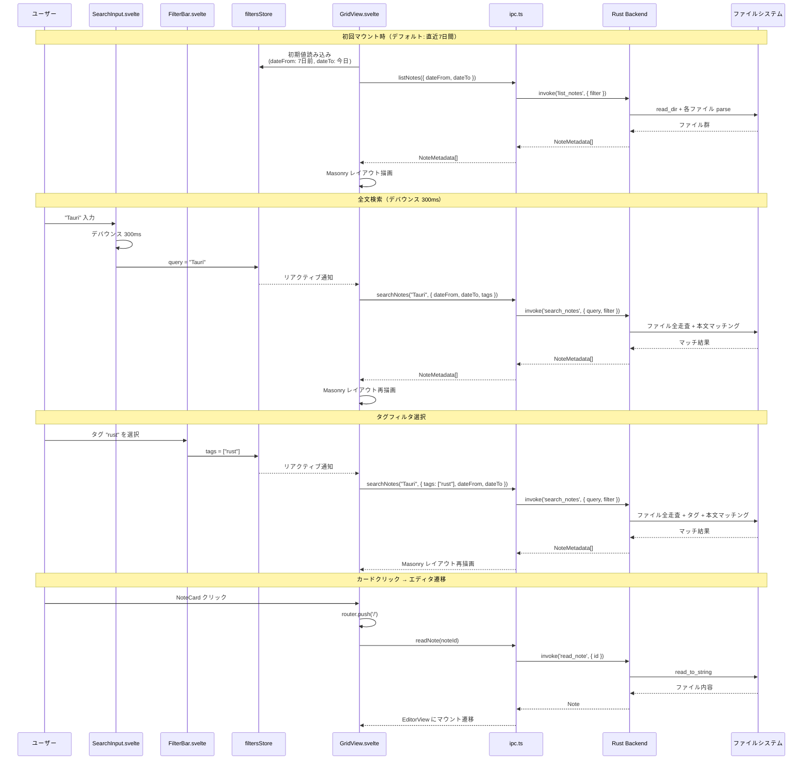

---
codd:
  node_id: detail:grid_search
  type: design
  depends_on:
  - id: detail:component_architecture
    relation: depends_on
    semantic: technical
  - id: detail:storage_fileformat
    relation: depends_on
    semantic: technical
  depended_by:
  - id: plan:implementation_plan
    relation: depends_on
    semantic: technical
  conventions:
  - targets:
    - module:grid
    reason: Pinterestスタイル可変高カード必須。デフォルトフィルタは直近7日間。
  - targets:
    - module:grid
    reason: タグ・日付フィルタおよび全文検索（ファイル全走査）は必須機能。
  - targets:
    - module:grid
    - module:editor
    reason: カードクリックでエディタ画面へ遷移必須。
  modules:
  - grid
  - storage
---

# Grid View & Search Detailed Design

## 1. Overview

本設計書は PromptNotes の `module:grid` におけるグリッドビュー表示、全文検索、タグ・日付フィルタリング、およびエディタ画面への遷移の詳細設計を定義する。`module:grid` は WebView Process（Svelte SPA）内に存在し、Rust バックエンドの `search` モジュールおよび `storage` モジュールと Tauri IPC 経由で通信してノート一覧の取得・検索を行う。

グリッドビューは Pinterest スタイルの可変高カードレイアウトを採用し、各ノートカードにはプレビューテキスト（本文先頭 100 文字）、タグ一覧、作成日時を表示する。ユーザーはカードクリックによりエディタ画面（`/` ルート）へ遷移し、対象ノートを即座に編集可能とする。

### リリースブロッキング制約の適用

本設計書は以下のリリースブロッキング制約を構造的に強制する。

| 制約 | 対象 | 内容 | 本設計書での担保方法 |
|---|---|---|---|
| RBC-GRID-1 | `module:grid` | Pinterest スタイル可変高カード必須。デフォルトフィルタは直近 7 日間 | `GridView.svelte` は CSS Masonry レイアウトを実装し、`filtersStore` の初期値を直近 7 日間に設定 |
| RBC-GRID-2 | `module:grid` | タグ・日付フィルタおよび全文検索（ファイル全走査）は必須機能 | `FilterBar.svelte` にタグフィルタ・日付範囲フィルタを配置し、`SearchInput.svelte` で全文検索を実装。検索は Rust バックエンドのファイル全走査で実行 |
| RBC-GRID-3 | `module:grid`, `module:editor` | カードクリックでエディタ画面へ遷移必須 | `NoteCard.svelte` の `click` イベントで `/{noteId}` へルーター遷移し、`EditorView.svelte` が `read_note` で対象ノートを読み込み |

すべてのデータ取得は `src/lib/ipc.ts` のラッパー関数（`listNotes`、`searchNotes`）を経由し、フロントエンドからの直接ファイルシステムアクセスは Tauri v2 のケイパビリティシステムにより構造的に禁止される。

### 技術スタック

| 要素 | 技術 | 備考 |
|---|---|---|
| カードレイアウト | CSS columns（Masonry 代替） | JavaScript ベースの仮想スクロールは想定データ量では不要 |
| 状態管理 | `filtersStore`（`src/stores/filters.ts`） | フィルタ条件のリアクティブ管理 |
| 検索デバウンス | 300ms `setTimeout` | Rust バックエンドのファイル全走査を過剰にトリガーしない |
| ルーティング | `svelte-spa-router` または Svelte 5 組み込み | `/grid` でマウント、カードクリックで `/` へ遷移 |

---

## 2. Mermaid Diagrams

### 2.1 グリッドビューのコンポーネント構成



**所有権と境界:**

- `GridView.svelte` はグリッド画面全体のオーケストレーションを担当する。`filtersStore` の変更を購読し、フィルタ条件に基づいて `ipc.ts` の `listNotes` または `searchNotes` を呼び出す。検索クエリが空の場合は `listNotes` を、非空の場合は `searchNotes` を使い分ける。
- `FilterBar.svelte` はタグフィルタと日付範囲フィルタの UI を所有する。フィルタ条件の変更は `filtersStore` への書き込みを通じて `GridView` に伝播する。`FilterBar` 自身がバックエンドと直接通信することはない。
- `SearchInput.svelte` は `FilterBar` 内に配置される全文検索入力コンポーネントであり、300ms デバウンスを内部で実装する。デバウンス後のクエリ文字列を `filtersStore.query` に書き込む。
- `NoteCard.svelte` は `notesStore` から受け取った `NoteMetadata` を表示し、クリック時にルーター遷移を発火する。カード自身が IPC 呼び出しを行うことはない。
- Rust バックエンドの `search.rs` がファイル全走査による全文検索を排他的に所有する。フロントエンド側で独自の検索・フィルタ処理を実装することは禁止される。

### 2.2 検索・フィルタリングのデータフローシーケンス



**実装上の境界:**

- 初回マウント時にデフォルトフィルタ（直近 7 日間）が適用される。`filtersStore` の `dateFrom` 初期値は `new Date(Date.now() - 7 * 24 * 60 * 60 * 1000).toISOString().slice(0, 10)` で算出し、`dateTo` は当日日付とする。これにより RBC-GRID-1 のデフォルトフィルタ要件を満たす。
- 検索クエリとフィルタ条件は `filtersStore` で統合管理され、いずれかの値が変更されるたびに `GridView` がバックエンドへの再問い合わせを発行する。複数フィルタの同時変更（例: タグ選択と同時に検索クエリ入力）に対してはリアクティブ購読のバッチ処理で 1 回の IPC 呼び出しに統合する。
- カードクリックからエディタ画面への遷移（RBC-GRID-3）は、Svelte ルーターの `push` によるクライアントサイド遷移で実装し、全画面リロードは発生しない。遷移先の `EditorView.svelte` が `read_note` を呼び出してノート全文を取得する。

### 2.3 フィルタ条件のステートマシン

```mermaid
stateDiagram-v2
    [*] --> Default: GridView マウント

    Default --> Filtered: タグ選択 / 日付変更
    Default --> Searching: 検索クエリ入力
    Filtered --> FilteredSearching: 検索クエリ入力
    Searching --> FilteredSearching: タグ選択 / 日付変更
    FilteredSearching --> Searching: フィルタクリア
    FilteredSearching --> Filtered: 検索クリア
    Filtered --> Default: フィルタ全クリア
    Searching --> Default: 検索クリア
    FilteredSearching --> Default: 全条件クリア

    note right of Default
        dateFrom: 7日前
        dateTo: 今日
        tags: []
        query: ""
        API: list_notes
    end note

    note right of Searching
        query: 非空
        API: search_notes
    end note

    note right of Filtered
        tags/date が変更済み
        query: 空
        API: list_notes
    end note

    note right of FilteredSearching
        tags/date + query
        API: search_notes
    end note
```

**状態遷移の説明:**

- デフォルト状態は直近 7 日間の `list_notes` 呼び出しに対応する。フィルタも検索も未適用の初期状態であり、`GridView` のマウント時に自動設定される。
- `query` が非空の場合は常に `search_notes`（ファイル全走査）を使用し、空の場合は `list_notes` を使用する。これは `search_notes` がバックエンドで本文の全文マッチングを行うのに対し、`list_notes` はメタデータ（タグ・日付）のみでフィルタリングするためである。
- フィルタクリアボタンは `FilterBar` に配置し、タグフィルタ・日付フィルタ・検索クエリをすべて初期値に戻す。

---

## 3. Ownership Boundaries

### 3.1 コンポーネント所有権

| コンポーネント | 所有モジュール | 所有するリソース | 禁止事項 |
|---|---|---|---|
| `GridView.svelte` | `grid` | Masonry カードレイアウト、`filtersStore` 購読によるデータ取得オーケストレーション、`notesStore` への書き込み | 独自の検索・フィルタロジック実装、直接 `invoke` 呼び出し |
| `NoteCard.svelte` | `grid` | 個別ノートカードの表示（プレビュー・タグ・作成日）、クリックイベントによるルーター遷移 | IPC 呼び出し、ノートデータの直接編集 |
| `FilterBar.svelte` | `grid` | タグフィルタ UI（チェックボックス/チップ）、日付範囲フィルタ UI（日付入力）、フィルタクリアボタン | バックエンドとの直接通信 |
| `SearchInput.svelte` | `grid` | 全文検索テキスト入力、300ms デバウンス制御 | 独自の検索アルゴリズム実装 |

### 3.2 ストア所有権

| ストア | 書き込み権限 | 購読者 | 初期値 |
|---|---|---|---|
| `filtersStore` | `FilterBar`（タグ・日付）、`SearchInput`（クエリ） | `GridView`、`FilterBar` | `{ tags: [], dateFrom: "7日前", dateTo: "今日", query: "" }` |
| `notesStore` | `GridView`（IPC 応答を反映） | `GridView`、`NoteCard` | `[]` |

`filtersStore` の型定義は `src/lib/types.ts` の `NoteFilter` 型を拡張した内部表現を使用する。

```typescript
// src/stores/filters.ts
import { writable } from 'svelte/store';
import type { NoteFilter } from '$lib/types';

interface GridFilters extends NoteFilter {
  query: string;  // 全文検索クエリ（NoteFilter には含まれない）
}

function getDefaultFilters(): GridFilters {
  const now = new Date();
  const sevenDaysAgo = new Date(now.getTime() - 7 * 24 * 60 * 60 * 1000);
  return {
    tags: [],
    date_from: sevenDaysAgo.toISOString().slice(0, 10),
    date_to: now.toISOString().slice(0, 10),
    query: '',
  };
}

export const filtersStore = writable<GridFilters>(getDefaultFilters());

export function resetFilters() {
  filtersStore.set(getDefaultFilters());
}
```

`filtersStore` の初期値関数 `getDefaultFilters()` が直近 7 日間のデフォルトフィルタを生成する。これにより RBC-GRID-1 のデフォルトフィルタ制約を `filtersStore` の初期化時点で構造的に強制する。

### 3.3 IPC 呼び出しの所有権

`module:grid` が使用する IPC 関数はすべて `src/lib/ipc.ts` からインポートする。

| IPC 関数 | 呼び出し元 | 用途 |
|---|---|---|
| `listNotes(filter?)` | `GridView.svelte` | 検索クエリが空の場合のフィルタ付きノート一覧取得 |
| `searchNotes(query, filter?)` | `GridView.svelte` | 検索クエリが非空の場合の全文検索 + フィルタ |
| `readNote(id)` | ルーター遷移先の `EditorView.svelte` | カードクリック後のノート全文取得 |

`NoteCard.svelte`、`FilterBar.svelte`、`SearchInput.svelte` は IPC 関数を直接呼び出さない。データ取得のトリガーは `GridView.svelte` のリアクティブ購読に一元化される。

### 3.4 バックエンド検索ロジックの所有権

全文検索のマッチングロジックは `search.rs` が排他的に所有する。フロントエンドでの JavaScript ベースのフィルタリングや検索は一切行わない。

`search_notes` コマンドの責務:

1. `storage.rs` の `list_note_files()` でディレクトリ内の `.md` ファイル一覧を取得
2. 各ファイルの frontmatter をパースしてタグフィルタ・日付フィルタを適用
3. フィルタ通過ファイルの本文に対して `query` 文字列の部分一致検索を実行
4. マッチしたノートの `NoteMetadata` を `created_at` 降順で返却

検索はケースインセンシティブな部分一致とし、正規表現は初期スコープでは対応しない。

### 3.5 共有型の利用

`NoteCard.svelte` が表示するデータは `src/lib/types.ts` の `NoteMetadata` 型に対応する。

```typescript
// src/lib/types.ts（既存定義の参照）
interface NoteMetadata {
  id: string;           // "2026-04-11T143052"
  tags: string[];       // frontmatter の tags
  created_at: string;   // ISO 8601（ファイル名から導出）
  preview: string;      // 本文先頭 100 文字
}
```

`NoteMetadata` の型定義は `src/lib/types.ts` が単一所有者であり、`module:grid` のコンポーネントはここからインポートする。型の再定義は禁止。

---

## 4. Implementation Implications

### 4.1 Masonry レイアウトの実装

Pinterest スタイルの可変高カードレイアウト（RBC-GRID-1）は CSS `columns` プロパティを使用して実装する。

```css
/* GridView.svelte の <style> */
.grid-container {
  columns: 3 280px;      /* 最小カード幅 280px、最大 3 列 */
  column-gap: 16px;
  padding: 16px;
}

.note-card {
  break-inside: avoid;    /* カードが列をまたがないようにする */
  margin-bottom: 16px;
  border-radius: 8px;
  background: var(--card-bg);
  padding: 16px;
  cursor: pointer;
  transition: box-shadow 0.2s ease;
}

.note-card:hover {
  box-shadow: 0 4px 12px rgba(0, 0, 0, 0.15);
}
```

CSS `columns` は JavaScript ベースの Masonry ライブラリ（Masonry.js 等）を使用せず、ブラウザネイティブのレイアウトで実現する。WebKitGTK（Linux）および WKWebView（macOS）の両方で `columns` プロパティは完全にサポートされている。

カードの高さはプレビューテキストの長さとタグ数に応じて自然に変動し、`break-inside: avoid` により列間でカードが分断されないことを保証する。

### 4.2 NoteCard コンポーネントの実装

`NoteCard.svelte` は `NoteMetadata` を props として受け取り、以下の要素を表示する。

```svelte
<script lang="ts">
  import type { NoteMetadata } from '$lib/types';
  import { push } from 'svelte-spa-router';

  export let note: NoteMetadata;

  function handleClick() {
    push(`/?note=${note.id}`);
  }

  function formatDate(isoDate: string): string {
    const d = new Date(isoDate);
    return `${d.getFullYear()}/${String(d.getMonth() + 1).padStart(2, '0')}/${String(d.getDate()).padStart(2, '0')}`;
  }
</script>

<div class="note-card" on:click={handleClick} role="button" tabindex="0">
  <p class="preview">{note.preview}</p>
  {#if note.tags.length > 0}
    <div class="tags">
      {#each note.tags as tag}
        <span class="tag">{tag}</span>
      {/each}
    </div>
  {/if}
  <time class="created-at">{formatDate(note.created_at)}</time>
</div>
```

カードクリック時のルーター遷移は `push` 関数でエディタ画面のルート（`/`）にクエリパラメータ `note={id}` を付与する形で実装する。`EditorView.svelte` はマウント時にクエリパラメータから `noteId` を取得し、`readNote(noteId)` で対象ノートを読み込む。これにより RBC-GRID-3 を満たす。

### 4.3 FilterBar コンポーネントの実装

`FilterBar.svelte` はタグフィルタと日付範囲フィルタを提供する。

**タグフィルタ:** 現在の `notesStore` に含まれる全タグのユニーク一覧を算出し、チップ形式で表示する。チップクリックでトグル選択し、`filtersStore.tags` を更新する。

```svelte
<script lang="ts">
  import { filtersStore, resetFilters } from '$stores/filters';
  import { notesStore } from '$stores/notes';
  import SearchInput from './SearchInput.svelte';

  $: allTags = [...new Set($notesStore.flatMap(n => n.tags))].sort();

  function toggleTag(tag: string) {
    filtersStore.update(f => ({
      ...f,
      tags: f.tags.includes(tag)
        ? f.tags.filter(t => t !== tag)
        : [...f.tags, tag],
    }));
  }
</script>

<div class="filter-bar">
  <SearchInput />
  <div class="tag-chips">
    {#each allTags as tag}
      <button
        class="chip"
        class:active={$filtersStore.tags.includes(tag)}
        on:click={() => toggleTag(tag)}
      >
        {tag}
      </button>
    {/each}
  </div>
  <div class="date-range">
    <input type="date" bind:value={$filtersStore.date_from} />
    <span>〜</span>
    <input type="date" bind:value={$filtersStore.date_to} />
  </div>
  <button class="clear-btn" on:click={resetFilters}>クリア</button>
</div>
```

**日付範囲フィルタ:** HTML5 の `<input type="date">` を使用する。`date_from` と `date_to` を `filtersStore` に双方向バインドする。初期値は直近 7 日間（RBC-GRID-1）。

**タグ一覧の取得:** 初回マウント時に `listNotes` をフィルタなし（直近 7 日間）で呼び出した結果の `NoteMetadata[]` からタグを収集する。日付範囲を広げた場合や全文検索を行った場合は、その応答に含まれるタグ一覧で動的に更新される。

### 4.4 SearchInput コンポーネントの実装

```svelte
<script lang="ts">
  import { filtersStore } from '$stores/filters';

  let inputValue = '';
  let debounceTimer: ReturnType<typeof setTimeout>;

  function handleInput() {
    clearTimeout(debounceTimer);
    debounceTimer = setTimeout(() => {
      filtersStore.update(f => ({ ...f, query: inputValue }));
    }, 300);
  }
</script>

<input
  type="search"
  placeholder="ノートを検索..."
  bind:value={inputValue}
  on:input={handleInput}
/>
```

300ms デバウンスはコンポーネント内の `setTimeout` / `clearTimeout` で実装する。デバウンス後に `filtersStore.query` を更新し、`GridView` のリアクティブ購読がバックエンドへの問い合わせをトリガーする。

### 4.5 GridView のデータ取得オーケストレーション

`GridView.svelte` は `filtersStore` の購読により、フィルタ条件変更を検知してバックエンドにデータを要求する。

```svelte
<script lang="ts">
  import { onMount } from 'svelte';
  import { filtersStore } from '$stores/filters';
  import { notesStore } from '$stores/notes';
  import { listNotes, searchNotes } from '$lib/ipc';
  import NoteCard from './NoteCard.svelte';
  import FilterBar from './FilterBar.svelte';

  let loading = false;

  async function fetchNotes(filters: GridFilters) {
    loading = true;
    try {
      const filter = {
        tags: filters.tags.length > 0 ? filters.tags : undefined,
        date_from: filters.date_from,
        date_to: filters.date_to,
      };
      const notes = filters.query
        ? await searchNotes(filters.query, filter)
        : await listNotes(filter);
      notesStore.set(notes);
    } finally {
      loading = false;
    }
  }

  $: fetchNotes($filtersStore);
</script>

<div class="grid-page">
  <FilterBar />
  {#if loading}
    <div class="loading">読み込み中...</div>
  {:else if $notesStore.length === 0}
    <div class="empty">ノートが見つかりません</div>
  {:else}
    <div class="grid-container">
      {#each $notesStore as note (note.id)}
        <NoteCard {note} />
      {/each}
    </div>
  {/if}
</div>
```

`$: fetchNotes($filtersStore)` のリアクティブ宣言により、`filtersStore` のいずれかのプロパティが変更されるたびに自動的にデータ再取得が発行される。Svelte のリアクティブシステムがバッチ処理するため、同一ティック内の複数更新は 1 回の `fetchNotes` 呼び出しに統合される。

### 4.6 バックエンドの NoteFilter 型と search_notes コマンド

Rust バックエンドの `NoteFilter` 構造体（`models.rs` で定義済み）に対応するフィルタリングロジック:

```rust
// search.rs
#[tauri::command]
pub fn search_notes(query: String, filter: Option<NoteFilter>) -> Result<Vec<NoteMetadata>, StorageError> {
    let notes_dir = resolve_notes_dir()?;
    let files = list_note_files(&notes_dir)?;
    let mut results: Vec<NoteMetadata> = Vec::new();

    for file in files {
        let filename = file.file_name().to_string_lossy().to_string();
        let (id, created_at) = parse_filename(&filename)?;

        // 日付フィルタ（ファイル名ベース）
        if let Some(ref f) = filter {
            if let Some(ref from) = f.date_from {
                if created_at < *from { continue; }
            }
            if let Some(ref to) = f.date_to {
                if created_at > *to { continue; }
            }
        }

        let content = std::fs::read_to_string(&file.path())?;
        let (frontmatter, body) = parse_frontmatter(&content)?;

        // タグフィルタ
        if let Some(ref f) = filter {
            if let Some(ref tags) = f.tags {
                if !tags.is_empty() && !tags.iter().any(|t| frontmatter.tags.contains(t)) {
                    continue;
                }
            }
        }

        // 全文検索（ケースインセンシティブ部分一致）
        let query_lower = query.to_lowercase();
        let body_lower = body.to_lowercase();
        let tags_str = frontmatter.tags.join(" ").to_lowercase();
        if !body_lower.contains(&query_lower) && !tags_str.contains(&query_lower) {
            continue;
        }

        let preview = body.chars().take(100).collect::<String>();
        results.push(NoteMetadata { id, tags: frontmatter.tags, created_at, preview });
    }

    results.sort_by(|a, b| b.created_at.cmp(&a.created_at));
    Ok(results)
}
```

検索対象は本文テキストおよびタグ文字列である。ファイル名（ノート ID）は検索対象外とする。日付フィルタはファイル名から導出した `created_at` に対して適用し、ファイル読み込み前にスキップすることでパフォーマンスを最適化する。

### 4.7 パフォーマンス特性

| 操作 | 想定レイテンシ | 条件 | 閾値の根拠 |
|---|---|---|---|
| 初回マウント（直近 7 日間） | < 100ms | 7 日間のノート数 ≤ 数十件 | `list_notes` の 100 件走査 < 50ms + レンダリング |
| 全文検索（100 件） | < 200ms | デバウンス 300ms + バックエンド走査 | ファイル全走査 < 50ms + 本文マッチング |
| 全文検索（1000 件） | < 800ms | 想定上限 | ファイル全走査 < 500ms + 本文マッチング |
| タグフィルタ切替 | < 100ms | メタデータのみのフィルタ | `list_notes` のフィルタ済み結果 |
| カードクリック → エディタ表示 | < 150ms | ルーター遷移 + `read_note` | 単一ファイル読み込み < 10ms + UI 遷移 |

デバウンス 300ms によりユーザーがタイピング中にバックエンドへの過剰な問い合わせを防止する。想定データ量（数十件/週）ではインデックス構築なしのファイル全走査で十分な応答速度を達成できる。

### 4.8 リリースブロッキング制約への構造的対応

**RBC-GRID-1（Pinterest スタイル可変高カード + デフォルト 7 日間フィルタ）:**

- CSS `columns` プロパティにより可変高の Masonry レイアウトを実現する。カードの高さはプレビューテキスト長とタグ数に応じて自然に決定される。
- `filtersStore` の `getDefaultFilters()` 関数が `date_from` を 7 日前に、`date_to` を当日に設定する。`GridView` マウント時にこの初期値で `listNotes` が呼び出されるため、デフォルト表示は必ず直近 7 日間となる。
- `resetFilters()` 関数もデフォルト値を直近 7 日間に戻すため、フィルタクリア操作でもこの制約が維持される。

**RBC-GRID-2（タグ・日付フィルタ + 全文検索の必須化）:**

- `FilterBar.svelte` がタグチップフィルタと日付範囲入力を UI として提供する。
- `SearchInput.svelte` が 300ms デバウンス付き全文検索入力を提供する。
- バックエンドの `search_notes` コマンドがファイル全走査によるケースインセンシティブ部分一致検索を実行する。フロントエンド側での独自フィルタリングは禁止し、すべてバックエンド経由とする。
- タグフィルタ、日付フィルタ、全文検索は同時適用可能であり、`filtersStore` の統合状態によりバックエンドに AND 条件として渡される。

**RBC-GRID-3（カードクリックでエディタ遷移）:**

- `NoteCard.svelte` の `click` イベントハンドラが `push('/?note={id}')` でルーター遷移を発火する。
- `EditorView.svelte` がクエリパラメータの `note` を検出し、`readNote(id)` で対象ノートを読み込んで CodeMirror 6 にセットする。
- キーボードアクセシビリティのため、`NoteCard` には `role="button"` と `tabindex="0"` を付与し、Enter キーでもクリックと同等の遷移が発生する。

### 4.9 Tauri IPC セキュリティへの準拠

`module:grid` のすべてのデータ取得は `src/lib/ipc.ts` のラッパー関数を経由する。`@tauri-apps/api/core` の `invoke` を直接インポートするコンポーネントは `module:grid` 内に存在しない。Tauri v2 のケイパビリティ設定で `fs` プラグインが無効化されているため、フロントエンドからの直接ファイルアクセスは構造的に不可能である。

---

## 5. Open Questions

| ID | 質問 | 影響コンポーネント | 判断に必要な情報 |
|---|---|---|---|
| OQ-GS-001 | タグフィルタの一覧を直近 7 日間のノートから動的に構築するか、全ノートのタグ一覧を別途取得する API（`list_all_tags`）を新設するか。直近 7 日間のノートに存在しないタグは初期表示でフィルタ候補に現れない | `FilterBar.svelte`、`search.rs` | タグの活用頻度とユーザーの期待する検索範囲の確認 |
| OQ-GS-002 | CSS `columns` による Masonry レイアウトで、ノート件数が多い場合（100 件以上）のスクロールパフォーマンスが WebKitGTK で十分か。仮想スクロール（windowing）の導入が必要か | `GridView.svelte`、`NoteCard.svelte` | WebKitGTK 環境での 100 件以上のカード描画ベンチマーク |
| OQ-GS-003 | 検索結果でマッチした箇所のハイライト表示を行うか。行う場合、`search_notes` の応答に `matchPositions` フィールドを追加する必要がある | `NoteCard.svelte`、`search.rs`、`models.rs` | 全文検索 UI の詳細仕様の確定 |
| OQ-GS-004 | カードクリック時のルーター遷移を `/?note={id}` のクエリパラメータ方式とするか、`/note/{id}` のパスパラメータ方式とするか。前者は `EditorView` のルートを変更しないが、後者はルーティング定義の追加が必要 | `NoteCard.svelte`、`App.svelte`、`EditorView.svelte` | ルーティングライブラリの選定結果（OQ-CA-005） |
| OQ-GS-005 | `filtersStore` の状態をブラウザの URL クエリパラメータに同期するか。同期する場合、グリッドビューの検索・フィルタ状態がブックマーク可能になるが、Tauri デスクトップアプリでの URL バーの扱いを検討する必要がある | `filtersStore`、`GridView.svelte` | デスクトップアプリにおける URL ベース状態管理の必要性 |
