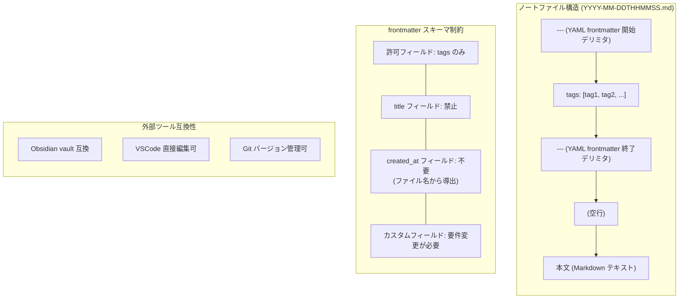
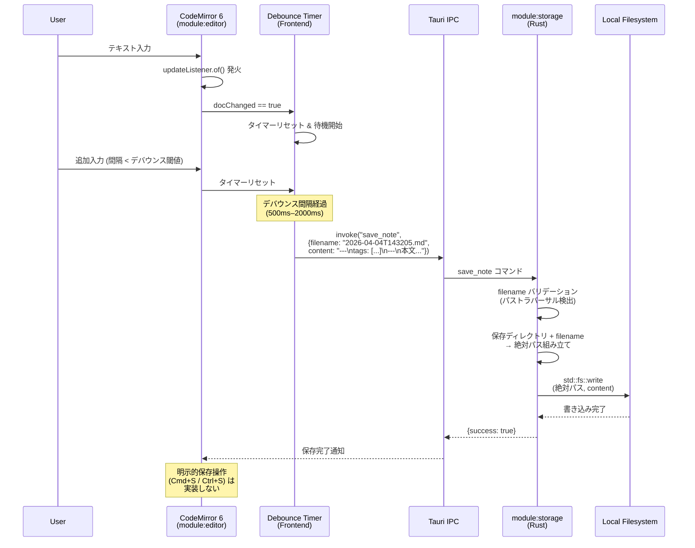
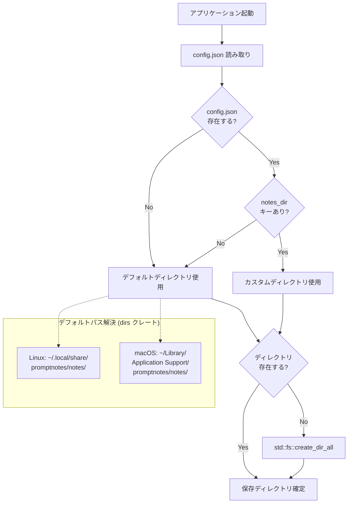

---
codd:
  node_id: detail:storage_fileformat
  type: design
  depends_on:
  - id: detail:component_architecture
    relation: depends_on
    semantic: technical
  depended_by:
  - id: plan:implementation_plan
    relation: depends_on
    semantic: technical
  conventions:
  - targets:
    - module:storage
    reason: ファイル名は YYYY-MM-DDTHHMMSS.md 形式で確定。作成時タイムスタンプで不変。
  - targets:
    - module:storage
    reason: frontmatter は YAML形式、メタデータは tags のみ。作成日はファイル名から取得。追加フィールドの導入は要件変更が必要。
  - targets:
    - module:storage
    reason: 自動保存必須。ユーザーによる明示的保存操作は不要。
  - targets:
    - module:storage
    - module:settings
    reason: 'デフォルト保存ディレクトリは Linux: ~/.local/share/promptnotes/notes/、macOS: ~/Library/Application
      Support/promptnotes/notes/。設定から任意ディレクトリに変更可能であること。'
  modules:
  - storage
  - settings
---

# Storage & File Format Detailed Design

## 1. Overview

本設計書は PromptNotes アプリケーションにおける `module:storage` の詳細設計を定義する。`module:storage` は Rust バックエンド内でファイル I/O の全責務を単独所有し、ノートの永続化形式・ファイル命名規則・frontmatter スキーマ・自動保存メカニズム・保存ディレクトリ管理を網羅する。

PromptNotes のストレージ層は「ローカル `.md` ファイルのみ」を永続化先とし、SQLite・IndexedDB・クラウドストレージ等のデータストアは一切使用しない。すべてのファイル操作は Tauri IPC 境界を通じて Rust バックエンド（`module:shell` → `module:storage`）が実行し、フロントエンド WebView SPA からの直接ファイルシステムアクセスは物理的に禁止される。

本設計書はファイル形式の仕様を確定し、Obsidian vault 内サブディレクトリ指定時の互換性、VSCode での直接編集、Git によるバージョン管理との共存を保証する。

### 1.1 リリース不可制約への準拠

本設計書は以下のリリース不可制約を反映し、各セクションで具体的な実装制約として記述する。

| 制約 | 対象モジュール | 本設計書での反映箇所 |
|------|---------------|---------------------|
| ファイル名は `YYYY-MM-DDTHHMMSS.md` 形式で確定。作成時タイムスタンプで不変。 | `module:storage` | §2.1（ファイル命名状態図）、§3.1（命名責務の所有権）、§4.1（ファイル名生成ロジック） |
| frontmatter は YAML 形式、メタデータは `tags` のみ。作成日はファイル名から取得。追加フィールドの導入は要件変更が必要。 | `module:storage` | §2.2（frontmatter スキーマ図）、§3.2（frontmatter パーサー所有権）、§4.2（frontmatter 仕様） |
| 自動保存必須。ユーザーによる明示的保存操作は不要。 | `module:storage` | §2.3（自動保存シーケンス）、§3.3（保存トリガー責務）、§4.3（自動保存実装） |
| デフォルト保存ディレクトリは Linux: `~/.local/share/promptnotes/notes/`、macOS: `~/Library/Application Support/promptnotes/notes/`。設定から任意ディレクトリに変更可能。 | `module:storage`, `module:settings` | §2.4（ディレクトリ解決フロー）、§3.4（ディレクトリ管理所有権）、§4.4（パス解決と変更フロー） |

---

## 2. Mermaid Diagrams

### 2.1 ファイルライフサイクル状態図

```mermaid
stateDiagram-v2
    [*] --> FilenameGenerated: create_note IPC 受信
    FilenameGenerated --> EmptyFileWritten: std::fs::write\n(空 frontmatter テンプレート)
    EmptyFileWritten --> EditingInProgress: フロントエンドへ\nfilename 返却
    EditingInProgress --> AutoSaved: デバウンス完了\n→ save_note IPC
    AutoSaved --> EditingInProgress: ユーザー追加入力
    AutoSaved --> Idle: エディタ離脱\n(グリッドビューへ遷移)
    Idle --> EditingInProgress: read_note IPC\n→ エディタ再表示

    state FilenameGenerated {
        [*] --> TimestampCapture: chrono::Local::now()
        TimestampCapture --> FormatFilename: format!(\n"YYYY-MM-DDTHHMMSS.md")
        FormatFilename --> [*]
    }

    note right of FilenameGenerated
        ファイル名は作成時に確定し不変。
        リネーム・タイトル埋め込みは禁止。
    end note

    note right of AutoSaved
        自動保存のみ。手動保存操作
        (Cmd+S / Ctrl+S) は実装しない。
    end note
```

**所有権と実装境界:** ファイルのライフサイクル全体を `module:storage`（Rust バックエンド）が管理する。ファイル名 `YYYY-MM-DDTHHMMSS.md` は `create_note` コマンド処理時に `chrono` クレートを使用してシステムローカル時刻から生成され、一度確定した後は変更されない。フロントエンドはバックエンドから返却された `filename` 文字列を識別子として使用するのみであり、ファイル名の組み立て・パース・変更には関与しない。自動保存状態遷移のトリガーはフロントエンド側のデバウンスタイマーが制御するが、実際のファイル書き込みは `save_note` IPC 経由で Rust バックエンドが実行する。

### 2.2 ファイル内部構造と frontmatter スキーマ



**frontmatter 所有権:** frontmatter の読み書き・パースは `module:storage` 内の YAML パーサー（`serde_yaml` クレート）が単独所有する。frontmatter スキーマは `tags` フィールドのみを許可フィールドとして定義し、`title`・`created_at`・`updated_at` 等のフィールドは含めない。作成日時はファイル名 `YYYY-MM-DDTHHMMSS.md` から一意に導出可能であるため、frontmatter 内に重複して保持しない。この制約により、frontmatter は最小限に保たれ、外部ツール（Obsidian、VSCode、Git）との互換性が最大化される。追加フィールドの導入には要件変更プロセスを経る必要がある。

### 2.3 自動保存データフロー



**自動保存の責務分離:** デバウンス制御（タイマーリセット・間隔管理）はフロントエンド `module:editor` が所有する。デバウンス間隔は 500ms〜2000ms の範囲で決定予定（OQ-002）。一方、ファイルパスの組み立て・ディレクトリ存在確認・パストラバーサル検証・`std::fs::write` による書き込みはすべて `module:storage` が実行する。フロントエンドは `save_note` IPC コマンドに `filename`（ファイル名文字列のみ）と `content`（frontmatter + 本文の全文）を渡すのみであり、絶対パスやディレクトリパスを知ることはない。手動保存ボタン・`Cmd+S`/`Ctrl+S` ショートカットは実装せず、自動保存が唯一の永続化手段である。

### 2.4 保存ディレクトリ解決フロー



**ディレクトリ管理の所有権:** 保存ディレクトリの解決・作成・変更はすべて Rust バックエンド（`module:storage` + Settings Manager）が所有する。起動時のデフォルトパス解決には `dirs` クレートまたは Tauri の `path` API を使用し、プラットフォーム固有のパスを取得する。ユーザーが設定画面（`module:settings`）からディレクトリを変更する場合、フロントエンドは `update_settings` IPC コマンドで新しいパス文字列を送信するのみであり、パスの正規化・ディレクトリ作成・`config.json` 永続化はバックエンドが実行する。フロントエンド単独でのファイルパス操作は Tauri の `allowlist` 設定（`fs: { all: false }`）により物理的に不可能である。

---

## 3. Ownership Boundaries

### 3.1 ファイル命名の所有権 — `module:storage` 単独所有

ファイル名 `YYYY-MM-DDTHHMMSS.md` の生成・パース・バリデーションは `module:storage`（Rust バックエンド）が単独所有する。

| 責務 | 所有者 | 実装手段 | 再実装禁止ルール |
|------|--------|---------|-----------------|
| タイムスタンプ取得 | `module:storage` | `chrono::Local::now()` | フロントエンドでの `Date.now()` によるファイル名生成禁止 |
| ファイル名フォーマット | `module:storage` | `format!("{}", dt.format("%Y-%m-%dT%H%M%S"))` + `.md` 拡張子 | タイトル文字列・ランダム ID のファイル名埋め込み禁止 |
| ファイル名からの日時抽出 | `module:storage` | `NaiveDateTime::parse_from_str` | フロントエンドでのファイル名パース禁止（`created_at` は IPC レスポンスの `NoteEntry.created_at` を使用） |
| ファイル名不変性保証 | `module:storage` | リネーム API を公開しない | ファイル名変更用 IPC コマンドは定義しない |

**ファイル名フォーマット仕様:**

```
YYYY-MM-DDTHHMMSS.md
│    │  │  │ │ │
│    │  │  │ │ └─ 秒 (00-59)
│    │  │  │ └── 分 (00-59)
│    │  │  └─── 時 (00-23)
│    │  └────── 日 (01-31)
│    └───────── 月 (01-12)
└──────────── 年 (4桁)
```

例: `2026-04-04T143205.md`（2026年4月4日 14時32分05秒に作成）

ファイル名内の `T` は ISO 8601 の日付・時刻区切り文字に準拠する。秒までの精度を含めることで、同一分内に複数ノートを作成した場合のファイル名衝突を低減する。万一の衝突（同一秒内に `create_note` が複数回呼ばれた場合）の処理は §5 の OQ-001 で扱う。

### 3.2 frontmatter パーサーの所有権 — `module:storage` 単独所有

frontmatter の YAML パース・生成・バリデーションは `module:storage` が単独所有する。

| 責務 | 所有者 | 実装手段 |
|------|--------|---------|
| frontmatter YAML パース | `module:storage` | `serde_yaml` クレート |
| `tags` フィールド抽出 | `module:storage` | `Vec<String>` へのデシリアライズ |
| 新規ノート用テンプレート生成 | `module:storage` | 空 `tags` 配列を含む YAML ブロック |
| frontmatter 更新（タグ編集時） | `module:storage` | YAML シリアライズ → ファイル書き込み |
| スキーマバリデーション | `module:storage` | `tags` 以外のフィールドは無視（寛容パース） |

**frontmatter 正規スキーマ:**

```rust
#[derive(Serialize, Deserialize)]
struct Frontmatter {
    #[serde(default)]
    tags: Vec<String>,
}
```

`Frontmatter` 構造体は `tags` フィールドのみを持つ。`serde(default)` により、`tags` フィールドが存在しない場合は空の `Vec` がデフォルト値となる。`title`、`created_at`、`updated_at` 等のフィールドは構造体に含めない。外部ツール（Obsidian 等）が追加したフィールドが存在する場合、`serde_yaml` の寛容パースにより無視される（エラーにはしない）が、`module:storage` が書き込む際にそれらのフィールドが保持されるかどうかは実装上の判断による（§5 OQ-003 参照）。

**frontmatter と本文の分離ロジック:**

```rust
fn parse_note(content: &str) -> (Frontmatter, &str) {
    // "---\n" で始まり、2つ目の "---\n" までが frontmatter
    // 残りが本文
}
```

フロントエンド側では、`save_note` IPC 呼び出し時に CodeMirror 6 のドキュメント全文（frontmatter + 本文）をそのまま `content` として送信する。frontmatter の解釈・検証はバックエンド側でのみ行われる。

### 3.3 保存トリガーの所有権 — フロントエンドとバックエンドの協調

自動保存は `module:editor`（フロントエンド）と `module:storage`（バックエンド）の協調で実現される。

| 責務 | 所有者 | 理由 |
|------|--------|------|
| ドキュメント変更検知 | `module:editor` | CodeMirror 6 の `updateListener` はフロントエンド側 API |
| デバウンスタイマー管理 | `module:editor` | UI 入力頻度の制御はフロントエンド層の責務 |
| `save_note` IPC 呼び出し | `module:editor` | Tauri `invoke` はフロントエンドから発行 |
| ファイルパス組み立て | `module:storage` | 保存ディレクトリ + filename → 絶対パス |
| パストラバーサル検証 | `module:storage` | セキュリティチェックはバックエンド層の責務 |
| `std::fs::write` 実行 | `module:storage` | ファイル I/O はバックエンドが単独所有 |
| エラーハンドリング（ディスク容量不足等） | `module:storage` | ファイルシステムエラーの判定と適切なエラーメッセージ生成 |

手動保存ボタンや `Cmd+S`/`Ctrl+S` ショートカットは実装しない。ユーザーが明示的に保存操作を行う必要はなく、自動保存が唯一の永続化手段である。この設計により、ユーザー体験が「常に保存済み」の状態で統一される。

### 3.4 保存ディレクトリ管理の所有権 — `module:storage` + Settings Manager

| 責務 | 所有者 | 実装手段 |
|------|--------|---------|
| デフォルトパス解決 | `module:storage` / Rust バックエンド | `dirs::data_dir()` + `"promptnotes/notes/"` |
| `config.json` 読み書き | Settings Manager / Rust バックエンド | `serde_json` + `std::fs` |
| ディレクトリ変更パスバリデーション | Settings Manager / Rust バックエンド | `Path::canonicalize` + 書き込み権限確認 |
| ディレクトリ自動作成 | `module:storage` / Rust バックエンド | `std::fs::create_dir_all` |
| 設定 UI 表示 | `module:settings` / フロントエンド | IPC 経由で取得した文字列の表示のみ |

**プラットフォーム別デフォルトパス:**

| プラットフォーム | ノート保存ディレクトリ | 設定ファイルパス |
|-----------------|---------------------|----------------|
| Linux | `~/.local/share/promptnotes/notes/` | `~/.config/promptnotes/config.json` |
| macOS | `~/Library/Application Support/promptnotes/notes/` | `~/Library/Application Support/promptnotes/config.json` |

設定からディレクトリを変更する場合、フロントエンド（`module:settings`）は `update_settings` IPC コマンドを通じてパス文字列を送信するのみである。パス正規化・ディレクトリ存在確認・作成・`config.json` 書き込みはすべて Rust バックエンドが実行する。Tauri の `allowlist` で `fs` プラグインを `false` に設定することで、フロントエンド単独でのファイルパス操作は物理的に不可能となる。

### 3.5 共有型 `NoteEntry` の所有権 — `module:storage` が正規定義を所有

```rust
// module:storage 内（Rust 側）— 正規定義
#[derive(Serialize)]
struct NoteEntry {
    filename: String,     // "2026-04-04T143205.md"
    created_at: String,   // "2026-04-04T14:32:05" (ファイル名から導出)
    tags: Vec<String>,    // frontmatter の tags フィールド
    preview: String,      // 本文先頭の抜粋テキスト
}
```

`NoteEntry.created_at` はファイル名の `YYYY-MM-DDTHHMMSS` 部分をパースして `YYYY-MM-DDTHH:MM:SS` 形式に変換した値である。ファイルシステムのメタデータ（`mtime`、`ctime`）は使用しない。これにより、Git クローンやファイルコピーでメタデータが失われても作成日時が保持される。

TypeScript 側の型定義はバックエンドのスキーマに追従し、`tauri-specta` による自動生成または手動同期で維持する。スキーマ変更時はバックエンド側を先に更新する。

---

## 4. Implementation Implications

### 4.1 ファイル名生成ロジックの実装

`create_note` IPC コマンド受信時、`module:storage` は以下の手順でファイルを作成する。

```rust
use chrono::Local;
use std::fs;
use std::path::PathBuf;

fn create_note(notes_dir: &PathBuf) -> Result<(String, PathBuf), StorageError> {
    let now = Local::now();
    let filename = format!("{}.md", now.format("%Y-%m-%dT%H%M%S"));
    let path = notes_dir.join(&filename);

    // 同一秒内衝突チェック（§5 OQ-001 参照）
    if path.exists() {
        return Err(StorageError::FilenameCollision(filename));
    }

    let template = "---\ntags: []\n---\n\n";
    fs::write(&path, template)?;

    Ok((filename, path))
}
```

**不変性の担保:** ファイル名は作成時のシステムローカル時刻から一度だけ生成され、以降リネーム・変更は行わない。`module:shell` の IPC コマンド一覧にリネーム用コマンドは存在せず、構造的にファイル名変更が不可能である。タイムゾーンはシステムローカル（`chrono::Local`）を使用し、UTC 変換は行わない。

### 4.2 frontmatter 仕様の実装

**確定スキーマ:**

```yaml
---
tags: [tag1, tag2]
---
```

| フィールド | 型 | 必須/任意 | デフォルト値 | 説明 |
|-----------|-----|----------|-------------|------|
| `tags` | `string[]` (YAML シーケンス) | 任意 | `[]` (空配列) | ノートに付与するタグのリスト |

**明示的に排除されるフィールド:**

| フィールド | 排除理由 |
|-----------|---------|
| `title` | タイトル入力欄はリリース不可制約（FAIL-04）で禁止。ファイルにタイトルメタデータを持たない。 |
| `created_at` | ファイル名 `YYYY-MM-DDTHHMMSS.md` から一意に導出可能。重複保持による不整合リスクを排除。 |
| `updated_at` | 要件に更新日時の表示・フィルタ要件がない。将来導入時は要件変更プロセスを経る。 |
| その他カスタムフィールド | 追加フィールドの導入は要件変更が必要。`module:storage` は `tags` 以外のフィールドを書き込まない。 |

**新規ノート作成時のテンプレート:**

```markdown
---
tags: []
---

```

空の `tags` 配列と終了デリミタの直後に空行を1行挿入し、本文入力の開始位置を明確にする。

**外部ツール互換性の実装方針:**

- YAML frontmatter は `---` デリミタで囲む標準形式を使用し、Obsidian・Hugo・Jekyll 等との互換性を維持する。
- ファイル拡張子は `.md` であり、VSCode の Markdown エクステンション、Git diff ビュー、GitHub のレンダリングで正しく認識される。
- `module:storage` のパースは寛容パースとし、Obsidian が追加する `aliases`、`cssclass` 等のフィールドが存在してもエラーにしない。ただし、`module:storage` が書き込む際にこれらのフィールドを保持するかどうかは OQ-003 で決定する。

### 4.3 自動保存メカニズムの実装

**フロントエンド側（`module:editor`）:**

```typescript
import { EditorView } from "@codemirror/view";

let saveTimer: ReturnType<typeof setTimeout> | null = null;
const DEBOUNCE_MS = 1000; // 500-2000ms 範囲で最終決定（OQ-002）

const autoSaveListener = EditorView.updateListener.of((update) => {
  if (update.docChanged) {
    if (saveTimer) clearTimeout(saveTimer);
    saveTimer = setTimeout(async () => {
      const content = update.state.doc.toString();
      await invoke("save_note", { filename: currentFilename, content });
    }, DEBOUNCE_MS);
  }
});
```

**バックエンド側（`module:storage`）:**

```rust
#[tauri::command]
fn save_note(filename: &str, content: &str, state: State<AppState>) -> Result<SaveResult, String> {
    // 1. filename バリデーション（パストラバーサル防止）
    if filename.contains("..") || filename.contains('/') || filename.contains('\\') {
        return Err("Invalid filename".into());
    }

    // 2. ファイル名形式チェック（YYYY-MM-DDTHHMMSS.md）
    let re = Regex::new(r"^\d{4}-\d{2}-\d{2}T\d{6}\.md$").unwrap();
    if !re.is_match(filename) {
        return Err("Invalid filename format".into());
    }

    // 3. 絶対パス組み立て
    let path = state.notes_dir.join(filename);

    // 4. ファイル書き込み
    std::fs::write(&path, content).map_err(|e| e.to_string())?;

    Ok(SaveResult { success: true })
}
```

**セキュリティ制御:**

- `save_note` コマンドは `filename` 引数にファイル名のみ（ディレクトリパスを含まない文字列）を受け取る。
- `..`、`/`、`\` を含むファイル名はパストラバーサル攻撃として拒否する。
- ファイル名が `YYYY-MM-DDTHHMMSS.md` 形式に一致しない場合も拒否する。
- 書き込み先は `state.notes_dir`（設定された保存ディレクトリ）配下に限定される。

**エラーハンドリング:**

| エラー条件 | バックエンド処理 | フロントエンド処理 |
|-----------|----------------|-------------------|
| ディスク容量不足 | `std::io::Error` を文字列化して返却 | エラー通知をエディタ UI に表示 |
| 書き込み権限なし | `std::io::Error` を文字列化して返却 | エラー通知をエディタ UI に表示 |
| ファイル名バリデーション失敗 | エラー文字列を返却 | エラーログ出力（通常発生しない） |

### 4.4 保存ディレクトリ解決と変更フロー

**起動時の初期化フロー:**

1. `dirs::config_dir()` で設定ファイルディレクトリを取得する。
   - Linux: `~/.config/promptnotes/`
   - macOS: `~/Library/Application Support/promptnotes/`
2. `config.json` の存在を確認する。
3. 存在する場合、`notes_dir` キーを読み取ってカスタムディレクトリとして使用する。
4. 存在しない場合または `notes_dir` キーがない場合、デフォルトディレクトリを使用する。
   - Linux: `~/.local/share/promptnotes/notes/`（`dirs::data_dir()` + `promptnotes/notes/`）
   - macOS: `~/Library/Application Support/promptnotes/notes/`（`dirs::data_dir()` + `promptnotes/notes/`）
5. 保存ディレクトリが存在しない場合、`std::fs::create_dir_all` で再帰的に作成する。

**ディレクトリ変更時のバリデーション手順:**

```rust
fn update_notes_dir(new_path: &str) -> Result<(), String> {
    let path = PathBuf::from(new_path);

    // 1. パスの正規化
    // 存在しないパスの場合は canonicalize 前にディレクトリ作成
    if !path.exists() {
        std::fs::create_dir_all(&path).map_err(|e| e.to_string())?;
    }
    let canonical = path.canonicalize().map_err(|e| e.to_string())?;

    // 2. 書き込み権限確認（テストファイル書き込み）
    let test_file = canonical.join(".promptnotes_write_test");
    std::fs::write(&test_file, "").map_err(|_| "No write permission".to_string())?;
    std::fs::remove_file(&test_file).ok();

    // 3. config.json 永続化
    save_config(&Config { notes_dir: canonical.to_string_lossy().to_string() })?;

    Ok(())
}
```

**`config.json` フォーマット:**

```json
{
  "notes_dir": "/home/user/custom/notes"
}
```

設定ファイルは最小限のフィールドのみを含む。`notes_dir` が唯一の設定項目である。JSON フォーマットは `serde_json::to_string_pretty` で人間可読な形式で書き込む。

### 4.5 ファイル読み取りとプレビュー生成

**`read_note` コマンド実装:**

```rust
#[tauri::command]
fn read_note(filename: &str, state: State<AppState>) -> Result<NoteContent, String> {
    let path = state.notes_dir.join(filename);
    let content = std::fs::read_to_string(&path).map_err(|e| e.to_string())?;
    let (frontmatter, _body) = parse_frontmatter(&content);

    Ok(NoteContent {
        content,                    // frontmatter + 本文の全文
        tags: frontmatter.tags,     // パース済みタグ配列
    })
}
```

**`list_notes` コマンドにおけるプレビュー生成:**

```rust
fn generate_preview(body: &str, max_chars: usize) -> String {
    // 本文（frontmatter 除外後）の先頭から max_chars 文字を切り出す
    // 改行は半角スペースに置換してカード表示に最適化
    body.chars()
        .take(max_chars)
        .collect::<String>()
        .replace('\n', " ")
}
```

プレビューの文字数上限は OQ-004 でデザインモックアップに基づいて決定する。暫定値として 200 文字を使用する。

### 4.6 日付フィルタリングとタグフィルタリングの実装

**日付フィルタリング（ファイル名ベース）:**

```rust
fn filter_by_date(
    entries: Vec<DirEntry>,
    from_date: NaiveDate,
    to_date: NaiveDate,
) -> Vec<DirEntry> {
    entries.into_iter().filter(|entry| {
        if let Some(date) = parse_date_from_filename(entry.file_name()) {
            date >= from_date && date <= to_date
        } else {
            false // YYYY-MM-DDTHHMMSS.md 形式でないファイルは除外
        }
    }).collect()
}
```

日付の比較はファイル名のタイムスタンプ部分をパースして行う。ファイルシステムのメタデータ（`mtime`）は使用しない。これにより、Git クローンやファイルコピー後もフィルタリングの正確性が保持される。

**タグフィルタリング:**

各ファイルの frontmatter を `serde_yaml` でパースし、`tags` フィールドに指定タグが含まれるかを判定する。日付フィルタとタグフィルタは AND 条件で結合される。

**全文検索:**

`search_notes` コマンドは保存ディレクトリ内の全 `.md` ファイルを `std::fs::read_to_string` で読み込み、`str::contains`（case-insensitive 対応は OQ-002 で決定）でクエリ文字列の存在を判定する。検索インデックスは構築しない。5,000 件超過時のパフォーマンス劣化が許容範囲を超える場合に Tantivy 導入を検討する。

### 4.7 排除機能の実装ガードとストレージ制約

`module:storage` は以下を実装しない。これらの排除は CI パイプラインで検査する。

| 排除対象 | 検出方法 |
|---------|---------|
| SQLite / IndexedDB / PostgreSQL | `Cargo.toml` に `rusqlite`、`diesel`、`sea-orm`、`sqlx` 等の依存がないことを CI チェック |
| クラウドストレージ同期 | `Cargo.toml` に `reqwest`、`hyper` 等のネットワーク系クレートがないことを CI チェック |
| LLM API / AI 呼び出し | `http` allowlist が `false`、CSP の `connect-src` 制限を CI チェック |
| ファイル名にタイトル埋め込み | ファイル名生成ロジックが `chrono` 出力のみであることのコードレビュー |

### 4.8 パフォーマンス閾値

| 操作 | 想定規模 | 実装方式 | 閾値 |
|------|---------|---------|------|
| 新規ノート作成 (`create_note`) | 単一ファイル書き込み | `std::fs::write`（空テンプレート） | キー押下から CodeMirror フォーカス移動まで体感遅延なし |
| 自動保存 (`save_note`) | 単一ファイル上書き | デバウンス後 `std::fs::write` | デバウンス完了後の書き込みは即座に完了 |
| ノート一覧取得 (`list_notes`) | 5,000 件以下 | `std::fs::read_dir` + frontmatter パース | 実用的応答速度（ベンチマークで確定） |
| 全文検索 (`search_notes`) | 5,000 件以下 | ファイル全走査 `str::contains` | 実用的応答速度（5,000 件超過時 Tantivy 検討） |
| 設定変更 (`update_settings`) | 単一 JSON ファイル | `std::fs::write` | 即座に完了 |

---

## 5. Open Questions

| ID | 対象 | 質問 | 影響範囲 | 優先度 | 解決条件 |
|----|------|------|---------|--------|---------|
| OQ-001 | `module:storage` | 同一秒内にファイル名が衝突した場合のフォールバック戦略。末尾にサフィックス（`_1`、`_2`）を付与するか、ミリ秒精度に拡張するか、エラーとして拒否するか。 | `create_note` コマンドの実装。ファイル名フォーマット仕様に影響する可能性がある。 | 中 | 実際の使用パターンを分析し、衝突確率が無視できない場合に対策を決定する。現実的には秒精度で十分と想定されるが、連打テストで検証する。 |
| OQ-002 | `module:editor`, `module:storage` | 自動保存のデバウンス間隔の具体値。500ms〜2000ms の範囲で決定が必要。短すぎるとディスク I/O と IPC 呼び出し頻度が増加し、長すぎるとクラッシュ時のデータ消失量が増える。 | `save_note` の呼び出し頻度、ディスク I/O 負荷、データ消失リスク。 | 中 | ユーザーテストで体感遅延と保存信頼性を検証し、具体値を決定する。暫定値として 1000ms を実装し、計測結果に基づいて調整する。 |
| OQ-003 | `module:storage` | 外部ツール（Obsidian 等）が追加した frontmatter フィールドの保持ポリシー。`save_note` でファイルを上書きする際、`tags` 以外のフィールドを保持するか破棄するか。 | Obsidian vault 互換性、外部ツールとの共存。 | 中 | 互換性重視の場合はフィールド保持（raw YAML 文字列の部分更新）、シンプル実装の場合は `tags` のみ再生成。技術検証で実装コストを比較し決定する。 |
| OQ-004 | `module:storage`, `module:grid` | `NoteEntry.preview` のプレビュー文字数上限。カードレイアウトの視覚的バランスに影響する。 | `list_notes` レスポンスのペイロードサイズ、グリッドビューのカード表示品質。 | 低 | デザインモックアップとプロトタイプで視覚的に検証し、具体値を決定する。暫定値 200 文字で実装を開始する。 |
| OQ-005 | `module:storage` | 全文検索の大文字小文字区別。`str::contains` は case-sensitive であり、case-insensitive 検索を実装する場合は `to_lowercase` 変換が必要。 | `search_notes` コマンドの実装、検索結果の網羅性。 | 中 | case-insensitive をデフォルトとし、`query.to_lowercase()` と `content.to_lowercase()` による比較で実装する方針で暫定決定。 |
| OQ-006 | `module:storage` | 5,000 件超過時のファイル全走査パフォーマンス。`list_notes` および `search_notes` のレスポンスタイムがユーザー許容範囲を超えるか。 | 将来的な Tantivy（全文検索エンジン）導入の要否。`module:storage` 内部構成の変更が必要となる可能性。 | 低（5,000 件超過時に検討） | 5,000 件規模のベンチマークを実施し、応答時間が許容範囲を超える場合に Tantivy 導入 ADR を起票する。 |
