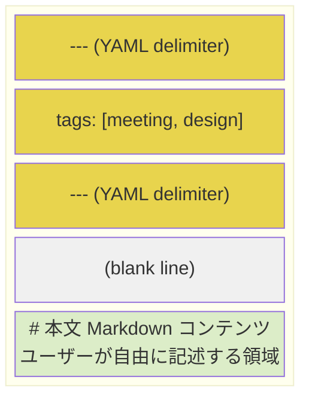
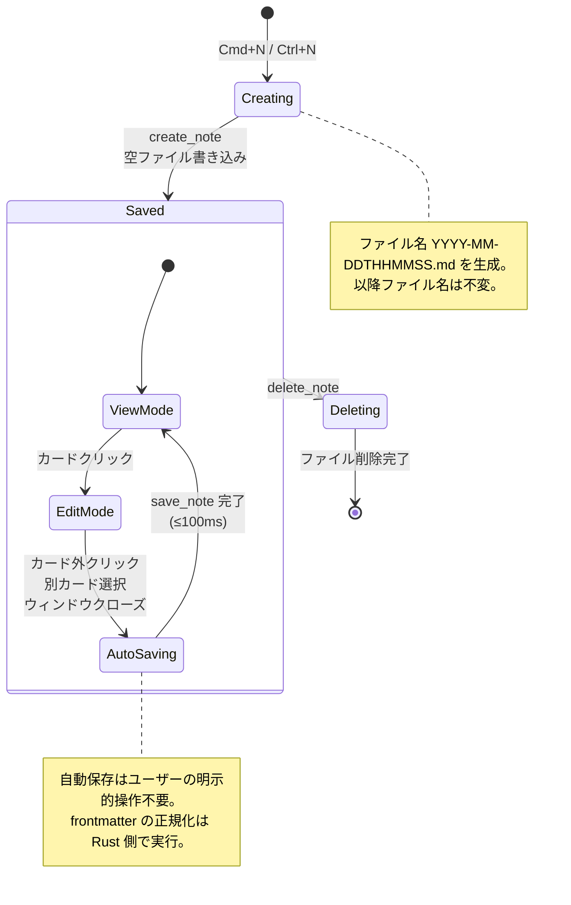
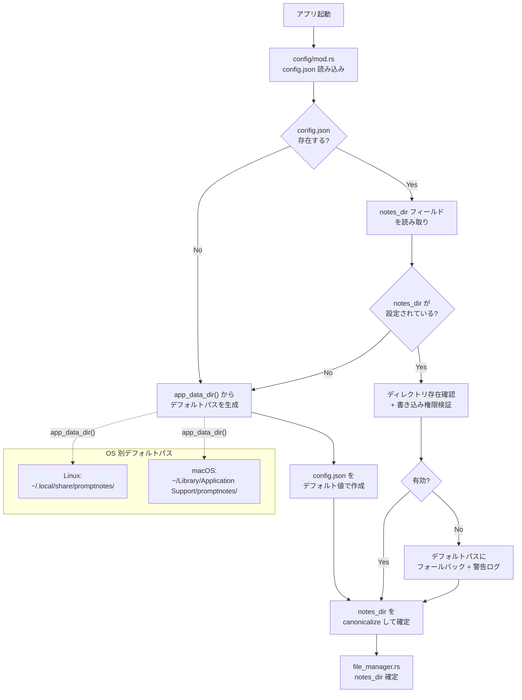
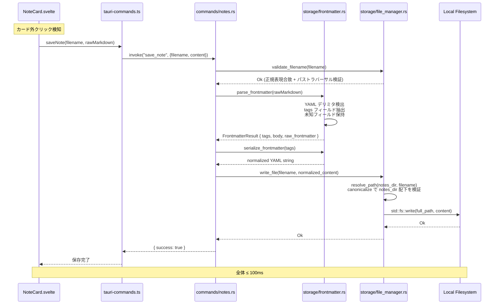

---
codd:
  node_id: detail:storage_fileformat
  type: design
  depends_on:
  - id: detail:component_architecture
    relation: depends_on
    semantic: technical
  depended_by:
  - id: detail:feed_search
    relation: depends_on
    semantic: technical
  - id: plan:implementation_plan
    relation: depends_on
    semantic: technical
  conventions:
  - targets:
    - module:storage
    reason: ファイル名は YYYY-MM-DDTHHMMSS.md 形式で確定。作成時タイムスタンプで不変。
  - targets:
    - module:storage
    reason: frontmatter は YAML形式、メタデータは tags のみ。作成日はファイル名から取得。追加フィールドの導入は要件変更が必要。
  - targets:
    - module:storage
    reason: 自動保存必須。ユーザーによる明示的保存操作は不要。
  - targets:
    - module:storage
    - module:settings
    reason: 'デフォルト保存ディレクトリは Linux: ~/.local/share/promptnotes/notes/、macOS: ~/Library/Application
      Support/promptnotes/notes/。設定から任意ディレクトリに変更可能であること。'
  modules:
  - storage
  - settings
---

# Storage & File Format Detailed Design

## 1. Overview

本設計書は PromptNotes における `module:storage` のファイル永続化レイヤーを詳細に定義する。上流の Component Architecture（detail:component_architecture）で規定された Rust バックエンド内の `storage/` モジュール群（`file_manager.rs`, `frontmatter.rs`, `search.rs`）が扱うファイルフォーマット・命名規則・ディレクトリ構造・自動保存メカニズム・frontmatter スキーマを、実装可能な粒度まで分解する。

### 対象スコープ

| 領域 | 内容 |
|---|---|
| ファイル命名規則 | `YYYY-MM-DDTHHMMSS.md` 形式。作成時タイムスタンプで不変 |
| frontmatter スキーマ | YAML 形式。メタデータフィールドは `tags` のみ。作成日はファイル名から導出 |
| ディレクトリ構造 | OS 別デフォルトパス + `config.json` によるカスタムパス |
| 自動保存 | ユーザーによる明示的保存操作は不要。カード外クリック時に即時永続化 |
| ファイル CRUD | `file_manager.rs` が単一所有者としてすべてのファイルシステム書き込みを担当 |

### リリースブロッキング制約への準拠

本設計書は以下の 4 つの非交渉条件を全セクションにわたって反映する。

| 制約 | 準拠方法 |
|---|---|
| ファイル名は `YYYY-MM-DDTHHMMSS.md` 形式で確定。作成時タイムスタンプで不変。 | §2 の状態遷移図およびファイルライフサイクルで、ファイル名がノート作成時に一度だけ生成され、以降のすべての操作（編集・保存・検索）でファイル名が変更されないことを明示する。§4 でバリデーション正規表現と不変性の強制メカニズムを定義する。 |
| frontmatter は YAML 形式、メタデータは `tags` のみ。作成日はファイル名から取得。追加フィールドの導入は要件変更が必要。 | §2 のファイルフォーマット図で frontmatter スキーマを厳密に定義し、§3 で `storage/frontmatter.rs` をスキーマの単一所有者として宣言する。§4 でパース時の未知フィールド処理方針（保持するが無視）を規定する。 |
| 自動保存必須。ユーザーによる明示的保存操作は不要。 | §2 のシーケンス図で自動保存トリガーのすべてのパス（カード外クリック、別カード選択、ウィンドウクローズ）を網羅する。§4 で保存トリガーの実装方針と 100ms 以内の完了閾値を定義する。 |
| デフォルト保存ディレクトリは Linux: `~/.local/share/promptnotes/notes/`、macOS: `~/Library/Application Support/promptnotes/notes/`。設定から任意ディレクトリに変更可能であること。 | §2 のディレクトリ構造図で OS 別パスを明示し、§3 で `config/mod.rs` と `file_manager.rs` のパス解決責務を定義する。§4 でディレクトリ変更時のバリデーション手順を規定する。 |

## 2. Mermaid Diagrams

### 2.1 ファイルフォーマット構造図



PromptNotes のノートファイルは上記の構造を持つ。ファイル全体の正規所有者は `module:storage`（Rust バックエンド）であり、フロントエンドがファイル内容を直接構築・書き込みすることは禁止される。frontmatter 領域（YAML デリミタ `---` で囲まれた部分）のパース・シリアライズは `storage/frontmatter.rs` が単一所有者として担当する。本文領域はユーザーが Markdown 形式で自由に記述する。

**ファイル名の不変性:** ファイル名 `YYYY-MM-DDTHHMMSS.md` はノート作成時のローカルタイムスタンプから一度だけ生成される。以降の編集・保存・タグ変更でファイル名は一切変更されない。ファイル名がノートの作成日時を表す唯一のソースであるため、frontmatter に作成日フィールドは持たない。

### 2.2 frontmatter スキーマ定義

frontmatter は以下の厳密なスキーマに従う。

| フィールド | 型 | 必須 | デフォルト値 | 説明 |
|---|---|---|---|---|
| `tags` | `string[]` (YAML sequence) | Yes | `[]` | ノートに付与されたタグのリスト |

**許可される frontmatter の具体例:**

```yaml
---
tags: []
---
```

```yaml
---
tags: [meeting, design, review]
---
```

```yaml
---
tags:
  - meeting
  - design
---
```

上記以外のフィールド（`title`, `created_at`, `updated_at` 等）は frontmatter に含めない。要件変更なしに追加フィールドを導入することは禁止される。パース時に未知フィールドが検出された場合、`frontmatter.rs` はそれらを破棄せず保持するが、アプリケーションロジックでは無視する（§4.3 で詳述）。

### 2.3 ノートファイルのライフサイクル状態遷移図



この状態遷移図は、ノートファイルが作成から削除までに辿るすべてのライフサイクル状態を示す。最も重要な設計制約は以下の 2 点である。

1. **ファイル名の不変性**: `Creating` → `Saved` 遷移時に `file_manager.rs` が `YYYY-MM-DDTHHMMSS.md` 形式のファイル名を生成し、それ以降のすべての状態遷移でファイル名は変更されない。`save_note` コマンドは既存ファイル名を受け取って上書きするのみである。
2. **自動保存の暗黙性**: `EditMode` → `AutoSaving` 遷移はユーザーの明示的な「保存」操作なしに発火する。トリガーはカード外クリック・別カード選択・ウィンドウクローズの 3 パターンであり、いずれもフロントエンド（`NoteCard.svelte`）が検知して `tauri-commands.ts` 経由で `save_note` を呼び出す。

### 2.4 ディレクトリ構造とパス解決フロー



パス解決の正規所有者は `config/mod.rs` であり、Tauri の `app_data_dir()` API を唯一の呼び出し元として OS 別のパス差異を吸収する。ハードコードされたパス文字列はアプリケーションコード中に存在しない。`file_manager.rs` はパス解決完了後の `notes_dir` を受け取り、以降のすべてのファイル操作でこのパスをベースディレクトリとして使用する。

ディレクトリ構造は以下の通りである。

```
<app_data_dir>/                          # OS 依存のアプリデータルート
├── config.json                          # アプリケーション設定
└── notes/                               # デフォルトノート保存ディレクトリ
    ├── 2025-01-15T093042.md
    ├── 2025-01-15T141530.md
    ├── 2025-01-16T080000.md
    └── ...
```

| OS | `app_data_dir()` 解決先 | `config.json` パス | デフォルト `notes_dir` |
|---|---|---|---|
| Linux | `~/.local/share/promptnotes/` | `~/.local/share/promptnotes/config.json` | `~/.local/share/promptnotes/notes/` |
| macOS | `~/Library/Application Support/promptnotes/` | `~/Library/Application Support/promptnotes/config.json` | `~/Library/Application Support/promptnotes/notes/` |

### 2.5 自動保存データフロー図



このシーケンスは自動保存の完全なデータフローを示す。フロントエンドから受け取った生の Markdown テキストは、Rust バックエンドで以下の処理を経て永続化される。

1. **ファイル名バリデーション**: `file_manager.rs` が正規表現 `^\d{4}-\d{2}-\d{2}T\d{6}\.md$` との合致を検証し、パストラバーサル攻撃を防止する。
2. **frontmatter パース**: `frontmatter.rs` が YAML デリミタを検出し、`tags` フィールドを抽出する。
3. **frontmatter 正規化**: `frontmatter.rs` が `tags` 配列を正規化された YAML 形式に再シリアライズする。これにより、フロントエンドで手動編集された不正な YAML がクリーンアップされる。
4. **ファイル書き込み**: `file_manager.rs` がパスを `canonicalize` した上で `notes_dir` 配下であることを確認し、ファイルに書き込む。

100ms 以内の完了目標を達成するため、すべての処理は同期的に実行される。非同期 I/O のオーバーヘッドは回避する。

## 3. Ownership Boundaries

### 3.1 ストレージモジュール内部の所有権

| ファイル | 所有モジュール | 単一責務 | 再実装禁止範囲 |
|---|---|---|---|
| `src-tauri/src/storage/file_manager.rs` | `module:storage` | ファイル CRUD（作成・読み取り・上書き・削除）、ファイル名生成、ファイル名バリデーション、パストラバーサル防止 | 他のモジュール（`commands/`, `config/`）が `std::fs` を直接呼び出してノートファイルを操作することを禁止 |
| `src-tauri/src/storage/frontmatter.rs` | `module:storage` | YAML frontmatter のパース・シリアライズ・正規化。frontmatter スキーマの単一信頼源 | フロントエンド `frontmatter.ts` は読み取り専用の軽量パースのみ。書き込み時の frontmatter 組み立ては Rust 側のみが実行 |
| `src-tauri/src/storage/search.rs` | `module:feed` | 全文検索ロジック（ファイル全走査）。`file_manager.rs` と `frontmatter.rs` を利用する | 検索のためのファイル読み取りは `search.rs` 経由。`commands/notes.rs` が直接ファイルを走査しない |

### 3.2 ファイル名フォーマットの所有権

ファイル名フォーマット `YYYY-MM-DDTHHMMSS.md` の仕様は `module:storage` が単一所有する。

| 責務 | 所有者 | 定義場所 |
|---|---|---|
| ファイル名生成（タイムスタンプ → 文字列変換） | `module:storage` | `src-tauri/src/storage/file_manager.rs` の `generate_filename()` 関数 |
| ファイル名バリデーション正規表現 | `module:storage` | `src-tauri/src/storage/file_manager.rs` の定数 `FILENAME_REGEX` |
| ファイル名 → 日時変換（フロントエンド表示用） | `module:storage` が仕様を決定 | `src/lib/utils/timestamp.ts` が実装。ファイル名パターンの変更時は `file_manager.rs` と `timestamp.ts` の両方を同期更新 |

ファイル名の正規表現パターン `^\d{4}-\d{2}-\d{2}T\d{6}\.md$` は `file_manager.rs` 内に定数として定義され、`commands/notes.rs` はこの定数をインポートして使用する。フロントエンドの `timestamp.ts` も同一のパターンに準拠するが、バリデーションの正式な実行ポイントは Rust 側のみである。

### 3.3 frontmatter スキーマの所有権

frontmatter のスキーマ定義と正規化ロジックは `storage/frontmatter.rs` が単一所有する。

| 操作 | 所有者 | 備考 |
|---|---|---|
| スキーマ定義（`tags` フィールドのみ） | `storage/frontmatter.rs` | 追加フィールドの導入は要件変更を必要とし、このファイルの変更がトリガーとなる |
| パース（YAML → Rust 構造体） | `storage/frontmatter.rs` | `serde_yaml` クレートを使用 |
| シリアライズ（Rust 構造体 → YAML 文字列） | `storage/frontmatter.rs` | 正規化された出力を保証 |
| 表示用軽量パース（フロントエンド） | `src/lib/utils/frontmatter.ts` | 読み取り専用。書き込みパスでの使用禁止 |

### 3.4 ディレクトリパス管理の所有権

| 責務 | 所有者 | 備考 |
|---|---|---|
| OS 別デフォルトパスの解決 | `config/mod.rs`（`module:settings`） | `app_data_dir()` の唯一の呼び出し元 |
| `config.json` の読み書き | `config/mod.rs`（`module:settings`） | `notes_dir` フィールドの永続化 |
| ディレクトリ存在確認・作成 | `config/mod.rs`（`module:settings`） | `set_config` 時に検証 |
| `notes_dir` 配下でのファイル操作 | `storage/file_manager.rs`（`module:storage`） | 確定済み `notes_dir` を使用 |
| フロントエンドからのパス送信 | `tauri-commands.ts` 経由 | パス解決・検証はフロントエンドでは行わない |

`module:settings` がパス管理を、`module:storage` がパス配下のファイル操作を所有する。この責務分離により、設定変更時の影響を `config/mod.rs` に局所化できる。

## 4. Implementation Implications

### 4.1 ファイル名生成の実装

`file_manager.rs` の `generate_filename()` 関数は以下の仕様に従う。

```
入力: なし（内部でシステム時刻を取得）
出力: String（例: "2025-01-15T093042.md"）
```

- ローカルタイムゾーンの `chrono::Local::now()` を使用
- フォーマット: `%Y-%m-%dT%H%M%S.md`（ISO 8601 の時刻部分からコロンを除去）
- 同一秒内に複数ノートが作成された場合の衝突回避: ファイル存在チェックを行い、衝突時は 1 秒待機して再生成する

**不変性の強制:** `save_note` コマンドはファイル名の変更を受け付けない。引数として渡された `filename` が既存ファイルを指すことをバリデーションした上で、同一ファイルを上書きする。ファイルのリネーム API は IPC コマンドとして公開しない。

### 4.2 ファイル名バリデーションの実装

`file_manager.rs` は以下の 3 段階バリデーションをすべてのファイル操作（`save_note`, `delete_note`, `read_note`）の前に実行する。

| ステップ | 検証内容 | 失敗時のエラー |
|---|---|---|
| 1. 正規表現チェック | `^\d{4}-\d{2}-\d{2}T\d{6}\.md$` に合致 | `InvalidFilename` |
| 2. パスセパレータ検査 | `/` および `\` が含まれないこと | `PathTraversalAttempt` |
| 3. パス正規化検証 | `canonicalize(notes_dir.join(filename))` が `notes_dir` 配下であること | `PathTraversalAttempt` |

バリデーション関数は `pub fn validate_filename(filename: &str, notes_dir: &Path) -> Result<PathBuf, StorageError>` として公開され、`commands/notes.rs` が呼び出す。バリデーションロジックを `commands/` 層に分散させることは禁止する。

### 4.3 frontmatter パース・シリアライズの実装

`storage/frontmatter.rs` は以下の Rust 構造体を定義する。

```rust
#[derive(Debug, Clone, Serialize, Deserialize)]
pub struct NoteFrontmatter {
    #[serde(default)]
    pub tags: Vec<String>,
    #[serde(flatten)]
    pub extra: HashMap<String, serde_yaml::Value>,  // 未知フィールド保持
}
```

**パース処理:**

1. ファイル内容の先頭から YAML デリミタ `---` のペアを検出
2. デリミタ間の内容を `serde_yaml::from_str::<NoteFrontmatter>()` でデシリアライズ
3. デリミタが見つからない場合はデフォルト値（`tags: []`）を返却
4. YAML パースエラー時はデフォルト値を返却し、本文は全体をそのまま保持

**シリアライズ処理:**

1. `NoteFrontmatter` を `serde_yaml::to_string()` でシリアライズ
2. 出力形式は YAML flow style（`tags: [meeting, design]`）をデフォルトとし、3 要素以下の場合にインライン表記を使用
3. 未知フィールド（`extra`）はシリアライズ時にも保持する。ユーザーが手動で追加したフィールドを破壊しないため

**空 frontmatter の高速生成:** `create_note` 時は `serde_yaml` を経由せず、固定文字列 `"---\ntags: []\n---\n"` を直接出力する。200ms 以内のノート作成目標を達成するためのファストパスである。

### 4.4 自動保存トリガーの実装

自動保存はユーザーの明示的保存操作なしに以下のイベントで発火する。

| トリガー | 検知元 | 実装方式 |
|---|---|---|
| カード外クリック | `NoteCard.svelte` | `on:pointerdown` イベントのバブリングを `Feed.svelte` で捕捉し、現在編集中のカード外であれば保存を実行 |
| 別カード選択 | `NoteCard.svelte` | 新たなカードがクリックされた際、現在編集中のカードの `saveNote()` を先に呼び出してから新カードの編集モードに遷移 |
| ウィンドウクローズ | `module:shell` | Tauri のウィンドウクローズイベント（`close-requested`）をフックし、フロントエンドに `before-close` イベントを emit。フロントエンドが編集中の内容を `save_note` で保存してからクローズを許可 |

すべてのトリガーにおいて、保存処理は `tauri-commands.ts` の `saveNote()` 関数を経由し、Rust バックエンドの `save_note` コマンドで実行される。保存完了閾値は 100ms 以内である。

**保存内容の構成:** フロントエンドは CodeMirror 6 エディタから取得した生の Markdown テキスト（frontmatter 含む）をそのまま Rust に送信する。フロントエンド側で frontmatter を分離・再構成する処理は行わない。Rust 側の `frontmatter.rs` が受信した内容をパースし、frontmatter 部分を正規化した上でファイルに書き込む。

### 4.5 config.json のスキーマと永続化

`config.json` は以下のスキーマで `config/mod.rs` が管理する。

```json
{
  "notes_dir": "/home/user/.local/share/promptnotes/notes/"
}
```

| フィールド | 型 | 必須 | デフォルト値 |
|---|---|---|---|
| `notes_dir` | `string`（絶対パス） | No | `<app_data_dir>/notes/` |

`config.json` が存在しない場合、`config/mod.rs` は `app_data_dir()` を使用してデフォルト値を生成し、`config.json` をデフォルト値で新規作成する。`notes_dir` が未指定または空文字列の場合も同様にデフォルト値を使用する。

**ディレクトリ変更時のバリデーション手順:**

1. `set_config` コマンドが新しい `notes_dir` パスを受信
2. `std::fs::canonicalize()` でパスを正規化
3. ディレクトリ存在確認。存在しない場合は `std::fs::create_dir_all()` で作成を試行
4. 書き込み権限検証: テストファイル `.promptnotes_write_test` を作成・削除
5. バリデーション通過後、`config.json` に新しいパスを書き込み
6. `file_manager.rs` の `notes_dir` を更新し、以降のファイル操作で新ディレクトリを使用

旧ディレクトリのファイルは移動しない。新ディレクトリ内の既存 `.md` ファイルを読み込む方針である（Component Architecture OQ-ARCH-004 準拠）。

### 4.6 ファイル一覧取得と日付フィルタの実装

`file_manager.rs` の `list_files()` 関数は `notes_dir` 内の `.md` ファイルを走査し、ファイル名から日付情報を抽出する。

```
入力: ListOptions { from_date: Option<String>, to_date: Option<String>, tags: Option<Vec<String>> }
出力: Vec<NoteMetadata>
```

- ファイル名のパースで日付範囲フィルタを適用（ファイル名が日時を含むため、ファイルを開かずにフィルタ可能）
- タグフィルタが指定されている場合のみ、各ファイルの frontmatter をパースしてタグを照合
- 結果は降順（新しいノートが先頭）でソート
- デフォルトのフィルタ範囲は過去 7 日間

### 4.7 NoteMetadata 構造体の定義

`commands/notes.rs` で定義される `NoteMetadata` 構造体は、ファイル情報の IPC 転送用データモデルである。

| フィールド | 型 | 導出元 |
|---|---|---|
| `filename` | `String` | ファイル名そのもの（例: `"2025-01-15T093042.md"`） |
| `path` | `String` | ファイルの絶対パス |
| `created_at` | `String` | ファイル名からパース（例: `"2025-01-15T09:30:42"`） |
| `tags` | `Vec<String>` | frontmatter の `tags` フィールド |
| `body_preview` | `String` | 本文の先頭 200 文字（一覧表示用） |

`created_at` はファイル名から機械的に導出される。ファイルシステムのメタデータ（`mtime`, `ctime`）には依存しない。これにより、ファイルをコピー・移動してもノートの作成日が保持される。

### 4.8 パフォーマンス閾値の整理

| 操作 | 閾値 | 実装方針 |
|---|---|---|
| ノート作成（ショートカット → ファイル書き込み完了） | 200ms 以内（IPC + ファイル I/O） | 固定文字列 frontmatter の同期書き込み |
| 自動保存（カード外クリック → ファイル書き込み完了） | 100ms 以内 | frontmatter パース → 正規化 → 同期書き込み |
| ファイル一覧取得（7 日間フィルタ） | 200ms 以内（数十件規模） | ファイル名ベースの日付フィルタで I/O を最小化 |
| 全文検索 | 200ms 以内（数十件規模） | `search.rs` による全ファイル走査。1,000 件超過時は tantivy ベースのインデックス検索への移行を検討 |

すべてのファイル I/O は `std::fs` の同期 API を使用する。Tauri コマンドは非同期（`async`）で定義されるが、内部のファイル操作は `tokio::task::spawn_blocking` で同期ブロック内に配置し、非同期ランタイムのオーバーヘッドを回避する。

### 4.9 エラーハンドリング

`module:storage` は以下の統一エラー型を定義する。

| エラーコード | 発生条件 | IPC レスポンス |
|---|---|---|
| `INVALID_FILENAME` | ファイル名が正規表現に不合致 | `{ code: "INVALID_FILENAME", message: "..." }` |
| `PATH_TRAVERSAL` | パストラバーサル攻撃の検出 | `{ code: "PATH_TRAVERSAL", message: "..." }` |
| `FILE_NOT_FOUND` | 指定されたノートファイルが存在しない | `{ code: "FILE_NOT_FOUND", message: "..." }` |
| `IO_ERROR` | ファイルシステム I/O エラー（権限不足、ディスク容量不足等） | `{ code: "IO_ERROR", message: "..." }` |
| `FRONTMATTER_PARSE_ERROR` | frontmatter の YAML パース失敗（致命的ではない。デフォルト値で続行） | ログ出力のみ。IPC レスポンスには影響しない |
| `DIR_NOT_WRITABLE` | 保存ディレクトリへの書き込み権限がない | `{ code: "DIR_NOT_WRITABLE", message: "..." }` |

エラーレスポンスは Component Architecture OQ-ARCH-002 で定義された統一フォーマット `TauriCommandError { code: string, message: string }` に準拠する。

## 5. Open Questions

| ID | 質問 | 影響コンポーネント | 暫定方針 |
|---|---|---|---|
| OQ-STOR-001 | 同一秒内に複数ノートが作成された場合のファイル名衝突解決方法として、1 秒待機以外のアプローチ（ミリ秒付加、連番サフィックス等）を採用するか | `storage/file_manager.rs` | 1 秒待機で再生成する方針。ユーザーが 1 秒以内に複数ノートを作成するユースケースは想定されないが、Cmd+N の連打対策としてフロントエンドでのデバウンス（500ms）を併用する |
| OQ-STOR-002 | frontmatter に含まれる未知フィールドの保持ポリシーとして、再シリアライズ時にフィールド順序を保証するか | `storage/frontmatter.rs` | `serde_yaml` のデフォルト動作に委ね、フィールド順序は保証しない。`tags` フィールドが常に先頭に出力されることのみ保証する |
| OQ-STOR-003 | ファイル書き込みのアトミック性を `rename` ベースの一時ファイル方式で保証するか、直接上書きで十分か | `storage/file_manager.rs` | 一時ファイル方式（`write` → `rename`）を採用し、書き込み中のクラッシュによるデータ損失を防止する。パフォーマンス影響が 100ms 閾値を超える場合は直接上書きにフォールバック |
| OQ-STOR-004 | `notes_dir` 外に存在するシンボリックリンクされた `.md` ファイルを一覧・検索の対象に含めるか | `storage/file_manager.rs`, `storage/search.rs` | シンボリックリンクは `canonicalize` で解決し、解決後のパスが `notes_dir` 配下でない場合は除外する。シンボリックリンク先がディレクトリの場合は再帰走査しない |
| OQ-STOR-005 | ファイルサイズの上限を設けるか。巨大な Markdown ファイルが全文検索やフィード表示のパフォーマンスに与える影響 | `storage/file_manager.rs`, `storage/search.rs` | 個別ファイルのサイズ上限は設けない。全文検索で 200ms 閾値を超過した場合に tantivy 移行で対応する方針（Component Architecture OQ-ARCH-004 準拠） |
