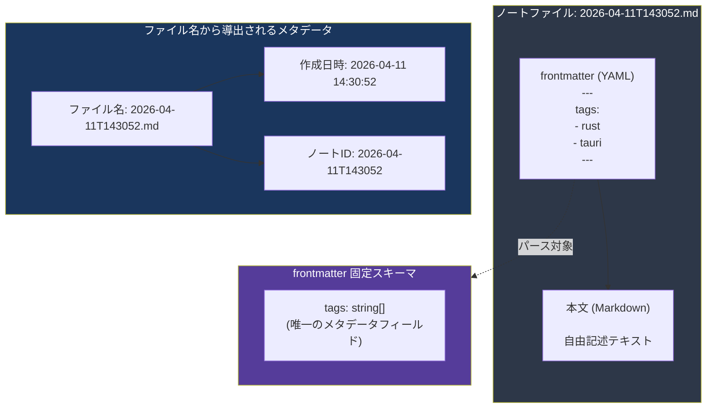
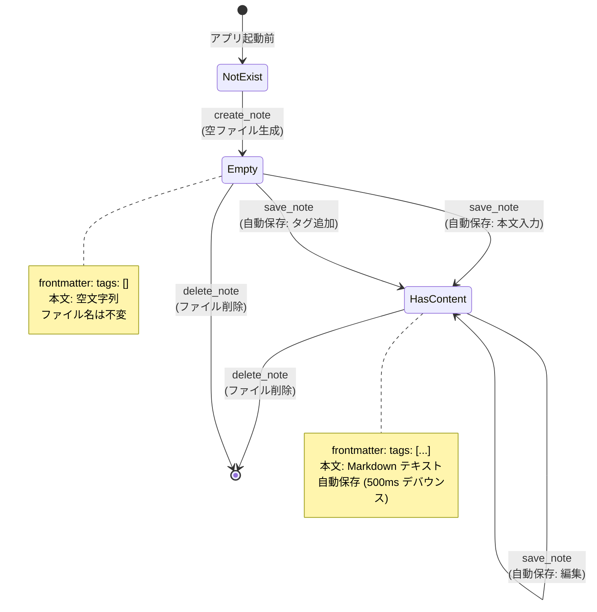
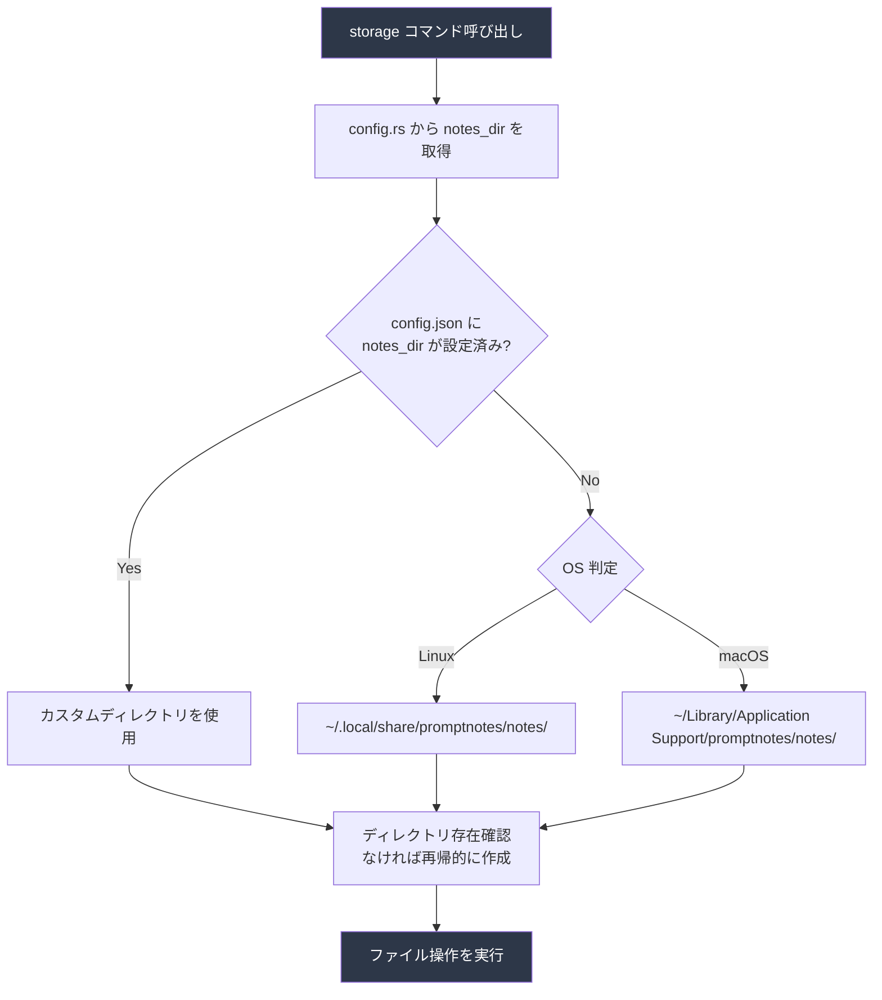

---
codd:
  node_id: detail:storage_fileformat
  type: design
  depends_on:
  - id: detail:component_architecture
    relation: depends_on
    semantic: technical
  depended_by:
  - id: detail:grid_search
    relation: depends_on
    semantic: technical
  - id: plan:implementation_plan
    relation: depends_on
    semantic: technical
  conventions:
  - targets:
    - module:storage
    reason: ファイル名は YYYY-MM-DDTHHMMSS.md 形式で確定。作成時タイムスタンプで不変。
  - targets:
    - module:storage
    reason: frontmatter は YAML形式、メタデータは tags のみ。作成日はファイル名から取得。追加フィールドの導入は要件変更が必要。
  - targets:
    - module:storage
    reason: 自動保存必須。ユーザーによる明示的保存操作は不要。
  - targets:
    - module:storage
    - module:settings
    reason: 'デフォルト保存ディレクトリは Linux: ~/.local/share/promptnotes/notes/、macOS: ~/Library/Application
      Support/promptnotes/notes/。設定から任意ディレクトリに変更可能であること。'
  modules:
  - storage
  - settings
---

# Storage & File Format Detailed Design

## 1. Overview

本設計書は PromptNotes の `module:storage` におけるファイル永続化形式、ディレクトリ構造、ノート CRUD 操作、および自動保存メカニズムの詳細設計を定義する。`storage` モジュールは Rust Core Process 内に存在し、WebView Process からの `invoke` 呼び出しを唯一のエントリポイントとしてノートファイルのライフサイクル全体を管理する。

本設計は以下のリリースブロッキング制約を構造的に強制する。

| 制約 ID | 対象 | 内容 | 本設計書での担保方法 |
|---|---|---|---|
| CONV-1 | `module:storage` | ファイル名は `YYYY-MM-DDTHHMMSS.md` 形式で確定。作成時タイムスタンプで不変 | ファイル名生成ロジックを `storage.rs` 内の単一関数に局所化し、リネーム API を提供しない |
| CONV-2 | `module:storage` | frontmatter は YAML 形式、メタデータは `tags` のみ。作成日はファイル名から取得。追加フィールドの導入は要件変更が必要 | frontmatter のパース・シリアライズを固定スキーマの構造体で実装し、未知フィールドを破棄する |
| CONV-3 | `module:storage` | 自動保存必須。ユーザーによる明示的保存操作は不要 | `save_note` コマンドはフロントエンドのデバウンスパイプラインから自動的に発行され、UI に「保存」ボタンを設置しない |
| CONV-4 | `module:storage`, `module:settings` | デフォルト保存ディレクトリは Linux: `~/.local/share/promptnotes/notes/`、macOS: `~/Library/Application Support/promptnotes/notes/`。設定から任意ディレクトリに変更可能 | `config.rs` から取得したパスを `storage.rs` が参照し、ディレクトリ解決を起動時およびコマンド実行時に行う |

データ永続化はローカル `.md` ファイルのみで行い、データベースやクラウドストレージの使用は禁止される（RBC-3）。すべてのファイル操作は Rust バックエンド経由で実行され、フロントエンドからの直接ファイルシステムアクセスは Tauri v2 のケイパビリティシステムにより構造的に不可能である。

---

## 2. Mermaid Diagrams

### 2.1 ノートファイルの内部構造



**所有権と実装境界:**

- ファイル名の生成（`YYYY-MM-DDTHHMMSS.md` 形式）は `storage.rs` 内の `generate_filename()` 関数が排他的に担当する。ファイル名は作成時に確定し、以後変更されない（CONV-1）。ノート ID はファイル名から拡張子を除いた `YYYY-MM-DDTHHMMSS` 文字列であり、ファイルシステム上のパスと 1:1 で対応する。
- 作成日時はファイル名からパースして取得する。`NoteMetadata` 構造体に `created_at` フィールドを持つが、これはファイル名から導出される読み取り専用の値であり、frontmatter やファイルシステムのタイムスタンプには依存しない。
- frontmatter は YAML 形式で `tags` フィールドのみを格納する（CONV-2）。`serde` の `deny_unknown_fields` は適用せず、将来的な互換性のために未知フィールドはパース時に無視して書き込み時に破棄する。ただし、追加フィールドの正式導入は要件変更を経なければならない。

### 2.2 ストレージ操作のステートマシン



**操作遷移の説明:**

- `create_note` は空の frontmatter（`tags: []`）と空の本文を持つファイルを生成する。ファイル名は呼び出し時刻から `generate_filename()` で決定され、以後不変である。
- `save_note` はデバウンスパイプライン（フロントエンド 500ms）を経て自動発行される（CONV-3）。本文変更とタグ変更の両方が同一パイプラインで処理される。
- `delete_note` はファイルをファイルシステムから物理削除する。ゴミ箱機能はスコープ外である。
- `read_note` と `list_notes` は状態遷移を伴わない読み取り操作のため、図から省略している。

### 2.3 ディレクトリ解決フロー



**所有権:**

- ディレクトリパスの解決は `storage.rs` が `config.rs` の `get_notes_dir()` を内部呼び出しして行う。フロントエンドにパス文字列を渡さず、`storage.rs` 内で完結する。
- デフォルトディレクトリは OS ごとに XDG Base Directory（Linux）または Apple のアプリケーションサポートディレクトリ（macOS）に準拠する（CONV-4）。Rust では `dirs` クレート（`dirs::data_dir()`）を使用してプラットフォーム差を吸収する。
- ディレクトリが存在しない場合は `std::fs::create_dir_all` で再帰的に作成する。これはアプリ初回起動時および保存ディレクトリ変更後の初回アクセス時に発生する。

---

## 3. Ownership Boundaries

### 3.1 ファイルフォーマットの所有権

| 要素 | 所有者 | 責務 | 他モジュールへの公開 |
|---|---|---|---|
| ファイル名形式（`YYYY-MM-DDTHHMMSS.md`） | `storage.rs` / `generate_filename()` | UTC 現在時刻からファイル名を生成 | `NoteMetadata.id` としてフロントエンドに公開（読み取り専用） |
| frontmatter スキーマ（`tags` フィールド） | `storage.rs` / `parse_frontmatter()`, `serialize_frontmatter()` | YAML パースとシリアライズ | `Note.frontmatter.tags` としてフロントエンドに公開 |
| 本文テキスト | `storage.rs` / `save_note()`, `read_note()` | frontmatter 以降の Markdown テキストの読み書き | `Note.body` としてフロントエンドに公開 |
| ディレクトリパス解決 | `storage.rs` + `config.rs` 連携 | `config.json` の `notes_dir` またはデフォルトパスを解決 | パス文字列はフロントエンドに公開しない |

### 3.2 Rust 構造体の定義（`models.rs` が単一所有者）

```rust
/// ノートの frontmatter。tags フィールドのみを持つ固定スキーマ。
#[derive(Debug, Clone, Serialize, Deserialize)]
pub struct Frontmatter {
    #[serde(default)]
    pub tags: Vec<String>,
}

/// ノートの全データ（read_note の応答）
#[derive(Debug, Clone, Serialize, Deserialize)]
pub struct Note {
    pub id: String,           // "2026-04-11T143052"（ファイル名から拡張子除去）
    pub frontmatter: Frontmatter,
    pub body: String,
    pub created_at: String,   // ISO 8601 形式（ファイル名から導出）
}

/// ノートのメタデータ（list_notes / search_notes の応答）
#[derive(Debug, Clone, Serialize, Deserialize)]
pub struct NoteMetadata {
    pub id: String,
    pub tags: Vec<String>,
    pub created_at: String,
    pub preview: String,      // 本文先頭 100 文字のプレビュー
}
```

- `Frontmatter` 構造体は `tags` のみをフィールドに持つ。`#[serde(deny_unknown_fields)]` は付与せず、未知フィールドはデシリアライズ時に無視される。ただし `serialize_frontmatter()` は `Frontmatter` 構造体のみをシリアライズするため、未知フィールドは書き込み時に消失する。これは CONV-2 の「追加フィールドの導入は要件変更が必要」を実装レベルで強制する設計である。
- `NoteMetadata.preview` は `list_notes` 呼び出し時にファイル読み込みと同時に生成する。プレビュー長は 100 文字で切り捨て、グリッド表示に使用する。

### 3.3 ファイル I/O 関数の責務分担

| 関数 | ファイル | 責務 | 呼び出し元 |
|---|---|---|---|
| `generate_filename()` | `storage.rs` | UTC 現在時刻 → `YYYY-MM-DDTHHMMSS.md` 文字列生成 | `create_note()` のみ |
| `parse_filename(filename: &str)` | `storage.rs` | ファイル名 → `(id, created_at)` パース | `list_notes()`, `read_note()` |
| `parse_frontmatter(content: &str)` | `storage.rs` | ファイル全文 → `(Frontmatter, body)` 分離 | `read_note()`, `list_notes()`, `search_notes()` |
| `serialize_frontmatter(fm: &Frontmatter)` | `storage.rs` | `Frontmatter` → YAML 文字列（`---` 区切り付き） | `save_note()`, `create_note()` |
| `resolve_notes_dir()` | `storage.rs` | `config.rs` 経由でノートディレクトリパスを取得 | 全 storage コマンド |
| `ensure_dir(path: &Path)` | `storage.rs` | ディレクトリが存在しなければ再帰作成 | `create_note()`, `save_note()` |

`search.rs` がファイル走査を行う場合、`storage.rs` の `resolve_notes_dir()` および `parse_frontmatter()` を呼び出す。ファイル列挙ロジックの重複を避けるため、ディレクトリ内の `.md` ファイル一覧を返す `list_note_files()` 関数を `storage.rs` に定義し、`search.rs` はこれを利用する。

### 3.4 自動保存の所有権境界

自動保存（CONV-3）はフロントエンドとバックエンドの協調で実現する。

- **フロントエンド所有:** デバウンス制御（500ms `setTimeout`）、CodeMirror 6 の `updateListener` による変更検知、`FrontmatterBar` のタグ状態と本文の結合
- **バックエンド所有:** ファイルへの物理書き込み、frontmatter のシリアライズ、ディレクトリ存在確認

フロントエンドに「保存」ボタンや Ctrl+S / Cmd+S のショートカットを設けない。`EditorView.svelte` のデバウンスパイプラインが唯一の保存トリガーである。

---

## 4. Implementation Implications

### 4.1 ファイル名生成の実装

ファイル名は `chrono` クレートを使用して UTC 現在時刻から生成する。

```rust
use chrono::Utc;

fn generate_filename() -> String {
    Utc::now().format("%Y-%m-%dT%H%M%S.md").to_string()
}

fn parse_filename(filename: &str) -> Result<(String, String), StorageError> {
    let id = filename.trim_end_matches(".md");
    let created_at = chrono::NaiveDateTime::parse_from_str(id, "%Y-%m-%dT%H%M%S")
        .map_err(|_| StorageError::InvalidFilename(filename.to_string()))?;
    Ok((id.to_string(), created_at.format("%Y-%m-%dTT%H:%M:%S").to_string()))
}
```

同一秒内に複数のノートが作成された場合、ファイル名が衝突する可能性がある。この場合、`storage.rs` はファイル存在チェックを行い、衝突時は秒数を 1 インクリメントしたファイル名を生成する。ユーザーの通常操作（Cmd+N / Ctrl+N）では秒単位の衝突は実質的に発生しないが、防御的に実装する。

### 4.2 frontmatter パース・シリアライズの実装

frontmatter のパースには `serde_yaml` クレート（または後継の `serde_yml`）を使用する。ファイル先頭の `---` 行で囲まれた YAML ブロックを frontmatter として抽出し、残りを本文として分離する。

```rust
fn parse_frontmatter(content: &str) -> Result<(Frontmatter, String), StorageError> {
    if !content.starts_with("---\n") {
        return Ok((Frontmatter { tags: vec![] }, content.to_string()));
    }
    let end = content[4..]
        .find("\n---\n")
        .ok_or(StorageError::MalformedFrontmatter)?;
    let yaml_str = &content[4..4 + end];
    let body = &content[4 + end + 5..];
    let fm: Frontmatter = serde_yaml::from_str(yaml_str)?;
    Ok((fm, body.to_string()))
}

fn serialize_frontmatter(fm: &Frontmatter, body: &str) -> String {
    let yaml = serde_yaml::to_string(fm).unwrap_or_default();
    format!("---\n{}---\n{}", yaml, body)
}
```

frontmatter を持たないファイル（古いファイルや手動作成ファイル）は `tags: []` として扱い、エラーにしない。`save_note` 時には常に frontmatter を書き出す。

### 4.3 CRUD コマンドの実装詳細

#### `create_note`

1. `resolve_notes_dir()` でディレクトリパスを取得
2. `ensure_dir()` でディレクトリ存在を保証
3. `generate_filename()` でファイル名を生成（衝突チェック付き）
4. 空 frontmatter（`tags: []`）と空本文を `serialize_frontmatter()` で結合
5. `std::fs::write()` でファイルを作成
6. `NoteMetadata` を返却

レイテンシ目標: 100ms 以下。空ファイル作成は数 ms で完了する。

#### `save_note`

1. `resolve_notes_dir()` でディレクトリパスを取得
2. `id` からファイルパスを構築（`{notes_dir}/{id}.md`）
3. ファイル存在チェック（存在しない場合は `StorageError::NotFound`）
4. `serialize_frontmatter()` で frontmatter + 本文を結合
5. `std::fs::write()` でファイルを上書き

自動保存のため頻繁に呼び出される。`std::fs::write` はアトミック書き込みではないため、書き込み中のクラッシュでデータが破損するリスクがある。これを軽減するため、一時ファイル（`{id}.md.tmp`）に書き込み後に `std::fs::rename` でアトミックに置換する。

```rust
fn atomic_write(path: &Path, content: &str) -> Result<(), StorageError> {
    let tmp_path = path.with_extension("md.tmp");
    std::fs::write(&tmp_path, content)?;
    std::fs::rename(&tmp_path, path)?;
    Ok(())
}
```

#### `read_note`

1. `resolve_notes_dir()` でディレクトリパスを取得
2. `id` からファイルパスを構築
3. `std::fs::read_to_string()` でファイル全文を読み込み
4. `parse_frontmatter()` で frontmatter と本文を分離
5. `parse_filename()` で作成日時を導出
6. `Note` 構造体を返却

#### `delete_note`

1. `resolve_notes_dir()` でディレクトリパスを取得
2. `id` からファイルパスを構築
3. `std::fs::remove_file()` でファイルを削除
4. ファイルが存在しない場合は `StorageError::NotFound`

#### `list_notes`

1. `resolve_notes_dir()` でディレクトリパスを取得
2. `std::fs::read_dir()` でディレクトリ内の `.md` ファイルを列挙
3. 各ファイルについて `parse_filename()` と `parse_frontmatter()` を実行
4. オプションの `NoteFilter`（タグフィルタ、日付範囲）を適用
5. `created_at` の降順（新しい順）でソート
6. `NoteMetadata[]` を返却

プレビュー生成は本文先頭 100 文字を切り出す。マルチバイト文字の途中で切断しないよう `char_indices` を使用する。

### 4.4 ディレクトリ設定の連携

`config.rs` が管理する `config.json` のスキーマ:

```json
{
  "notes_dir": "/custom/path/to/notes"
}
```

`notes_dir` が未設定（`null` または `config.json` 自体が存在しない）の場合、`storage.rs` は以下のデフォルトパスを使用する:

| OS | デフォルトパス | 解決方法 |
|---|---|---|
| Linux | `~/.local/share/promptnotes/notes/` | `dirs::data_dir()` + `/promptnotes/notes/` |
| macOS | `~/Library/Application Support/promptnotes/notes/` | `dirs::data_dir()` + `/promptnotes/notes/` |

設定変更時（`set_config` で `notes_dir` が変更された場合）、既存ノートファイルの移動は行わない。新しいディレクトリに存在するノートのみが `list_notes` の対象となる。この仕様はコンポーネントアーキテクチャ設計書の設定変更フロー（§2.3）で明示されている。

### 4.5 エラー型の設計

`storage.rs` 固有のエラーは `error.rs` の `StorageError` enum で定義する。

```rust
#[derive(Debug, thiserror::Error, Serialize)]
pub enum StorageError {
    #[error("ファイルが見つかりません: {0}")]
    NotFound(String),
    #[error("不正なファイル名: {0}")]
    InvalidFilename(String),
    #[error("frontmatter のパースに失敗: {0}")]
    MalformedFrontmatter(String),
    #[error("I/O エラー: {0}")]
    Io(String),
    #[error("ディレクトリの作成に失敗: {0}")]
    DirectoryCreation(String),
}
```

`StorageError` は `Serialize` を derive し、Tauri IPC のエラー応答として JSON シリアライズされる。フロントエンドの `ipc.ts` では `Promise` の `catch` でこのエラーを受け取り、エラー種別に応じた処理を行う。

### 4.6 パフォーマンス特性

| 操作 | 想定レイテンシ | ボトルネック | 最適化戦略 |
|---|---|---|---|
| `create_note` | < 5ms | ファイル作成 I/O | なし（十分高速） |
| `save_note` | < 10ms | ファイル書き込み I/O | アトミック書き込み（`write` + `rename`） |
| `read_note` | < 10ms | ファイル読み込み + frontmatter パース | なし |
| `list_notes` (100 件) | < 50ms | ディレクトリ走査 + 各ファイルの frontmatter パース | プレビュー取得を先頭 100 文字に制限 |
| `list_notes` (1000 件) | < 500ms | 同上 | 将来的にメタデータキャッシュを検討（現時点では未実装） |
| `delete_note` | < 5ms | ファイル削除 I/O | なし |

想定データ量（数十件/週）では、インデックス構築なしのファイル全走査で数百 ms 以内の応答が十分達成可能である。

### 4.7 リリースブロッキング制約の構造的対応

**CONV-1（ファイル名形式の不変性）:** `generate_filename()` は `storage.rs` 内の private 関数であり、外部からファイル名を指定する API は存在しない。`save_note` は `id`（既存ファイル名）を受け取るのみで、リネーム機能は一切提供しない。ファイル名のフォーマット `YYYY-MM-DDTHHMMSS.md` は `chrono` の `format` 文字列で固定される。

**CONV-2（frontmatter スキーマの固定）:** `Frontmatter` 構造体は `tags: Vec<String>` のみをフィールドに持つ。`serialize_frontmatter()` はこの構造体のみをシリアライズするため、仮にユーザーがテキストエディタで frontmatter に手動でフィールドを追加しても、次回の `save_note` 時に `tags` 以外は消失する。作成日は frontmatter に含めず、ファイル名から導出する。

**CONV-3（自動保存の必須化）:** `save_note` コマンド自体は明示的に呼び出し可能だが、フロントエンドの `EditorView.svelte` に組み込まれた 500ms デバウンスパイプラインが唯一のトリガーである。保存ボタンや保存ショートカット（Ctrl+S / Cmd+S）は実装しない。

**CONV-4（デフォルトディレクトリとカスタムディレクトリ）:** `resolve_notes_dir()` は `config.rs` の `get_config()` を呼び出し、`notes_dir` が設定済みであればそのパスを、未設定であれば `dirs::data_dir()` ベースのプラットフォーム固有デフォルトを返す。設定変更は `SettingsView.svelte` → `invoke('set_config')` → `config.rs` の経路でのみ可能であり、フロントエンド単独でのパス操作は禁止される。

---

## 5. Open Questions

| ID | 質問 | 影響範囲 | 判断に必要な情報 |
|---|---|---|---|
| OQ-SF-001 | 同一秒内のファイル名衝突時、秒数インクリメント方式で十分か。ミリ秒精度を採用すべきか | `storage.rs` / `generate_filename()` | ユーザー操作パターンの実測（高速連続 Cmd+N の頻度） |
| OQ-SF-002 | ユーザーが外部テキストエディタでノートファイルを直接編集した場合、frontmatter の未知フィールドが消失する仕様を許容するか。あるいは未知フィールドを保持するために `serde_yaml::Value` ベースのパース方式に変更するか | `storage.rs` / `parse_frontmatter()`, `serialize_frontmatter()` | ユーザーの外部エディタ併用ニーズの確認。CONV-2 の厳密な解釈の合意 |
| OQ-SF-003 | アトミック書き込み（`write` + `rename`）は全プラットフォーム（Linux ext4/btrfs、macOS APFS）で期待通りにアトミックに動作するか | `storage.rs` / `atomic_write()` | Linux（WebKitGTK 環境）および macOS での動作検証結果 |
| OQ-SF-004 | `list_notes` のプレビュー生成時、frontmatter 直後の空行や見出し記法（`#`）を除去してプレビューテキストを生成すべきか | `storage.rs` / `list_notes()` | グリッドビューのカード表示仕様の詳細化 |
| OQ-SF-005 | 保存ディレクトリ変更後、旧ディレクトリのノートへの参照をどう扱うか。エディタで開いているノートの保存先は即座に新ディレクトリに切り替わるか、セッション中は旧パスを維持するか | `storage.rs`, `config.rs`, `EditorView.svelte` | 設定変更時の UX 要件の明確化 |
