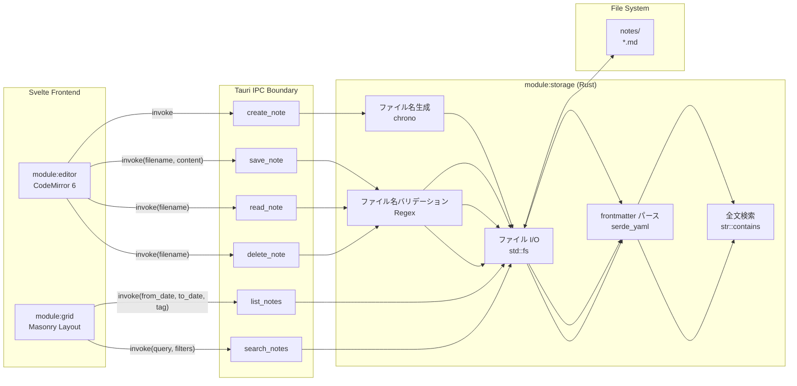
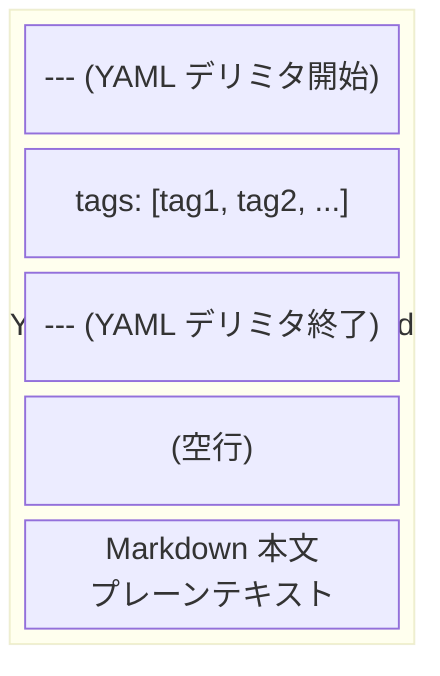

---
codd:
  node_id: detail:storage_fileformat
  type: design
  depends_on:
  - id: detail:component_architecture
    relation: depends_on
    semantic: technical
  depended_by:
  - id: plan:implementation_plan
    relation: depends_on
    semantic: technical
  conventions:
  - targets:
    - module:storage
    reason: ファイル名は YYYY-MM-DDTHHMMSS.md 形式で確定。作成時タイムスタンプで不変。
  - targets:
    - module:storage
    reason: frontmatter は YAML形式、メタデータは tags のみ。作成日はファイル名から取得。追加フィールドの導入は要件変更が必要。
  - targets:
    - module:storage
    reason: 自動保存必須。ユーザーによる明示的保存操作は不要。
  - targets:
    - module:storage
    - module:settings
    reason: 'デフォルト保存ディレクトリは Linux: ~/.local/share/promptnotes/notes/、macOS: ~/Library/Application
      Support/promptnotes/notes/。設定から任意ディレクトリに変更可能であること。'
  modules:
  - storage
  - settings
---

# Storage & File Format Detailed Design

## 1. Overview

本設計書は PromptNotes アプリケーションにおける `module:storage` のファイル保存形式、ディレクトリ構造、frontmatter 仕様、および自動保存メカニズムの詳細を定義する。PromptNotes は Tauri（Rust + WebView）上で動作するローカルファーストのプロンプトノートアプリであり、フロントエンドに **Svelte**、エディタエンジンに **CodeMirror 6** を採用する。データはローカルファイルシステム上の `.md` ファイルのみに保存し、データベース（SQLite・IndexedDB 等）やクラウド同期は一切使用しない。

`module:storage` はすべてのファイル I/O 操作を排他的に所有する Rust バックエンドモジュールであり、ノートの CRUD、ファイル名タイムスタンプ生成、frontmatter パース、全文検索を担当する。Svelte フロントエンドからの直接ファイルシステムアクセスは禁止され、すべての操作は Tauri IPC（`invoke`）経由で `module:storage` に委譲される。

### リリース不可制約への準拠

本設計書は以下の非交渉制約（Release-Blocking Constraints）に完全準拠する。

| 制約 ID | 対象モジュール | 制約内容 | 本設計書における準拠箇所 |
|---------|--------------|---------|----------------------|
| CONV-FILENAME | `module:storage` | ファイル名は `YYYY-MM-DDTHHMMSS.md` 形式で確定。作成時タイムスタンプで不変。 | §1.1 ファイル名仕様、§2 ステートマシン図で不変性を明示 |
| CONV-FRONTMATTER | `module:storage` | frontmatter は YAML 形式、メタデータは `tags` のみ。作成日はファイル名から取得。追加フィールドの導入は要件変更が必要。 | §1.2 frontmatter 仕様で完全定義 |
| CONV-AUTOSAVE | `module:storage` | 自動保存必須。ユーザーによる明示的保存操作は不要。 | §4 自動保存フロー実装詳細 |
| CONV-DIRECTORY | `module:storage`, `module:settings` | デフォルト保存ディレクトリは Linux: `~/.local/share/promptnotes/notes/`、macOS: `~/Library/Application Support/promptnotes/notes/`。設定から任意ディレクトリに変更可能。 | §1.3 ディレクトリ構造、§4 設定連携 |

### 1.1 ファイル名仕様

ファイル名は `YYYY-MM-DDTHHMMSS.md` 形式で生成される。これはノートの作成日時を表し、一度生成されたファイル名は不変である。リネーム操作は `module:storage` の IPC コマンドとして提供せず、ファイル名変更の手段は存在しない。

- **形式:** `YYYY-MM-DDTHHMMSS.md`（例: `2026-04-04T143052.md`）
- **タイムゾーン:** ローカルタイム（`chrono::Local::now()`）
- **生成者:** `module:storage`（Rust 側）が `chrono` クレートで排他的に生成。Svelte フロントエンドがファイル名を生成することは禁止。
- **不変性:** 作成後にファイル名が変更されることはない。作成日時の情報源としてファイル名を正とする。
- **衝突回避:** 同一秒内に複数ノートが作成された場合、末尾に `_1`, `_2` のサフィックスを付与する（例: `2026-04-04T143052_1.md`）。
- **バリデーション:** `save_note` / `read_note` / `delete_note` コマンドの `filename` 引数は正規表現 `^\d{4}-\d{2}-\d{2}T\d{6}(_\d+)?\.md$` に厳密一致するもののみ許可し、パストラバーサルを防止する。

### 1.2 frontmatter 仕様

ノートファイルの先頭には YAML 形式の frontmatter を配置する。メタデータフィールドは `tags` のみで、作成日はファイル名から取得するため frontmatter には含めない。追加フィールドの導入は要件変更プロセスを経る必要がある。

```markdown
---
tags: [rust, tauri, memo]
---

ここからノート本文が始まる。
```

| フィールド | 型 | 必須 | デフォルト | 説明 |
|-----------|-----|------|-----------|------|
| `tags` | `string[]` | いいえ | `[]`（空配列） | ノートに付与されるタグ。フィルタリング・分類に使用 |

- **デリミタ:** 先頭行が `---` で始まり、次の `---` で終わるブロックを frontmatter として認識する。
- **パーサー:** Rust 側で `serde_yaml` クレートを使用してデシリアライズする。パースエラー時は `tags: []` として扱い、ノート本文は保持する。
- **作成日の取得:** `NoteEntry` 構造体の `created_at` フィールドはファイル名からパースして取得する。frontmatter に `date` や `created_at` フィールドを持たせない。
- **フロントエンドデコレーション:** `module:editor`（Svelte + CodeMirror 6）は frontmatter 領域に背景色を付与するカスタムデコレーションを表示するが、frontmatter の構造解釈（YAML パース）は行わない。保存時に `content` 全体を `module:storage` に送信し、Rust 側でパースする。

### 1.3 ディレクトリ構造

```
<base_dir>/
├── notes/
│   ├── 2026-04-01T091530.md
│   ├── 2026-04-02T140022.md
│   ├── 2026-04-03T083015.md
│   └── 2026-04-04T143052.md
└── config.json
```

| パス | 所有モジュール | 説明 |
|------|--------------|------|
| `<base_dir>/notes/` | `module:storage` | ノートファイル保存ディレクトリ |
| `<base_dir>/config.json` | `module:settings` | アプリケーション設定ファイル |

**デフォルト `<base_dir>`:**

| プラットフォーム | デフォルトパス | 取得方法 |
|----------------|-------------|---------|
| Linux (GTK WebKitGTK) | `~/.local/share/promptnotes/` | `dirs::data_dir()` + `"promptnotes"` |
| macOS (WKWebView) | `~/Library/Application Support/promptnotes/` | `dirs::data_dir()` + `"promptnotes"` |

`notes/` サブディレクトリは `module:storage` の初期化時に `std::fs::create_dir_all` で自動作成される。ユーザーは `module:settings` 経由で保存ディレクトリ（`notes_dir`）を任意のパスに変更可能であり、変更は Rust バックエンドで検証・永続化される。フロントエンドから直接 `notes_dir` パスをファイルシステムに書き込む操作は禁止される。

## 2. Mermaid Diagrams

### 2.1 ノートファイルのライフサイクル状態遷移

```mermaid
stateDiagram-v2
    [*] --> Creating : Cmd+N / Ctrl+N (module:editor → IPC)
    Creating --> Empty : module:storage が<br/>YYYY-MM-DDTHHMMSS.md 生成<br/>frontmatter: tags=[]
    Empty --> Editing : ユーザーがテキスト入力開始
    Editing --> Saving : デバウンス 500ms 経過<br/>(module:editor → IPC)
    Saving --> Persisted : module:storage が<br/>std::fs::write で上書き保存
    Persisted --> Editing : ユーザーが再度編集
    Persisted --> Deleting : ユーザーが削除操作<br/>(module:grid / module:editor → IPC)
    Deleting --> [*] : module:storage が<br/>std::fs::remove_file で削除

    note right of Creating
        ファイル名は作成時に確定し不変。
        chrono::Local::now() で生成。
        module:storage が排他的に所有。
    end note

    note right of Saving
        自動保存のみ。
        明示的保存操作は存在しない。
        content 全体（frontmatter + body）を
        Rust 側に送信。
    end note
```

この状態遷移図はノートファイルのライフサイクル全体を表す。ファイルは `module:storage`（Rust バックエンド）のみがファイルシステム上で操作し、状態遷移のトリガーは Svelte フロントエンドからの Tauri IPC `invoke` 呼び出しに限定される。

**所有権の明示:**

- **Creating → Empty 遷移:** `module:storage` がファイル名を `chrono` クレートで生成し、`std::fs::File::create` で空ファイルを作成する。フロントエンドはファイル名を一切関知せず、`create_note` IPC コマンドの戻り値 `{ filename, path }` として受け取るのみ。
- **Editing → Saving 遷移:** デバウンスタイマー（500ms）は `module:editor`（Svelte 側、`lib/debounce.ts`）が管理する。タイマー消化後に `save_note` IPC コマンドを呼び出し、Rust 側は受信した `content` をそのまま `std::fs::write` で上書きする。Rust 側はステートレスであり、エディタの変更状態を追跡しない。
- **Deleting 遷移:** `module:storage` が `std::fs::remove_file` でファイルを物理削除する。ゴミ箱やソフトデリートの仕組みは導入しない。

### 2.2 ファイル I/O コマンドとデータフロー



このフローチャートはすべての IPC コマンドが `module:storage` 内部でどのサブコンポーネント（ファイル名生成、frontmatter パース、ファイル I/O、全文検索、バリデーション）を経由するかを示す。

**実装境界:**

- **ファイル名バリデーション（VAL）** はすべての既存ファイルを対象とする操作（`save_note`, `read_note`, `delete_note`）の入口で実行される。正規表現 `^\d{4}-\d{2}-\d{2}T\d{6}(_\d+)?\.md$` に一致しない `filename` はパストラバーサル攻撃として拒否する。
- **frontmatter パース（FMP）** は読み取り系操作（`read_note`, `list_notes`, `search_notes`）で実行される。`save_note` では frontmatter をパースせずに `content` をそのまま書き込む（パース責任は読み取り時）。
- **全文検索（FTS）** は `str::to_lowercase().contains(&query.to_lowercase())` による大文字小文字非区別の部分文字列一致で実装する。インデックスエンジンは導入しない。ノート蓄積が 5,000 件を超過した時点で応答時間を計測し、`tantivy` クレートの導入を検討する。

### 2.3 ノートファイル内部構造



ファイルの物理構造は上記の通り単純である。frontmatter ブロック（`---` で囲まれた YAML）とノート本文の2セクションからなる。`module:storage` は `---` デリミタを先頭から走査して frontmatter ブロックを抽出し、残りを本文として扱う。

## 3. Ownership Boundaries

### 3.1 `module:storage` の排他的所有範囲

`module:storage` は以下のリソースと操作を排他的に所有する。他のモジュールがこれらを直接実装・操作することは禁止される。

| リソース / 操作 | 排他的所有者 | 利用者 | Rust クレート |
|---------------|------------|-------|-------------|
| `.md` ファイル CRUD（作成・読取・上書き・削除） | `module:storage` | `module:editor`, `module:grid` via IPC | `std::fs` |
| ファイル名生成 `YYYY-MM-DDTHHMMSS.md` | `module:storage` | `module:editor`（IPC 戻り値として受領） | `chrono` |
| ファイル名バリデーション | `module:storage` | 内部使用のみ | `regex` |
| frontmatter YAML パース | `module:storage` | `module:grid`（`NoteEntry.tags` として受領） | `serde_yaml` |
| 全文検索ロジック | `module:storage` | `module:grid` via IPC | 標準ライブラリ `str::contains` |
| `notes/` ディレクトリ初期化 | `module:storage` | なし | `std::fs::create_dir_all` |
| ファイル名からの日時パース | `module:storage` | `module:grid`（`NoteEntry.created_at` として受領） | `chrono::NaiveDateTime::parse_from_str` |

### 3.2 `module:settings` との境界

`config.json` の読み書きは `module:settings`（Rust バックエンド）が排他的に所有する。`module:storage` は起動時に `module:settings` から `notes_dir` を取得し、以降のファイル操作に使用する。

```rust
// config.json の構造（module:settings が所有）
{
    "notes_dir": "/home/user/.local/share/promptnotes/notes/"
}
```

- `module:storage` は `notes_dir` の値を参照するが、`config.json` への書き込み権限を持たない。
- 設定変更時のディレクトリ存在チェック・書き込み権限チェックは `module:settings`（Rust 側）が行う。
- 設定変更後、`module:storage` は新しい `notes_dir` で動作する。既存ノートの移動は行わない。

### 3.3 Svelte フロントエンドとの境界

Svelte フロントエンド（`module:editor`, `module:grid`）は `lib/api.ts` の型安全な IPC ラッパー関数を通じてのみ `module:storage` と通信する。

| フロントエンド操作 | IPC コマンド | `module:storage` の責務 |
|------------------|-------------|----------------------|
| 新規ノート作成（`Cmd+N` / `Ctrl+N`） | `create_note` | ファイル名生成、空ファイル作成、初期 frontmatter 書き込み |
| テキスト編集後の自動保存 | `save_note` | ファイル名バリデーション、`content` 全体の上書き保存 |
| ノート読み込み | `read_note` | ファイル名バリデーション、ファイル読み込み、`content` 返却 |
| ノート削除 | `delete_note` | ファイル名バリデーション、ファイル物理削除 |
| 一覧取得（日付・タグフィルタ） | `list_notes` | ディレクトリ走査、ファイル名日時パース、frontmatter パース、フィルタリング |
| 全文検索 | `search_notes` | ディレクトリ走査、ファイル全文読み込み、部分文字列一致検索 |

### 3.4 共有型 `NoteEntry` の正規定義

`NoteEntry` は `module:storage` 内の `models.rs` が正規の定義元であり、TypeScript 側の型定義（`src/lib/types.ts`）は Rust 側に追従する。

```rust
// module:storage の models.rs（正規定義）
#[derive(Serialize, Deserialize, Clone)]
pub struct NoteEntry {
    pub filename: String,          // "2026-04-04T143052.md"
    pub created_at: String,        // "2026-04-04T14:30:52" (ファイル名からパース)
    pub tags: Vec<String>,         // frontmatter の tags フィールド
    pub body_preview: String,      // 本文先頭 200 文字のプレビュー
}
```

```typescript
// src/lib/types.ts（Rust 側に追従）
export interface NoteEntry {
    filename: string;
    created_at: string;
    tags: string[];
    body_preview: string;
}
```

再実装ドリフト防止のため、Rust 側の `serde::Serialize` / `serde::Deserialize` 導出が正（canonical）であり、CI の E2E テストで型の一致を検証する。

## 4. Implementation Implications

### 4.1 `create_note` コマンドの実装詳細

`create_note` はファイル名生成とファイル作成を一括で行う。

**処理フロー:**

1. `chrono::Local::now().format("%Y-%m-%dT%H%M%S")` でタイムスタンプ文字列を生成する。
2. `{timestamp}.md` のファイルが既に存在するか確認する。存在する場合は `{timestamp}_1.md`, `{timestamp}_2.md` と順にサフィックスを付与し、未使用のファイル名を特定する。
3. `notes_dir` 配下に初期 frontmatter を含むファイルを作成する。

**初期ファイル内容:**

```markdown
---
tags: []
---

```

4. `{ filename, path }` を IPC レスポンスとして返却する。

**不変性の保証:** ファイル名は作成時に確定し、以降の `save_note` 呼び出しでは既存の `filename` を受け取って上書き保存する。ファイル名を変更する IPC コマンドは提供しない。

### 4.2 `save_note` コマンドの実装詳細（自動保存対応）

自動保存は `module:editor`（Svelte 側）のデバウンスタイマー（500ms）が管理し、タイマー消化後に `save_note` IPC コマンドを呼び出す。ユーザーによる明示的な保存操作（Cmd+S、保存ボタン等）は一切提供しない。

**処理フロー:**

1. `filename` を正規表現 `^\d{4}-\d{2}-\d{2}T\d{6}(_\d+)?\.md$` でバリデーションする。不一致の場合はエラーを返却する。
2. `notes_dir` と `filename` を結合してフルパスを構成する。パストラバーサル防止のため `..` や絶対パスを含む `filename` を拒否する。
3. `std::fs::write(full_path, content)` で `content`（frontmatter + 本文の全体）を上書き保存する。
4. 書き込み成功時は `void` を返却する。書き込み失敗時は Tauri のエラーレスポンスでフロントエンドに通知する。

**自動保存のパフォーマンス:** ローカルファイルシステムへの `std::fs::write` は通常 1ms 以下で完了する。デバウンス 500ms と IPC オーバーヘッドを含めても、ユーザー体感上の遅延は発生しない。

### 4.3 `list_notes` / `search_notes` の実装詳細

グリッドビュー（`module:grid`）のデータ供給を担う2つの検索系コマンドの実装方針。

**`list_notes` 処理フロー:**

1. `notes_dir` 配下の `*.md` ファイルを `std::fs::read_dir` で列挙する。
2. 各ファイル名からタイムスタンプをパースし、`from_date` / `to_date` フィルタを適用する。デフォルトは Svelte 側で算出した直近7日間。
3. フィルタ通過ファイルの frontmatter を `serde_yaml` でパースし、`tag` フィルタが指定されている場合は `tags` フィールドで絞り込む。
4. 本文先頭 200 文字を `body_preview` として切り出す。
5. `NoteEntry[]` を作成日時の降順（新しい順）でソートして返却する。

**`search_notes` 処理フロー:**

1. `list_notes` と同様にファイルを列挙・フィルタリングする。
2. 追加で `query` パラメータによる全文検索を実行する。`content.to_lowercase().contains(&query.to_lowercase())` で大文字小文字非区別の部分文字列一致を判定する。
3. 一致したノートを `NoteEntry[]` として返却する。

**スケーラビリティ:** 想定ノート件数は数百〜数千件規模であり、ファイル全走査で実用的な応答速度が得られる。5,000 件超過時に応答時間を計測し、`tantivy` クレート（Rust 製全文検索エンジン）の導入を検討する。

### 4.4 frontmatter パースの堅牢性

`module:storage` の frontmatter パーサーは以下のエッジケースに対応する。

| ケース | 挙動 |
|-------|------|
| frontmatter なし（`---` デリミタが存在しない） | `tags: []` として扱い、ファイル全体を本文とする |
| frontmatter の YAML パースエラー | `tags: []` として扱い、本文は frontmatter ブロック以降を採用する |
| `tags` フィールドが存在しない | `tags: []` として扱う |
| `tags` フィールドが文字列型（配列でない） | 単一要素の配列 `[value]` に変換する |
| 未知のフィールドが frontmatter に含まれる | 無視する（`serde_yaml` の `#[serde(deny_unknown_fields)]` は使用しない） |
| 空ファイル | `tags: []`, `body_preview: ""` として `NoteEntry` を生成する |

未知のフィールドを許容することで、ユーザーが手動で frontmatter を編集した場合でもデータ損失を防ぐ。ただし、`module:storage` が認識・利用するフィールドは `tags` のみであり、追加フィールドの公式サポートには要件変更が必要である。

### 4.5 ディレクトリ変更時の挙動

`module:settings` 経由で `notes_dir` が変更された場合の `module:storage` の挙動を定義する。

1. **新しいディレクトリの適用:** `set_config` 成功後、`module:storage` は以降のすべてのファイル操作で新しい `notes_dir` を使用する。
2. **既存ノートの非移動:** 旧ディレクトリのノートファイルは自動移動しない。ユーザーが手動で移動する必要がある。
3. **ディレクトリ初期化:** 新しい `notes_dir` が存在しない場合、`module:storage` が `std::fs::create_dir_all` で作成する。
4. **検証:** ディレクトリの書き込み権限チェックは `module:settings`（Rust 側）が `set_config` 時に実行する。権限不足の場合はエラーを返却し、設定変更を拒否する。

### 4.6 技術スタック

| 処理 | ライブラリ / 手法 | バージョン指針 |
|------|-----------------|-------------|
| ファイル I/O | `std::fs` | Rust 標準ライブラリ |
| タイムスタンプ生成 | `chrono` クレート | 最新安定版 |
| frontmatter パース | `serde_yaml` クレート | 最新安定版 |
| ファイル名バリデーション | `regex` クレート | 最新安定版 |
| デフォルトディレクトリ取得 | `dirs` クレート | 最新安定版 |
| JSON シリアライズ | `serde_json` クレート | 最新安定版（`config.json` は `module:settings` が所有） |
| 全文検索 | `str::contains` | Rust 標準ライブラリ。5,000 件超過時に `tantivy` 導入を検討 |

### 4.7 セキュリティ制御

**パストラバーサル防止:**

- すべてのファイル操作コマンド（`save_note`, `read_note`, `delete_note`）で `filename` 引数を正規表現でバリデーションする。
- `filename` に `..`、`/`、`\` が含まれる場合は即座にエラーを返却する。
- ファイル操作は常に `notes_dir` 配下に限定し、`notes_dir` の外部へのアクセスは不可能とする。

**IPC 境界の強制（コンポーネントアーキテクチャ CONV-1 準拠）:**

- Tauri の `allowlist` / permissions 設定でフロントエンドからの直接ファイルシステムアクセスを遮断する。
- すべてのファイル操作は `#[tauri::command]` で公開された IPC コマンド経由でのみ実行可能とする。

**設定変更のバックエンド検証（コンポーネントアーキテクチャ CONV-2 準拠）:**

- `set_config` で渡された `notes_dir` のパス存在チェック・書き込み権限チェックを Rust 側で実行する。
- フロントエンド単独でのファイルパス操作・ファイルシステム書き込みは禁止する。

### 4.8 パフォーマンス閾値

| 操作 | 期待レイテンシ | 計測条件 | 閾値超過時の対策 |
|------|-------------|---------|---------------|
| `create_note` | 1ms 以下 | ファイル作成 + タイムスタンプ生成 | N/A（超過は想定外） |
| `save_note` | 1ms 以下 | `std::fs::write` によるローカルファイル書き込み | N/A（超過は想定外） |
| `read_note` | 1ms 以下 | `std::fs::read_to_string` によるローカルファイル読み込み | N/A（超過は想定外） |
| `list_notes` | 100ms 以下 | 1,000 件のノートファイル走査 + frontmatter パース | 5,000 件超過時に `tantivy` 導入を検討 |
| `search_notes` | 200ms 以下 | 1,000 件のノートファイル全文走査 | 5,000 件超過時に `tantivy` 導入を検討 |
| 自動保存（エンドツーエンド） | デバウンス 500ms + IPC + 書き込み = 約 505ms | ユーザーのタイピング停止から保存完了まで | デバウンス間隔はプロトタイプテストで調整 |

## 5. Open Questions

| ID | 対象モジュール | 質問 | 判断時期 |
|----|--------------|------|---------|
| OQ-SF-001 | `module:storage` | 同一秒内に複数ノートが作成された場合のサフィックス付与方式（`_1`, `_2`）で十分か、あるいはミリ秒精度のタイムスタンプ（`YYYY-MM-DDTHHMMSS.SSS.md`）に変更すべきか。実際の使用パターンで衝突頻度を評価する。 | プロトタイプでのユーザーテスト後に決定 |
| OQ-SF-002 | `module:storage` | `list_notes` のレスポンスに含める `body_preview` の文字数上限（現在 200 文字）が適切か。グリッドビューのカード表示デザインとの整合性を確認する。 | `module:grid` の Masonry カードデザイン確定時に決定 |
| OQ-SF-003 | `module:storage` | 旧ディレクトリから新ディレクトリへのノート移動機能を将来的に提供するか。現時点では手動移動のみをサポートするが、ユーザビリティ観点で移動支援が必要になる可能性がある。 | ユーザーフィードバック収集後に決定 |
| OQ-SF-004 | `module:storage` | frontmatter パースエラー時の通知方式。現在はサイレントに `tags: []` にフォールバックする方針だが、ユーザーに軽微な通知（トースト等）を表示すべきかは UX 検討を要する。 | UI プロトタイプ時に `module:editor` チームと共同で決定 |
| OQ-SF-005 | `module:storage` | `search_notes` の全文検索でファイル内容全体を読み込む際のメモリ使用量。大きなノートファイル（10MB 超等）が存在する場合の制限・警告ポリシーを定めるか。 | パフォーマンステスト実施時に決定 |
