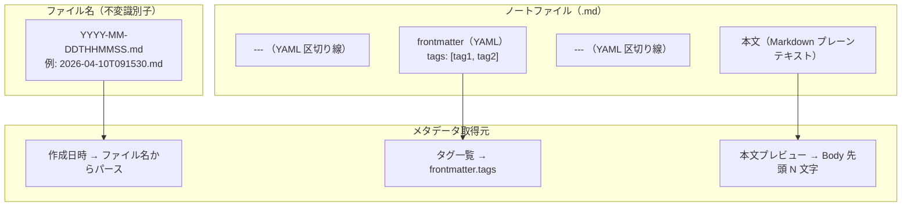
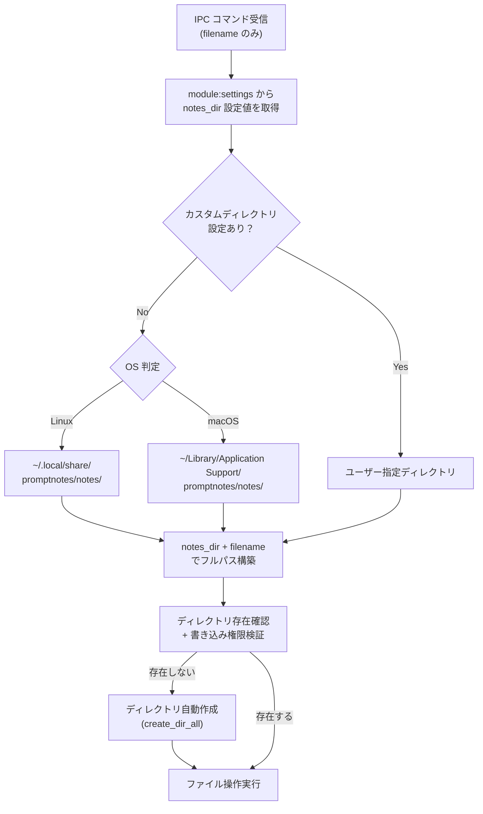
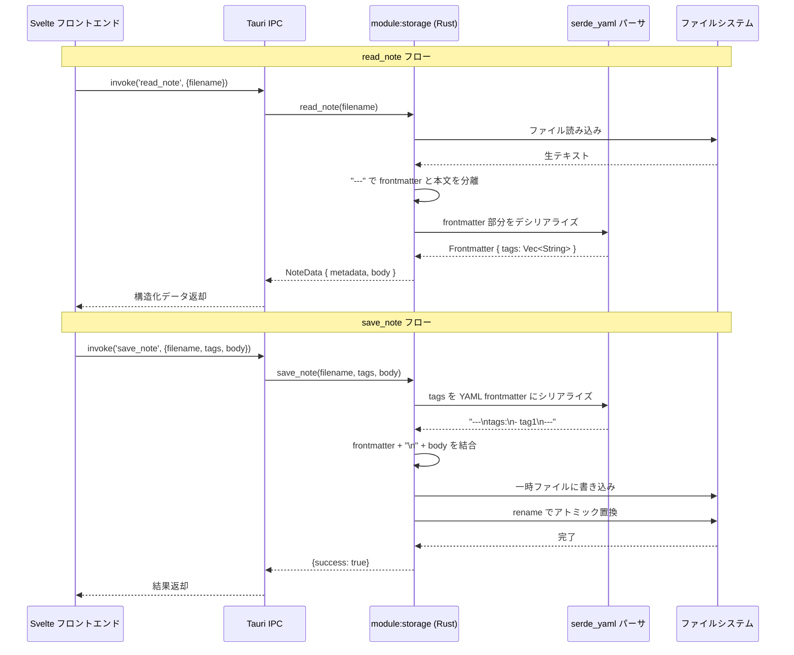

---
codd:
  node_id: detail:storage_fileformat
  type: design
  depends_on:
  - id: detail:component_architecture
    relation: depends_on
    semantic: technical
  depended_by:
  - id: plan:implementation_plan
    relation: depends_on
    semantic: technical
  - id: detail:grid_search
    relation: depends_on
    semantic: technical
  conventions:
  - targets:
    - module:storage
    reason: ファイル名は YYYY-MM-DDTHHMMSS.md 形式で確定。作成時タイムスタンプで不変。
  - targets:
    - module:storage
    reason: frontmatter は YAML形式、メタデータは tags のみ。作成日はファイル名から取得。追加フィールドの導入は要件変更が必要。
  - targets:
    - module:storage
    reason: 自動保存必須。ユーザーによる明示的保存操作は不要。
  - targets:
    - module:storage
    - module:settings
    reason: 'デフォルト保存ディレクトリは Linux: ~/.local/share/promptnotes/notes/、macOS: ~/Library/Application
      Support/promptnotes/notes/。設定から任意ディレクトリに変更可能であること。'
  modules:
  - storage
  - settings
---

# Storage & File Format Detailed Design

## 1. Overview

本設計書は、PromptNotes における `module:storage` のファイル保存形式・ディレクトリ構造・読み書きロジックを詳細に定義する。`module:storage` は Rust バックエンド（`src-tauri/src/storage/`）に配置され、すべてのファイル操作の排他的な所有者である。フロントエンドからの直接ファイルシステムアクセスは Tauri IPC 境界により技術的に遮断されており、ノートの作成・読み取り・更新・削除・検索はすべて `#[tauri::command]` ハンドラ経由で実行される。

PromptNotes のノートは単一の `.md` ファイルとして管理され、ファイル名が作成日時を兼ねる不変識別子として機能する。クラウド同期・データベース・インデックスエンジンは一切使用せず、ローカルファイルシステムのみをストレージバックエンドとする。

### リリース不可制約（Non-negotiable conventions）への準拠

| 制約 | 対象 | 内容 | 本設計書での反映箇所 |
|---|---|---|---|
| NNC-S1 | `module:storage` | ファイル名は `YYYY-MM-DDTHHMMSS.md` 形式で確定。作成時タイムスタンプで不変。 | §2 ファイル名生成フロー図、§4.1 ファイル名生成仕様 |
| NNC-S2 | `module:storage` | frontmatter は YAML 形式、メタデータは `tags` のみ。作成日はファイル名から取得。追加フィールドの導入は要件変更が必要。 | §2 ファイルフォーマット図、§4.2 frontmatter スキーマ定義 |
| NNC-S3 | `module:storage` | 自動保存必須。ユーザーによる明示的保存操作は不要。 | §4.4 自動保存のアトミック書き込み |
| NNC-S4 | `module:storage`, `module:settings` | デフォルト保存ディレクトリは Linux: `~/.local/share/promptnotes/notes/`、macOS: `~/Library/Application Support/promptnotes/notes/`。設定から任意ディレクトリに変更可能。 | §3 パス解決の所有権、§4.3 ディレクトリ解決ロジック |

対象プラットフォームは Linux および macOS である。

## 2. Mermaid Diagrams

### 2.1 ノートファイルフォーマット構造



**所有権**: ファイルフォーマットの定義と解釈は `module:storage`（Rust 側 `src-tauri/src/storage/`）が排他的に所有する。フロントエンドはファイルの内部構造を直接パースせず、`read_note` コマンドの戻り値として構造化データ（`NoteMetadata` + `body`）を受け取る。frontmatter のパースおよびシリアライズロジックを `module:storage` 外部に実装することは禁止される。

### 2.2 ファイル CRUD 操作フロー

```mermaid
stateDiagram-v2
    [*] --> NotExists: 初期状態

    NotExists --> Creating: create_note 呼び出し
    Creating --> Exists: ファイル名生成 + 空テンプレート書き込み

    Exists --> Reading: read_note 呼び出し
    Reading --> Exists: frontmatter パース + 本文返却

    Exists --> Saving: save_note 呼び出し（自動保存）
    Saving --> WritingTmp: 一時ファイル書き込み (.tmp)
    WritingTmp --> Renaming: std::fs::rename アトミック置換
    Renaming --> Exists: 保存完了

    Exists --> Deleting: delete_note 呼び出し
    Deleting --> NotExists: ファイル削除

    Exists --> Listing: list_notes / search_notes
    Listing --> Exists: メタデータ一覧返却
```

**実装境界**: 状態遷移のすべてのステップは `module:storage` の Rust コード内で完結する。`Creating` 状態でのファイル名生成（`YYYY-MM-DDTHHMMSS.md`）、`Saving` 状態でのアトミック書き込み（一時ファイル → rename）、`Listing` 状態でのディレクトリ走査はいずれも `module:storage` が単独で所有するロジックである。フロントエンドは IPC コマンドの発行と結果の受信のみを行う。

### 2.3 ディレクトリ解決とファイルパス構築



**所有権**: パス解決フロー全体は `module:storage` が所有する。OS 判定には Rust の `std::env::consts::OS` または Tauri のパスリゾルバ（`app.path().app_data_dir()`）を使用する。フロントエンドはファイル名（`2026-04-10T091530.md`）のみを知り、フルパスには一切関与しない。設定値の永続化は `module:settings`（Rust 側）が所有し、`module:storage` は読み取り専用で設定値を参照する。

### 2.4 frontmatter パース/シリアライズ処理



**実装境界**: YAML の解析・生成は `serde_yaml`（または `serde_yml`）クレートを使用し、`module:storage` の Rust コード内でのみ実行される。フロントエンドは `tags` を `string[]` として送受信し、YAML フォーマットの詳細を知らない。frontmatter に `tags` 以外のフィールドが含まれることは想定外であり、未知フィールドが存在した場合は無視（破棄しない、ラウンドトリップ保全）する動作とする。

## 3. Ownership Boundaries

### 3.1 module:storage の排他的責務

| 責務 | 詳細 | 制約根拠 |
|---|---|---|
| ファイル名生成 | `YYYY-MM-DDTHHMMSS.md` 形式。`chrono::Local::now()` を使用し、作成時に一度だけ生成。ファイル名はノートの生涯を通じて不変。 | NNC-S1 |
| frontmatter スキーマ管理 | YAML 形式、`tags` フィールドのみ。作成日はファイル名に含まれるため frontmatter には記録しない。 | NNC-S2 |
| ファイル CRUD | `create_note`、`read_note`、`save_note`、`delete_note` の各操作。 | NNC-S3（自動保存必須） |
| パス解決 | 設定値または OS デフォルトパスとファイル名の結合。 | NNC-S4 |
| 全文検索 | ディレクトリ内 `.md` ファイルの全走査による本文検索。 | データベース/インデックス不使用 |
| アトミック書き込み | 一時ファイル書き込み → `rename` によるデータ破損防止。 | NNC-S3（自動保存の信頼性） |
| frontmatter パース/シリアライズ | `serde_yaml` による YAML ↔ Rust 構造体の変換。 | NNC-S2 |

### 3.2 module:settings との境界

`module:storage` と `module:settings` の間には以下の明確な境界が存在する。

| 関心事 | 所有者 | 他モジュールからの利用方法 |
|---|---|---|
| `notes_dir` 設定値の永続化（JSON 読み書き） | `module:settings`（Rust 側） | `module:storage` は `get_notes_dir()` 関数で現在値を読み取り専用で参照 |
| `notes_dir` のデフォルト値決定 | `module:storage` | OS 判定に基づくデフォルト値を `module:settings` に提供（設定未保存時のフォールバック） |
| パスバリデーション（ディレクトリ存在確認、書き込み権限確認） | `module:storage` | `module:settings` は `update_settings` 時に `module:storage` のバリデーション関数を呼び出し |

設定ファイルの配置先:
- **Linux**: `~/.config/promptnotes/config.json`
- **macOS**: `~/Library/Application Support/promptnotes/config.json`

### 3.3 module:shell との境界

`module:shell` は IPC コマンドのディスパッチャとして機能し、`module:storage` の関数を呼び出す。`module:shell` 自体にストレージロジックを実装することは禁止される。

```
[フロントエンド] → invoke('save_note') → [module:shell: コマンドハンドラ] → [module:storage: save()]
```

`module:shell` が所有するのは `#[tauri::command]` アノテーション付きハンドラの登録と `AppState` の管理のみであり、ファイル操作の詳細は `module:storage` に委譲する。

### 3.4 共有型 NoteMetadata の所有権

`NoteMetadata` 構造体は `module:storage` の Rust コード内（`src-tauri/src/storage/`）に正規定義を持つ唯一の型である。

```rust
// src-tauri/src/storage/types.rs（正規定義）
#[derive(Debug, Clone, Serialize, Deserialize)]
pub struct NoteMetadata {
    pub filename: String,          // "2026-04-10T091530.md"
    pub tags: Vec<String>,         // frontmatter から取得
    pub created_at: String,        // ファイル名からパース "2026-04-10T09:15:30"
    pub body_preview: String,      // 本文先頭 N 文字
}
```

フロントエンド側の TypeScript ミラー型（`src/lib/types/note.ts`）は正規定義ではなく、Rust 側の変更に追随する。

### 3.5 ファイル名の不変性保証

ファイル名（`YYYY-MM-DDTHHMMSS.md`）はノート作成時に `module:storage` が生成し、以後変更されない。`module:storage` にリネーム API は存在しない。この不変性により、ファイル名がノートの一意識別子として機能し、フロントエンドのルーティングパラメータ（`/edit/:filename`）と直接対応する。

## 4. Implementation Implications

### 4.1 ファイル名生成仕様

ファイル名は `YYYY-MM-DDTHHMMSS.md` 形式で、ローカルタイムゾーンの現在時刻から生成する。

```rust
use chrono::Local;

pub fn generate_filename() -> String {
    Local::now().format("%Y-%m-%dT%H%M%S.md").to_string()
}
```

- フォーマット: `2026-04-10T091530.md`（秒精度）
- 同一秒内に複数ノートが作成された場合の衝突回避: ファイル存在チェックを行い、衝突時はミリ秒サフィックスを付与する（例: `2026-04-10T091530_001.md`）。
- ファイル名はノートの作成日時を表し、作成後の変更は不可。

### 4.2 frontmatter スキーマ定義

```yaml
---
tags:
  - プロンプト設計
  - ChatGPT
---
```

| フィールド | 型 | 必須 | 説明 |
|---|---|---|---|
| `tags` | `string[]` | No（省略時は空配列） | ユーザーが付与するタグ一覧 |

**禁止フィールド**: `title`、`created_at`、`updated_at`、`id` 等の追加フィールドは、要件変更なしに導入してはならない（NNC-S2）。作成日はファイル名から取得するため frontmatter に記録しない。

パース時のルール:
- `---` で囲まれた先頭ブロックを YAML frontmatter として解釈する。
- frontmatter が存在しないファイルは `tags: []` として扱う。
- 未知フィールドが存在する場合はラウンドトリップ時に保全する（ユーザーが手動追加した情報を破棄しない）。

### 4.3 ディレクトリ解決ロジック

```rust
use std::path::PathBuf;

pub fn resolve_notes_dir(custom_dir: Option<&str>) -> PathBuf {
    if let Some(dir) = custom_dir {
        return PathBuf::from(dir);
    }
    
    #[cfg(target_os = "linux")]
    {
        let home = std::env::var("HOME").expect("HOME not set");
        PathBuf::from(home).join(".local/share/promptnotes/notes")
    }
    
    #[cfg(target_os = "macos")]
    {
        let home = std::env::var("HOME").expect("HOME not set");
        PathBuf::from(home).join("Library/Application Support/promptnotes/notes")
    }
}
```

デフォルトパス一覧（NNC-S4 準拠）:

| OS | デフォルト保存ディレクトリ |
|---|---|
| Linux | `~/.local/share/promptnotes/notes/` |
| macOS | `~/Library/Application Support/promptnotes/notes/` |

ディレクトリが存在しない場合は `std::fs::create_dir_all()` で自動作成する。設定画面からユーザーが任意のディレクトリに変更可能であり、変更時にはディレクトリの存在確認と書き込み権限検証を Rust 側で実行する。

### 4.4 自動保存とアトミック書き込み

自動保存（NNC-S3 準拠）のフローは以下のとおり。

1. **フロントエンド（`module:editor`）**: CodeMirror 6 の変更イベントをデバウンス（500ms〜1000ms）し、安定後に `invoke('save_note', {filename, tags, body})` を発行する。ユーザーによる明示的な保存操作（Ctrl+S 等）は設けない。
2. **Rust 側（`module:storage`）**: 以下のアトミック書き込みを実行する。
   - frontmatter（`tags` の YAML シリアライズ）と本文を結合してコンテンツを構築する。
   - 一時ファイル（`.{filename}.tmp`）に書き込む。
   - `std::fs::rename()` で一時ファイルを正式ファイル名にアトミック置換する。
   - 一時ファイルと正式ファイルは同一ディレクトリ内に配置し、同一ファイルシステム上の `rename` のアトミック性を保証する。

エラー発生時（ディスク容量不足、権限エラー等）は `Result<(), String>` でフロントエンドにエラーを返却し、フロントエンドは未保存状態をユーザーに通知する。

### 4.5 list_notes の実装

`list_notes` コマンドは保存ディレクトリ内の全 `.md` ファイルを走査し、各ファイルの `NoteMetadata` を返却する。

```rust
pub fn list_notes(notes_dir: &Path) -> Result<Vec<NoteMetadata>, StorageError> {
    let mut notes = Vec::new();
    for entry in std::fs::read_dir(notes_dir)? {
        let entry = entry?;
        let path = entry.path();
        if path.extension().map_or(false, |ext| ext == "md") {
            let filename = path.file_name().unwrap().to_string_lossy().to_string();
            let content = std::fs::read_to_string(&path)?;
            let (frontmatter, body) = parse_frontmatter(&content);
            notes.push(NoteMetadata {
                filename: filename.clone(),
                tags: frontmatter.tags,
                created_at: parse_created_at(&filename),
                body_preview: body.chars().take(200).collect(),
            });
        }
    }
    notes.sort_by(|a, b| b.created_at.cmp(&a.created_at)); // 新しい順
    Ok(notes)
}
```

- 一時ファイル（`.tmp` 拡張子）は走査対象から除外する。
- ファイル名が `YYYY-MM-DDTHHMMSS.md` 形式に合致しないファイルは無視する。
- 返却順: `created_at` の降順（新しいノートが先頭）。

### 4.6 search_notes の実装

`search_notes` コマンドは全 `.md` ファイルの本文部分（frontmatter を除く）に対する大文字小文字非区別の部分文字列検索を行う。

- 検索対象: 保存ディレクトリ内の全 `.md` ファイルの本文。
- 性能目標: 直近 7 日間のノート数十件に対して **100ms 以内**で応答。
- タグによるフィルタリング: `tags` パラメータが指定された場合、frontmatter の `tags` フィールドとの完全一致でフィルタする。
- 日付によるフィルタリング: ファイル名からパースした `created_at` に対して期間指定フィルタを適用する。
- インデックスエンジン（Tantivy, SQLite FTS 等）は現時点では導入しない。

### 4.7 delete_note の実装

`delete_note` コマンドは指定されたファイル名のノートを物理削除する。

- ゴミ箱機能は実装しない（ファイルは即時削除）。
- 削除対象ファイルが存在しない場合はエラーを返却する。
- パストラバーサル攻撃防止: `filename` にパス区切り文字（`/`, `\`）が含まれる場合はバリデーションエラーとする。

### 4.8 Rust 構造体定義

```rust
// src-tauri/src/storage/types.rs

#[derive(Debug, Clone, Serialize, Deserialize)]
pub struct Frontmatter {
    #[serde(default)]
    pub tags: Vec<String>,
    
    #[serde(flatten)]
    pub extra: serde_yaml::Mapping, // 未知フィールドの保全用
}

#[derive(Debug, Clone, Serialize, Deserialize)]
pub struct NoteMetadata {
    pub filename: String,
    pub tags: Vec<String>,
    pub created_at: String,
    pub body_preview: String,
}

#[derive(Debug, Clone, Serialize, Deserialize)]
pub struct NoteData {
    pub metadata: NoteMetadata,
    pub body: String,
}

#[derive(Debug, Clone, Serialize, Deserialize)]
pub struct SaveResult {
    pub success: bool,
}
```

`Frontmatter` 構造体の `extra` フィールド（`serde(flatten)` + `serde_yaml::Mapping`）により、ユーザーが手動追加したフィールドがラウンドトリップ時に保全される。ただし `module:storage` が自動挿入するフィールドは `tags` のみである。

### 4.9 セキュリティ対策

| 脅威 | 対策 | 実装箇所 |
|---|---|---|
| パストラバーサル | `filename` にパス区切り文字が含まれないことを検証。フルパス構築後に正規化し、`notes_dir` 配下であることを確認。 | `module:storage` |
| データ破損 | アトミック書き込み（一時ファイル → rename）。 | `module:storage` |
| 直接ファイルアクセス | Tauri `fs` プラグインを `deny` 設定。全操作は IPC 経由。 | `tauri.conf.json` |
| シンボリックリンク攻撃 | `notes_dir` 内のシンボリックリンクは追跡しない。通常ファイルのみを操作対象とする。 | `module:storage` |

### 4.10 性能特性

| 操作 | 想定ノート数 | 性能目標 |
|---|---|---|
| `create_note` | N/A | 50ms 以内 |
| `save_note`（自動保存） | 単一ファイル | 50ms 以内 |
| `read_note` | 単一ファイル | 50ms 以内 |
| `list_notes` | 数十〜数百件 | 200ms 以内 |
| `search_notes` | 数十件（直近 7 日間） | 100ms 以内 |
| `search_notes` | 数千件 | 100ms 超過の可能性あり（ADR FU-002 の導入判断トリガー） |
| `delete_note` | 単一ファイル | 50ms 以内 |

## 5. Open Questions

| ID | 質問 | 影響範囲 | 解決トリガー |
|---|---|---|---|
| OQ-SF-001 | 同一秒内に複数ノートが作成された場合の衝突回避方式として、ミリ秒サフィックス付与（`_001`）が `YYYY-MM-DDTHHMMSS.md` 形式の不変制約と整合するか。衝突発生時のリトライ（1 秒待機して再生成）との比較。 | `module:storage` | 実装開始前のレビュー |
| OQ-SF-002 | frontmatter の未知フィールド保全について、`serde(flatten)` + `serde_yaml::Mapping` 方式で YAML コメントやフォーマットが維持されるか。維持されない場合の代替パース手法（正規表現ベースの frontmatter 抽出）の検討。 | `module:storage` | プロトタイプ実装時の動作検証 |
| OQ-SF-003 | `body_preview` の文字数上限（現在 200 文字想定）がグリッドビューの Masonry レイアウトにおけるカード高さと適切に対応するか。 | `module:storage`, `module:grid` | UI プロトタイプ作成時 |
| OQ-SF-004 | 保存ディレクトリ変更時に既存ノートの移動を行うか、新規ノートのみ新ディレクトリに作成するか。移動する場合のトランザクション保証方式。 | `module:storage`, `module:settings` | 詳細設計レビュー時 |
| OQ-SF-005 | `list_notes` で数千件規模のファイルを毎回全走査する場合のレイテンシ改善策として、メモリ内キャッシュ（ファイル変更監視 + 差分更新）を導入するか。 | `module:storage` | ノート件数が数百件を超えて体感遅延が発生した時点 |
